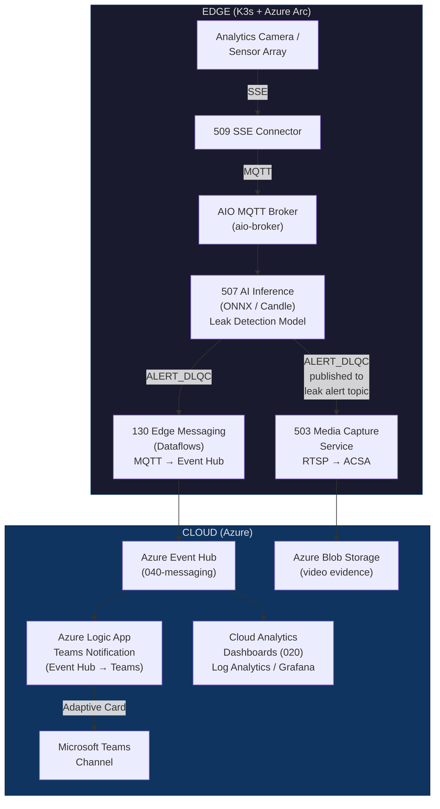

# Leak Detection Accelerator — Design Proposal

**Author:** Dallas (Lead Architect)
**Date:** 2026-02-17
**Status:** PROPOSED (Revision 2)
**Reviewer:** Carlos Sardo

---

## 1. Executive Summary

The Leak Detection Accelerator delivers a production-ready, edge-native solution for detecting and responding to gas and liquid leaks in Oil & Gas and Energy environments. It combines real-time visual and sensor-based inference at the edge with automated alerting, evidence capture, and cloud-side analytics — all running on Azure IoT Operations over K3s with Azure Arc.

**Value proposition:** This accelerator reduces mean time to detection (MTTD) from minutes to sub-second, captures forensic video evidence automatically, and ensures operations teams are notified in Microsoft Teams within seconds of a leak event. It does this by composing existing, proven components from this repository — approximately 80% of the required infrastructure already exists.

**Core delivery (Milestone 1):**

1. Camera/sensor → edge AI inference → leak event generation
2. Leak event → parallel fan-out to Media Capture and Edge-to-Cloud messaging
3. Cloud-side Event Hub → Azure Logic App → Microsoft Teams Adaptive Card notification
4. Cloud-side event archival, dashboards, and analytics

**What's new:**

* Azure Logic App for Teams notification (cloud-side, triggered by Event Hub)
* Leak detection asset definitions in `111-assets`
* A purpose-built `leak-detection` blueprint
* Configuration tuning of existing components (509, 507, 503, 130)

**Architecture simplification (Revision 2):** The original design specified a Rust microservice (`511-teams-notification`) running on the edge for Teams notification. This revision replaces it with an Azure Logic App in the cloud, triggered by the Event Hub that already receives leak events via the 130-messaging dataflow. This eliminates a container build/deploy/maintain cycle on the edge, leverages built-in Logic App retry and connector capabilities, and reduces the edge workload footprint.

---

## 2. Architecture Overview

### 2.1 System Context Diagram



### 2.2 Edge Data Flow

The edge data flow follows a strict sequential pipeline with a terminal fan-out:

```text
1. INGEST:   Camera SSE stream → 509-sse-connector → AIO MQTT Broker
             Topic: events/{facility}/{device_id}/camera/raw

2. ANALYZE:  AIO MQTT Broker → 507-ai-inference (subscriber)
             Topic: events/{facility}/{device_id}/camera/raw
             Model: leak-detection-v1 (ONNX or Candle backend)

3. DETECT:   507-ai-inference → AIO MQTT Broker
             Topic: alerts/{facility}/{device_id}/leak/dlqc
             Payload: ALERT_DLQC JSON (see §4)

4. FAN-OUT:  Two independent subscribers on the leak alert topic:
             a) 503-media-capture-service → captures RTSP evidence → Blob Storage
             b) 130-messaging dataflow   → routes to Event Hub (cloud)

5. NOTIFY:   Event Hub → Azure Logic App → Microsoft Teams Adaptive Card
             (cloud-side, triggered by Event Hub consumer group)
```

**Latency budget (target):**

| Stage | Target | Notes |
|-------|--------|-------|
| SSE → MQTT ingestion | < 50ms | Network + connector overhead |
| MQTT → Inference result | < 250ms | Candle: 155ms, ONNX: 220ms typical |
| ALERT_DLQC → Media capture start | < 500ms | Ring buffer already recording |
| ALERT_DLQC → Event Hub delivery | < 1s | Dataflow passthrough |
| Event Hub → Logic App → Teams | < 3s | Logic App trigger + webhook call |
| **Total: Camera → Teams** | **< 5s** | End-to-end detection + notification |

### 2.3 Cloud Data Flow

```text
Event Hub (leak events)
    ├─→ Azure Logic App → Teams Adaptive Card notification
    ├─→ Azure Stream Analytics / Functions → PostgreSQL (035) time-series storage
    ├─→ Log Analytics Workspace (020) → KQL dashboards
    └─→ Grafana (020) → operational dashboards and alerting rules

Blob Storage (video evidence)
    └─→ Indexed by event_id for forensic retrieval
```

Cloud-side processing beyond Logic App notification is out of scope for Milestone 1 but the pipeline is already wired — the 130-messaging dataflows and 503-media-capture ACSA sync handle delivery.

### 2.4 Component Interaction Map

```text
Component                Source Path / Resource                          Role
─────────────────────────────────────────────────────────────────────────────────────
509-sse-connector        src/500-application/509-sse-connector/          Event source (SSE → MQTT)
507-ai-inference         src/500-application/507-ai-inference/           Leak detection model host
503-media-capture        src/500-application/503-media-capture-service/  Evidence capture (RTSP → ACSA)
110-iot-ops              src/100-edge/110-iot-ops/                       AIO platform (MQTT broker, Akri)
111-assets               src/100-edge/111-assets/                       Device Registry definitions
130-messaging            src/100-edge/130-messaging/                     Edge-to-cloud data transport
020-observability        src/000-cloud/020-observability/                Dashboards and monitoring
010-security-identity    src/000-cloud/010-security-identity/            Key Vault, identities, RBAC
030-data                 src/000-cloud/030-data/                         Schema Registry, ADR, Storage
040-messaging            src/000-cloud/040-messaging/                    Event Hub / Event Grid (cloud)
Azure Logic App          Azure resource (cloud)                          Teams notification (NEW)
```

---

## 3. Component Design

### 3.1 Existing Components (Reuse)

#### 3.1.1 — 509-sse-connector (Event Source)

**What it does:** Maintains persistent SSE connections to analytics cameras and forwards events to AIO MQTT Broker. Already defines `ALERT_DLQC` event type with full leak detection fields.

**Source:** `src/500-application/509-sse-connector/`

**Protocol distinction (509 vs 508):** The SSE connector (509) and Media connector (508) serve complementary purposes using different AIO connector types. The SSE connector handles **structured JSON event data** via Server-Sent Events (endpoint type `Microsoft.SSE`) — this is how ALERT_DLQC events with 18+ structured fields (confidence, flow rate, mass, location, weather) are ingested. The Media connector (508) handles **RTSP binary data** (snapshots, video clips, streams from IP cameras) via the Media connector type. These are separate AIO portal connector types (ONVIF, Media, HTTP/REST, SSE, MQTT) and cannot substitute for each other.

**Configuration changes for leak detection:**

* Deploy with `should_enable_akri_sse_connector = true` in the blueprint
* Configure SSE endpoint URL to point at leak detection cameras
* Map event topics in asset definitions:
  * `HEARTBEAT` → `events/{facility}/{device_id}/camera/heartbeat`
  * `ALERT` → `alerts/{facility}/{device_id}/leak/basic`
  * `ALERT_DLQC` → `alerts/{facility}/{device_id}/leak/dlqc`

**No code changes required.** Configuration via Terraform asset definitions and Akri connector settings.

#### 3.1.2 — 507-ai-inference (Model Host)

**What it does:** Dual-backend inference engine (ONNX Runtime 220ms / Candle 155ms) that subscribes to MQTT topics, runs inference, and publishes results.

**Source:** `src/500-application/507-ai-inference/services/ai-edge-inference/`

**Configuration for leak detection:**

* Deploy a trained leak detection model (ONNX format) to the model directory
* Set `MODEL_DIRECTORY` to point at the leak detection model
* Configure MQTT subscription topic to match camera raw data topic
* Set `TOPIC_PREFIX` to `alerts/{facility}/{device_id}/leak` so inference results publish to the correct alert topic
* The `TopicRouter` (in `src/500-application/507-ai-inference/services/ai-edge-inference/src/topic_router.rs`) already supports priority-based routing based on inference confidence

**No code changes required.** Model deployment + environment configuration only.

#### 3.1.3 — 503-media-capture-service (Evidence Capture)

**What it does:** In-memory ring buffer for continuous RTSP stream capture. Triggered by MQTT events to extract and save video segments. Cloud sync via ACSA to Blob Storage.

**Source:** `src/500-application/503-media-capture-service/`

**Configuration for leak detection:**

* Subscribe to `alerts/{facility}/+/leak/dlqc` for capture triggers
* Configure RTSP stream URLs matching the leak detection cameras
* Set capture window: 30 seconds pre-event (ring buffer) + 60 seconds post-event
* ACSA configuration for cloud sync to a `leak-evidence` blob container
* Video filename pattern: `{facility}_{device_id}_{event_id}_{timestamp}.mp4`

**No code changes required.** MQTT topic subscription + ACSA configuration.

#### 3.1.4 — 130-messaging (Edge-to-Cloud Dataflows)

**What it does:** AIO Dataflows for routing MQTT messages to cloud endpoints (Event Hub, Event Grid, Fabric RTI).

**Source:** `src/100-edge/130-messaging/terraform/`

**Configuration for leak detection:**

* Use the EventHub dataflow module (`modules/eventhub/main.tf`): source `alerts/#/leak/dlqc` → destination Event Hub
* Set `should_create_eventhub_dataflows = true` in the blueprint
* MQTT source topic filter: `alerts/+/+/leak/dlqc`
* Data transformation: PassThrough (the ALERT_DLQC schema is already well-structured)
* The Event Hub is the trigger source for the Logic App — no additional edge plumbing required

**No code changes required.** Terraform variable configuration.

#### 3.1.5 — 110-iot-ops (AIO Platform)

**What it does:** Deploys the full Azure IoT Operations stack: MQTT Broker, Dataflow engine, Akri connector framework, Device Registry integration.

**Source:** `src/100-edge/110-iot-ops/`

**Configuration for leak detection:**

* `should_enable_akri_sse_connector = true` — enables the SSE connector for camera integration
* Optional: `should_enable_akri_media_connector = true` for additional RTSP camera discovery
* Optional: `should_enable_akri_onvif_connector = true` for ONVIF IP camera management
* `should_create_anonymous_broker_listener = false` in production (mTLS enforced)
* Registry endpoints configured for ACR pull of leak detection container images

**No code changes required.** Feature flags in blueprint variables.

---

### 3.2 New Implementation: Azure Logic App (Teams Notification)

**Resource type:** `Microsoft.Logic/workflows` (Azure Logic App — Consumption or Standard)
**Deployment:** Terraform (`azurerm_logic_app_workflow`) or Bicep, as part of the leak-detection blueprint
**Status:** Replaces the previously designed `511-teams-notification` Rust microservice

> **Disposition of `src/500-application/511-teams-notification/`:** The existing scaffold directory is not deleted by this design revision. Disposition is deferred to Carlos. The directory contains an implemented Rust service that is no longer part of the architecture — no blueprint module references it.

#### 3.2.1 Architecture Rationale

The 130-messaging dataflow already routes ALERT_DLQC events from the MQTT broker to Event Hub in the cloud. A Logic App subscribes to that same Event Hub — no new edge-to-cloud plumbing is needed. Benefits:

* **No edge container to build, deploy, or maintain** — eliminates Rust build pipeline, Dockerfile, Helm chart, ACR image
* **Built-in retry and error handling** — Logic App provides configurable retry policies per action
* **Native Teams connector** — Logic App has a first-party Microsoft Teams connector (or Incoming Webhook action)
* **Azure Monitor integration** — run history, diagnostic logs, and alerts out of the box
* **Managed identity authentication** — accesses Event Hub and Key Vault via system-assigned managed identity

#### 3.2.2 Workflow Definition

The Logic App workflow consists of five actions:

```text
1. TRIGGER:  Event Hub trigger (When events are available)
             - Consumer group: leak-notifications
             - Event Hub: from 040-messaging module output
             - Batch size: 1 (process events individually)

2. PARSE:    Parse JSON action
             - Content: trigger body (ALERT_DLQC payload)
             - Schema: §4 ALERT_DLQC schema

3. DERIVE:   Condition / Switch action — severity from confidence_level
             - 80–100 → CRITICAL (Attention style)
             - 60–79  → HIGH (Warning style)
             - 40–59  → MEDIUM (Accent style)
             - 0–39   → LOW (Good style)

4. BUILD:    Compose action — Adaptive Card JSON
             - Uses parsed fields and derived severity
             - Template matches the canonical design (see §3.2.3)

5. SEND:     HTTP action — POST to Teams Incoming Webhook URL
             - URL: retrieved from Key Vault via managed identity
             - Content-Type: application/json
             - Body: Adaptive Card payload
```

#### 3.2.3 Adaptive Card Template

The Logic App composes the same Adaptive Card format used across the system:

```json
{
  "type": "message",
  "attachments": [{
    "contentType": "application/vnd.microsoft.card.adaptive",
    "content": {
      "$schema": "http://adaptivecards.io/schemas/adaptive-card.json",
      "type": "AdaptiveCard",
      "version": "1.4",
      "body": [
        {
          "type": "Container",
          "style": "@{severity_style}",
          "items": [{
            "type": "TextBlock",
            "text": "LEAK DETECTED — @{severity_label} — Event #@{event_id}",
            "weight": "Bolder",
            "size": "Large",
            "wrap": true
          }]
        },
        {
          "type": "FactSet",
          "facts": [
            {"title": "Camera ID", "value": "@{camera_id}"},
            {"title": "Confidence", "value": "@{confidence_level}%"},
            {"title": "Flow Rate", "value": "@{flow_rate} @{unit}"},
            {"title": "Mass", "value": "@{mass} @{mass_unit}"},
            {"title": "Location", "value": "@{leak_lat}°, @{leak_lon}°"},
            {"title": "Temperature", "value": "@{temperature}° @{temperature_unit}"},
            {"title": "Wind", "value": "@{wind_speed} @{wind_speed_unit} at @{wind_direction}°"},
            {"title": "Humidity", "value": "@{humidity}%"},
            {"title": "Timestamp", "value": "@{timestamp}"}
          ]
        }
      ]
    }
  }]
}
```

#### 3.2.4 Severity Derivation

Implemented as a Logic App Switch action on the parsed `confidence_level` field:

| `confidence_level` | Severity | `severity_style` | `severity_label` |
|---------------------|----------|-------------------|-------------------|
| 80–100 | CRITICAL | Attention | CRITICAL |
| 60–79 | HIGH | Warning | HIGH |
| 40–59 | MEDIUM | Accent | MEDIUM |
| 0–39 | LOW | Good | LOW |

This is the same derivation table used across all components (§4).

#### 3.2.5 Rate Limiting and Deduplication

* **Concurrency control:** Logic App trigger concurrency set to `1` — processes one event at a time, preventing burst flooding
* **Event Hub consumer group:** Dedicated `leak-notifications` consumer group prevents interference with other consumers
* **Event Hub sequence-based dedup:** Logic App tracks the Event Hub sequence number; replayed events from the same partition are idempotent
* **Stateful workflow (optional):** For advanced dedup, use a Standard Logic App with stateful workflow to maintain a sliding window of processed `event_id` values
* **Teams connector rate limit:** Logic App concurrency of 1 inherently throttles to well below the Teams webhook rate limit

#### 3.2.6 Error Handling and Retry

| Error | Behavior |
|-------|----------|
| Event Hub trigger failure | Logic App runtime auto-retries with exponential backoff |
| JSON parse failure | Run fails; visible in Logic App run history; event skipped |
| Teams webhook 429 (rate limited) | Logic App retry policy: fixed interval 30s, max 3 retries |
| Teams webhook 5xx | Logic App retry policy: exponential backoff, max 4 retries |
| Teams webhook 4xx (non-429) | Run marked failed; no retry (bad request = template issue) |
| Key Vault secret retrieval failure | Logic App retry policy applies; falls back to cached value if available |

#### 3.2.7 Deployment Options

**Terraform (preferred):**

```terraform
resource "azurerm_logic_app_workflow" "teams_notification" {
  name                = "${var.resource_prefix}-leak-teams-notify"
  location            = var.location
  resource_group_name = module.cloud_resource_group.resource_group.name

  identity {
    type = "SystemAssigned"
  }

  tags = local.common_tags
}
```

**Bicep (alternative):**

```bicep
resource logicApp 'Microsoft.Logic/workflows@2019-05-01' = {
  name: '${resourcePrefix}-leak-teams-notify'
  location: location
  identity: {
    type: 'SystemAssigned'
  }
  properties: {
    definition: workflowDefinition
  }
}
```

The Logic App can be deployed as part of a new cloud component or integrated into the existing `040-messaging` module. Architectural recommendation: create a lightweight Terraform module within the leak-detection blueprint or add to `040-messaging` as a conditional resource.

#### 3.2.8 Teams Connector Configuration

Two options for Teams integration:

1. **Incoming Webhook (recommended for Milestone 1):** Webhook URL stored in Key Vault (`teams-webhook-url` secret). Logic App retrieves it via managed identity at workflow execution time using a Key Vault "Get secret" action.

2. **Logic App Teams connector (future):** Uses the built-in Microsoft Teams connector action "Post adaptive card in a chat or channel." Requires OAuth consent and a service account. More robust but adds identity management overhead.

---

### 3.3 New Implementation: Leak Detection Asset Definitions

**Target:** `src/100-edge/111-assets/`
**Action:** Define leak detection camera assets using the namespaced Device Registry model

The asset definitions follow the existing pattern in `variables.tf` (namespaced_assets with event_groups). These are provided as Terraform variable values in the blueprint.

#### Namespaced Device (SSE Camera Connector)

```terraform
namespaced_devices = [
  {
    name    = "leak-detection-camera"
    enabled = true
    endpoints = {
      outbound = { assigned = {} }
      inbound = {
        "sse-leak-camera-endpoint" = {
          endpoint_type = "Microsoft.SSE"
          address       = "http://analytics-camera:8080/camera-events"
          authentication = {
            method = "Anonymous"
          }
        }
      }
    }
  }
]
```

#### Namespaced Asset (Leak Detection Events)

```terraform
namespaced_assets = [
  {
    name         = "leak-detection-asset"
    display_name = "Leak Detection Analytics Camera"
    device_ref = {
      device_name   = "leak-detection-camera"
      endpoint_name = "sse-leak-camera-endpoint"
    }
    description     = "Analytics camera asset for leak detection with DLQC events"
    manufacturer    = "Site Analytics Corp"
    model           = "LAC-5000"
    enabled         = true
    attributes      = {
      facility    = "plant-alpha"
      zone        = "pipeline-section-3"
      asset_class = "leak-detection"
    }
    event_groups = [
      {
        name = "leak_detection_events"
        events = [
          {
            name        = "HEARTBEAT"
            data_source = "ns=2;s=HeartbeatEvent"
            destinations = [
              {
                target = "Mqtt"
                configuration = {
                  topic  = "events/plant-alpha/leak-cam-01/camera/heartbeat"
                  retain = "Never"
                  qos    = "Qos0"
                }
              }
            ]
          },
          {
            name        = "ALERT_DLQC"
            data_source = "ns=2;s=AlertDlqcEvent"
            destinations = [
              {
                target = "Mqtt"
                configuration = {
                  topic  = "alerts/plant-alpha/leak-cam-01/leak/dlqc"
                  retain = "Never"
                  qos    = "Qos1"
                }
              }
            ]
          },
          {
            name        = "ALERT"
            data_source = "ns=2;s=AlertEvent"
            destinations = [
              {
                target = "Mqtt"
                configuration = {
                  topic  = "alerts/plant-alpha/leak-cam-01/leak/basic"
                  retain = "Never"
                  qos    = "Qos1"
                }
              }
            ]
          }
        ]
      }
    ]
  }
]
```

---

### 3.4 New Implementation: Leak Detection Blueprint

**Target:** `blueprints/leak-detection/terraform/`

A purpose-built blueprint composing the minimum set of components for a leak detection deployment. Follows the same composition pattern as `blueprints/full-single-node-cluster/terraform/main.tf`.

#### Blueprint Module Composition

```terraform
/**
 * # Leak Detection Blueprint
 *
 * Deploys a single-node Azure IoT Operations cluster optimized for
 * leak detection in Oil & Gas / Energy environments.
 */

# ── Cloud Foundation ──────────────────────────────────────────

module "cloud_resource_group" {
  source = "../../../src/000-cloud/000-resource-group/terraform"
  # ... standard vars
}

module "cloud_networking" {
  source = "../../../src/000-cloud/050-networking/terraform"
  # ... standard vars
  resource_group = module.cloud_resource_group.resource_group
}

module "cloud_security_identity" {
  source = "../../../src/000-cloud/010-security-identity/terraform"
  # ... standard vars
  resource_group = module.cloud_resource_group.resource_group
}

module "cloud_observability" {
  source = "../../../src/000-cloud/020-observability/terraform"
  # ... standard vars
  resource_group = module.cloud_resource_group.resource_group
}

module "cloud_data" {
  source = "../../../src/000-cloud/030-data/terraform"
  # ... standard vars
  resource_group = module.cloud_resource_group.resource_group
}

module "cloud_messaging" {
  source = "../../../src/000-cloud/040-messaging/terraform"
  # ... standard vars
  resource_group = module.cloud_resource_group.resource_group
}

module "cloud_vm_host" {
  source = "../../../src/000-cloud/051-vm-host/terraform"
  # ... standard vars
  resource_group     = module.cloud_resource_group.resource_group
  virtual_network    = module.cloud_networking.virtual_network
}

module "cloud_acr" {
  source = "../../../src/000-cloud/060-acr/terraform"
  # ... standard vars
  resource_group = module.cloud_resource_group.resource_group
}

# ── Edge Foundation ───────────────────────────────────────────

module "edge_cncf_cluster" {
  source     = "../../../src/100-edge/100-cncf-cluster/terraform"
  depends_on = [module.cloud_vm_host]
  # ... standard vars
  resource_group          = module.cloud_resource_group.resource_group
  arc_onboarding_identity = module.cloud_security_identity.arc_onboarding_identity
  arc_onboarding_sp       = module.cloud_security_identity.arc_onboarding_sp
  cluster_server_machine  = module.cloud_vm_host.virtual_machines[0]
  key_vault               = module.cloud_security_identity.key_vault
}

module "edge_arc_extensions" {
  source     = "../../../src/100-edge/109-arc-extensions/terraform"
  depends_on = [module.edge_cncf_cluster]
  arc_connected_cluster = module.edge_cncf_cluster.arc_connected_cluster
}

module "edge_iot_ops" {
  source     = "../../../src/100-edge/110-iot-ops/terraform"
  depends_on = [module.edge_arc_extensions]

  adr_schema_registry   = module.cloud_data.schema_registry
  adr_namespace         = module.cloud_data.adr_namespace
  resource_group        = module.cloud_resource_group.resource_group
  aio_identity          = module.cloud_security_identity.aio_identity
  arc_connected_cluster = module.edge_cncf_cluster.arc_connected_cluster
  secret_sync_key_vault = module.cloud_security_identity.key_vault
  secret_sync_identity  = module.cloud_security_identity.secret_sync_identity

  # Leak detection: enable SSE connector for analytics cameras
  should_enable_akri_sse_connector = true
  registry_endpoints               = local.combined_registry_endpoints
}

# ── Leak Detection Specific ──────────────────────────────────

module "edge_assets" {
  source     = "../../../src/100-edge/111-assets/terraform"
  depends_on = [module.edge_iot_ops]

  location           = var.location
  resource_group     = module.cloud_resource_group.resource_group
  custom_location_id = module.edge_iot_ops.custom_locations.id
  adr_namespace      = module.cloud_data.adr_namespace

  namespaced_devices = var.namespaced_devices
  namespaced_assets  = var.namespaced_assets
}

module "edge_observability" {
  source     = "../../../src/100-edge/120-observability/terraform"
  depends_on = [module.edge_iot_ops]
  # ... standard vars
  resource_group        = module.cloud_resource_group.resource_group
  arc_connected_cluster = module.edge_cncf_cluster.arc_connected_cluster
}

module "edge_messaging" {
  source     = "../../../src/100-edge/130-messaging/terraform"
  depends_on = [module.edge_iot_ops]

  environment     = var.environment
  resource_prefix = var.resource_prefix
  instance        = var.instance

  aio_custom_locations = module.edge_iot_ops.custom_locations
  aio_dataflow_profile = module.edge_iot_ops.aio_dataflow_profile
  aio_instance         = module.edge_iot_ops.aio_instance
  aio_identity         = module.cloud_security_identity.aio_identity
  eventhub             = module.cloud_messaging.eventhubs[0]
  adr_namespace        = module.cloud_data.adr_namespace

  should_create_eventhub_dataflows = true
}

# ── Cloud-side Notification ──────────────────────────────────
# Logic App for Teams notification, triggered by Event Hub.
# Can be implemented as an inline resource or a dedicated module.
# See §3.2.7 for Terraform resource definition.
```

#### Logic App Deployment Note

The Logic App (`azurerm_logic_app_workflow`) is a cloud-side resource. It can be:

1. **Inline in the blueprint** — defined directly in `main.tf` as a resource with role assignments for Event Hub and Key Vault
2. **Part of `040-messaging`** — added as a conditional resource within the cloud messaging module (gated by `should_create_teams_notification = true`)
3. **A new cloud component** — a dedicated `041-notification` or similar module

Recommendation: start inline in the blueprint for Milestone 1 and extract to a reusable module if other blueprints need it.

#### Key Differences from full-single-node-cluster

| Feature | full-single-node-cluster | leak-detection |
|---------|--------------------------|----------------|
| PostgreSQL | Optional | Excluded (Phase 1) |
| Managed Redis | Optional | Excluded (Phase 1) |
| Azure ML | Optional | Excluded (Phase 1) |
| AI Foundry | Optional | Excluded (Phase 1) |
| AKS (cloud) | Optional | Excluded |
| VPN Gateway | Optional | Optional |
| SSE Connector | Configurable | Always enabled |
| Asset definitions | Generic OPC-UA | Leak detection camera assets |
| Dataflows | All types configurable | EventHub always enabled |
| Teams notification | Not included | Logic App (cloud-side) |

---

## 4. ALERT_DLQC Event Schema

This is the **canonical contract** between all components. Every agent must use this schema exactly. It is consumed by the SSE connector (509), the edge-to-cloud dataflow (130), and the Logic App workflow.

**Source of truth:** `src/500-application/509-sse-connector/services/sse-server/events_simulator.py` (line 125)

```json
{
  "type": "ALERT_DLQC",
  "timestamp": 1705339210000,
  "message": "leak",
  "event_id": 1002,
  "camera_id": 3,
  "leak_location": {
    "longitude": 35.78269848040571,
    "latitude": 64.55565678374194
  },
  "camera_location": {
    "longitude": -171.2156123298313,
    "latitude": 64.08392306220344
  },
  "flow_rate": 0.714703905661418,
  "unit": "g/s",
  "mass": 3.207630462504989,
  "mass_unit": "kg",
  "confidence_level": 28,
  "camera_orientation": 92,
  "depression_angle": 52,
  "wind_speed": 34.19892851403805,
  "wind_speed_unit": "m/h",
  "wind_direction": 149,
  "temperature": 38.19919186189587,
  "temperature_unit": "F",
  "humidity": 99
}
```

### Field Reference

| Field | Type | Unit | Description |
|-------|------|------|-------------|
| `type` | string | — | Always `"ALERT_DLQC"` |
| `timestamp` | u64 | ms | Unix epoch in milliseconds |
| `message` | string | — | Alert category (always `"leak"` for this event type) |
| `event_id` | u64 | — | Monotonically increasing event identifier |
| `camera_id` | u32 | — | Camera identifier (1–N per facility) |
| `leak_location.longitude` | f64 | degrees | Leak geo-location longitude (-180 to 180) |
| `leak_location.latitude` | f64 | degrees | Leak geo-location latitude (-90 to 90) |
| `camera_location.longitude` | f64 | degrees | Camera geo-location longitude |
| `camera_location.latitude` | f64 | degrees | Camera geo-location latitude |
| `flow_rate` | f64 | g/s | Estimated leak flow rate (grams per second) |
| `unit` | string | — | Flow rate unit label (always `"g/s"`) |
| `mass` | f64 | kg | Estimated total leaked mass |
| `mass_unit` | string | — | Mass unit label (always `"kg"`) |
| `confidence_level` | u32 | % | Detection confidence (0–100) |
| `camera_orientation` | u32 | degrees | Camera azimuth heading (0–360) |
| `depression_angle` | u32 | degrees | Camera depression angle (0–90) |
| `wind_speed` | f64 | m/h | Wind speed at detection site |
| `wind_speed_unit` | string | — | Wind speed unit label |
| `wind_direction` | u32 | degrees | Wind direction (0–360, meteorological) |
| `temperature` | f64 | °F | Ambient temperature |
| `temperature_unit` | string | — | Temperature unit label |
| `humidity` | u32 | % | Relative humidity (0–100) |

### Severity Derivation

Components derive severity from `confidence_level`:

| Range | Severity | Teams Card Style |
|-------|----------|-----------------|
| 80–100 | CRITICAL | Attention (red) |
| 60–79 | HIGH | Warning (orange) |
| 40–59 | MEDIUM | Accent (blue) |
| 0–39 | LOW | Good (green) |

---

## 5. MQTT Topic Architecture

### Topic Hierarchy

```text
edge-ai/
├── events/                                           # Non-alert operational events
│   └── {facility}/
│       └── {device_id}/
│           └── camera/
│               ├── heartbeat                         # HEARTBEAT events
│               ├── analytics-enabled                 # ANALYTICS_ENABLED events
│               └── analytics-disabled                # ANALYTICS_DISABLED events
│
├── alerts/                                           # Alert events (higher QoS)
│   └── {facility}/
│       └── {device_id}/
│           └── leak/
│               ├── basic                             # ALERT events (basic leak)
│               └── dlqc                              # ALERT_DLQC (detailed leak)
│
├── media/                                            # Media capture lifecycle
│   └── {facility}/
│       └── {device_id}/
│           └── capture/
│               ├── started                           # Capture initiated
│               ├── completed                         # Capture saved
│               └── synced                            # Uploaded to cloud (ACSA)
│
└── inference/                                        # AI inference results
    └── {facility}/
        └── {device_id}/
            └── vision/
                └── leak-detection/                   # Inference output before thresholding
                    ├── result                        # Full inference result
                    └── metrics                       # Performance metrics
```

### QoS Policy

| Topic Pattern | QoS | Rationale |
|---------------|-----|-----------|
| `events/+/+/camera/heartbeat` | 0 | Best-effort, periodic, loss-tolerant |
| `alerts/+/+/leak/dlqc` | 1 | At-least-once: critical safety data |
| `alerts/+/+/leak/basic` | 1 | At-least-once |
| `media/+/+/capture/*` | 1 | At-least-once: evidence chain integrity |
| `inference/+/+/vision/leak-detection/*` | 0 | High-volume metrics |

### Subscriber Map

| Component | Subscribes To | Publishes To |
|-----------|---------------|--------------|
| 509-sse-connector | External SSE endpoint | `events/{f}/{d}/camera/*`, `alerts/{f}/{d}/leak/*` |
| 507-ai-inference | `events/{f}/{d}/camera/raw` | `alerts/{f}/{d}/leak/dlqc`, `inference/{f}/{d}/vision/*` |
| 503-media-capture | `alerts/+/+/leak/dlqc` | `media/{f}/{d}/capture/*` |
| 130-messaging (dataflow) | `alerts/+/+/leak/dlqc` | → Event Hub (cloud) |
| Logic App | Event Hub (cloud-side) | → Teams channel (HTTP webhook) |

---

## 6. Security Considerations

### Edge-to-Cloud Authentication

* **AIO MQTT Broker:** mTLS for all service-to-broker connections (Kubernetes SAT tokens for authentication, no anonymous listeners in production)
* **Event Hub dataflow:** User-assigned Managed Identity (UAMI) for Kafka-protocol authentication — already configured in 130-messaging
* **ACSA cloud sync:** Managed Identity for Blob Storage access — already configured in 503-media-capture

### Webhook Security (Teams)

* **Webhook URL storage:** The Teams Incoming Webhook URL is stored in Azure Key Vault
* **Secret name:** `teams-webhook-url`
* **Key Vault access:** Logic App system-assigned managed identity with Key Vault Secrets User role
* **HTTPS only:** Logic App HTTP action enforces HTTPS for webhook calls

### MQTT TLS/mTLS

* **Broker listener:** TLS with the AIO-provisioned CA certificate
* **Client authentication:** Kubernetes Service Account Token (SAT) authentication for edge services
* **Topic authorization:** AIO BrokerAuthorization resources restricting each service to its required topic scope

### Key Vault Integration

| Secret | Consumer | Purpose |
|--------|----------|---------|
| `teams-webhook-url` | Logic App (managed identity) | Teams Incoming Webhook URL |
| AIO MQTT CA cert | All edge services | Broker TLS trust chain |
| ACSA storage key | 503-media-capture | Cloud sync authentication |

### RBAC Requirements

| Identity | Role | Scope | Purpose |
|----------|------|-------|---------|
| AIO UAMI | Azure Event Hubs Data Sender | Event Hub namespace | Dataflow write |
| AIO UAMI | Storage Blob Data Contributor | Storage account | ACSA media sync |
| Secret Sync identity | Key Vault Secrets User | Key Vault | Edge runtime secret retrieval |
| Arc onboarding SP | Kubernetes Cluster Admin | Subscription | Arc onboarding |
| Logic App managed identity | Azure Event Hubs Data Receiver | Event Hub namespace | Logic App trigger consumer |
| Logic App managed identity | Key Vault Secrets User | Key Vault | Webhook URL retrieval |

---

## 7. Observability

### OpenTelemetry Tracing Spans (Edge)

Every leak detection event carries a distributed trace from detection to cloud delivery:

```text
Trace: leak-detection-{event_id}
├── span: sse-connector/receive-event          (509)
├── span: mqtt-broker/publish-raw              (AIO)
├── span: ai-inference/run-model               (507)
│   ├── span: inference/preprocess
│   ├── span: inference/execute
│   └── span: inference/postprocess
├── span: mqtt-broker/publish-alert            (AIO)
├── span: media-capture/trigger-capture        (503)
│   ├── span: media/extract-buffer
│   └── span: media/cloud-sync
└── span: dataflow/route-to-eventhub           (130)
```

The AIO SDK receiver automatically propagates trace context from MQTT message headers. The 501 pattern already demonstrates this with `handle_receive_trace()`.

### Cloud Monitoring (Logic App)

The Logic App provides built-in observability through Azure platform capabilities:

| Signal | Source | Purpose |
|--------|--------|---------|
| Run history | Logic App blade (Azure Portal) | Per-execution success/failure, input/output inspection |
| Diagnostic logs | Azure Monitor Diagnostic Settings | Workflow runtime and trigger events to Log Analytics |
| Metrics | Azure Monitor Metrics | Runs started, succeeded, failed, latency |
| Alerts | Azure Monitor Alert Rules | Notify on Logic App failure rate or latency threshold |
| Application Insights | Optional integration | Distributed tracing across Logic App actions |

### Grafana Dashboards

Ripley should deploy a Grafana dashboard (via 020-observability) with:

| Panel | Metric | Alert Threshold |
|-------|--------|-----------------|
| Leak Events / Hour | Count of `ALERT_DLQC` events on Event Hub | > 50/hr → warning |
| Detection Latency | P95 duration: SSE receive → alert publish | > 500ms → warning |
| Logic App Run Latency | P95 duration: Event Hub trigger → Teams post | > 5s → critical |
| Logic App Failure Rate | Failed runs / total runs in sliding window | > 5% → warning |
| Media Capture Success Rate | Captures completed / captures triggered | < 95% → warning |
| Inference Confidence Distribution | Histogram of `confidence_level` values | Informational |
| Active Cameras | Count of cameras with heartbeat in last 60s | < expected → critical |

### Log Analytics Queries

```kql
// Leak events in last 24 hours by severity (from Event Hub diagnostic logs)
AzureDiagnostics
| where ResourceProvider == "MICROSOFT.EVENTHUB"
| where Category == "OperationalLogs"
| summarize EventCount = count() by bin(TimeGenerated, 1h)
| render columnchart

// Logic App notification latency and success rate
AzureDiagnostics
| where ResourceProvider == "MICROSOFT.LOGIC"
| where Category == "WorkflowRuntime"
| extend duration_ms = tolong(duration_s) * 1000
| summarize
    P95_Latency = percentile(duration_ms, 95),
    SuccessRate = countif(status_s == "Succeeded") * 100.0 / count()
  by bin(TimeGenerated, 5m)

// Logic App failures for investigation
AzureDiagnostics
| where ResourceProvider == "MICROSOFT.LOGIC"
| where status_s == "Failed"
| project TimeGenerated, resource_workflowName_s, error_code_s, error_message_s
| order by TimeGenerated desc
```

### SLA/SLO Targets

| Metric | SLO | Measurement |
|--------|-----|-------------|
| Detection-to-notification latency | < 5 seconds (P95) | Event Hub ingestion time → Logic App completion |
| Notification delivery success rate | > 99.5% | Logic App succeeded runs / total runs |
| Detection model uptime | > 99.9% | Inference engine health check |
| Event ingestion availability | > 99.9% | SSE connector health check |
| Media capture success rate | > 95% | Captures completed / triggered |

---

## 8. Implementation Plan

### 8.1 Phase 1 — Logic App: Teams Notification

Deploy an Azure Logic App for Teams notification. This replaces the previously planned Rust microservice (511-teams-notification) and is significantly simpler to implement and maintain.

**Prerequisite:** This design document (§3.2, §4 for schema and workflow definition)

| # | Task | Owner | Notes |
|---|------|-------|-------|
| 1 | Define Logic App workflow JSON (trigger, parse, switch, compose, HTTP) | Ripley | Per §3.2.2 workflow definition |
| 2 | Create `azurerm_logic_app_workflow` Terraform resource in blueprint | Ripley | Per §3.2.7 |
| 3 | Configure Event Hub trigger with `leak-notifications` consumer group | Ripley | Consumer group on 040-messaging Event Hub |
| 4 | Build Adaptive Card template as Logic App Compose action | Ripley | Per §3.2.3 |
| 5 | Configure Key Vault access for webhook URL (managed identity + role) | Ripley | Per §6 RBAC requirements |
| 6 | Configure Logic App retry policies and concurrency settings | Ripley | Per §3.2.5, §3.2.6 |
| 7 | Deploy and test end-to-end: Event Hub → Logic App → Teams | Ripley | Use 509 SSE simulator to generate events |
| 8 | Configure Azure Monitor diagnostic settings for Logic App | Ripley | Per §7 cloud monitoring |

### 8.2 Phase 2 — Ripley: Leak Detection Blueprint & IaC

Ripley creates the Terraform blueprint and asset definitions. Can run in parallel with Phase 1.

**Prerequisite:** This design document (Ripley reads §3.3, §3.4, §5, §6)

| # | Task | File Path | Notes |
|---|------|-----------|-------|
| 1 | Create blueprint directory | `blueprints/leak-detection/terraform/` | Follow `full-single-node-cluster` pattern |
| 2 | Create `main.tf` | `blueprints/leak-detection/terraform/main.tf` | Module composition per §3.4 |
| 3 | Create `variables.tf` | `blueprints/leak-detection/terraform/variables.tf` | Match component variable names exactly |
| 4 | Create `variables.core.tf` | `blueprints/leak-detection/terraform/variables.core.tf` | Standard: environment, resource_prefix, location, instance |
| 5 | Create `variables.deps.tf` | `blueprints/leak-detection/terraform/variables.deps.tf` | Dependencies between modules |
| 6 | Create `outputs.tf` | `blueprints/leak-detection/terraform/outputs.tf` | Key outputs for downstream use |
| 7 | Create `versions.tf` | `blueprints/leak-detection/terraform/versions.tf` | Provider constraints |
| 8 | Create CI tfvars | `src/100-edge/111-assets/ci/terraform/leak-detection.auto.tfvars` | Minimal vars for asset testing |
| 9 | Create example tfvars | `blueprints/leak-detection/terraform/leak-detection.tfvars.example` | Complete example config |
| 10 | Create `README.md` | `blueprints/leak-detection/README.md` | Blueprint documentation |
| 11 | Grafana dashboard JSON | Via 020-observability configuration | Per §7 panel definitions |

### 8.3 Phase 3 — Lambert: Test Strategy

Lambert designs and implements tests. Depends on Phase 2 completion.

**Prerequisite:** This design document (Lambert reads §4, §5, §12)

| # | Test Category | Scope | Approach |
|---|---------------|-------|----------|
| 1 | Terraform: blueprint plan | `blueprints/leak-detection/terraform/` | `command = plan` only |
| 2 | Terraform: asset definitions | `src/100-edge/111-assets/` | Validate asset variables accepted |
| 3 | Terraform: Logic App resource | Blueprint Logic App definition | Validate resource configuration in plan |
| 4 | Integration: Logic App workflow | Logic App test run | Send test ALERT_DLQC event to Event Hub, verify Teams card |
| 5 | E2E: detection pipeline | Full stack | SSE → broker → inference → alert → Event Hub → Logic App → Teams |

---

## 9. Delegation Matrix

| Task | Agent | Inputs | Outputs | Dependencies |
|------|-------|--------|---------|--------------|
| Logic App workflow + Terraform | Ripley | §3.2 of this document | Logic App resource in blueprint | None |
| Leak detection blueprint | Ripley | §3.4, §6 of this document; full-single-node-cluster reference | `blueprints/leak-detection/terraform/` full module set | None (parallel) |
| Asset definitions (tfvars) | Ripley | §3.3 of this document; 111-assets variable schema | Example tfvars for leak detection assets | None (parallel) |
| Grafana dashboard config | Ripley | §7 of this document; 020-observability patterns | Dashboard JSON / Terraform config | Blueprint completion |
| Azure Monitor alerting | Ripley | §7 of this document | Alert rules for Logic App failures | Logic App deployment |
| Terraform plan tests | Lambert | Ripley's blueprint | `.tftest.hcl` files (`command = plan`) | Phase 2 complete |
| Integration test (Logic App) | Lambert | Ripley's Logic App | Test event → verify Teams card | Logic App deployed |
| Code review of all work | Dallas | All outputs above | Approval or revision requests | Phases 1–3 complete |

---

## 10. Risk Register

| Risk | Impact | Likelihood | Mitigation |
|------|--------|------------|------------|
| Teams webhook URL expires or is rotated | Notifications stop | Medium | Store in Key Vault with rotation policy; Logic App run history shows failures immediately |
| Leak detection model accuracy insufficient | False positives flood Teams channel | High | Confidence threshold filtering (only notify on ≥40%); Logic App concurrency control limits throughput |
| SSE connector drops connection to camera | Event loss during reconnect | Medium | SSE client has built-in exponential backoff reconnection; heartbeat monitoring detects gaps |
| MQTT broker restart causes message loss | In-flight ALERT_DLQC events dropped | Low | QoS 1 (at-least-once) with session persistence; AIO broker is HA |
| Logic App Consumption plan cold start | First notification delayed 1–3s on cold start | Medium | Use Standard plan for latency-sensitive deployments; Consumption plan acceptable for Milestone 1 |
| Logic App connector/action limits | Throttled during sustained burst events | Low | Concurrency set to 1; Event Hub consumer group provides backpressure; Logic App Standard plan has higher limits |
| Video evidence capture fails (RTSP timeout) | Missing forensic evidence | Medium | Ring buffer ensures pre-event capture exists; ACSA retry on cloud sync failure |
| Network partition (edge ↔ cloud) | Events queued, cloud dashboards stale, notifications delayed | Low | AIO dataflow buffering; store-and-forward when reconnected; edge has local monitoring |
| Container image pull failure (ACR unreachable) | New service versions can't deploy | Low | ACR pull-through cache; pre-pull images on K3s node |
| Inference engine OOM on small edge hardware | 507 pod evicted | Medium | Set Kubernetes resource limits; use Candle backend (lower memory footprint) |

---

## 11. Non-Goals (Milestone 1)

The following are explicitly **out of scope** for this milestone:

1. **Cloud-side analytics pipelines** — Stream Analytics, Functions, or Data Factory processing of leak events in the cloud. The Logic App handles notification only; downstream analytics consumption from Event Hub is a separate workstream.
2. **Model training** — Training leak detection models via Azure ML (080-azureml). Milestone 1 assumes a pre-trained ONNX model is provided.
3. **Multi-node cluster support** — This design targets a single-node K3s cluster. Multi-node HA is a future blueprint.
4. **Fabric / Fabric RTI integration** — The dataflow module supports it, but it's not wired in the leak-detection blueprint.
5. **Custom Teams bot** — We use a simple Incoming Webhook via Logic App. A full Teams Bot Framework integration is out of scope.
6. **Mobile notifications** — Push notifications to mobile devices (beyond Teams mobile app).
7. **Automated incident response** — Automated valve shutoff or process control actions. This is notification-only.
8. **PostgreSQL time-series storage** — The 035-postgresql component exists but is not included in Phase 1.
9. **VPN Gateway** — Optional in blueprint but not required for Milestone 1.
10. **OPC-UA integration** — This design uses SSE-based cameras. OPC-UA sensor integration (pressure, flow sensors) is a future milestone.
11. **Edge-side notification service** — The `511-teams-notification` Rust service is superseded by the cloud-side Logic App. The existing scaffold is retained but not deployed.

---

## 12. Verification Guide

Step-by-step guide to verify the full pipeline end-to-end.

### Prerequisites

* Leak detection blueprint deployed (`blueprints/leak-detection/terraform/`)
* Teams Incoming Webhook URL configured in Key Vault (`teams-webhook-url` secret)
* Logic App deployed with Event Hub trigger and Key Vault access
* SSE server running (use the 509 simulator for testing)
* `kubectl` access to the edge cluster
* `mosquitto_sub` available (or use AIO MQTT client pod)

### Step 1: Verify SSE Connector is Receiving Events

```bash
# Check SSE connector pod status
kubectl get pods -n azure-iot-operations -l app.kubernetes.io/name=sse-connector

# View SSE connector logs (should show event counts)
kubectl logs -l app.kubernetes.io/name=sse-connector -n azure-iot-operations --tail=20
```

Expected: Pod running, logs showing `Events Received: N`, `HEARTBEAT`, `ALERT_DLQC` events.

### Step 2: Verify MQTT Topic Delivery

```bash
# Subscribe to all leak alert topics
kubectl exec -it mqtt-client -n azure-iot-operations -- \
  mosquitto_sub --host aio-broker --port 18883 \
  --username 'K8S-SAT' --pw $(cat /var/run/secrets/tokens/broker-sat) \
  --cafile /var/run/certs/ca.crt \
  --topic 'alerts/#' -v
```

Expected: `ALERT_DLQC` JSON payloads appearing on `alerts/{facility}/{device}/leak/dlqc`.

### Step 3: Verify AI Inference Processing

```bash
# Check inference pod
kubectl get pods -n azure-iot-operations -l app=ai-edge-inference

# View inference logs
kubectl logs -l app=ai-edge-inference -n azure-iot-operations --tail=20
```

Expected: Inference results with confidence levels being published.

### Step 4: Verify Edge-to-Cloud Dataflow

```bash
# Check dataflow status
kubectl get dataflows -n azure-iot-operations

# Verify events in Event Hub (Azure Portal or CLI)
az eventhubs eventhub show --resource-group <rg> --namespace-name <ns> --name <eh> \
  --query "messageCountDetails"
```

Expected: Incoming message count increasing in Event Hub.

### Step 5: Verify Logic App — Teams Notification

1. **Azure Portal:** Navigate to the Logic App resource → **Run history**
2. Verify runs are triggering when ALERT_DLQC events arrive in Event Hub
3. Check each run's status: `Succeeded` = Teams card was posted
4. Click into a run to inspect: trigger input (ALERT_DLQC JSON), parse output, compose output (Adaptive Card), HTTP action response
5. **Manual verification:** Check the configured Teams channel for Adaptive Cards with leak detection information (camera ID, confidence, flow rate, location, weather)

If runs are failing:

```bash
# Check Logic App diagnostic logs in Log Analytics
az monitor diagnostic-settings list --resource <logic-app-resource-id>
```

### Step 6: Verify Media Capture

```bash
# Check media-capture pod
kubectl get pods -n azure-iot-operations -l app=media-capture-service

# Check captured files
kubectl exec -it media-capture-pod -n azure-iot-operations -- ls -la /capture/
```

Expected: `.mp4` files with timestamps matching recent `ALERT_DLQC` events.

### Step 7: End-to-End Latency Check

Compare timestamps:

1. `ALERT_DLQC.timestamp` (event generation time)
2. Event Hub `EnqueuedTimeUtc` (cloud arrival time)
3. Logic App run completion time (Teams notification sent)

Target: < 5 seconds from event generation to Teams notification.

```bash
# Check Event Hub metrics for ingestion latency
az monitor metrics list --resource <eventhub-resource-id> \
  --metric "IncomingMessages" --interval PT1M
```

---

*Prepared by Dallas (Lead Architect) for the Edge AI Leak Detection Accelerator.*
*Revision 2: 511-teams-notification replaced with Azure Logic App. 509 SSE connector retained (complementary to 508 Media connector).*
