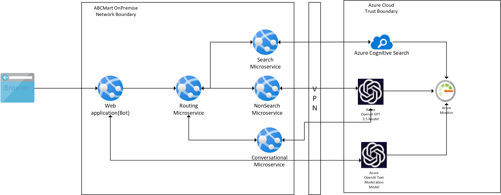
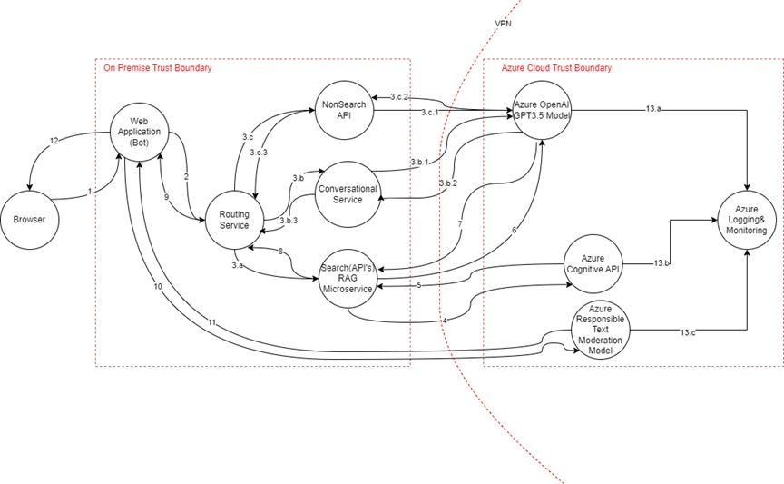
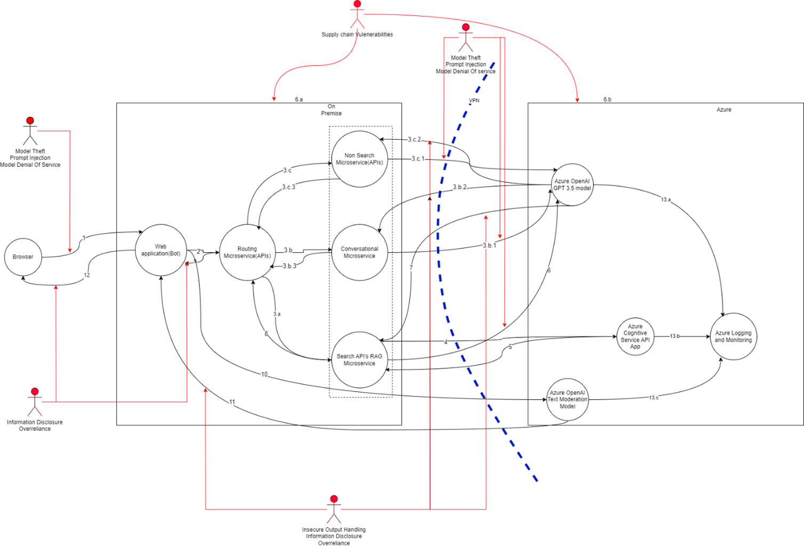
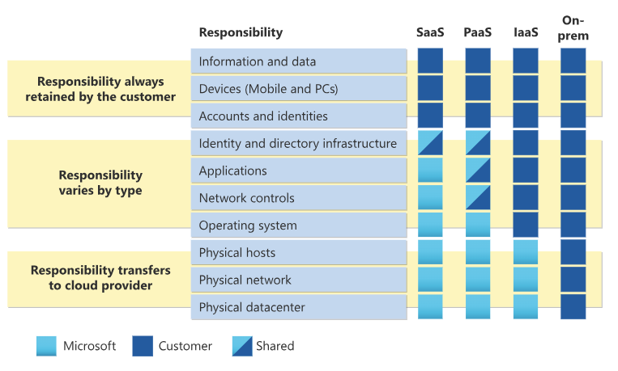

# Security Plan – RetailMart (Example) Retail Application

## Preamble

Important Note:

ISE cannot certify/attest to the security of an architecture nor code. This document is intended to help produce backlog items specific to the customer engagement and to document the relevant security design decisions made by the team during build. Please direct your customer to work with their account team or preferred security vendor to seek an audit or pen-test from a security vendor if required/desired.

## ISE Security Checklist

As part of a new pilot program, ISE Security TD has established the following baseline tasks to improve security outcomes of all engagements:

- Regularly review your Defender for Cloud secure score and recommendations throughout your engagement and create backlog items to remediate them as appropriate.

- Identify and meet with the customer’s security stakeholder during the start, middle, and end of the engagement. Identify and prioritize security requirements, share progress, and hand off unfinished backlog items.

- Meet with an ISE security champion to review the design for your solution.

- With the help of a champion or the Security TD, review and identify the elements in this security plan template that will be completed during the engagement. Deliver the completed components to the customer so that they can integrate it into their threat model(s).

## Security Plan Overview

Please find the Security Plan for RetailMart below. This document shows the architecture and data flow diagram of the application. These artifacts were constructed based on documentation and source code from the project itself and are subject to change as the architecture and codebase evolves.  Each of the labeled entities in the figures below are accompanied by meta-information which describes the threats, describes the data in scope, and recommendations for security controls.
Discretion and resilience are essential qualities for AI models to effectively navigate complex and sensitive tasks, ensuring they can make informed decisions and maintain performance in challenging environments.More details can ne found [here.](#discretion)
In addition to the security controls recommended in this plan, we strongly advise our customers to have robust defense mechanisms implemented using SIEM, SOC tools.

## Application Overview

RetailMart is a fictional retail corporation that stands as a symbol of innovation, customer-centric, and market leadership in the retail industry. With a rich history spanning several decades, RetailMart has consistently set the standard for excellence and has become a household name, synonymous with quality and convenience.

RetailMart operates a diverse range of retail products, catering to the diverse needs of its customers. Whether it's groceries, clothing, jewelry or DIY construction products, the convenience stores e-commerce platform provides a seamless shopping experience, RetailMart has a presence in every facet of the retail landscape.

The company's commitment to customer satisfaction is evident in its dedication to offering top-notch products, exceptional service, and a wide array of choices to meet the demands of shoppers from all walks of life. RetailMart wants to embrace cutting-edge technologies by making use of data-driven analytics and AI-driven recommendations to enhance the shopping experience and ensure that customers find exactly what they need.

This is the security plan that will highlight the security risks associated with the proposed architecture and the security controls that will reduce the likelihood and severity of the security risks assessed within the RetailMart AI driven architecture for its e-commerce web app.

## Diagrams

### Architecture Diagram

|  |
|:------------------------------------------------------------------------------------------:|
|                              *Figure 1: Architecture Diagram*                              |

### Data Flow Diagram

||
|:---------------------------------------------:|
| *Figure 2: Data Flow Diagram*                              |

#### Use Cases

1. Prompt Flow/ Prompt Inputs requiring search /RAG Pattern(**focus of this document**)\
   Data Flow Sequence -- 1, 2, 3.a, 4, 5, 6, 7, 8, 9, 10, 11, 12
2. Non-Search prompts (Example -- Policy query)\
   Data Flow Sequence -- 1, 2, 3.c, 3.c.1, 3.c.2, 9, 10, 11, 12
3. Conversational (Chit-chat) prompts\
   Data Flow Sequence -- 1,2, 3.b, 3.b.1, 3.b.2, 3.b.3, 9, 10, 11, 12

## Data Flow Attributes

| # | Transport Protocol | Data Classification | Authentication | Authorization | Notes|
|---|--------------------|---------------------|----------------|---------------|------|
| 1 | HTTPS | Confidential  | Entra ID |  Entra Application permissions | User enters the prompt on client and send request to web application with prompt input.|
| 2 | HTTPS | Confidential | Entra ID | Entra Application permissions | User request is enhanced and sent to routing service. |
| 3.a | HTTPS | Confidential | Entra ID | Entra Application permissions | If request is related to search, then it's sent to Search RAG (Retrieval Augmented Generation) microservice|
| 3.b | HTTPS | Confidential | Entra ID | Entra Application permissions | If the request is conversational, it is sent to Conversational Microservice. |
| 3.b.1 | HTTPS | Confidential  | Entra ID | Azure RBAC(Cognitive Services OpenAI User) | Conversational Prompt Input is sent to GPT model |
| 3.b.2 | HTTPS | Confidential | Entra ID | Azure RBAC(Cognitive Services OpenAI User) | Conversational prompt response from GPT model. |
| 3.b.3 | HTTPS | Confidential | Entra ID | Entra Application permissions | Response from Conversational Service to Routing Service |
| 3.c | HTTPS | Confidential | Entra ID | Entra Application permissions | If the request is non search, it is sent to non search Microservice. |
| 3.c.1| HTTPS | Confidential | Entra ID | Azure RBAC(Cognitive Services OpenAI User) | Non-Search Request sent to GPT model |
| 3.c.2| HTTPS | Confidential | Entra ID | Azure RBAC(Cognitive Services OpenAI User) | Non search response from GPT model |
| 3.c.3| HTTPS | Confidential  | Entra ID | Entra Application permissions | Response from Non Search API service to Routing Service|
| 4 | HTTPS | Confidential | Entra ID | Azure RBAC(Cognitive Services OpenAI User) | Search API calls cognitive search API to fetch top 10 products. |
| 5 | HTTPS | Confidential | Entra ID | Azure RBAC(Cognitive Services OpenAI User) |  Response from Cognitive search API with details about top 10 products matching search input. |
| 6 | HTTPS | Confidential | Entra ID | Azure RBAC(Cognitive Services OpenAI User) | Product details output from cognitive search is sent to GPT model to summarize the content. |
| 7 | HTTPS | Confidential | Entra ID | Azure RBAC(Cognitive Services OpenAI User) | Response of GPT model to summarize the output|
| 8 | HTTPS | Confidential | Entra ID | Entra Application permissions | Response from Search Service|
| 9 | HTTPS | Confidential | Entra ID | Entra Application permissions | Response from routing service to Web application |
| 10 | HTTPS | Confidential | Entra ID | Azure RBAC(Cognitive Services OpenAI User) | Request sent to content moderation service to filter out harmful content provided by user. Content moderation service used at both user input and output response. |
| 11 | HTTPS | Confidential | Entra ID | Azure RBAC(Cognitive Services OpenAI User) | Output response of content moderation service. |
| 12 | HTTPS | Confidential | Entra ID | Entra Application permissions | Response from web application to client browser|
| 13.a, 13.b, 13.c | HTTPS | Confidential | Entra ID | Azure RBAC(Cognitive Services OpenAI User) | Logs sent to Azure Monitor. |

### Threat Map

||
|:---------------------------------------------:|
| *Figure 3: Threat Map*                              |

### Threat Properties

****

**Threat #**: Prompt Injection

**Principle**: Confidentiality, Integrity, Availability, Privacy

**Threat**:
Users can modify the system-level prompt restrictions to "jailbreak" the LLM and overwrite previous controls in place.

As a result of the vulnerability, an attacker can create malicious input to manipulate LLMs into unknowingly execute unintended actions. There are two types of prompt injection direct and indirect. Direct prompt injections, also known as jail breaking, occur when an attacker overwrites or reveal underlying system prompt. This allows attackers to exploit backend systems.

Indirect prompt injections occur when LLM accepts input from external sources like websites or files. Attackers may embed a prompt injection in the external content.

**Affected Asset(s)**
Chat Bot Service, Routing Microservice, Conversational Microservice, Azure OpenAI GPT3.5 Model, Search API RAG microservice

**Mitigation**:

1. Enforce privilege control on LLM access to backend systems.
2. Segregate external content from user prompts and limit the influence when untrusted content is used.
3. Manually monitor input and output periodically to check that as expected.
4. Maintain fine user control on decision making capabilities by LLM.
5. All products and services must encrypt data in transit using approved cryptographic protocols and algorithms.
6. Use [Azure AI Content Safety Filters](https://azure.microsoft.com/en-us/products/ai-services/ai-content-safety/#features) for prompt inputs and its responses.
7. Use TLS to encrypt all HTTP-based network traffic. Use other mechanisms, such as IPSec, to encrypt non-HTTP network traffic that contains customer or confidential data.
8. Use only TLS 1.2 or TLS 1.3. Use ECDHE-based ciphers suites and NIST curves. Use strong keys. Enable HTTP Strict Transport Security. Turn off TLS compression and do not use ticket-based session resumption.

****

**Threat #**: Model Theft

**Principle**: Confidentiality

**Threat**
Users can modify the system-level prompt restrictions to "jailbreak" the LLM and overwrite previous controls in place.

This threat arises when the proprietary LLM models are compromised, physically stolen, copied or weights and parameters are extracted to create a functional equivalent.

**Affected Asset(s)**
Chat Bot Service, Routing Microservice, Conversational Microservice, Azure OpenAI GPT3.5 Model, Search API RAG microservice

**Mitigation**:

1. Implement strong access controls and strong authentication mechanisms to limit unauthorized access to LLM model repositories and training environments.
2. Restrict the LLMs access to network resources, internal services and API's.
3. Regularly monitor and audit access logs and activities related to LLM model repositories to detect and respond to any suspicious activities.
4. Automate MLOps deployment with governance and tracking and approval workflows.
5. Rate Limiting API calls where applicable.
6. All customer or confidential data must be encrypted before being written to non-volatile storage media (encrypted at-rest) per the following requirements.
7. Use approved algorithms. This includes AES-256, AES-192, or AES-128.

****

**Threat#** : Model Denial Of Service

**Principle**: Availability

**Threat**:

An attacker interacts with an LLM in a method that consumes an exceptionally high amount of resources, which results in a decline in the quality of service for them and other users, as well as potentially incurring high resource costs. This can also be due to vulnerabilities in supply chain.

**Affected Asset(s)**
Chat Bot Service, Routing Microservice, Conversational Microservice, Azure OpenAI GPT3.5 Model, Search API RAG microservice

**Mitigation**:

1. Implement input validation and sanitization to ensure user input adheres to defined limits and filters out any malicious content.
2. Cap resource use per request or step, so that requests involving complex parts execute more slowly.
3. Enforce API rate limits to restrict the number of requests an individual user or IP address can make within a specific time frame.
4. Limit the number of queued actions and the number of total actions in a system reacting to LLM responses.
5. Continuously monitor the resource utilization of the LLM to identify abnormal spikes or patterns that may indicate a DoS attack.
6. Set strict input limits based on the LLMs context window to prevent overload and resource exhaustion.
7. Promote awareness among developers about potential DoS vulnerabilities in LLMs and provide guidelines for secure LLM implementation.
8. All services within the Azure Trust Boundary must authenticate all incoming requests, including requests coming from the same network. Proper authorization should also be applied to prevent unnecessary privileges.
9. Whenever available, use Azure Managed Identities to authenticate services. Service Principals may be used if Managed Identities are not supported.
10. External users or services may use Username + Passwords, Tokens, or Certificates to authenticate, provided these are stored on Key Vault or any other vaulting solution.
11. For authorization, use Azure RBAC and conditional access policies to segregate duties and grant only the least amount of access to perform an action at a particular scope.

****

**Threat#**: Insecure Output Handling

**Principle**: Confidentiality

**Threat**:
Insufficient scrutiny of LLM output, unfiltered acceptance of the LLM output could lead to unintended code execution.

Insecure Output Handling occurs when insufficient validation, sanitization, and handling of the outputs generated by large language models before they are passed downstream to other components and systems. Since LLM-generated content can be controlled by prompt input, this behavior is like providing users with indirect access to additional
functionality.

**Affected Asset(s)**
Web application, Non Search Microservice, Search API RAG microservice, Conversational Microservice, Browser

**Mitigation**:

1. Treat the model as any other user, adopting a zero-trust approach, and apply proper input validation on responses coming from the model to backend functions.
2. Follow the best practices to ensure effective input validation and sanitization.
3. Encode model output back to users to mitigate undesired code execution by JavaScript or Markdown.
4. Use [Azure AI Content Safety Filters](https://azure.microsoft.com/en-us/products/ai-services/ai-content-safety/#features) for prompt inputs and its responses.

****

**Threat#**: Supply chain Vulnerabilities

**Principle**: Confidentiality, Integrity, and Availability

**Threat**:
Vulnerabilities in the open source/third party packages used for development could lead to an attacker exploiting those vulnerabilities

This threat occurs due to vulnerabilities in software components, training data, ML models or deployment platforms.

**Affected Asset(s)**
Web application, Non Search Microservice, Search API RAG microservice, Conversational Microservice, Azure OpenAI GPT 3.5 model, Azure OpenAI Text moderation tool, Azure Cognitive Service API APP

**Mitigation**:

1. Use Azure Artifacts to publish and control feeds, that will lower risk of supply chain vulnerability.
2. Carefully vet data sources and suppliers, including T&Cs and their privacy policies, only using trusted suppliers. Ensure adequate and independently audited security is in place and that model operator policies align with your data protection policies, i.e., your data is not used for training their models; similarly, seek assurances and legal mitigation against using copyrighted material from model maintainers.
3. Only use reputable plug-ins and ensure they have been tested for your application requirements. LLM-Insecure Plugin Design provides information on the LLM-aspects of Insecure Plugin design you should test against to mitigate risks from using third-party plugins.
4. Maintain an up-to-date inventory of components using a Software Bill of Materials (SBOM) to ensure you have an up-to-date, accurate, and signed inventory preventing tampering with deployed packages. SBOMs can be used to detect and alert new, zero-day vulnerabilities quickly.
5. At the time of writing, SBOMs do not cover models, their artifacts, and datasets. If your LLM application uses its own model, you should use MLOps best practices and platforms offering secure model repositories with data, model, and experiment tracking.
6. You should also use model and code signing when using external models and suppliers.
7. Anomaly detection and adversarial robustness tests on supplied models and data can help detect tampering and poisoning.
8. Implement sufficient monitoring to cover component and environment vulnerabilities scanning, use of unauthorized plugins, and out-of-date components, including the model and its artifacts.
9. Implement a patching policy to mitigate vulnerable or outdated components. Ensure the application relies on a maintained version of APIs and the underlying model.
10. Regularly review and audit supplier Security and Access, ensuring no changes in their security posture or T&Cs.

****

**Threat #** : Over-reliance

**Principle**: Integrity

**Threat**:
Over-reliance can occur when an LLM produces erroneous information and provides it in an authoritative manner.

**Affected Asset(s)**
Web application, Non Search Microservice, Search API RAG microservice, Conversational Microservice, Browser

**Mitigation**:

1. Regularly monitor and review the LLM outputs. Use self-consistency or voting techniques to filter out inconsistent text. Comparing multiple model responses for a single prompt can better judge the quality and consistency of output.
2. Cross-check the LLM output with trusted external sources. This additional layer of validation can help ensure the information provided by the model is accurate and reliable.
3. Enhance the model with fine-tuning or embeddings to improve output quality. Generic pre-trained models are more likely to produce inaccurate information compared to tuned models in a particular domain. Techniques such as prompt engineering, parameter efficient tuning (PET), full model tuning, and chain of thought prompting can be employed for this purpose.
4. Implement automatic validation mechanisms that can cross-verify the generated output against known facts or data. This can provide an additional layer of security and mitigate the risks associated with hallucinations.
5. Break down complex tasks into manageable subtasks and assign them to different agents. This not only helps in managing complexity, but it also reduces the chances of hallucinations as each agent can be held accountable for a smaller task.
6. Communicate the risks and limitations associated with using LLMs. This includes potential for information inaccuracies, and other risks. Effective risk communication can prepare users for potential issues and help them make informed decisions.
7. Build APIs and user interfaces that encourage responsible and safe use of LLMs. This can involve measures such as content filters, user warnings about potential inaccuracies, and clear labeling of AI-generated content.
8. When using LLMs in development environments, establish secure coding practices and guidelines to prevent the integration of possible vulnerabilities.
9. Educate users so that they understand the implications of using the LLM outputs directly without any validation.

****

**Threat #**: Information Disclosure

**Principle:** Confidentiality, Privacy

**Threat:**

LLM applications have the potential to reveal sensitive information,proprietary algorithms, or other confidential details through their output. This can result in unauthorized access to sensitive data, intellectual property, privacy violations, and other security breaches.

**Affected Asset(s)**
Web application, Non Search Microservice, Search API RAG microservice, Conversational Microservice, Browser

**Mitigation:**

- Integrate adequate data sanitization and scrubbing techniques to prevent user data from entering the training model data.
- Implement robust input validation and sanitization methods to identify and filter out potential malicious inputs to prevent the model from being poisoned.
- When enriching the model with data and if fine-tuning a model.
- Anything that is deemed sensitive in the fine-tuning data has the potential to be revealed to a user. Therefore, apply the rule of least privilege and do not train the model on information that the highest-privileged user can access which may be displayed to a lower-privileged user.
- Access to external data sources (orchestration of data at runtime) should be limited.
- Apply strict access control methods to external data sources and a rigorous approach to maintaining a secure supply chain.

### Secrets Inventory

An ideal architecture would contain **zero secrets**. Credential-less options like managed identities should be used wherever possible. Where secrets are required, it's important to track them for operational purposes. Please see our [Example SecretsInventory](https://www.cwcwiki.com/wiki/Security_Plan_Guidelines#Example_Secrets_Inventory) to help you get started.

| **Name**        | **What is it?** | **Where does it live?** | **How was it generated?** | **What's the rotation strategy? Does it cause downtime?** | **How does the secret get distributed to consumers?**  | **What’s the secret’s lifespan?**|
| --------- | ------ | -------- | ----- | ----- | -------- | ---------- |
| ......... | ...... | ........ | ..... | ..... | ........ | .......... |

### Appendix

#### Discretion

AI should be a responsible and trustworthy custodian of any information it has access to. As humans, we will undoubtedly assign a certain level of trust in our AI relationships. At some point, these agents will talk to other agents or other humans on our behalf.

Designing controls that limit access to data and ensure that users/systems have access to authorized data is more important than ever before to establish trust in AI. Inline to this thought process, it is also equally important that LLM outputs aligns with the Responsible AI standards.

#### Resilience

The system should be able to identify abnormal behaviors and prevent manipulation or coercion outside of the normal boundaries of acceptable behavior in relation to the AI system and the specific task. These are new types of attacks specific to the AI/ML space.

Systems should be designed to resist inputs that would otherwise conflict with local laws, ethics and values held by the community and its creators. This means providing AI with the capability to determine when an interaction is going “off script.”  Integrity.

Hence, it is important to spruce up the defense mechanisms for the early detection of anomalies, so that AI based applications can fail safe for maintaining Business continuity.

#### Security Principles

- **Confidentiality** refers to the objective of keeping data private or secret. In practice, it's about controlling access to data to prevent unauthorized disclosure.
- **Integrity** is about ensuring that data has not been tampered with and, therefore, can be trusted. It is correct, authentic, and reliable.
- **Availability** means that networks, systems, and applications are up and running. It ensures that authorized users have timely reliable access to resources when they are needed.
- **Privacy** relates to activities that focus on individual users' rights.

#### Microsoft [Zero Trust](https://www.microsoft.com/en-us/security/business/zero-trust/?ef_id=67d61e29cde6157ddb0b7f7559e92f81:G:s&OCID=AID2200938_SEM_67d61e29cde6157ddb0b7f7559e92f81:G:s&msclkid=67d61e29cde6157ddb0b7f7559e92f81) Principles

- **Verify explicitly**.
Always authenticate and authorize based on all available data points, including user identity, location, device health, service or workload, data classification, and anomalies.

- **Use least privileged access**.
Limit user access with just-in-time and just-enough-access (JIT/JEA), risk-based adaptive policies, and data protection to help secure both data and productivity.

- **Assume breach**.
Minimize blast radius and segment access. Verify end-to-end encryption and use analytics to get visibility, drive threat detection, and improve defense.

#### Microsoft Data Classification Guidelines

| **Classification     | **Description**                               |
|-------------|--------------------------------------------------------|
| **Sensitive**          | Data that is to have the most limited access and requires a high degree of integrity. This is typically data that will do the most damage to the organization should it be disclosed. Personal data (including PII) falls into this category and includes any identifier, such as name, identification number, location data, online identifier. This also includes data related to one or more factors specific to the physical, psychological, genetic, mental, economic, cultural, or social identity of an individual. |
| **Confidential**       | Data that might be less restrictive within the company but might cause damage if disclosed. |
| **Private** | Private data is usually compartmental data that might not do the company damage but must be kept private for other reasons. Human resources data is one example of data that can be classified as private.  |
| **Proprietary**        | Proprietary data is data that is disclosed outside the company on a limited basis or contains information that could reduce the company's competitive advantage, such as the technical specifications of a new product. |
| **Public**  | Public data is the least sensitive data used by the company and would cause the least harm if disclosed. This could be anything from data used for marketing to the number of employees in the company.    |

#### Shared Responsibility Model in the Azure Cloud

For all cloud deployment types, customer always their data and identities. They are responsible for protecting the security of your data and identities, on-premises resources, and the cloud components you control. Cloud components the customers control vary by the service type.

Regardless of the type of deployment, customer always retains the following responsibilities:

- Data
- Endpoints
- Account
- Access management

#### References

- [Moderation - OpenAI API](https://platform.openai.com/docs/guides/moderation/overview)
- [Azure AI Content Moderator](https://learn.microsoft.com/en-us/azure/ai-services/content-moderator/overview)
- [Azure AI Content Safety](https://azure.microsoft.com/en-us/products/ai-services/ai-content-safety/#features)
- [Security Bug Reports](https://learn.microsoft.com/en-us/security/engineering/identifying-security-bug-reports)
- [AI Security Risk Assessment](https://www.microsoft.com/en-us/security/blog/2021/12/09/best-practices-for-ai-security-risk-management/)
- [AI Impact Assessment](https://microsoft.sharepoint.com/sites/ResponsibleAI/SitePages/Achieving-Compliance.aspx#impact-assessments)
- [Azure AI Security Risk Assessment](https://github.com/Azure/AI-Security-Risk-Assessment/blob/main/AI_Risk_Assessment_v4.1.4.pdf)
- [MITRE Adversarial ML Threat Matrix](https://github.com/mitre/advmlthreatmatrix)
- [OWASP AI Security and Privacy Guide](https://owasp.org/www-project-ai-security-and-privacy-guide/)
- [Azure ML Prompt Flow](https://learn.microsoft.com/en-us/azure/machine-learning/prompt-flow/overview-what-is-prompt-flow?view=azureml-api-2)
- [Deck and Go Dos Responsible AI at Microsoft](https://strikecommunity.azurewebsites.net/articles/12301/deck-and-go-dos-responsible-ai-at-microsoft-deploy.html)
- [Looking for Threats and Harms in AI System](https://microsoft.sharepoint.com/teams/PRCommunityTeam/Shared%20Documents/Forms/AllItems.aspx?id=%2Fteams%2FPRCommunityTeam%2FShared%20Documents%2FSTRIKE%2FSTRIKE%20Contributors%2FSTRIKE%20Presentations%2FArchive%2F2023%2F9%2E22%2E2023%20STRIKE%20Live%20%2D%20AI%2FAI%20FINAL%2F4%29%20Looking%20for%20Threat%20and%20Harms%2FLooking%20for%20Threats%20and%20Harms%20Presentation%2Epdf&parent=%2Fteams%2FPRCommunityTeam%2FShared%20Documents%2FSTRIKE%2FSTRIKE%20Contributors%2FSTRIKE%20Presentations%2FArchive%2F2023%2F9%2E22%2E2023%20STRIKE%20Live%20%2D%20AI%2FAI%20FINAL%2F4%29%20Looking%20for%20Threat%20and%20Harms&p=true&ga=1)
