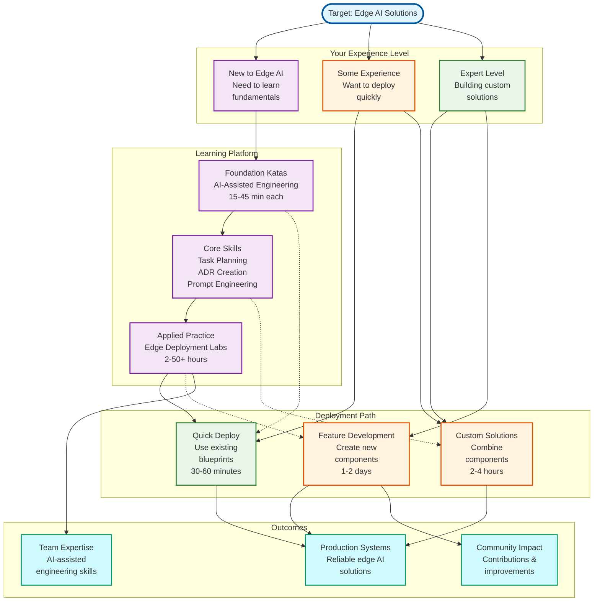

# Edge AI Accelerator

[](https://dev.azure.com/ai-at-the-edge-flagship-accelerator/edge-ai/_build/latest?definitionId=12&branchName=main)
[](LICENSE)
[](https://vscode.dev/redirect?url=vscode://ms-vscode-remote.remote-containers/cloneInVolume?url=https://dev.azure.com/ai-at-the-edge-flagship-accelerator/_git/edge-ai)

Production-ready Infrastructure as Code that empowers organizations to achieve more with edge AI solutions. Built by friendly geeks, for every team that needs edge solutions to achieve real production results.

## 🎯 Who This Is For

- **Platform Engineers** building edge AI infrastructure at scale
- **DevOps Teams** deploying IoT and edge computing solutions
- **Solution Architects** designing hybrid cloud-edge systems
- **Every organization** that needs edge infrastructure solutions that actually deliver production results

## 🚀 Get Started (Pick Your Adventure)

### → [Just Want to Deploy Something?](docs/getting-started/general-user.md)

Start here if you want to achieve rapid deployment with existing blueprints to Azure. **Time: 30-60 minutes**

### → [Building Custom Solutions?](docs/getting-started/blueprint-developer.md)

Start here if you're combining components to achieve new deployment scenarios. **Time: 2-4 hours**

### → [Contributing New Features?](docs/getting-started/feature-developer.md)

Start here if you're developing new components to help others achieve more. **Time: 1-2 days setup**

## 🗺️ Your Learning and Deployment Journey



## �📁 Repository Tour

```text
📦 edge-ai/
├── 📋 blueprints/          # Ready-to-deploy solution templates
├── 📚 docs/                # Complete documentation and guides
├── 🏗️  src/                # Reusable infrastructure components
├── 🧪 tests/               # Testing and validation
├── 🤖 scripts/             # Automation and utilities
└── 🚢 deploy/              # CI/CD pipelines and automation
```

### 🏗️ Infrastructure Components ([`src/`](src/))

Modular, reusable building blocks:

- **Cloud services** (identity, data, messaging, observability)
- **Edge platforms** (Kubernetes, Azure IoT Operations)
- **Application frameworks** (AI inference, telemetry)

### 📋 Deployment Blueprints ([`blueprints/`](blueprints/))

Complete solution templates:

- **Single-node edge** deployments
- **Multi-node cluster** setups
- **Cloud-only** configurations
- **Minimal** proof-of-concept setups

### 📚 Documentation ([`docs/`](docs/))

Everything you need to know:

- **Getting started** guides for different roles
- **Architecture** decisions and design patterns
- **Contributing** guidelines and development workflow

## 🛠️ Quick Setup (Dev Container Recommended)

**Prerequisites:** Docker, VS Code, and GitHub Copilot (seriously, this repo is optimized for AI-assisted development)

```bash
# Clone and open in VS Code
git clone https://github.com/Microsoft/edge-ai.git
cd edge-ai
code .

# When prompted, "Reopen in Container"
# Everything gets installed automatically 🎉
```

**Alternative:** [Manual setup instructions](docs/contributing/development-environment.md) (for the brave)

> **Note on Telemetry:** If you wish to opt-out of sending telemetry data to Microsoft when deploying Azure resources with Terraform, you can set the environment variable `ARM_DISABLE_TERRAFORM_PARTNER_ID=true` before running any `terraform` commands.

## 🎨 What Makes This Project Different

- **Actually works in production** - empowering real deployments
- **Modular design** - enabling teams to build custom solutions that meet business needs
- **AI-assisted development** - optimized for GitHub Copilot to accelerate every engineer's productivity
- **Multiple IaC frameworks** - Terraform & Bicep
- **Comprehensive testing** - because empowering reliable edge infrastructure deployments is our mission

## 🔗 Want to Use Edge-AI Tools in Your Own Repository?

Share our AI instructions, custom agents, and prompts across your projects with a simple dev container setup:

**Step 1:** Clone both repositories into the same workspace

```bash
git clone https://github.com/Microsoft/edge-ai.git
git clone https://github.com/<your-organization>/<your-project>.git  # Replace with your own repository URL
```

**Step 2:** Add mount to your project's `devcontainer.json`

```json
{
  "mounts": [
    "source=${localWorkspaceFolder}/../edge-ai,target=/workspaces/edge-ai,type=bind,consistency=cached"
  ]
}
```

**Step 3:** Update your project's `.vscode/settings.json`

```json
{
  "chat.agentFilesLocations": {
    ".github/agents": true,
    "../edge-ai/.github/agents": true
  },
  "chat.instructionsFilesLocations": {
    ".github/instructions": true,
    "../edge-ai/.github/instructions": true
  },
  "chat.promptFilesLocations": {
    ".github/prompts": true,
    "../edge-ai/.github/prompts": true
  }
}
```

**Result:** Rebuild your dev container and gain instant access to:

- ✅ **Task researcher** and **task planner** custom agents
- ✅ **AI-assisted engineering** workflows
- ✅ **Coding standards** and conventions
- ✅ **Always up-to-date** - no file copying needed

*💡 Perfect for teams wanting to adopt AI-assisted development patterns without duplicating files across repositories.*

## 🎓 Learning Platform

**Empower your team to achieve proficiency in AI-assisted, hyper-velocity engineering** through hands-on training labs and focused practice exercises (Katas).

### Learning Platform Philosophy

This Learning Platform combines AI assistance with practical engineering challenges, empowering every engineer to achieve more and ensuring that learning translates directly into real-world engineering capabilities and better contributions to Edge-AI.

The Learning Platform provides challenge-based learning for edge-to-cloud AI systems:

- **🥋 [Katas](learning/katas/)** - Focused 15-45 minute practice exercises
- **🧪 [Training Labs](learning/training-labs/)** - Comprehensive 2-8 hour hands-on experiences *(Coming Soon)*
- **🤖 [AI Coaching](learning/)** - Built-in coaching prompts for discovery-based learning

### 🚀 Start Your AI-Assisted Learning Path

**One-click training mode** - launch documentation with automatic navigation to Learning Platform:

```bash
npm run docs
```

This command automatically:

- ✅ Builds the documentation
- ✅ Starts the local server
- ✅ Opens your browser directly to the documentation site
- ✅ Navigate to the Learning section to access all learning paths and resources

## 🤝 Contributing

We ❤️ contributions! Whether you're fixing typos or adding new components:

1. Read our [Contributing Guide](docs/contributing/)
2. Check out [open issues](https://github.com/Microsoft/edge-ai/issues)
3. Join the [discussion](https://github.com/Microsoft/edge-ai/discussions)

## Responsible AI

Microsoft encourages customers to review its Responsible AI Standard when developing AI-enabled systems to ensure ethical, safe, and inclusive AI practices. Learn more at [Microsoft's Responsible AI][responsible-ai].

## 📄 Legal

This project is licensed under the [MIT License](./LICENSE).

**Security:** See [SECURITY.md](./SECURITY.md) for security policy and reporting vulnerabilities.

## Trademark Notice

> This project may contain trademarks or logos for projects, products, or services. Authorized use of Microsoft
> trademarks or logos is subject to and must follow Microsoft's Trademark & Brand Guidelines. Use of Microsoft trademarks or logos in
> modified versions of this project must not cause confusion or imply Microsoft sponsorship. Any use of third-party trademarks or
> logos are subject to those third-party's policies.

<!-- markdownlint-disable MD036 -->
*🤖 Crafted with precision by ✨Copilot following brilliant human instruction,
then carefully refined by our team of discerning human reviewers.*
<!-- markdownlint-enable MD036 -->

[responsible-ai]: https://www.microsoft.com/ai/responsible-ai
