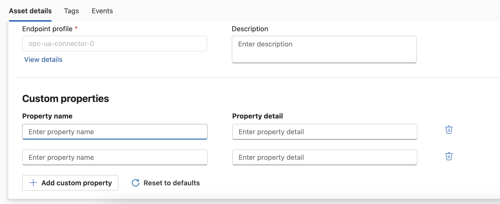
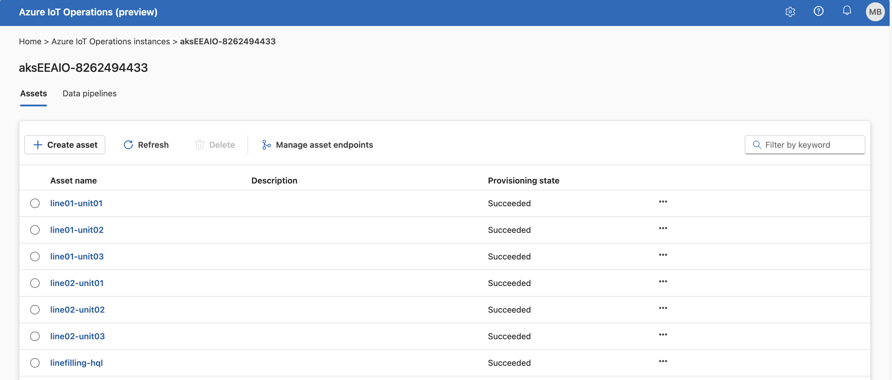
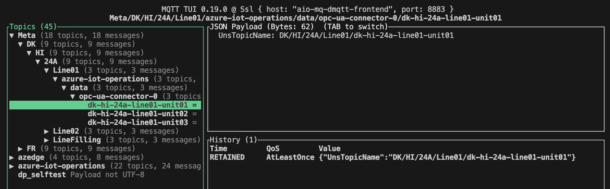

# Asset and Metadata Creation

Date: 2024-04-03

## Status

[For this library of ADRs, mark the most applicable status at which it was stored in the original project. This can help provide context and validity for folks reviewing this ADR. If it has been deprecated you can add a note on why and date it.]

- [ ] Draft
- [X] Proposed
- [ ] Accepted
- [ ] Deprecated

## Context

Metadata needs to be stored to the assets/tags that provide additional information, e.g. temperature_max. But the metadata also contains information about the hierarchy of the asset itself, like the country, site, area, production line, and asset name which can be used to create the right structure in the UNS.

## Decision

Based on the available asset data and also metadata provided in the [FullMetadata.csv](/simulated-assets/FullMetadata.csv) file, assets have to be provisioned in AIO using the endpoint linked to the OPC UA Broker.

## Decision Drivers

- We want to store the metadata in a central place, when the assets are created (batch)
- We want to allow operator to update the metadata from this central place and ensure the changes are reflected in the Local and Enterprise UNS
- We want to ensure the MQTT topic structure is consistent across the enterprise

## Considered Options

The preferred option is to store the metadata directly during the asset creation in a place where it can be updated by operators.
The ideal way is the use the custom properties of the asset in AIO to store that data.


Unfortunately, adding custom properties automatically via the `az iot ops asset create` command is not yet supported.

The alternative is to store the metadata in a central place. Here [Azure Resource Tags](https://learn.microsoft.com/en-us/azure/azure-resource-manager/management/tag-resources) of the synced Azure resource can be used. This can be added by using the `az iot ops asset create --tags` command. The operator can then update the metadata in the Azure Portal if changes occur.

## Decision Conclusion

### Asset Creation

The creation of assets and asset endpoint profiles can be achieved by utilizing the Azure CLI `az iot ops asset`. See [this page](https://learn.microsoft.com/en-us/cli/azure/iot/ops?view=azure-cli-latest) for latest CLI details / updates.
Asset creation will be automated via shell script which executes the following steps:

1. Receive the following parameters:
    - Endpoint name
    - Resource group name
    - Directory where the asset tags are located
    - Name of the Arc-enabled Kubernetes cluster
2. Create the asset endpoint pointing the OPC UA Broker to the OPC UA Server with address e.g. `ocp.tcp://10.1.2.4:49320`
3. Create the assets according to the files found with patter *data.csv in the directory defined in the parameter
    - Create the asset name from country, site, area, production line, and asset name to avoid conflicts
    - Build the initial command
    - Loop through the file(s) found in the directory
    - Add the asset tags as data-points
    - Add the Azure tags as metadata

Assets will be created via the Azure custom location and synced to the Arc-enabled Kubernetes cluster and Azure IoT Operations portal as well.


### Metadata Creation and Publishing

The metadata will be stored in the Azure Tags of the synced Azure resource. The operator can update the metadata in the Azure Portal if changes occur.

A shell script can be used to implement the following steps in an efficient way:

1. Access the Arc-enabled Kubernetes cluster by executing `az connectedk8s proxy -n <cluster-name> -g <resource-group-name>` ('clusterrolebinding' needs to be created before)
2. Receive the following parameters:
    - Resource group name
    - Directory where the asset tags are located
3. Loop through the file(s) found in the directory
    - Retrieve the asset tags from the Azure Tags of the synced Azure resource by executing `az iot ops asset show --name <asset-name> --resource-group <resource-group-name>`
    - Build the payload for the MQTT message

        ```json
        "UnsTopicName": "DK/HI/24A/Line01/Unit01"
        ```

    - Build the topic name, e.g. `Meta/DK/HI/24A/azure-iot-operations/data/kepware-opc-ua-connector/Line01/Unit01`
    - Publish the payload to the MQTT broker via

        ```bash
        kubectl exec  mqtt-client -n azure-iot-operations -- \
        mqttui -b mqtts://aio-mq-dmqtt-frontend:8883 -u '$sat' \
        --password $mqttClientPassword --insecure publish "$metaTopicName" "$metaValue"
        ```

Meta data will be published to the MQTT broker and stored in the Enterprise UNS (Corp/L4).

