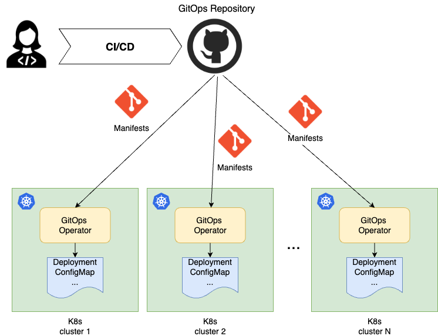

# Deployment on the Edge with GitOps

Date: **2024-06-04**

## Status

- [ ] Draft
- [ ] Proposed
- [X] Accepted
- [ ] Deprecated

## Context

Kubernetes clusters and VMs operating at the Edge host diverse workloads and configurations. These edge computing systems are jointly authored by application developers and platform teams,
and must be deployed across a fleet of Edge runtimes. Edge environments impose strong requirements on solution scalability, connectivity, and security with regards to their deployment approach.

## Decision

GitOps has been determined as the primary deployment technique for Kubernetes clusters across Edge and Cloud.

GitOps is the de-facto a standard deployment approach in the Kubernetes ecosystem and it proves especially valuable for the scale and dimensionality of Edge environments.
GitOps is a pull-based technique that defines a centralized storage mechanic containing deployment descriptors, such as Kubernetes manifests. This storage is often a Git repository,
but can also be an OCI repository, an S3 API storage, an Azure Blob Storage, or a Helm repository.
This storage is observed by Kubernetes clusters, with each cluster hosting a reconciler (a GitOps operator),
that watches the manifests in the GitOps storage and pulls them down to the cluster if there is a new change to apply.

Depending on the manifests nature, a corresponding Kubernetes controller natively handles the new manifests.
For example, if it is a Deployment, the deployment controller on the cluster starts its rollout process, so that the pods are created.

## Decision Drivers

There are many advantages of GitOps, but, when it comes to Edge, the following three capabilities make the point.

### Scalability

The classic push-based deployment approach iterates over a list of deployment target clusters and deploys manifests to each of them. It works well for a handful of clusters.
Given that there might be hundreds or thousands of Edge clusters, this solution is not practical and at a large scale not feasible. With the pull-based GitOps technique,
the burden of the deployment is delegated from the central deployment orchestrator to the clusters.
It is scaled out across the fleet. Each cluster simultaneously, asynchronously and independently
from each other starts the deployment once there is a change to the manifests. The number of deployment target clusters doesn't really matter in this case.

### Security

A GitOps technique eliminates the need for a central connection point out to all Edge clusters, such as a deployment orchestrator.
The deployment pipeline doesn't even know on what clusters the manifests are deployed, inverting the chain of responsibility.
The information on what clusters are there and how to get access to them is not concentrated in one place.
Further, it eliminates a single point of threat that might compromise all Edge clusters in the fleet.
Additionally, a GitOps operator on each cluster adheres to the Kubernetes security model, including RBAC.
It pulls and applies manifests using a service account with permissions restricted to the specific application's scope, ensuring that each application operates within its own security boundaries.

### Connectivity

It is common for Edge clusters to operate at the lower network layers hidden behind a chain of firewalls and proxies, and occasionally in completely disconnected environments.
It is difficult, and sometimes not even possible, to establish and maintain the connectivity to the Edge clusters from a central point in the cloud to perform push-based deployments.
With a GitOps pull-based technique, it is the responsibility of each cluster to check and deploy changes as they come online.

### The Downside

A GitOps approach is more complex than a strait forward push-based deployment approaches.
It requires more sophisticated CI/CD flows with additional monitoring requirements to provide visibility into the entire promotional
flows and component execution.

## Consequences

The GitOps based solution enables the customer to effectively and securely deploy workloads to Edge clusters regardless of scale and connectivity challenges.
It also serves as a unified deployment approach for all Kubernetes workloads, including the cloud based ones.

## Future Considerations

The related topics are highlighted in separate ADRs:

- Promotional CI/CD flow with GitOps
- GitOps operator. Azure Arc GitOps vs Flux vs ArgoCD
- Workload and Configuration Management
- Deployment Observability
- Secret Management on the Edge with GitOps
