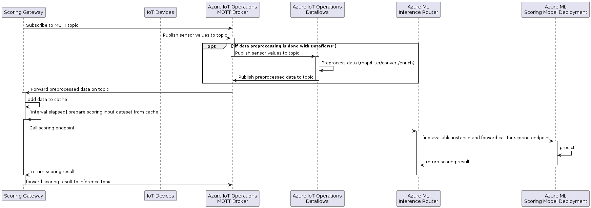

# Separation of concerns in edge data transformation pipeline for inferencing ML model hosted by Azure ML Arc extension (in an MVE)

Date: **2024-09-18**

Author: **Martin Weber**

## Status

- [ ] Draft
- [ ] Proposed
- [X] Accepted (in scope of the MVE/Demonstrator)
- [ ] Deprecated

## Context

For a manufacturing customer, a **Demonstrator** needed to be created in a short period of time to showcase technology capabilities and choices that can solve the customer's requirements.

The Demonstrator aims to address the following requirements: calling an ML model to predict potential machine stoppages by ingesting machine data (OPC UA simulated data) and interacting with the model on edge. The model is deployed using Azure Machine Learning Arc-extension on edge, with a built-in inferencing router.

This ADR focuses on this requirement:

- Enable an edge platform at the factories for running (near) real-time workloads that process data from the factory, prepare the data, call an inferencing endpoint of an ML model, and process the prediction.

The following diagram shows the interaction between the _Scoring Gateway_ and the other edge components:

The devices publish data to the Azure IoT Operations MQTT broker. This data is then optionally [preprocessed by Azure IoT Operations Dataflow](https://learn.microsoft.com/en-us/azure/iot-operations/connect-to-cloud/overview-dataflow) to map (filter, project), convert and enrich the data. The goal is to provide the right preprocessed (mapped, filtered, enriched, etc.) features required by the scoring endpoint. This preprocessed data is then published back to the MQTT broker to a different topic for preprocessed data.

The gateway subscribes to the input topic on startup.

As data is published by the devices or the dataflow, the gateway receives this data from MQTT and caches it.

At a given interval the gateway calls the scoring endpoint to get the prediction.

To make the prediction, the time series data needs to be transformed in a way that fits the input of the scoring endpoint. The transformation depends on the scoring endpoint input format and can differ in between different scoring endpoints and even versions of the same. Some scoring endpoints might need a table containing a time series, others might just need a record of aggregated values, values need to be encoded, combined, imputation needs to be done, etc., and there might be many other options and combinations which require some flexibility.

To make sure that the scoring behaves in production as tested with the test set, it is important that this feature transformation is the equivalent in production and in the test script.

**Scope** of this ADR is to discuss different options to distribute the data preprocessing functionality between the gateway and the scoring endpoint.

**Out of scope:** in this ADR we are not considering data enrichment (with MES-like data). That will be the object of a subsequent ADR.

### Glossary

- (Scoring) Gateway: The Gateway between MQTT and Azure ML on the edge that reads the device messages from MQTT and sends them to the scoring endpoint for inference and forwards the result to and other MQTT topic.
- Scoring endpoint: The Azure ML scoring endpoint on the edge cluster provides a static REST API to perform predictions on the scoring deployment that hosts the ML inference pipeline including the ML model.
- Model: The Machine Learning model that does the inference.

## Decision

For this demo / experiment phase of the project, we decided to go with _Option 3: Simple Gateway and full preprocessing in the scoring endpoint_, as it allows the simplest implementation of the gateway for the given inference pipeline in this demo phase and has the highest flexibility for different scoring endpoints.

## Decision Drivers

The main purpose of the gateway is to interact with the scoring endpoint to get a prediction based on the data from MQTT. The gateway is not intended to do complex data processing as there are other components better suited for this.

The chosen approach is model agnostic and the feature transformation script can be the same for the inference pipelines in testing and in production. There is the highest flexibility for the Data Scientist to change the transformation of the features as it is shared between the test code and the scoring script.

Also, the Azure IoT Operations Dataflow component does not provide all the functions to give the required flexibility for feature engineering. Therefore, it is important that the dataflow is only responsible for providing a prepared dataset that can act as input for the inference pipeline dependent feature transformations (imputation, combination of features, encoding, etc.) that provide the right input to the scoring endpoint.

## Considered Options

### Option 1: Full preprocessing in the Gateway

The sensor data ingested via MQTT is prepared in the gateway to be ready for prediction. No data preprocessing is done on the scoring endpoint. The scoring endpoint just calls the inference pipeline and returns the result.

**Advantages:**

- The data that is sent from the gateway to the scoring endpoint is smaller as it can be aggregated in the gateway.
- Potential to save memory when aggregating before caching.

**Disadvantages:**

- The data preprocessing needs to be replicated for testing the inference pipeline and for configuring in the gateway.
  - Duplicate work.
  - Risk of missing functionality on the Gateway.
  - Risk of different behavior between test and production.
- The gateway needs to be more complex to configure and handle this preprocessing. It needs to decide how to aggregate each feature. This is especially complex for non-numeric features where it is not possible to take the average or min/max function.

### Option 2: Aligning time series by windowing in the gateway and creating more complex features in the scoring script

This option is a compromise between the options 1 and 3.
In the gateway the cached data is transformed into a time series data table with some simple windowing by time to align all the time series of the different features, before passing it to the scoring endpoint for prediction.

**Advantages:**

- Smaller data that needs to be sent between the gateway and the scoring endpoint.
- Complex transformations are still done in the scoring script and can be shared between test and scoring endpoint.

**Disadvantages:**

- Not needed for the inference pipeline we have now for the demo, as the data is aggregated to a single record.
- More complex implementation of the gateway as it needs to aggregate the data by window.
  - How would the window be aggregated: average, median, min, max, first, last value?
  - How should non-numeric features such as the vendor_name in the sample be aggregated?
- The split between windowing and feature engineering might make it difficult when for a certain time series more data is needed than for other, for example to extract the frequency of a time series, more data is needed than for other features where just the average is of interest.
- There is data imputation needed for values that are sent less often than the window size.

### Option 3: Simple Gateway and full preprocessing in the scoring endpoint

The gateway is scoring endpoint agnostic. All MQTT data is transformed into a set of time series that is then forwarded to the scoring endpoint for inference at the configured interval.

The filtering of the data can be either done as part of the gateway or in an [Azure IoT Operations dataflow](https://learn.microsoft.com/en-us/azure/iot-operations/connect-to-cloud/overview-dataflow) that just filters the data required by the scoring and forwards it to a MQTT topic on which the gateway receives it.

**Advantages:**

- The code for the transformation of the features for testing and for inference in production can be reused.
  - No duplication of functionality.
  - No risk of different behavior between test and production.
  - As the feature transformation has a big influence on the prediction quality, the Data Scientist should have the best flexibility to change it and build advanced preprocessing functions. This approach allows the Data Scientist to work more independently.
- The configuration of the gateway is simple and therefore the gateway resides scoring endpoint agnostic.
- It is a good starting point that allows later adding simple windowing and alignment of the data by time if needed.
- For this demo / experiment phase of the project, the data that needs to be cached and sent from the gateway to the scoring endpoint is small enough and needs no compression.
- Time series of different sizes can be processed in the scoring script which adds more flexibility for the Data Scientist.

**Disadvantages:**

- There is a risk that the time series data becomes big which has the following implications:
  - The size of the payload that is sent to the scoring endpoint might at some point reach some size limits.
  - The memory consumption of the gateway pod is higher as there is no aggregation. Assuming that just tabular data is cached, this might not be an issue compared to the payload.

## Consequences

The choice for _option #3_ in this MVE allows for simplest implementation of this demonstrator. For a real environment choices would need to be re-evaluated.
