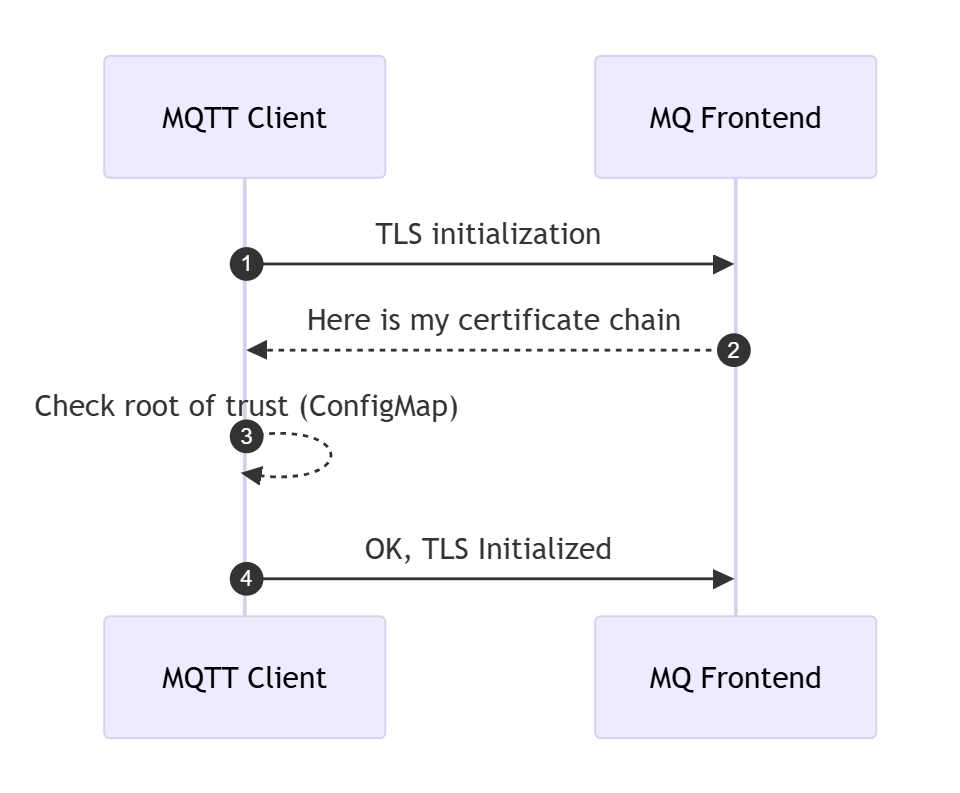

# Certificates and TLS in Azure IoT Operations (AIO)

Azure IoT Operations utilizes TLS for secure communication between servers and clients in services such as the MQTT broker. This document aims to demystify the complex aspects of TLS, focusing on key elements like Root CA, Intermediate CA, Leaf Certificates, Certificate Chains, and Trust Bundles.

Furthermore, the document also highlights a few key callouts concerning certificates and Azure IoT Operations beyond the regular official documentation.

## TLS and Certificates Primer

### Root Certificate Authority (Root CA)

In a production environment, the Root Certificate Authority (CA) certificate usually originates from an external Certificate Authority, which could be an Enterprise PKI or a third-party like VeriSign, GlobalSign, etc.

This document uses self-signed certificates as examples to explain the different flows of TLS exchanges. In the case of self-signed certificates, the Root CA is always at the top of the chain. It's the initial certificate and key pair used to sign any child certificates, which could be Intermediate CA certificates, or Leaf certificates.

### Intermediate CA Certificates

Intermediate CAs are often used to establish different branches of chains. This allows for the renewal of only the Intermediate CA, while the Root CA can be trusted for longer periods by clients.

The number of Intermediates used can vary. Some companies might use one Intermediate per division, project, or solution, while others might use just one. In a simple developer setup, one might decide not to use any intermediates and have the leaf certificates as children of the Root CA.

As a developer, it's always a good idea to setup a more realistic flow with at least one Intermediate since trust chain validations might behave differently in custom code or some custom libraries, and all scenarios should be tested.
It's worth calling out that the different environments such as Test / Staging / Prod should implement similar approaches to ensure applications are tested with the same certificate management approaches as in production.

### Leaf or Server Certificate

The leaf certificate is the actual server or client certificate associated with a TLS server endpoint. It's often also called the 'Server certificate'. It is the leaf certificate where settings such as the Subject Alternate Name(s) (SAN) are configured.

In the case of Mutual TLS (mTLS) or certificate-based authentication, the certificate chain validation is done in the opposite direction, i.e., the server needs to verify the ownership of the client chain.

An important note here is the differentiation between the server/leaf certificate itself, and what information it sends over upon a TLS or mutual authentication flow: the leaf certificate is typically not sent as is for any of the flows, it's always a chain (bundle) of the leaf certificate together with its chain of intermediate certificates.

### Trust Distribution: Trust Bundles

When using public CAs from known vendors, these Root CAs are typically distributed with OS and are stored in the computer's trust store. However, when using private or self-signed CAs, a manual step is required to ensure all clients have an ability to load custom roots of trust.

In Kubernetes, *trust-manager* is a useful solution to help distribute trust within the cluster. It can distribute default CAs from known vendors as well as your own roots of trust.

Read more about *trust-manager* [here](https://cert-manager.io/docs/trust/trust-manager/).

Regardless of whether you use *trust-manager* or not, you will typically end up distributing the Root CA distribution via a `ConfigMap`, which is then mounted onto Pods (applications) that require TLS connectivity to servers. These ConfigMaps, often referred to as Trust Bundles, may contain one or more root CAs.

### TLS Handshake Flow

A secure TLS channel between a client and a server is initiated with a handshake, which includes a Certificate validation flow. The server sends its full certificate chain to the client during the TLS handshake, which the client uses to verify the server's identity.

* The server sends its **full certificate chain** to the client during the TLS handshake.
* This chain typically includes:
  * The server's **end-entity certificate** (issued to the server's domain).
  * Intermediate certificates (if any) that link the server's certificate to a **trusted root certificate authority (CA)**.
  * The **root certificate** (optional but not recommended) that signed the intermediate certificate. Root trust is typically distributed upfront to client and therefore not recommended to include it in the Server Certificate Chain [see spec](https://www.rfc-editor.org/rfc/rfc5246#section-7.4.2).
* The client uses this information to verify the server's identity.

In MQTT broker, the configuration of TLS is done through `BrokerListener`. The flow will look like this:



### Trust Bundle and Certificate Renewal

Public Root CAs often have a very long expiry time, up to 25 years. In such cases, any number of Intermediate CAs and Leaf certificates might expire and renew, but the client needs no updating to the root of trust since this one has such a long validity timespan.

In Enterprise PKI or self-signed Root CAs, certificate expiry is often set to a much lower timespan since the whole chain is controlled end-to-end.
This is why, it is often required to update Trust Bundles with new Root CAs and exposing the current and the new Root CA in the same bundle. If a bundle contains the current Root CA, all TLS communication will work.
Then, once a Root CA needs to be renewed, the Trust Bundle needs to be updated with the current as well as the new Root CA (before the renewal happens on the server-side), so the client is ready to verify a new chain once the server certificate is renewed.
This rollover period needs to be carefully planned, and clients need to be updated well-upfront to any server certificate renewal.

### Trust Bundles and Trust Chains

A trust bundle can contain one or several root CAs that are used by a client to verify authenticity during a TLS handshake. When speaking about trust bundles and root of trust we are always and only speaking about the public certificate, never the private key.

In Kubernetes, a `ConfigMap` is usually used to configure the trust store mounted in the Pod. Since it contains only public certificate information, it's not stored in a Kubernetes `Secret`.

A bundle of root CA certificates can also include a chain if some setups require the client to validate the root chain. Although uncommon, it is permissible. In such cases, the bundle contains both root and intermediate chains.

### Mutual TLS (mTLS)

In an mTLS flow, both the server and the client need to exchange their certificates and verify each other's authenticity. The process is initialized like any TLS flow, with the added step of the client sending its own chain, and this time it's the server validating the client. Each party (server and client) maintains its own root of trust (trusted CA certificates).

**Server Certificate Chain**:

* The server sends its **full certificate chain** to the client during the TLS handshake.
* This chain typically includes:
  * The server's **end-entity certificate** (issued to the server's domain).
  * Intermediate certificates (if any) that link the server's certificate to a **trusted root certificate authority (CA)**.
  * The **root certificate** (optional but not recommended) that signed the intermediate certificate. Root trust is typically distributed upfront to client and therefore not recommended to include it in the Server Certificate Chain [see spec](https://www.rfc-editor.org/rfc/rfc5246#section-7.4.2).
* The client uses this information to verify the server's identity.

**Client Certificate Chain**:

* The client sends its **full certificate chain** to the server during the TLS handshake.
  * This chain includes:
    * The client's **end-entity certificate** (issued to the client), also called *client certificate*.
    * Intermediate certificates (if any) that link the client's certificate to a trusted root CA.
      * The root certificate (optional but not recommended) that signed the intermediate certificate. The recommendation is for the server to have a trust store with the root of trust from the client. In MQTT broker this is configured through `trustedClientCaCert` when using [X.509 Authentication](https://learn.microsoft.com/azure/iot-operations/manage-mqtt-connectivity/howto-configure-authentication#x509-client-certificate).
  * The server uses this information to verify the client's identity.

**Root of Trust**:

* Each party (server and client) maintains its own **root of trust** (trusted CA certificates).
* The server verifies the client's certificate using its trusted root CA.
* The client verifies the server's certificate using its trusted root CA.
* These trusted roots ensure that the certificates are valid and issued by a legitimate CA.

## Azure IoT Operations and certificate management

### Trust configuration

*trust-manager* is required when installing AIO. The default `SelfSigned` installation settings take care of installing *cert-manager* and *trust-manager*.
When choosing custom trust configuration, these two solutions are a pre-requisite to installing AIO.

See the options `az iot ops init <> --user-trust` and `az iot ops create <> --trust-settings <>` in the [certificate management](https://learn.microsoft.com/azure/iot-operations/secure-iot-ops/concept-default-root-ca) documentation.

When using custom trust configuration, but preferring to have AIO take care of installing *cert-manager* and *trust-manager*, you can use the `user-trust` setting to false in the `az iot ops init <> --user-trust false` command while keeping custom settings in the subsequent `az iot ops create` command.

### MQTT broker's TLS server certificate

In the case of AIO MQTT broker, the Server certificate is generally automatically generated by configuring an `Issuer` and configuring the server certificate settings through the MQTT broker's [BrokerListener](https://learn.microsoft.com/azure/iot-operations/manage-mqtt-broker/howto-configure-brokerlistener?tabs=portal%2Ctest#configure-tls-with-automatic-certificate-management) resource.
The TLS settings can be set to generate leaf certificates automatically through *cert-manager*, or fully configuring [manual TLS settings](https://learn.microsoft.com/azure/iot-operations/manage-mqtt-broker/howto-configure-brokerlistener?tabs=portal%2Ctest#configure-tls-with-manual-certificate-management) by providing pre-existing Root (and optional intermediate) and server certificate.

When setting custom configuration for TLS automatic certificate management for a port, there is a spec for configuring the certificate's settings like expiry and renewal, as well as IP and SAN: [CertManagerCertificateSpec](https://learn.microsoft.com/rest/api/iotoperations/broker-listener/create-or-update?view=rest-iotoperations-2024-11-01&tabs=HTTP#certmanagercertificatespec).

```yaml
apiVersion: mqttbroker.iotoperations.azure.com/v1
kind: BrokerListener
metadata:
  name: aio-broker-loadbalancer-tls # Avoid conflicts with default service name 'aio-broker'
  namespace: azure-iot-operations
spec:
  brokerRef: default
  serviceType: loadBalancer
  ports:
  - port: 8884 # Avoid conflicts with default port 18883
    tls:
      mode: Automatic
      certManagerCertificateSpec:
        issuerRef:
          name: my-issuer
          kind: Issuer
        duration: 240h # default is 720 hours 
        san:
          dns: 
          - mycustom.domain # add my custom internal or public DNS entries
          ip: []

```

### MQTT broker's X.509 client authentication

One of the options for authentication clients to MQTT broker is by setting up X.509 client certificates.
One of the elements to call out is, when using this option, your leaf certificate should be setup as usual, but ensure you also generate a client certificate chain to present for mutual TLS handshake flow, [as documented](https://learn.microsoft.com/azure/iot-operations/manage-mqtt-broker/howto-configure-authentication?tabs=kubernetes#connect-mosquitto-client-to-mqtt-broker-with-x509-client-certificate).
Additionally, MQTT broker's X.509 client authentication flow is well documented with a [sequence diagram](https://learn.microsoft.com/azure/iot-operations/manage-mqtt-broker/howto-configure-authentication?tabs=portal#understand-mqtt-broker-x509-client-authentication-flow) and worth reviewing.

### Custom trust and certificate renewal options in MQTT broker

#### Single Root CA

With single Root CA approach, a new Root CA is created for each cluster (either self signed or with a PKI infrastructure) and this Root CA is used for issuing server certificates by `cert-manager` using the `Issuer` resource.

In the scenario that the Root CA needs to renewed, either because it has expired or because it is compromised, the cluster needs to be re-issued a new Root CA and all trust bundles need to be updated on all clients.
To avoid downtime, the client trust bundles need to be updated before the Root CA is updated on the cluster, as roll over to a new Root CA will not be instantaneous.
This means, there will be a period of time that the clients need to trust both the old and the new Root CA.

The renewal is a three-step process:

1. Create a new Root CA and trust bundles (the latter can leverage *trust-manager* `Bundle` CRD)
2. Update the trust bundles on all clients with the new trust bundles and the old trust bundles
3. Update the Root CA on the cluster with the new Root CA
4. (Optional) Remove the old Root CA from the trust bundle.

> NOTE: when deploying the default `SelfSigned` trust configuration with Azure IoT Operations, a `ConfigMap` with the trust bundle named `azure-iot-operations-aio-ca-trust-bundle` is automatically created.
> AIO creates this based on the Custom Resource of type `Bundle`, named `azure-iot-operations-aio-ca-trust-bundle` (note the same name for two both the `ConfigMap` and the `Bundle`).
> Verify its configuration by reviewing the CR `kubectl get bundle azure-iot-operations-aio-ca-trust-bundle -n azure-iot-operations -o yaml`.

### Root and Intermediate CA

By choosing an approach that leverages an Intermediate CA for the `Issuer`, a single Root CA can be shared amongst clusters, simplifying distribution of trust as well as ensuring more control over branches of intermediate chains under the Root CA.

An Intermediate CA is created for each cluster and this Intermediate CA is used with the `Issuer` resource, which is referenced when issuing server certificates by `cert-manager`.

> NOTE: It's important to call out that when an Intermediate CA is used to setup an `Issuer`, it's secret containing the `tls.crt` field must be the issuer's full chain `issuer CA -> (optional additional intermediates)`.
> The root CA is optional and according to the server certificate spec it should *not* be part of the chain. See the [official](https://cert-manager.io/docs/configuration/ca/) *cert-manager* documentation.

For the certificates issued by `cert-manager` to be trusted by clients, a trust bundle needs to be created, containing the public portion of the Root CA and distributed to the clients.

In the event of a renewal of the Intermediate CA, the Intermediate CA can be rolled over without the need to update the trust bundles on the clients.
This is because all the clients trust all certificates that have been signed by the top-level CA.

In addition, the Root CA can be kept offline and only used to sign the Intermediate CA, which limits the exposure of the Root CA.

This approach also allows for a shorter validity period for the Intermediate CA, which can be rolled over more frequently than the Root CA.

However, in the event of a renewal of the Root CA the process is the same as with the single Root CA approach.

### Leveraging Azure Key Vault for certificate secrets

When using custom certificates, the private key is stored as a secret in Kubernetes. To ensure this information is securely stored and synchronized to the cluster, Azure Key Vault [Secret Sync Extension](https://learn.microsoft.com/azure/azure-arc/kubernetes/secret-store-extension?tabs=arc-k8s) (Arc) can be leveraged.

This can be achieved by following these steps:

* Configure CA Root private key and certificate, and any intermediates as Key Vault secrets.
* Install [Secret Sync Extension](https://learn.microsoft.com/azure/azure-arc/kubernetes/secret-store-extension) (SSE) as a standalone installation.
* Install [cert](https://cert-manager.io/) and [trust](https://cert-manager.io/docs/trust/trust-manager/) managers (which can be installed with the `az iot ops init` command, as documented above).
* Sync the secrets to the cluster using `SecretProviderClass` and `SecretSync` resources.
* Configure the `Issuer` or `ClusterIssuer` resource and reference the securely synchronized `secret` resources which SSE provisions.
* Configure the `ConfigMap` for storing the trust bundle, referencing the root CA from the synced `secret`. If you use `Bundle` from `trust-manager`, create all resources in the `cert-manager` namespace.
* Finally, continue with the installation of AIO with the `az iot ops create` command, as documented in the [Bring your own issuer](https://learn.microsoft.com/en-us/azure/iot-operations/secure-iot-ops/concept-default-root-ca#bring-your-own-issuer) approach.

> ⚠️ **Warning**: Currently, Azure IoT Operations supports the Secret Sync Extension (SSE) in General Availability (GA) when installed as part of the default AIO installation. Although standalone SSE is not yet GA, it can be configured and installed before AIO to sync trust-related secrets.
> Follow the official documentation to install the Secret Sync Extension. Enable SSE federated identity with a service account in the `cert-manager` namespace to avoid conflicts with `az iot ops secretsync enable` functionality in the `azure-iot-operations` namespace.

## Resources

* [cert-manager: Trusting certificates](https://cert-manager.io/docs/trust/)
* [AIO MQTT broker: Encrypt internal traffic](https://learn.microsoft.com/azure/iot-operations/manage-mqtt-broker/howto-encrypt-internal-traffic)
* [AIO tutorial: TLS, X.509 client authentication, and attribute-based access control (ABAC) authorization with Azure IoT Operations MQTT broker](https://learn.microsoft.com/azure/iot-operations/manage-mqtt-broker/tutorial-tls-x509)
* [Create an Issuer for the TLS server certificate](https://learn.microsoft.com/azure/iot-operations/manage-mqtt-broker/howto-configure-brokerlistener?tabs=portal%2Cprod#create-an-issuer-for-the-tls-server-certificate)
