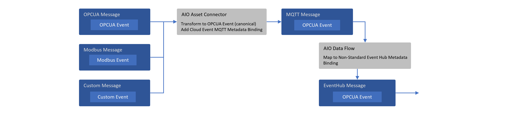

# Azure IoT Operations (AIO) Messaging

**Date:** January 24, 2025 | **Author(s):** Suneet Nangia

In the modern industrial landscape, the seamless collection, contextualization, and integration of edge events into analytics platforms are crucial for operational efficiency and insightful decision-making. In edge-based solutions, including AIO, the messaging system provides a reliable backbone to exchange events between disparate internal and external components, enabling patterns like RPC as well as event sourcing for the other data stores.

This document aims to cover the messaging aspects of AIO, encompassing both edge and cloud messaging infrastructures e.g. HTTP, MQTT or AMQP on Azure Event Hub. It provides clarity on the internal workings of AIO messaging constructs and describes patterns to build and configure custom workloads on AIO messaging using industry standards.

## Prerequisites

It is anticipated that the reader possesses a foundational understanding of the [Azure IoT Operations](https://learn.microsoft.com/azure/iot-operations/overview-iot-operations) (AIO) product and its associated services.

## Azure Services Scope

The following sections provide an overview of the primary services referenced in this document from a messaging perspective. This orientation will help the reader better understand the context before delving into the detailed content.

### Azure Device Registry (ADR)

ADR provides a set of resources for AIO, we describe these resource briefly here:

1. Asset Resource
AIO assets when created, are stored in this service, they are also surfaced as individual resources in Azure portal.
2. Asset Endpoints Profile (AEP) Resource
AIO asset endpoint when created, are stored in this service as asset endpoint profile, they are also surfaced as individual resources in Azure portal.
3. Schema Registry Resource
Message schemas are used in all three phases of a data flow in AIO i.e. defining the source input, applying data transformations, and creating the destination output. To access these schemas programmatically; Schema Registry will be made available locally on the edge and accessible via [AIO SDKs](https://github.com/Azure/iot-operations-sdks).

### Microsoft Fabric

Microsoft Fabric is an end-to-end analytics and data platform designed for enterprises that require a unified data platform. Fabric provides data services that align well with common AIO use cases. A set of built-in connectors in AIO enables connecting to these data services in Fabric:

1. Timeseries Database (KQL)
2. Delta Lake (OneLake)

> **_NOTE:_** To delve deeper into Fabric patterns and practices for AIO, please refer here [add link to AIO data document].

## Core Concepts

## Event

Events represent data about specific occurrences or observations within a system or physical environment, examples include a change in temperature of a welding machine, or pressure change in seals pressing machine. This data typically captures a fact or a state change observed at a particular moment in time which may require a remediating action.

## Message

To transfer events across a network boundary, they are encapsulated within messages. A message is a formatted network data frame that adheres to a messaging protocol for a given communication path. Examples are an HTTP request, an Event Hub message, an Apache Kafka record, or an MQTT packet. Metadata information models of messaging data frames vary widely, reflecting the diversity protocols and purposes.

An event often traverses multiple messaging infrastructure layers. It may start from a device using proprietary protocol/format and be transmitted via MQTT in an edge environment, then routed through an Event Hub service, and finally into a Fabric.

## CloudEvents

Given the diversity of metadata information models across protocols and the necessity for events to traverse multiple protocol routes, major cloud vendors collaborate within the Cloud Native Computing Foundation (CNCF) CloudEvents project. This initiative aims to establish a standardized metadata information model for events, with well-defined [bindings](<https://github.com/cloudevents/spec/blob/main/cloudevents/bindings>) and [extensions](<https://github.com/cloudevents/spec/blob/main/cloudevents/extensions>) enabling interoperation across key messaging protocols. The goal being uniform event metadata definitions and preservation of metadata across multi-protocol routes, as illustrated in the following diagram:



## AIO Messaging Stages

The messaging path in AIO consists of three primary stages i.e. Data Source, Data Transformation and Data Destination. Additionally, AIO is supported by a built-in MQTT broker as the messaging backbone on the edge.


## Data Source (Acquisition)

The initial step in the process involves acquiring data from edge devices, which typically include sensors and machines deployed on the factory (shop floor). To ensure reliable data acquisition, various communication protocols are utilized, with OPC UA (Open Platform Communications Unified Architecture) being among the most prevalent. OPC UA is a machine-to-machine communication protocol and information model designed for industrial automation scenarios. AIO offers an OPC UA connector as a Microsoft-supported component. Additionally, custom connectors can be developed using the [Akri framework](https://github.com/Azure/azure-iot-operations-preview/tree/main/preview/akri-connectors) by partners or customers.

### Schematization

The data model of the data acquired by the connector is enforced by [JSON schemas](https://json-schema.org/) in the ADR service. JSON schemas are configured or created in AIO through the following two methods:

1. Asset Creation Workflow (e.g. via Ops Portal)

    When an asset is created in AIO, the data model for the asset (including its data points) is automatically generated as part of the corresponding resource (referred to as Asset) in ADR. This resource also includes a reference to the OPC UA JSON schema resource in ADR (under [Schema Registry](https://learn.microsoft.com/azure/iot-operations/connect-to-cloud/concept-schema-registry)). The JSON schema enforces the data model for the asset at each data point level.

    <details>
        <summary>Example Asset Resource (includes data model and other asset related information)</summary>

    ``` json
    {
        "apiVersion": "2024-11-01",
        "id": "/subscriptions/6fe459a5-48ef-46ec-a521-1d9da467ab54/resourceGroups/cloudedge002/providers/Microsoft.DeviceRegistry/assets/thermostat",
        "name": "thermostat",
        "type": "microsoft.deviceregistry/assets",
        "location": "eastus2",
        "extendedLocation": {
            "name": "/subscriptions/6fe459a5-48ef-46ec-a521-1d9da467ab54/resourceGroups/CloudEdge002/providers/Microsoft.ExtendedLocation/customLocations/cloudedge002",
            "type": "CustomLocation"
        },
        "properties": {
            "uuid": "5d4cd37c-963e-4c45-a6d5-c4c7dff9f0f9",
            "enabled": true,
            "externalAssetId": "5d4cd37c-963e-4c45-a6d5-c4c7dff9f0f9",
            "displayName": "thermostat",
            "assetEndpointProfileRef": "plc-sim",
            "version": 2,
            "defaultDatasetsConfiguration": "{\"publishingInterval\":1000,\"samplingInterval\":1000,\"queueSize\":1}",
            "defaultEventsConfiguration": "{\"publishingInterval\":1000,\"samplingInterval\":1000,\"queueSize\":1}",
            "defaultTopic": {
                "path": "site01/data/thermostat01",
                "retain": "Never"
            },
            "datasets": [
                {
                    "name": "default",
                    "dataPoints": [
                        {
                            "name": "temperature",
                            "dataSource": "ns=3;s=FastUInt10",
                            "observabilityMode": "None",
                            "dataPointConfiguration": "{}"
                        }
                    ]
                }
            ],
            "status": {
                "errors": [
                    {
                        "code": 400,
                        "message": "{\"title\":\"Disconnected\",\"detail\":\"Reconnecting session ...\",\"lastTransitionTime\":\"2024-11-27T00:50:11.2924279Z\",\"reasons\":{\"StatusCode\":\"BadSecureChannelClosed\",\"SimbolicId\":\"BadSecureChannelClosed\",\"Message\":\"\\u003E\\u003E\\u003E BadSecureChannelClosed\\n---    at Opc.Ua.Bindings.ChannelAsyncOperation\\u00601.End(Int32 timeout, Boolean throwOnError)\\n---    at Opc.Ua.Bindings.UaSCUaBinaryClientChannel.EndSendRequest(IAsyncResult result)\\n---    at Opc.Ua.SessionClient.EndPublish(IAsyncResult result, UInt32\\u0026 subscriptionId, UInt32Collection\\u0026 availableSequenceNumbers, Boolean\\u0026 moreNotifications, NotificationMessage\\u0026 notificationMessage, StatusCodeCollection\\u0026 results, DiagnosticInfoCollection\\u0026 diagnosticInfos)\\n---    at Opc.Ua.Client.Session.OnPublishComplete(IAsyncResult result)\",\"RejectedCertificate\":\"LS0tLS1CRUdJTiBDRVJUSUZJQ0FURS0tLS0tCk1JSURmakNDQW1hZ0F3SUJBZ0lRWFFmcTUwTzRMaTQ1elFyVEZXelhkekFOQmdrcWhraUc5dzBCQVFzRkFEQVIKTVE4d0RRWURWUVFERXdaUGNHTlFiR013SGhjTk1qUXhNVEU0TVRNME5URTJXaGNOTWpVd01qRTJNVE0wTlRFMgpXakFSTVE4d0RRWURWUVFERXdt\"}}"
                    }
                ],
                "datasets": [
                    {
                        "name": "default",
                        "messageSchemaReference": {
                            "schemaRegistryNamespace": "cloudedge002-reg-ns",
                            "schemaName": "daa75cf427da5330085fbcf5d7ef704d9f477895f5096bcbbb03fc71627fcaba",
                            "schemaVersion": "1"
                        }
                    }
                ]
            },
            "provisioningState": "Succeeded"
        },
        "systemData": {
            "createdBy": "firstname.lastname@microsoft.com",
            "createdByType": "User",
            "createdAt": "2024-11-18T13:48:20.4542076Z",
            "lastModifiedBy": "319f651f-7ddb-4fc6-9857-7aef9250bd05",
            "lastModifiedByType": "Application",
            "lastModifiedAt": "2024-11-27T00:50:12.1839138Z"
        }
    }
    ```

    </details>

    A corresponding Schema Registry schema resource with Id ```daa75cf427da5330085fbcf5d7ef704d9f477895f5096bcbbb03fc71627fcaba``` (extracted from the backing storage account):

    <details>
      <summary>OPCUA JSON Schema for Example Asset Data Model</summary>

    ``` json
    {
        "$schema": "http://json-schema.org/draft-07/schema#",
        "title": "5d4cd37c-963e-4c45-a6d5-c4c7dff9f0f9-datapoints-telemetry-schema",
        "description": "Schema for OPC UA datapoints telemetry message",
        "type": "object",
        "properties": {
            "temperature": {
                "type": "object",
                "properties": {
                    "SourceTimestamp": {
                        "$ref": "#/definitions/org.opcfoundation.UA.DateTime"
                    },
                    "Value": {
                        "$ref": "#/definitions/org.opcfoundation.UA.UInt32"
                    },
                    "StatusCode": {
                        "$ref": "#/definitions/org.opcfoundation.UA.StatusCode"
                    }
                }
            }
        },
        "definitions": {
            "org.opcfoundation.UA.DateTime": {
                "type": "string",
                "title": "OPC UA built in type DateTime",
                "$id": "org.opcfoundation.UA.DateTime",
                "format": "date-time"
            },
            "org.opcfoundation.UA.UInt32": {
                "type": "integer",
                "title": "OPC UA built in type UInt32",
                "$id": "org.opcfoundation.UA.UInt32",
                "format": "uint32",
                "minimum": 0,
                "maximum": 4294967295,
                "const": 0
            },
            "org.opcfoundation.UA.String": {
                "type": "string",
                "title": "OPC UA built in type String",
                "$id": "org.opcfoundation.UA.String"
            },
            "org.opcfoundation.UA.StatusCode": {
                "type": "object",
                "title": "OPC UA built in type StatusCode",
                "$id": "org.opcfoundation.UA.StatusCode",
                "properties": {
                    "Code": {
                        "$ref": "#/definitions/org.opcfoundation.UA.UInt32"
                    },
                    "Symbol": {
                        "$ref": "#/definitions/org.opcfoundation.UA.String"
                    }
                },
                "additionalProperties": true
            }
        }
    }   
    ```

    </details>

2. MQTT Data Source in DataFlow (e.g. via Ops Portal)

    When data is ingested directly from an MQTT broker topic (instead of being associated with an Asset created in AIO), it can have any structure or no structure at all. AIO provides an option in Source stage of the DataFlow component to configure a JSON schema for this data. The schema configured for this data is also stored in ADR under the Schema resource, similar to the process described in point 1 above.

### Metadata

When the OPC UA connector publishes messages to the MQTT broker in AIO, it adds the following user-defined MQTTv5 properties, this follows the [MQTT bindings](https://github.com/cloudevents/spec/blob/main/cloudevents/bindings/mqtt-protocol-binding.md) approach for CloudEvents. These properties primarily consist of CloudEvent's OPC UA [extension properties](https://github.com/cloudevents/spec/blob/main/cloudevents/extensions/opcua.md) and they relate the message to a specific asset in the ADR and its corresponding OPC UA schema, while also providing other useful context for routing and hydrating messages into typed objects.

> **_NOTE:_** Custom connectors built using AKRI framework must follow this convention for consistency and symmetry reasons. Microsoft is canonicalizing on OPCUA event and OPCUA CloudEvent extension for metadata in the message.

| CloudEvent Property Name | Example Value from AIO v1.0.9/Description                                                       |
|--------------------------|-------------------------------------------------------------------------------------------------|
| id                       | 75bd908d-8c87-4e0c-9756-fd37d5df0265/GUID of message                                            |
| specversion              | 1.0                                                                                             |
| type                     | ua-keyframe                                                                                     |
| source                   | urn:OpcPlc:opcplc-000000                                                                        |
| time                     | 2024-11-18T21:42:34.8895682Z                                                                    |
| datacontenttype          | application/json                                                                                |
| subject                  | 5d4cd37c-963e-4c45-a6d5-c4c7dff9f0f9                                                            |
| sequence                 | 27980                                                                                           |
| dataschema               | aio-sr://cloudedge002-reg-ns/daa75cf427da5330085fbcf5d7ef704d9f477895f5096bcbbb03fc71627fcaba:1 |
| traceparent              | 00-a87cf86e6a2a3a9ae547640f62b74c77-287650b637c2e36b-01                                         |
| recordedtime             | 2024-11-18 21:42:34.890 +00:00                                                                  |

| Non CloudEvent Property Name  | Example Value from AIO v1.0.9/Description              |
|-------------------------------|--------------------------------------------------------|
| externalAssetId               | 5d4cd37c-963e-4c45-a6d5-c4c7dff9f0f9/Asset Id from ADR |
| uuid                          | 5d4cd37c-963e-4c45-a6d5-c4c7dff9f0f9/Asset Id from ADR |
| serverToConnectorMilliseconds | 0.5926                                                 |

## Data Transformation

The second step in the process involves transforming or filtering the acquired data. Message schemas created through the Asset creation process, or uploaded and configured via the DataFlow component, allow for the use of [dotted notation](<https://learn.microsoft.com/azure/iot-operations/connect-to-cloud/howto-create-dataflow?tabs=portal#filter-filter-data-based-on-a-condition>) to create data transformations or filters. This approach help enhance developer experience and avoid runtime errors.

> **_NOTE:_** The message structure is often modified at this stage (e.g., removing or injecting a computed field). As the metadata is passed through this stage, some of that metadata may become invalid. For example, AIO does not automatically remove or update the CloudEvent property called `dataschema`, which is likely to be valid for the pre-modified JSON. To address this, you can use the [map](<https://learn.microsoft.com/azure/iot-operations/connect-to-cloud/concept-dataflow-mapping?tabs=bicep#output-mapping>) feature of the DataFlow component or in AIO Ops portal to explicitly update the property with the correct value e.g. use [Compute](<https://learn.microsoft.com/azure/iot-operations/connect-to-cloud/howto-create-dataflow?tabs=portal#compute>) transformation and use ```$metadata.user_property.dataschema``` as output.

## Data Destination (Sink)

Finally, the third step in the process involves sending the transformed (or passthrough) data to the configured destination or data sink. The approach to data modeling and schema enforcement depends on the data destination configuration. This section covers the commonly used messaging destinations for AIO and associated data modeling/schematization approaches.

> **_NOTE:_** It is the user's responsibility to ensure that the event is transformed, if necessary, to match the destination schema (e.g. JSON or Delta Schema) definition.

### Azure Event Hub Connector

#### Schematization

Azure Event Hub messages do not inherently require schemas, however, attaching schema information to the messages can be beneficial for consumers. The OPC UA extension of CloudEvent specifies that a property called `dataschema` must contain the schema URI for the event. The OPC UA connector populates this property (as detailed in the Data Source -> Metadata section above) of the messages it publishes on the MQTT broker with the JSON schema URI from the Schema Registry.

#### Metadata

Just like MQTTv5, Azure Event Hub messages can carry two sets of properties as below:

| System Property Name  | Mapped From                                                                                                                                                             | Description/Example                                                                                                                                                                                                                                                                                                                                                                                                                                     |
|-----------------------|-------------------------------------------------------------------------------------------------------------------------------------------------------------------------|---------------------------------------------------------------------------------------------------------------------------------------------------------------------------------------------------------------------------------------------------------------------------------------------------------------------------------------------------------------------------------------------------------------------------------------------------------|
| x-opt-enqueued-time   | Event Hub                                                                                                                                                               | UTC time when the event was enqueued, example ```2024-11-20T10:34:46.391Z (Wed, 20 Nov 2024, 10:34:46 am GMT)```                                                                                                                                                                                                                                                                                                                                        |
| x-opt-sequence-number | Event Hub                                                                                                                                                               | The logical sequence number of the event within the partition stream of the event hub, example ```8```                                                                                                                                                                                                                                                                                                                                                  |
| x-opt-offset          | Event Hub                                                                                                                                                               | The offset of the event from the event hub partition stream. The offset identifier is unique within a partition of the event hub stream, example ```6272```                                                                                                                                                                                                                                                                                             |
| x-opt-publisher       | Event Hub                                                                                                                                                               | Used when publisher endpoint is used.                                                                                                                                                                                                                                                                                                                                                                                                                   |
| x-opt-partition-key   | [Partition Handling Strategy](https://learn.microsoft.com/azure/iot-operations/connect-to-cloud/howto-configure-kafka-endpoint?tabs=portal#partition-handling-strategy) | This property represents the partition key of the corresponding partition that stored the event. If the partition handling strategy is set to "Topic" in AIO's Event Hub connector, the MQTT topic name from which the message was ingested will appear in this property. Consumers of Event Hub messages, such as Fabric's KQL load process, can utilize this information. The partition key is also important for the scale and ordering of messages. |

> **_NOTE:_** The prefix "x" in property names/headers indicates the header was not a standard header when first introduced, and "opt" signifies that the property is optional.

| Custom Property Name          | Mapped From                            | Description/Example                                                                             |
|-------------------------------|----------------------------------------|-------------------------------------------------------------------------------------------------|
| Payload Format Indicator      | MQTTv5 System Properties               | Example “1”                                                                                     |
| Content Type                  | MQTTv5 System Properties               | application/json                                                                                |
| uuid                          | OPCUA CloudEvent MQTT Message Property | 5d4cd37c-963e-4c45-a6d5-c4c7dff9f0f9                                                            |
| externalAssetId               | OPCUA CloudEvent MQTT Message Property | 5d4cd37c-963e-4c45-a6d5-c4c7dff9f0f9                                                            |
| serverToConnectorMilliseconds | OPCUA CloudEvent MQTT Message Property | 0.6013                                                                                          |
| id                            | OPCUA CloudEvent MQTT Message Property | 2815a0ea-462a-474-b243-9e5050cc8e9d                                                             |
| specversion                   | OPCUA CloudEvent MQTT Message Property | 1.0                                                                                             |
| type                          | OPCUA CloudEvent MQTT Message Property | ua-keyframe                                                                                     |
| source                        | OPCUA CloudEvent MQTT Message Property | urn:OpcPlc:opcplc-000000                                                                        |
| time                          | OPCUA CloudEvent MQTT Message Property | 2024-11-20T10:34:46.3599828Z                                                                    |
| datacontenttype               | OPCUA CloudEvent MQTT Message Property | application/json                                                                                |
| dataschema                    | OPCUA CloudEvent MQTT Message Property | aio-sr://cloudedge002-reg-ns/daa75cf427da5330085fbcf5d7ef704d9f477895f5096bcbbb03fc71627fcaba:1 |
| subject                       | OPCUA CloudEvent MQTT Message Property | 5d4cd37c-963e-4c45-a6d5-c4c7dff9f0f9                                                            |
| sequence                      | OPCUA CloudEvent MQTT Message Property | 1222                                                                                            |
| traceparent                   | OPCUA CloudEvent MQTT Message Property | 00-cfe50ffd80c2354bb0d2347a0b21190-5a038ff44a1f6590-01                                          |
| recordedtime                  | OPCUA CloudEvent MQTT Message Property | 2024-11-20 10:34:46.360 +00:00                                                                  |

> **_NOTE:_** ```ce_``` prefix is added to some headers, dependent on the configuration [defined in a connector](https://learn.microsoft.com/en-gb/azure/iot-operations/connect-to-cloud/howto-configure-kafka-endpoint?tabs=portal#cloudevents). Additionally, there's an option to create/update metadata properties using AIO as described in [Data Transformation](#data-transformation) stage section above.

#### Nuances

1. Event Hub system properties (custom properties are not supported currently) of Event Hub messages above can be loaded into a KQL table in Fabric using the “Event system properties” dropdown in the [“Get data”](https://learn.microsoft.com/fabric/real-time-intelligence/get-data-event-hub#connect-the-cloud-connection-to-your-kql-database) workflow, which can provide useful data context.
2. To flatten the hierarchical JSON received on Event Hub, use one of the following approaches:

    a. Utilize the DataFlow [mapping feature](https://learn.microsoft.com/azure/iot-operations/connect-to-cloud/concept-dataflow-mapping?tabs=bicep) in Yaml/Bicep to flatten the structure.

    b. Leverage the ["Nested levels"](https://learn.microsoft.com/fabric/real-time-intelligence/get-data-event-hub#advanced-options-based-on-data-type) feature in the Advanced tab to split nested JSON into individual strongly typed columns.

    c. Alternatively, insert JSON as-is into a staging table with a dynamic column and then create a function to parse and split JSON into strongly typed columns in the final table. This function can be triggered when a new record is inserted into the staging table. When creating the final table, consider its schema design (e.g., key-value columns of each primitive type or key-value column of string type) or whether it can be split into multiple tables. This depends on the query applied to these tables for read/write optimizations.
3. To dynamically ingest and utilize new data points (JSON fields) in KQL, which is a common requirement in industrial scenarios, consider creating a tall KQL table with key-value style columns, where the value column is of the "dynamic" type to accommodate JSON. As JSON is inserted and parsed into a "dynamic" type column at ingestion time only, the performance penalty is lower than parsing JSON at each query time (e.g., using the `parse_json` function). Queries can then be written to access fields in JSON using dot notation.
4. Another pattern to handle different types of data points, or data points of different schemas,
 coming from the same source is to automatically route them to their respective tables in EventHouse.
 Note that routing to tables in _different_ databases is not yet supported.

    a. Create the tables of the desired schemas upfront. If you don't want to start from scratch,
       you can use the EventHouse "Get Data" wizard. It will have mixed schemas. Edit it to remove
       the unwanted columns.

    b. Use EventHouse "Get Data" to create only one connection, not multiple, even though you are routing
       to multiple tables. The routing will automatically happen.

    c. The events pushed to the EventHub must have the [documented custom properties](https://learn.microsoft.com/azure/data-explorer/ingest-data-event-hub-overview#route-event-data-to-an-alternate-table).
5. Optionally, you can configure Eventhouse (KQL) to sync with Lakehouse, this will enable use of timeseries data for other analytic purposes.

### Fabric OneLake Connector

#### Schematization

Fabric OneLake messages use [Delta](https://learn.microsoft.com/azure/iot-operations/connect-to-cloud/concept-schema-registry) schemas, which differ from JSON schemas. Therefore, the `dataschema` property propagated from OPC UA CloudEvents is not valid in any scenario (e.g. passthrough) here, it should be updated as described in [Data Transformation](#data-transformation) stage section above.

> **_NOTE:_** A GenAI-based [tool](https://azure-samples.github.io/explore-iot-operations/schema-gen-helper/) can assist with schema generation for both JSON and Delta formats.

#### Metadata

Unlike the Azure Event Hub connector, metadata is not mapped from MQTT properties when messages are sent to OneLake using the ADLSv2 API. In this scenario, you can add [new fields](https://learn.microsoft.com/azure/iot-operations/connect-to-cloud/howto-create-dataflow?tabs=portal#compute) with the metadata available in system or user-defined MQTT properties, including CloudEvents. These new fields will appear as columns in the Lakehouse table.

#### Nuances

1. When sending JSON payloads to Lakehouse, it is important to note that the connector does not automatically flatten hierarchical structures, users are responsible for flattening these structures before transmission. If the JSON structure remains hierarchical, only the top-level fields will be mapped to columns in the Lakehouse table, while nested structures will be stored as JSON documents within the respective fields. To flatten the structure in AIO, utilize the DataFlow [mapping feature](https://learn.microsoft.com/azure/iot-operations/connect-to-cloud/concept-dataflow-mapping?tabs=bicep) in YAML/Bicep.
2. Delta schema evolution or drift can occur naturally as data points change at the edge, such as the addition of new fields or the removal of existing ones. Currently, the DataFrame merge operation does not support changes in the Delta schema, which can pose challenges for customers. This functionality is expected to be supported in the future.

> **_NOTE:_** The output from this connector is a Parquet file, even if the schema created is in Delta format.

## Unified Namespace (UNS) Features

Although Unified Namespace (UNS) is not the primary focus of this document, from the perspective of AIO's messaging, UNS support is attributed to two key features:

1. AIO enables the specification of a custom MQTT topic at the asset level, allowing configuration in accordance with UNS topic naming conventions.
2. Retain Flag in AIO _will_ allow you to set the retain flag for custom MQTT topics.

> **_NOTE:_** A comprehensive discussion on Unified Namespace (UNS) is provided in a separate document, a link to that document will be included here once available.
