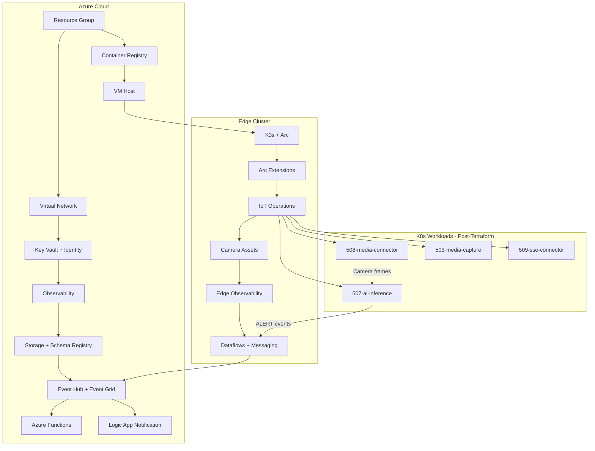

## Leak Detection Blueprint

This blueprint deploys a complete Azure IoT Operations environment for leak detection scenarios. It composes cloud infrastructure (networking, identity, storage, messaging, notification) with edge components (CNCF cluster, IoT Operations, assets, dataflows) into a single Terraform deployment.

Application workloads (AI inference, media connector, media capture, SSE connector) are deployed post-Terraform via helper scripts.

## Architecture



## Components

| Order | Component | Module Name | Purpose |
|-------|-----------|-------------|---------|
| 1 | 000-resource-group | `cloud_resource_group` | Resource group for all resources |
| 2 | 050-networking | `cloud_networking` | Virtual network, subnets, NAT gateway |
| 3 | 010-security-identity | `cloud_security_identity` | Key Vault, managed identities, RBAC |
| 4 | 020-observability | `cloud_observability` | Log Analytics, Grafana, Monitor |
| 5 | 030-data | `cloud_data` | Storage account, Schema Registry |
| 6 | 040-messaging | `cloud_messaging` | Event Hub, Event Grid, Azure Functions |
| 7 | 045-notification | `cloud_notification` | Logic App alert dedup + Teams posting |
| 8 | 060-acr | `cloud_acr` | Container Registry for app images |
| 9 | 051-vm-host | `cloud_vm_host` | VM for edge cluster hosting |
| 10 | 100-cncf-cluster | `edge_cncf_cluster` | K3s cluster with Arc connection |
| 11 | 109-arc-extensions | `edge_arc_extensions` | Arc cluster extensions |
| 12 | 110-iot-ops | `edge_iot_ops` | Azure IoT Operations instance |
| 13 | 111-assets | `edge_assets` | Camera asset definitions |
| 14 | 120-observability | `edge_observability` | Edge monitoring and metrics |
| 15 | 130-messaging | `edge_messaging` | MQTT topics, dataflows to Event Hub |

## Prerequisites

* Azure subscription with Contributor access
* Azure CLI authenticated (`az login`)
* Terraform >= 1.9.8
* `source scripts/az-sub-init.sh` to set `ARM_SUBSCRIPTION_ID`

## Quick Start

1. Initialize Terraform:

   ```bash
   source scripts/az-sub-init.sh
   cd blueprints/leak-detection/terraform
   terraform init
   ```

1. Copy and customize the example variables:

   ```bash
   cp terraform.tfvars.example terraform.tfvars
   ```

1. Edit `terraform.tfvars` with your values (Teams recipient ID, location, prefix).

1. Deploy infrastructure:

   ```bash
   terraform apply
   ```

## Post-Deployment

After Terraform completes, deploy application workloads using the helper scripts:

1. Build and push container images to ACR:

   ```bash
   ../scripts/build-app-images.sh \
     --acr-name "$(terraform output -raw container_registry | jq -r .name)" \
     --resource-group "$(terraform output -raw deployment_summary | jq -r .resource_group)"
   ```

1. Deploy edge applications to the K3s cluster:

   ```bash
   ../scripts/deploy-edge-apps.sh
   ```

See the [Leak Detection Scenario Guide](../../docs/getting-started/leak-detection-scenario.md) for the full deployment walkthrough.

## Data Flow

The leak detection pipeline follows this event flow:

1. **Camera Ingestion**: 508-media-connector captures frames from ONVIF/RTSP cameras via Akri connectors
1. **AI Inference**: 507-ai-inference runs ONNX leak detection model, publishes ALERT events to MQTT
1. **Edge Routing**: 130-messaging dataflows route ALERT events from MQTT to Event Hub
1. **Cloud Processing**: Azure Functions process events; 045-notification deduplicates and posts to Teams
1. **Video Capture**: 503-media-capture stores video clips to blob storage for review

## Configuration

Refer to [terraform/README.md](terraform/README.md) for the full variable reference (auto-generated).
