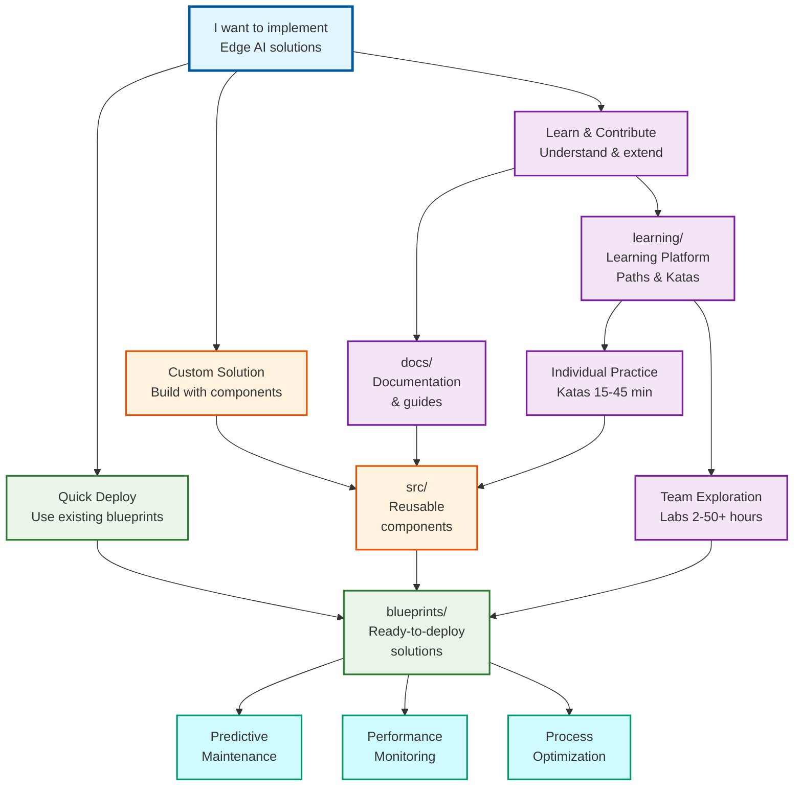

[](https://dev.azure.com/ai-at-the-edge-flagship-accelerator/IaC%20for%20the%20Edge/_build/latest?definitionId=3&branchName=main)
[](LICENSE.md)
[](https://vscode.dev/redirect?url=vscode://ms-vscode-remote.remote-containers/cloneInVolume?url=https://dev.azure.com/ai-at-the-edge-flagship-accelerator/_git/edge-ai)

## What You'll Find Here

### 🎯 For Users

Ready to achieve rapid edge-ai deployments? Start with our [General User Guide](/docs/getting-started/general-user.md) to deploy existing blueprints to Azure in **30-60 minutes**.

### 🏗️ For Blueprint Developers

Creating new deployment scenarios? Start your process with the [Blueprint Developer Guide](/docs/getting-started/blueprint-developer.md) to learn how to combine components into custom solutions that achieve your business goals.

### ⚙️ For Feature Developers

Contributing new capabilities? The [Feature Developer Guide](/docs/getting-started/feature-developer.md) empowers you with component development, testing, and contribution workflows to achieve impactful contributions.

## Key Features

- **Production-Ready**: Battle-tested Infrastructure as Code that empowers organizations to achieve repeatedly deployable and reliable edge AI scenarios
- **Modular Design**: Reusable components that enable teams to achieve custom solutions tailored to their unique business requirements
- **Multiple Frameworks**: Support for both Terraform and Bicep for diverse technical requirements
- **AI-Assisted Development**: Optimized for GitHub Copilot and AI-powered development workflows that accelerate team productivity
- **Comprehensive Testing**: Automated validation and testing that ensures global-scale reliability for every deployment
- **Edge-Focused**: Purpose-built capabilities that empower organizations worldwide to achieve edge AI computing workload success

## 🎓 Learning Platform

**Empower your team to achieve proficiency in Edge-AI's AI-assisted, hyper-velocity engineering** methodologies through challenge-based learning.

[Learning](learning/) provides hands-on training that empowers engineers to achieve expertise in edge-to-cloud AI systems with discovery-based coaching:

### Learning Formats

- **🥋 [Katas](learning/katas/)**: Focused practice exercises for skill building (**15-45 minutes**)
- **🧪 [Training Labs](learning/training-labs/)**: Comprehensive hands-on experiences (**2-8 hours**)
- **🤖 AI Coaching**: Built-in VS Code coaching prompts for discovery-based learning

### Ready to Start Learning?

**🚀 Launch Documentation:**

```bash
npm run docs
```

> ⏱️ **Build Time**:
>
> - **First run**: 2-4 minutes (installs dependencies + builds config)
> - **Subsequent runs**: ~30 seconds startup

Opens the complete documentation including the interactive **Learning** tab.

## Repository Overview

### How to Use This Repository



### 🎯 **How Blueprints Build Edge Solutions**

**Blueprints** are pre-configured compositions that combine **Cloud Foundation**, **Edge Infrastructure**, **IoT Platform**, and **Observability** components to deliver **Industrial Automation**, **AI Workloads**, and **System Reliability**.

#### **🏗️ Nine Blueprint Types**

- **Full Single Node** → Complete solution with all components for comprehensive edge deployment
- **Full Multi Node** → Enhanced distributed edge computing with load balancing and redundancy
- **Full Arc Multi Node** → Hybrid cloud + edge with AKS and multiple edge nodes
- **Minimal Single Node** → Core components only for resource-optimized deployment
- **Partial Single Node** → Partially configured edge solution for specific use cases
- **Edge IoT Only** → Add Azure IoT Operations to existing infrastructure
- **Cloud Only** → Hosting-ready cloud infrastructure for edge workloads
- **CNCF Cluster Script** → Automated deployment scripts for Kubernetes clusters
- **Fabric** → Advanced analytics and data platform for edge-to-cloud insights

#### **☁️ Cloud Foundation** provides the supporting infrastructure

- **Resource Management**: Resource groups, organization, governance
- **Security & Identity**: Authentication, RBAC, Key Vault, certificates
- **Data Services**: Data lakes, storage accounts, time-series databases
- **Messaging Services**: Event Grid, Event Hubs, Service Bus

#### **🖥️ Edge Infrastructure** delivers the compute platform

- **VM Hosting**: Virtual machines for edge hosting and management
- **Kubernetes Cluster**: K3s with Arc-enabled management and orchestration
- **Networking**: VNets, security groups, private endpoints

#### **🏭 IoT Platform** enables industrial connectivity

- **MQTT Broker**: Secure messaging and communication hub
- **Data Processing**: Real-time stream processing and analytics
- **Protocols**: Industrial protocol translation and device integration

#### **🔧 Device Management** handles asset connectivity

- **OPC UA Assets**: Industrial device integration and asset modeling
- **Asset Discovery**: Automatic detection and onboarding of devices

#### **📊 Observability** ensures system health

- **Cloud Monitoring**: Application Insights, Log Analytics, dashboards
- **Edge Monitoring**: Local monitoring, health checks, performance metrics

#### **🔧 Analytics Platform** provides advanced data capabilities

- **Real-time Analytics**: Stream processing and live data analysis
- **AI/ML Services**: Machine learning model deployment and inference
- **Business Intelligence**: Reporting, dashboards, and data visualization

#### **🔗 Integration Services** enable data flow and connectivity

- **Data Pipelines**: ETL/ELT processes and data transformation
- **Event Streaming**: Real-time event processing and routing
- **API Management**: Service exposure and integration management

#### **⚙️ Automation Tools** streamline deployment and management

- **Deployment Scripts**: Automated infrastructure provisioning
- **Configuration Management**: Consistent system configuration and updates

## Quick Start

1. **Choose your path** from our [Getting Started Guides](getting-started/)
2. **Set up your environment** with our [Dev Container](contributing/development-environment.md)
3. **Deploy a blueprint** from our [Blueprint Catalog](blueprints/)
4. **Explore components** in our [Component Library](src/)

> **Note on Telemetry:** If you wish to opt-out of sending telemetry data to Microsoft when deploying Azure resources with Terraform, you can set the environment variable `ARM_DISABLE_TERRAFORM_PARTNER_ID=true` before running any `terraform` commands.

## Community and Support

- 📖 [Complete Documentation](.)
- 🗺️ [Project Roadmap](roadmap.md)
- 🤝 [Contributing Guidelines](contributing/)
- 🐛 [Issue Tracker]({{ISSUES_URL}})
- 💬 [Discussions]({{DISCUSSIONS_URL}})
- 📧 [Support](../SUPPORT.md)

---

Ready to get started? Head to our [Getting Started Guides](getting-started/) and choose the path that matches your role!

## Responsible AI

Microsoft encourages customers to review its Responsible AI Standard when developing AI-enabled systems to ensure ethical, safe, and inclusive AI practices. Learn more at [Microsoft's Responsible AI][responsible-ai].

## 📄 Legal

This project is licensed under the [MIT License](../LICENSE).

**Security:** See [SECURITY.md](../SECURITY.md) for security policy and reporting vulnerabilities.

## Trademark Notice

> This project may contain trademarks or logos for projects, products, or services. Authorized use of Microsoft
> trademarks or logos is subject to and must follow Microsoft's Trademark & Brand Guidelines. Use of Microsoft trademarks or logos in
> modified versions of this project must not cause confusion or imply Microsoft sponsorship. Any use of third-party trademarks or
> logos are subject to those third-party's policies.

<!-- markdownlint-disable MD036 -->
*🤖 Crafted with precision by ✨Copilot following brilliant human instruction,
then carefully refined by our team of discerning human reviewers.*
<!-- markdownlint-enable MD036 -->

[responsible-ai]: https://www.microsoft.com/en-us/ai/responsible-ai
