## Branch Strategy

## Overview

The edge-ai project uses a **dual-branch strategy** with `dev` and `main` branches to separate active development from production-ready releases.

## Quick Reference

| Task           | Action                                              |
|----------------|-----------------------------------------------------|
| **Daily work** | Branch from `dev`, PR to `dev`                      |
| **Releases**   | Automated from `dev` → `main` (review and merge PR) |
| **Hotfixes**   | Branch from `main`, release → auto-syncs to `dev`   |
| **Sync check** | `git log origin/main..origin/dev` (empty = in sync) |

## Branch Roles

| Branch   | Purpose             | Updates          | Protection                                                       |
|----------|---------------------|------------------|------------------------------------------------------------------|
| **dev**  | Active development  | Feature/fix PRs  | 1 approval required, CI required, automation can force-push      |
| **main** | Production releases | Release PRs only | 2 approvals required, CI required, linear history, no force-push |

## Development and Release Cycle


**Standard Workflow**:

1. Create feature branch from `dev`
2. Create PR to `dev`, review, and merge
3. When ready for release, run release workflow (automated)
4. Review and merge release PR to `main`
5. `dev` automatically synced from `main` (strategy auto-selected)

**Hotfix Workflow**:

1. Branch from `main` (e.g., `hotfix/critical-bug`)
2. Apply minimal fix, trigger hotfix release (bumps PATCH version)
3. Fast-track release PR review and merge to `main`
4. Automatic sync brings hotfix to `dev`

## Branch Synchronization

**Automatic Triggers**:

* **Post-Release**: After release PR merged to `main`
* **Scheduled**: Daily at 03:00 UTC

**Intelligent Strategy Selection**:

The sync automatically chooses between force-push or merge based on `dev` state:

```bash
#!/bin/bash
# Intelligent sync: main to dev

git fetch origin main dev
UNRELEASED=$(git log origin/main..origin/dev --oneline)

if [ -z "$UNRELEASED" ]; then
  # Post-release: Clean slate
  git push origin main:dev --force-with-lease
else
  # Mid-cycle: Preserve unreleased work
  git checkout dev
  git merge origin/main --no-ff -m "chore: integrate external contributions from main"
  git push origin dev
fi
```

**Strategy Selection**:

```mermaid
flowchart TD
    Start([Sync Triggered]) --> Check{git log<br/>main..dev<br/>empty?}
    Check -->|Yes| FP[Force-Push<br/>Clean slate]
    Check -->|No| Merge[Merge<br/>Preserve unreleased work]
    FP --> Done([✓ Complete])
    Merge --> Done
```



**Manual Sync** (when automation unavailable):

```bash
# Force-push (post-release only)
git fetch origin main dev
[ -z "$(git log origin/main..origin/dev --oneline)" ] && \
  git push origin main:dev --force-with-lease || \
  echo "ERROR: dev has unreleased commits"

# Merge (mid-cycle with unreleased commits)
git checkout dev && git pull
git merge origin/main --no-ff -m "chore: integrate external contributions"
git push origin dev
```

## Branch Protection

| Setting            | dev                         | main                     |
|--------------------|-----------------------------|--------------------------|
| **PR Approvals**   | 1 required                  | 2 required               |
| **CI Checks**      | Required                    | Required + security scan |
| **Force Push**     | Automation only             | Blocked                  |
| **Direct Push**    | Blocked (except automation) | Blocked                  |
| **Linear History** | No                          | Yes                      |
| **Work Item Link** | Optional                    | Required (Azure DevOps)  |
| **Code Owners**    | Optional                    | Required                 |

Full configuration files: [GitHub](.github/workflows/) · [Azure DevOps](azure-pipelines.yml)

## Common Scenarios

**Feature or Bug Fix**:

```bash
git checkout dev && git pull
git checkout -b feature/my-feature  # or fix/my-bug
# Make changes, commit
git push origin feature/my-feature
# Create PR to 'dev' branch
```

**Release**:

1. Run release workflow from `dev`
2. Review auto-generated release PR
3. Merge to `main` → `dev` auto-syncs

**Hotfix**:

```bash
git checkout main && git pull
git checkout -b hotfix/critical-fix
# Apply minimal fix, commit
# Trigger hotfix release (bumps patch version)
# Fast-track PR to main → dev auto-syncs
```

## Best Practices

**Contributors**:

* Always branch from `dev`, never from `main`
* Target all PRs to `dev`
* Use conventional commits (feat, fix, docs, chore)
* Keep feature branches updated with `dev`

**Maintainers**:

* Release regularly to prevent `dev` drift
* Monitor sync logs after releases
* Validate version numbers in release PRs
* Review breaking changes documentation

## Troubleshooting

| Issue                              | Solution                                                                          |
|------------------------------------|-----------------------------------------------------------------------------------|
| **Sync workflow fails**            | Check logs for permission/network issues; retry or sync manually                  |
| **Merge conflicts in release PR**  | Verify sync completed; resolve in release branch                                  |
| **Accidentally committed to main** | Branch protection prevents this; if bypassed, PR commit to `dev` and reset `main` |
| **Check if branches in sync**      | `git log origin/main..origin/dev` (empty = synced)                                |

See [Release Workflow Troubleshooting](release-workflow.md#troubleshooting) for detailed guidance.

## FAQ

**Why force-push after release instead of merge?**
Ensures `dev` and `main` are identical, preventing drift. Safe because all dev changes are already in the merged release.

**Can I work on multiple features simultaneously?**
Yes, create separate feature branches from `dev` and merge independently.

**Can I delete feature branches after merging?**
Yes, enable auto-delete in GitHub/Azure DevOps settings.

**Can I create a release from a feature branch?**
No, releases must come from `dev`. Merge your feature first.

---

## References

* [Release Workflow Documentation](release-workflow.md)
* [Main-to-Dev Sync Pipeline](../../.azuredevops/docs/main-to-dev-sync.md)
* [GitHub Workflows](../../.github/workflows/)
* [Azure Pipelines](../../azure-pipelines.yml)
* [Contributing Guidelines](../../CONTRIBUTING.md)

---

<!-- markdownlint-disable MD036 -->
*🤖 Crafted with precision by ✨Copilot following brilliant human instruction,
then carefully refined by our team of discerning human reviewers.*
<!-- markdownlint-enable MD036 -->
