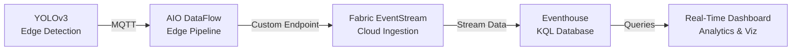

This guide shows you how to send object detection results from your edge AI vision system to Microsoft Fabric Real-Time Intelligence (RTI) for analytics, dashboards, and advanced querying with KQL.

## Prerequisites

Before starting this guide, you must have:

### Required

* **Working YOLOv3 Detection System** - Complete the [Simple Vision AI Example](./simple-vision-example.md) first
  * RTSP camera configured and streaming
  * Media Connector extracting frames
  * AI inference service detecting objects
  * Detection results publishing to MQTT topics
* **Azure Subscription** with permissions to create Fabric resources
* **Microsoft Fabric Capacity** - F2 or higher (F64 recommended for production)
* **Azure IoT Operations Cluster** - Already deployed from the prerequisite guide

### Verify Prerequisites

Before proceeding, verify your detection system is working:

```bash
# Subscribe to detection results
kubectl run mqtt-client --rm -i --tty \
  --image=eclipse-mosquitto:latest \
  --restart=Never \
  -n azure-iot-operations -- \
  mosquitto_sub -h aio-broker -p 18883 \
    --cafile /var/run/certs/ca.crt \
    --cert /var/run/secrets/tokens/broker-sat \
    -t "camera/ai/inference/results" -v
```

You should see JSON detection results like:

```json
{
  "device_id": "my-rtsp-camera",
  "timestamp": 1733270400,
  "detections": [
    {
      "label": "banana",
      "confidence": 0.89,
      "bbox": [120, 45, 280, 420]
    }
  ]
}
```

If you see detection results, you're ready to proceed with Fabric RTI integration.

## What You'll Build



**End Result**: Object detection events flowing from edge to cloud analytics with real-time KQL queries and dashboards.

## Architecture Overview

### Data Flow

1. **Edge AI Detection**: YOLOv3 detects objects and publishes to MQTT topic `camera/ai/inference/results`
2. **AIO DataFlow**: Routes MQTT messages to Fabric via custom endpoint
3. **Fabric EventStream**: Receives events via custom endpoint and streams to Eventhouse
4. **Eventhouse (KQL Database)**: Stores detection events in time-series optimized format
5. **Real-Time Analytics**: Query and visualize detection patterns with KQL

### Components

| Component | Purpose | Location |
|-----------|---------|----------|
| **YOLOv3 Inference** | Object detection on edge | Edge cluster (already deployed) |
| **AIO MQTT Broker** | Message bus for detection results | Edge cluster (already deployed) |
| **AIO DataFlow** | Route MQTT to Fabric endpoint | Edge cluster (new) |
| **Fabric EventStream** | Cloud event ingestion | Azure Fabric workspace (new) |
| **Eventhouse** | KQL database for analytics | Azure Fabric workspace (new) |

## Deployment Options

This guide provides **two deployment approaches**:

| Approach | Best For | Time Required | Complexity |
|----------|----------|---------------|------------|
| **Manual Portal** | Learning, proof-of-concept | 10-15 min | Low |
| **Terraform Blueprint** | Production, repeatable deployments | 20-30 min | Medium |

Choose the approach that fits your needs.

---

## Manual Portal Approach

Use this approach for quick proof-of-concept and learning.

### Step 1: Create Fabric Workspace

1. Navigate to [Microsoft Fabric Portal](https://app.fabric.microsoft.com/)
2. Click **Workspaces** → **New Workspace**
3. Configure workspace:
   * **Name**: `vision-ai-analytics`
   * **Capacity**: Select your F2+ capacity
   * **License mode**: Fabric capacity
4. Click **Apply**

### Step 2: Create Eventhouse (KQL Database)

1. In your new workspace, click **+ New** → **Eventhouse**
2. Configure Eventhouse:
   * **Name**: `vision-detection-events`
   * **Description**: `Object detection events from edge AI`
3. Click **Create**
4. Wait for Eventhouse to provision (1-2 minutes)

### Step 3: Create KQL Database and Table

Once Eventhouse is created:

1. Click **+ KQL Database** in the Eventhouse
1. Configure database:
   * **Name**: `detections`
   * **Description**: `Vision AI detection events`
1. Click **Create**

Create the detection events table:

1. In the KQL database, click **Query**
1. Run this KQL command to create the table:

```kusto
.create table DetectionEvents (
    Timestamp: datetime,
    DeviceId: string,
    Label: string,
    Confidence: real,
    BboxX1: int,
    BboxY1: int,
    BboxX2: int,
    BboxY2: int,
    RawPayload: dynamic
)
```

1. Create a JSON mapping for ingestion:

```kusto
.create table DetectionEvents ingestion json mapping 'DetectionEventsMapping'
```

```json
'[{"column":"Timestamp","path":"$.timestamp","datatype":"datetime","transform":"DateTimeFromUnixSeconds"},{"column":"DeviceId","path":"$.device_id"},{"column":"Label","path":"$.detections[0].label"},{"column":"Confidence","path":"$.detections[0].confidence"},{"column":"BboxX1","path":"$.detections[0].bbox[0]"},{"column":"BboxY1","path":"$.detections[0].bbox[1]"},{"column":"BboxX2","path":"$.detections[0].bbox[2]"},{"column":"BboxY2","path":"$.detections[0].bbox[3]"},{"column":"RawPayload","path":"$"}]'
```

### Step 4: Create EventStream with Custom Endpoint

1. In your workspace, click **+ New** → **EventStream**
2. Configure EventStream:
   * **Name**: `vision-detection-stream`
   * **Description**: `Ingests detection events from AIO`
3. Click **Create**

Configure the EventStream source:

1. Click **Add source** → **Custom Endpoint**
2. Configure custom endpoint:
   * **Name**: `aio-detection-endpoint`
   * **Endpoint type**: `Custom App`
3. Click **Add**
4. **Copy the EventStream endpoint URL** (you'll need this for AIO DataFlow)
5. **Copy the connection string** (contains the shared access key)

Configure the EventStream destination:

1. Click **Add destination** → **Eventhouse**
1. Configure destination:
   * **Eventhouse**: `vision-detection-events`
   * **KQL Database**: `detections`
   * **Table**: `DetectionEvents`
   * **Input data format**: `JSON`
   * **Mapping**: `DetectionEventsMapping`
1. Click **Add**

### Step 5: Create AIO DataFlow with Custom Endpoint

Now configure Azure IoT Operations to send detection data to Fabric.

Create a Kubernetes secret for Fabric authentication:

```bash
# Extract the connection string from Fabric EventStream custom endpoint
# Format: Endpoint=sb://<namespace>.servicebus.windows.net/;SharedAccessKeyName=<name>;SharedAccessKey=<key>;EntityPath=<path>

# Create Kubernetes secret with the connection string
kubectl create secret generic fabric-eventstream-connection \
  -n azure-iot-operations \
  --from-literal=connectionString='Endpoint=sb://your-namespace.servicebus.windows.net/;SharedAccessKeyName=keyname;SharedAccessKey=yourkey;EntityPath=entitypath'
```

Create the DataFlow configuration `fabric-detection-dataflow.yaml`:

```yaml
apiVersion: connectivity.iotoperations.azure.com/v1beta1
kind: DataflowEndpoint
metadata:
  name: fabric-eventstream-endpoint
  namespace: azure-iot-operations
spec:
  endpointType: FabricOneLake
  fabricOneLakeSettings:
    authentication:
      method: SystemAssignedManagedIdentity
      systemAssignedManagedIdentitySettings: {}
    names:
      workspaceName: vision-ai-analytics
      lakehouseName: vision-detection-events
    # Alternative: Use connection string authentication
    # authentication:
    #   method: AccessToken
    #   accessTokenSettings:
    #     secretRef: fabric-eventstream-connection
    host: "https://your-eventstream-endpoint.servicebus.windows.net"
    batching:
      latencySeconds: 5
      maxMessages: 100
---
apiVersion: connectivity.iotoperations.azure.com/v1beta1
kind: Dataflow
metadata:
  name: fabric-detection-dataflow
  namespace: azure-iot-operations
spec:
  profileRef: default
  mode: Enabled
  operations:
  - operationType: Source
    sourceSettings:
      endpointRef: default
      dataSources:
      - "camera/ai/inference/results"
  - operationType: Destination
    destinationSettings:
      endpointRef: fabric-eventstream-endpoint
      dataDestination: "detection-events"
```

**Important**: Update the `host` field with your actual EventStream endpoint URL from Step 4.

Apply the DataFlow configuration:

```bash
kubectl apply -f fabric-detection-dataflow.yaml
```

### Step 6: Verify Data Flow

Check DataFlow status:

```bash
# Check DataFlow resources
kubectl get dataflow -n azure-iot-operations
kubectl get dataflowendpoint -n azure-iot-operations

# Check DataFlow logs
kubectl logs -l app=aio-dataflow -n azure-iot-operations --tail=50
```

Verify data in Fabric:

1. Navigate to your Fabric Eventhouse → `detections` database
2. Click **Query**
3. Run this KQL query:

```kusto
DetectionEvents
| take 10
```

You should see recent detection events from your camera.

### Step 7: Create Real-Time Analytics Queries

Now that data is flowing, create useful KQL queries:

**Detection frequency by object type:**

```kusto
DetectionEvents
| where Timestamp > ago(1h)
| summarize Count = count() by Label
| order by Count desc
```

**High-confidence detections timeline:**

```kusto
DetectionEvents
| where Confidence > 0.8
| project Timestamp, DeviceId, Label, Confidence
| order by Timestamp desc
```

**Detections per device over time:**

```kusto
DetectionEvents
| where Timestamp > ago(24h)
| summarize Count = count() by DeviceId, bin(Timestamp, 1h)
| render timechart
```

**Average confidence by object type:**

```kusto
DetectionEvents
| summarize AvgConfidence = avg(Confidence), Count = count() by Label
| order by Count desc
```

**Banana detections (your test case):**

```kusto
DetectionEvents
| where Label == "banana"
| project Timestamp, DeviceId, Confidence, BboxX1, BboxY1, BboxX2, BboxY2
| order by Timestamp desc
```

### Step 8: Create Real-Time Dashboard

1. In Fabric workspace, click **+ New** → **Real-Time Dashboard**
2. Name it `Vision AI Detection Dashboard`
3. Add tiles with KQL queries:
   * **Detection count by object** - Use the detection frequency query
   * **Recent high-confidence detections** - Use the high-confidence query
   * **Detections over time** - Use the timeline query
4. Configure auto-refresh (e.g., every 30 seconds)
5. Save and share with your team

---

## Terraform Blueprint Approach

Use this approach for production-ready, repeatable deployments.

> **💡 Note**: This blueprint uses the Fabric RTI Terraform module (`src/100-edge/130-messaging/terraform/modules/fabric-rti/`) which creates:
>
> * **Kafka-based DataFlowEndpoint** to Fabric EventStream (managed identity authentication)
> * **Asset-based DataFlow** routing MQTT topics to Fabric RTI
> * **Automatic role assignment** (Fabric workspace Contributor for AIO identity)
>
> For YAML-based deployments or custom configurations, see the [ADR Integration Patterns](../solution-adr-library/edge-inference-vs-azure-video-indexer.md#technical-integration-patterns).

### Why Use Terraform for Fabric RTI?

* **Infrastructure as Code**: Version control your analytics infrastructure
* **Repeatability**: Deploy identical setups across multiple sites or environments
* **Integration**: Works with existing edge-ai blueprints
* **State Management**: Track and manage Fabric resource changes

### Prerequisites for Terraform

In addition to the manual approach prerequisites:

* **Terraform 1.0+** installed
* **Azure CLI** authenticated (`az login`)
* **Git** to clone the repository (if not already done)
* **Existing edge AI deployment** from [Simple Vision AI Example](./simple-vision-example.md)

### Step 1: Navigate to Fabric RTI Blueprint

```bash
cd /workspaces/edge-ai/blueprints/fabric-rti/terraform
```

### Step 2: Configure Terraform Variables

Create `terraform.tfvars`:

```hcl
# terraform.tfvars

# Basic Configuration
environment     = "dev"
location        = "eastus"
resource_prefix = "vision-ai"
instance        = "001"

# Fabric Configuration
fabric_capacity_name = "your-fabric-capacity-name"
fabric_workspace_name = "vision-ai-analytics"

# Eventhouse Configuration
eventhouse_name = "vision-detection-events"
kql_database_name = "detections"

# EventStream Configuration
eventstream_name = "vision-detection-stream"
eventstream_endpoint_name = "aio-detection-endpoint"

# DataFlow Configuration
dataflow_source_topic = "camera/ai/inference/results"
dataflow_destination = "detection-events"
```

### Step 3: Review the Blueprint

The Fabric RTI blueprint (`blueprints/fabric-rti/`) includes:

* **Cloud Resources** (`src/000-cloud/032-fabric-rti/`):
  * Fabric workspace creation
  * Eventhouse and KQL database provisioning
  * EventStream with custom endpoint configuration
  * KQL table and mapping creation

* **Edge Resources** (`src/100-edge/130-messaging/terraform/modules/fabric-rti/`):
  * AIO DataFlow configuration
  * DataFlowEndpoint for Fabric connection
  * Authentication secret management

### Step 4: Initialize Terraform

```bash
# Initialize Terraform
terraform init

# Review providers
terraform providers
```

### Step 5: Plan the Deployment

```bash
# Generate execution plan
terraform plan

# Review the resources to be created:
# - Fabric workspace
# - Eventhouse and KQL database
# - EventStream with custom endpoint
# - DataFlow and DataFlowEndpoint
# - Kubernetes secrets for authentication
```

### Step 6: Apply the Configuration

```bash
# Deploy Fabric RTI infrastructure
terraform apply

# Review and type 'yes' to confirm
```

This will take **5-10 minutes** to provision all resources.

### Step 7: Verify Terraform Deployment

```bash
# Check Terraform state
terraform state list

# Verify Kubernetes resources
kubectl get dataflow -n azure-iot-operations
kubectl get dataflowendpoint -n azure-iot-operations

# Check DataFlow logs
kubectl logs -l app=aio-dataflow -n azure-iot-operations --tail=50
```

### Step 8: Access Fabric Resources

Terraform outputs provide the resource URLs:

```bash
# Get Fabric workspace URL
terraform output fabric_workspace_url

# Get Eventhouse URL
terraform output eventhouse_url

# Get EventStream URL
terraform output eventstream_url
```

Navigate to these URLs to access your Fabric resources.

### Step 9: Query Data with KQL

Use the same KQL queries from the manual approach (Step 7) to analyze detection data.

### Step 10: Layer Additional Analytics

The Fabric RTI blueprint can be **layered on top of existing deployments**:

```bash
# If you previously deployed full-single-node-cluster
cd /workspaces/edge-ai/blueprints/full-single-node-cluster/terraform

# Get the cluster name and resource group
terraform output

# Now layer Fabric RTI on top
cd /workspaces/edge-ai/blueprints/fabric-rti/terraform

# Use matching variables from the base deployment
terraform apply -var="environment=dev" -var="instance=001"
```

This approach allows you to add analytics capabilities to existing edge AI deployments without redeploying the entire infrastructure.

### Terraform Troubleshooting

#### Issue: Fabric capacity not found

```bash
# List available Fabric capacities
az fabric capacity list --subscription <subscription-id>

# Update terraform.tfvars with correct capacity name
```

#### Issue: DataFlow not connecting to EventStream

```bash
# Check EventStream endpoint configuration
terraform output eventstream_endpoint_url

# Verify DataFlow endpoint reference
kubectl describe dataflowendpoint fabric-eventstream-endpoint -n azure-iot-operations

# Check authentication secret
kubectl get secret fabric-eventstream-connection -n azure-iot-operations
```

#### Issue: No data appearing in Eventhouse

```bash
# Check DataFlow logs for errors
kubectl logs -l app=aio-dataflow -n azure-iot-operations | grep -i error

# Verify source topic has data
kubectl run mqtt-client --rm -i --tty \
  --image=eclipse-mosquitto:latest \
  --restart=Never \
  -n azure-iot-operations -- \
  mosquitto_sub -h aio-broker -p 18883 \
    --cafile /var/run/certs/ca.crt \
    --cert /var/run/secrets/tokens/broker-sat \
    -t "camera/ai/inference/results" -v
```

### Cleanup Terraform Resources

```bash
# Destroy Fabric RTI resources only
cd /workspaces/edge-ai/blueprints/fabric-rti/terraform
terraform destroy

# This removes Fabric resources but keeps edge infrastructure intact
```

---

## Advanced Use Cases

### Multi-Camera Analytics

Query detections across multiple cameras:

```kusto
DetectionEvents
| where Timestamp > ago(1h)
| summarize Count = count() by DeviceId, Label
| render columnchart
```

### Anomaly Detection

Detect unusual detection patterns:

```kusto
DetectionEvents
| where Timestamp > ago(7d)
| summarize Count = count() by Label, bin(Timestamp, 1h)
| extend Baseline = avg(Count)
| where Count > Baseline * 2  // Alert if 2x normal rate
| project Timestamp, Label, Count, Baseline
```

### Historical Trend Analysis

Compare detection patterns over time:

```kusto
DetectionEvents
| where Timestamp > ago(30d)
| summarize Count = count() by Label, bin(Timestamp, 1d)
| render timechart
```

### Geospatial Analytics (with device location metadata)

If you add location metadata to your device configuration:

```kusto
DetectionEvents
| where Timestamp > ago(1h)
| join kind=inner (
    DeviceLocations  // Hypothetical table with device locations
) on DeviceId
| summarize Count = count() by Location, Label
| render piechart
```

---

## Best Practices

### Data Retention

Configure data retention policies in Eventhouse:

```kusto
.alter table DetectionEvents policy retention
```

```json
'{"SoftDeletePeriod":"90.00:00:00","Recoverability":"Enabled"}'
```

This keeps 90 days of detection data with soft-delete recovery.### Batch Optimization

For high-volume scenarios, optimize DataFlow batching:

```yaml
spec:
  batching:
    latencySeconds: 10      # Balance latency vs throughput
    maxMessages: 1000       # Larger batches for high volume
```

### Cost Optimization

* Use **Fabric F2** for development/testing (lower cost)
* Use **Fabric F64+** for production (better performance)
* Configure **data retention** to balance storage costs
* Use **materialized views** for frequently queried aggregations

### Monitoring

Monitor Fabric RTI health:

```bash
# DataFlow metrics
kubectl logs -l app=aio-dataflow -n azure-iot-operations | grep "events sent"

# EventStream metrics (in Fabric portal)
# Navigate to EventStream → Monitoring → Metrics
```

### Security

* Use **Managed Identity** for DataFlow authentication when possible
* Rotate **EventStream connection strings** regularly
* Apply **RBAC** to Fabric workspace and Eventhouse
* Enable **audit logging** in Fabric workspace settings

---

## Troubleshooting

### No Data Flowing to Fabric

**Check DataFlow configuration:**

```bash
kubectl describe dataflow fabric-detection-dataflow -n azure-iot-operations
```

**Verify MQTT source has data:**

```bash
kubectl run mqtt-client --rm -i --tty \
  --image=eclipse-mosquitto:latest \
  --restart=Never \
  -n azure-iot-operations -- \
  mosquitto_sub -h aio-broker -p 18883 \
    --cafile /var/run/certs/ca.crt \
    --cert /var/run/secrets/tokens/broker-sat \
    -t "camera/ai/inference/results" -v
```

**Check DataFlow logs:**

```bash
kubectl logs -l app=aio-dataflow -n azure-iot-operations --tail=100
```

### Authentication Errors

**Check EventStream connection string:**

```bash
kubectl get secret fabric-eventstream-connection -n azure-iot-operations -o yaml
```

**Verify connection string format:**

```text
Endpoint=sb://<namespace>.servicebus.windows.net/;SharedAccessKeyName=<name>;SharedAccessKey=<key>;EntityPath=<path>
```

### KQL Query Errors

**Verify table schema:**

```kusto
.show table DetectionEvents schema
```

**Check ingestion mapping:**

```kusto
.show table DetectionEvents ingestion mappings
```

**Review ingestion failures:**

```kusto
.show ingestion failures
| where Table == "DetectionEvents"
| take 10
```

### Performance Issues

**Check EventStream throughput:**

* Navigate to Fabric portal → EventStream → Monitoring
* Review **Incoming messages/sec** and **Outgoing messages/sec**

**Optimize KQL queries:**

```kusto
// Use 'where' before 'summarize' for better performance
DetectionEvents
| where Timestamp > ago(1h)  // Filter first
| where Confidence > 0.7      // Then filter more
| summarize count() by Label  // Then aggregate
```

**Enable query result caching:**

```kusto
set query_results_cache_max_age = time(1h);
DetectionEvents
| where Timestamp > ago(24h)
| summarize count() by Label
```

---

## What You've Learned

After completing this guide, you now have:

* ✅ **Real-time data pipeline** from edge AI to cloud analytics
* ✅ **KQL database** storing detection events with time-series optimization
* ✅ **Custom KQL queries** for object detection analytics
* ✅ **Real-time dashboards** visualizing detection patterns
* ✅ **Production-ready infrastructure** using Terraform (optional)

## Next Steps

1. **Custom Dashboards** - Build dashboards for specific business KPIs
2. **Alerting** - Set up alerts for anomalous detection patterns
3. **Power BI Integration** - Connect Power BI to Eventhouse for executive reporting
4. **Machine Learning** - Export detection data to Azure ML for model retraining
5. **Multi-Site Analytics** - Aggregate data from multiple edge locations

## Related Documentation

### Microsoft Fabric Documentation

* **[Microsoft Fabric Overview](https://learn.microsoft.com/fabric/get-started/microsoft-fabric-overview)** - Introduction to Fabric
* **[Real-Time Intelligence](https://learn.microsoft.com/fabric/real-time-intelligence/overview)** - Fabric RTI capabilities
* **[Eventhouse Documentation](https://learn.microsoft.com/fabric/real-time-intelligence/eventhouse)** - KQL database details
* **[EventStream Documentation](https://learn.microsoft.com/fabric/real-time-intelligence/event-streams/overview)** - Event ingestion
* **[KQL Query Language](https://learn.microsoft.com/azure/data-explorer/kusto/query/)** - KQL reference

### Azure IoT Operations Documentation

* **[DataFlow Overview](https://learn.microsoft.com/azure/iot-operations/connect-to-cloud/overview-dataflow)** - AIO DataFlow concepts
* **[DataFlow Endpoints](https://learn.microsoft.com/azure/iot-operations/connect-to-cloud/howto-configure-dataflow-endpoint)** - Endpoint configuration
* **[MQTT Broker](https://learn.microsoft.com/azure/iot-operations/manage-mqtt-broker/overview-iot-mq)** - AIO MQTT broker

### Repository Documentation

* **[Simple Vision AI Example](./simple-vision-example.md)** - Prerequisite guide for edge detection
* **[Fabric RTI Blueprint](../../blueprints/fabric-rti/README.md)** - Terraform blueprint documentation
* **[Fabric RTI Component](../../src/000-cloud/032-fabric-rti/README.md)** - Cloud component details
* **[Messaging Component](../../src/100-edge/130-messaging/README.md)** - Edge messaging including DataFlow

## Support and Resources

Need help? Check these resources:

* **GitHub Issues**: [microsoft/edge-ai/issues](https://github.com/microsoft/edge-ai/issues)
* **Azure Support**: [Azure Portal Support](https://portal.azure.com/#blade/Microsoft_Azure_Support/HelpAndSupportBlade)
* **Fabric Community**: [Microsoft Fabric Community](https://community.fabric.microsoft.com/)
* **Azure IoT Tech Community**: [IoT Tech Community](https://techcommunity.microsoft.com/t5/internet-of-things-iot/ct-p/IoT)

## FAQ

**Q: What Fabric capacity do I need?**
A: F2 for development/testing, F64+ recommended for production workloads.

**Q: How much does Fabric RTI cost?**
A: Pricing based on Fabric capacity units (CUs). See [Fabric pricing](https://azure.microsoft.com/pricing/details/microsoft-fabric/).

**Q: Can I use this with other MQTT sources?**
A: Yes! Any MQTT topic in AIO can be routed to Fabric using DataFlow.

**Q: What's the data latency?**
A: Typically 1-5 seconds from edge detection to Fabric depending on batching configuration.

**Q: Can I export data from Eventhouse?**
A: Yes, use KQL `.export` command or connect external tools via KQL endpoints.

**Q: Does this work with on-premises Fabric?**
A: Currently requires cloud-based Microsoft Fabric. Azure Stack HCI support planned.

**Q: How do I scale for multiple sites?**
A: Deploy one DataFlow per site, all writing to a central Eventhouse. Use DeviceId to distinguish sources.
