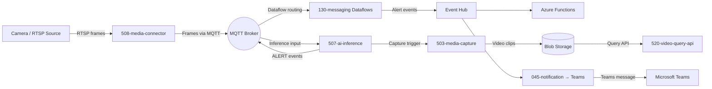

## Deploy a Leak Detection Pipeline

This guide walks through deploying a complete vision-based leak detection system on Azure IoT Operations. The pipeline captures camera frames at the edge, runs AI inference for leak detection, routes alerts to Microsoft Teams, and stores video clips for review.

**Total time:** ~2 hours (including infrastructure provisioning)

### Overview

#### Architecture



#### Component Map

| Component | Name              | Role in Pipeline                                             |
|-----------|-------------------|--------------------------------------------------------------|
| 508       | media-connector   | Captures RTSP/ONVIF camera frames, publishes to MQTT         |
| 507       | ai-inference      | Runs ONNX leak detection model on frames, emits ALERT events |
| 503       | media-capture     | Records video clips to blob storage on alert trigger         |
| 509       | sse-connector     | Server-Sent Events connector for real-time UI streaming      |
| 130       | messaging         | Dataflows routing ALERT events from MQTT to Event Hub        |
| 045       | notification      | Logic App deduplicating alerts and posting to Teams          |
| 040       | messaging (cloud) | Event Hub and Event Grid for cloud-side event processing     |
| 520       | video-query-api   | REST API for querying stored video captures                  |

#### Data Flow

1. **Camera Ingestion** — 508-media-connector captures frames from ONVIF/RTSP cameras via Akri connectors and publishes them to the MQTT broker
2. **AI Inference** — 507-ai-inference consumes frames, runs the ONNX leak detection model, and publishes ALERT events back to MQTT
3. **Edge Routing** — 130-messaging dataflows route ALERT events from MQTT to Event Hub
4. **Cloud Processing** — Azure Functions process events; 045-notification deduplicates and posts to Teams
5. **Video Capture** — 503-media-capture stores video clips to blob storage for later review via 520-video-query-api

### Prerequisites

* **Azure subscription** with Contributor access
* **Azure CLI** authenticated (`az login`)
* **Terraform** >= 1.9.8
* **Docker** installed and running
* **kubectl** configured for your cluster
* **jq** installed for JSON processing
* **Basic understanding** of Azure IoT Operations — see the [General User Guide](general-user.md) for orientation

### Phase 1: Deploy Infrastructure

**Estimated time:** ~20 minutes + provisioning

The `blueprints/full-single-node-cluster/terraform/` directory contains the infrastructure-as-code for this scenario. A dedicated variable file `leak-detection.tfvars.example` enables the leak-detection-specific components.

#### Configure Variables

```bash
source scripts/az-sub-init.sh
cd blueprints/full-single-node-cluster/terraform
cp leak-detection.tfvars.example leak-detection.tfvars
```

Edit `leak-detection.tfvars` with your environment values. Key variables to set:

* `environment` — Deployment environment name (e.g., `dev`)
* `resource_prefix` — Prefix for all resource names (e.g., `leakdet`)
* `location` — Azure region (e.g., `westus3`)
* `instance` — Instance identifier (e.g., `001`)
* `teams_recipient_id` — Your Teams chat or channel thread ID for alert notifications

#### Deploy

```bash
terraform init
terraform apply -var-file=leak-detection.tfvars
```

#### Verify Outputs

After deployment completes, verify the key resources:

```bash
terraform output deployment_summary
```

Confirm the following resources are provisioned:

* Resource group
* Virtual network and subnets
* Key Vault and managed identities
* Storage account and Schema Registry
* Event Hub namespace with alert Event Hub
* Container Registry
* VM host with K3s cluster connected to Arc
* IoT Operations instance with assets and dataflows

### Phase 2: Build and Push Application Images

**Estimated time:** ~30 minutes

Application container images must be built and pushed to the Azure Container Registry created in Phase 1.

#### Option A: Automated Build

```bash
cd blueprints/full-single-node-cluster

../../src/501-ci-cd/scripts/build-leak-detection-images.sh \
  --acr-name "$(cd terraform && terraform output -raw container_registry | jq -r .name)" \
  --resource-group "$(cd terraform && terraform output -raw deployment_summary | jq -r .resource_group)"
```

#### Option B: Manual Build

For each application component (507-ai-inference, 508-media-connector, 503-media-capture, 509-sse-connector):

```bash
ACR_NAME=$(cd blueprints/full-single-node-cluster/terraform && terraform output -raw container_registry | jq -r .name)

az acr login --name "$ACR_NAME"

docker build -t "$ACR_NAME.azurecr.io/507-ai-inference:latest" \
  ../../src/500-application/507-ai-inference/

docker push "$ACR_NAME.azurecr.io/507-ai-inference:latest"
```

Repeat for each application image.

#### Verify Images

```bash
az acr repository list --name "$ACR_NAME" --output table
```

### Phase 3: Deploy Kubernetes Workloads

**Estimated time:** ~15 minutes

#### Option A: Automated Deployment

```bash
cd blueprints/full-single-node-cluster

../../src/501-ci-cd/scripts/deploy-leak-detection-apps.sh
```

#### Option B: Manual Deployment

Apply manifests in dependency order:

```bash
kubectl apply -f ../../src/500-application/508-media-connector/kubernetes/
kubectl apply -f ../../src/500-application/507-ai-inference/kubernetes/
kubectl apply -f ../../src/500-application/503-media-capture/kubernetes/
kubectl apply -f ../../src/500-application/509-sse-connector/kubernetes/
```

#### Verify Pods

```bash
kubectl get pods -n azure-iot-operations
```

All application pods should reach `Running` status.

### Phase 4: Configure IoT Operations

**Estimated time:** ~15 minutes

#### Camera Asset Definitions

Camera assets are configured through the 111-assets component deployed in Phase 1. Verify the asset definitions:

```bash
kubectl get assets -n azure-iot-operations
```

#### MQTT Topic Routing

Verify MQTT topics are configured for the inference pipeline:

* Input topic: frames from 508-media-connector
* Output topic: ALERT events from 507-ai-inference
* Dataflow routing: ALERT events forwarded to Event Hub

#### Dataflow Verification

Confirm the dataflow resources are active:

```bash
kubectl get dataflows -n azure-iot-operations
```

### Phase 5: Validate End-to-End

**Estimated time:** ~10 minutes

#### Test Event Flow

1. Verify camera frames are being captured:

   ```bash
   kubectl logs -n azure-iot-operations -l app=media-connector --tail=20
   ```

2. Verify inference is processing frames:

   ```bash
   kubectl logs -n azure-iot-operations -l app=ai-inference --tail=20
   ```

#### Check Notifications

Trigger a test event and verify the alert appears in the configured Teams channel. The 045-notification Logic App deduplicates alerts by `camera_id` before posting.

#### Query Stored Video

After a capture event:

```bash
curl -s "https://<video-query-api-url>/api/captures?camera_id=<camera-id>" | jq
```

Replace `<video-query-api-url>` and `<camera-id>` with values from your deployment.

### Troubleshooting

* **ACR authentication failures** — Run `az acr login --name <acr-name>` and verify the managed identity has `AcrPull` role on the cluster
* **MQTT topic mismatches** — Check the asset definitions in 111-assets match the topic names expected by 507-ai-inference and 508-media-connector
* **kubectl context** — Ensure `kubectl config current-context` points to your Arc-connected K3s cluster
* **Notification webhook not firing** — Verify `teams_recipient_id` in `terraform.tfvars` is a valid Teams chat or channel thread ID
* **Pods in CrashLoopBackOff** — Check container image names match the ACR repository names; verify image pull secrets are configured
* **No alert events in Event Hub** — Confirm the 130-messaging dataflows are active and the MQTT topics are correct

### Known Limitations

* The 507-ai-inference component ships with a placeholder ONNX model (~0.001 MB). Real leak detection requires a trained industrial safety model.
* Container image builds are local-only. CI/CD automation for image builds is a follow-on item.
* The blueprint assumes a single-node K3s cluster. Multi-node deployments require the `full-multi-node-cluster` blueprint as a base.

### Next Steps

* **Customize the inference model** — Replace the placeholder ONNX model in 507-ai-inference with a trained leak detection model
* **Add camera sources** — Extend 111-assets definitions to include additional ONVIF/RTSP cameras
* **Scale to multi-node** — Use the [full-multi-node-cluster](../../blueprints/full-multi-node-cluster/) blueprint as a base, then layer leak detection components
* **Explore the Learning Platform** — Visit the [Learning Platform](../../learning/) for hands-on katas and training labs
