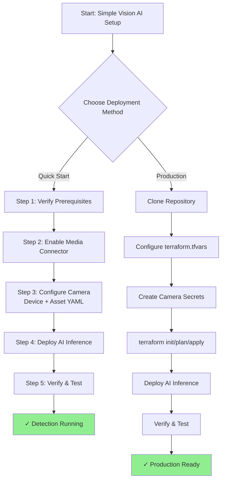
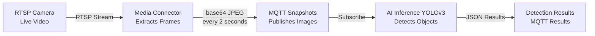

This guide shows you how to set up real-time object detection from an RTSP camera in **under 30 minutes**. Perfect for customers new to Azure IoT Operations who want to see vision AI in action quickly.

## Architecture Overview

**Architecture Diagram**: [Simple Vision AI Architecture](./assets/simple-vision-architecture.drawio)

The architecture consists of four main components:

1. **RTSP Camera** - Your physical camera or test stream providing video feed
2. **Media Connector** - Extracts frames from RTSP stream and publishes to MQTT
3. **MQTT Broker** - Azure IoT Operations message bus for pub/sub communication
4. **AI Inference Service** - Processes images with YOLOv3-Tiny and detects objects

**Data Flow:**

- Camera streams video via RTSP protocol
- Media Connector captures frames every 2 seconds (configurable)
- Frames published as base64-encoded JPEG to `azure-iot-operations/data/camera-snapshots/snapshots` topic
- AI Inference subscribes to snapshots, runs object detection
- Results published to `camera/ai/inference/results` topic as JSON

## Deployment Options

This guide provides **two deployment approaches**:

| Approach | Best For | Time Required | Complexity |
|----------|----------|---------------|------------|
| **Quick Start (kubectl)** | Learning, testing, getting started | 10-15 min | Low |
| **Production (Terraform)** | Real deployments, infrastructure as code | 20-30 min | Medium |

Choose the approach that fits your needs. Both accomplish the same result.



---

## Quick Start: Deploy with kubectl

Use this approach for rapid learning and experimentation.

> **Note:** Microsoft recommends using the [operations experience UI](https://learn.microsoft.com/azure/iot-operations/discover-manage-assets/howto-manage-assets-remotely) or [Azure IoT Operations CLI](https://learn.microsoft.com/azure/iot-operations/manage-devices-assets/overview-manage-assets) for device and asset configuration. The kubectl YAML approach shown here is an alternative method suitable for infrastructure-as-code workflows and advanced users who prefer direct Kubernetes resource management.

## What You'll Build



**End Result**: Your camera will detect objects (people, cars, etc.) in real-time and publish detection results to MQTT topics.

## Prerequisites

Before you begin, you need:

### Required

- **Azure IoT Operations cluster** - [Setup Guide](https://learn.microsoft.com/azure/iot-operations/get-started/quickstart-deploy)
- **kubectl access** to your cluster
- **RTSP camera** or test stream
  - TP-Link Tapo cameras (C200, C210, C220)
  - Any ONVIF-compliant IP camera
  - Test RTSP stream: `rtsp://wowzaec2demo.streamlock.net/vod/mp4:BigBuckBunny_115k.mp4`

### Optional (for testing)

- MQTT client (`mosquitto_sub`) to view results
- VLC or FFmpeg to verify RTSP stream works

### Time Required

- **10 minutes**: If you have AIO cluster ready
- **30 minutes**: If starting from scratch

## Step 1: Verify Prerequisites

### 1.1 Check Your AIO Cluster

```bash
# Verify Azure IoT Operations is running
kubectl get pods -n azure-iot-operations

# You should see pods like:
# - aio-broker-*
# - aio-controller-*
# - deviceregistry-*
```

### 1.2 Test Your Camera RTSP Stream

```bash
# Test with FFmpeg (if installed)
ffmpeg -i "rtsp://192.168.1.100:554/stream1" -frames:v 1 test.jpg

# Or test with VLC
vlc "rtsp://192.168.1.100:554/stream1"
```

> **Camera Tips**: Most TP-Link cameras use path `/stream1` or `/stream2`. Check your camera's documentation for the exact RTSP URL.

## Step 2: Enable Media Connector

The Media Connector handles RTSP streams and publishes snapshots to MQTT automatically.

### 2.1 Check if Media Connector is Already Enabled

```bash
# Check for media connector pods
kubectl get pods -n azure-iot-operations | grep akri-media

# If you see media connector pods, skip to Step 3
```

### 2.2 Enable Media Connector (If Not Present)

If using the **full-single-node-cluster** blueprint:

```bash
cd blueprints/full-single-node-cluster/terraform

# Add to terraform.tfvars
echo "should_enable_akri_media_connector = true" >> terraform.tfvars

# Apply
terraform apply
```

**Wait 2-3 minutes** for the media connector pods to start.

## Step 3: Configure Your Camera

Create two files to define your camera and snapshot task.

### 3.1 Create Camera Credentials Secret

**If your camera requires authentication:**

```bash
kubectl create secret generic camera-credentials \
  --from-literal=username=admin \
  --from-literal=password=yourpassword \
  -n azure-iot-operations
```

**If your camera has no authentication**, skip this step.

### 3.2 Create Camera Device Configuration

Create `camera-device.yaml`:

```yaml
apiVersion: deviceregistry.microsoft.com/v1beta1
kind: Device
metadata:
  name: my-rtsp-camera
  namespace: azure-iot-operations
spec:
  displayName: "My RTSP Camera"
  enabled: true
  endpoints:
    camera-stream:
      endpointType: "Custom"
      targetAddress: "rtsp://192.168.1.100:554/stream1"  # ← Update with your camera's RTSP URL
      authentication:
        method: "UsernamePassword"
        usernamePasswordRef:
          name: camera-credentials
          usernameKey: username
          passwordKey: password
      # For cameras without authentication, use:
      # authentication:
      #   method: "Anonymous"
```

**Apply the camera device:**

```bash
kubectl apply -f camera-device.yaml
```

### 3.3 Create Snapshot Task Configuration

Create `camera-snapshots.yaml`:

```yaml
apiVersion: deviceregistry.microsoft.com/v1beta1
kind: Asset
metadata:
  name: camera-snapshots
  namespace: azure-iot-operations
spec:
  displayName: "Camera Snapshots for AI"
  enabled: true
  deviceRef:
    name: my-rtsp-camera
  datasets:
  - name: snapshots
    dataSource: ""  # Media connector uses device endpoint
    datasetConfiguration: |
      {
        "taskType": "snapshot-to-mqtt",
        "intervalSeconds": 2,
        "quality": 85,
        "width": 640,
        "height": 480
      }
    dataPoints: []
    # Note: The media connector automatically publishes to topic:
    # azure-iot-operations/data/<asset-name>/<stream-name>
    # For this asset, snapshots will appear at:
    # azure-iot-operations/data/camera-snapshots/snapshots
```

**Apply the snapshot task:**

```bash
kubectl apply -f camera-snapshots.yaml
```

## Step 4: Deploy AI Inference Service

Now deploy the AI inference service that will detect objects in the camera snapshots.

### 4.1 Create Storage for Models

First, create a PersistentVolumeClaim to store the model files:

Create `models-pvc.yaml`:

```yaml
apiVersion: v1
kind: PersistentVolumeClaim
metadata:
  name: ai-models-pvc
  namespace: azure-iot-operations
spec:
  accessModes:
    - ReadWriteOnce
  resources:
    requests:
      storage: 1Gi  # Enough for multiple small models
```

```bash
kubectl apply -f models-pvc.yaml
```

### 4.2 Download YOLOv3-Tiny Model (Inside Cluster)

Create a Kubernetes Job to download the model directly into the cluster:

Create `model-downloader.yaml`:

```yaml
apiVersion: batch/v1
kind: Job
metadata:
  name: yolov3-model-downloader
  namespace: azure-iot-operations
spec:
  template:
    spec:
      restartPolicy: Never
      containers:
      - name: downloader
        image: curlimages/curl:latest
        command: ["/bin/sh"]
        args:
          - -c
          - |
            set -e
            echo "Downloading YOLOv3-Tiny model..."
            mkdir -p /models
            curl -L -o /models/yolov3-tiny.onnx \
              "https://github.com/onnx/models/raw/main/validated/vision/object_detection_segmentation/tiny-yolov3/model/tiny-yolov3-11.onnx"
            echo "Model downloaded successfully!"
            ls -lh /models/
        volumeMounts:
        - name: models
          mountPath: /models
      volumes:
      - name: models
        persistentVolumeClaim:
          claimName: ai-models-pvc
```

```bash
kubectl apply -f model-downloader.yaml

# Wait for download to complete (usually 10-30 seconds)
kubectl wait --for=condition=complete --timeout=120s job/yolov3-model-downloader -n azure-iot-operations

# Verify download succeeded
kubectl logs job/yolov3-model-downloader -n azure-iot-operations
```

### 4.3 Create Model Configuration

Create `yolov3-config.yaml`:

```yaml
name: "yolov3-tiny-detector"
model_path: "/models/yolov3-tiny.onnx"
preprocessing:
  resize: [416, 416]
  normalize: true
  mean: [0.0, 0.0, 0.0]
  std: [255.0, 255.0, 255.0]
confidence_threshold: 0.5
labels:
  - person
  - bicycle
  - car
  - motorbike
  - aeroplane
  - bus
  - train
  - truck
  - boat
  - traffic light
  - fire hydrant
  - stop sign
  - parking meter
  - bench
  - bird
  - cat
  - dog
  - horse
  - sheep
  - cow
  - elephant
  - bear
  - zebra
  - giraffe
  - backpack
  - umbrella
  - handbag
  - tie
  - suitcase
  - frisbee
  - skis
  - snowboard
  - sports ball
  - kite
  - baseball bat
  - baseball glove
  - skateboard
  - surfboard
  - tennis racket
  - bottle
  - wine glass
  - cup
  - fork
  - knife
  - spoon
  - bowl
  - banana
  - apple
  - sandwich
  - orange
  - broccoli
  - carrot
  - hot dog
  - pizza
  - donut
  - cake
  - chair
  - sofa
  - pottedplant
  - bed
  - diningtable
  - toilet
  - tvmonitor
  - laptop
  - mouse
  - remote
  - keyboard
  - cell phone
  - microwave
  - oven
  - toaster
  - sink
  - refrigerator
  - book
  - clock
  - vase
  - scissors
  - teddy bear
  - hair drier
  - toothbrush
```

### 4.4 Create ConfigMap for Model Configuration

```bash
# Create ConfigMap for model configuration
kubectl create configmap ai-model-config \
  --from-file=yolov3-tiny.yaml=yolov3-config.yaml \
  -n azure-iot-operations
```

### 4.5 Deploy AI Inference Service

Create `ai-inference-deployment.yaml`:

```yaml
apiVersion: apps/v1
kind: Deployment
metadata:
  name: ai-inference
  namespace: azure-iot-operations
spec:
  replicas: 1
  selector:
    matchLabels:
      app: ai-inference
  template:
    metadata:
      labels:
        app: ai-inference
    spec:
      serviceAccountName: aio-default-service-account
      containers:
      - name: ai-inference
        image: <your-acr>.azurecr.io/ai-inference/ai-edge-inference:latest  # ← Update with your ACR
        env:
        - name: AIO_BROKER_HOSTNAME
          value: "aio-broker"
        - name: AIO_BROKER_TCP_PORT
          value: "18883"
        - name: AIO_MQTT_USE_TLS
          value: "true"
        - name: MQTT_INPUT_TOPICS
          value: "azure-iot-operations/data/camera-snapshots/snapshots"
        - name: TOPIC_PREFIX
          value: "camera"
        - name: MODEL_CONFIG_PATH
          value: "/app/configs/yolov3-tiny.yaml"
        - name: MODELS_DIRECTORY
          value: "/app/models"
        - name: DEFAULT_BACKEND
          value: "onnx"
        - name: RUST_LOG
          value: "info,ai_edge_inference=debug"
        volumeMounts:
        - name: model-config
          mountPath: /app/configs
        - name: model-files
          mountPath: /app/models
        - name: broker-sat
          mountPath: /var/run/secrets/tokens
          readOnly: true
        - name: aio-ca-trust-bundle
          mountPath: /var/run/certs/ca.crt
          subPath: ca.crt
          readOnly: true
      volumes:
      - name: model-config
        configMap:
          name: ai-model-config
      - name: model-files
        persistentVolumeClaim:
          claimName: ai-models-pvc
      - name: broker-sat
        projected:
          sources:
          - serviceAccountToken:
              path: broker-sat
              audience: aio-mq
              expirationSeconds: 86400
      - name: aio-ca-trust-bundle
        configMap:
          name: aio-ca-trust-bundle-test-only
```

**Important**: Update the `image:` line with your Azure Container Registry name.

**Apply the deployment:**

```bash
kubectl apply -f ai-inference-deployment.yaml
```

## Step 5: Verify Everything is Working

### 5.1 Check Pod Status

```bash
# Check all pods are running
kubectl get pods -n azure-iot-operations | grep -E "media|inference"

# You should see:
# - akri-media-connector-* (Running)
# - ai-inference-* (Running)
```

### 5.2 Check Camera Device and Asset

```bash
# Verify camera device is configured
kubectl get device my-rtsp-camera -n azure-iot-operations

# Verify snapshot asset is configured
kubectl get asset camera-snapshots -n azure-iot-operations
```

### 5.3 Monitor AI Inference Logs

```bash
# Watch AI inference processing
kubectl logs -f deployment/ai-inference -n azure-iot-operations

# You should see:
# - "MQTT publisher initialized"
# - "Processing image from topic: azure-iot-operations/data/camera-snapshots/snapshots"
# - "Inference completed: detected 2 objects"
```

### 5.4 Subscribe to Detection Results

```bash
# Subscribe to AI detection results
kubectl run mqtt-client --rm -i --tty \
  --image=eclipse-mosquitto:latest \
  --restart=Never \
  -n azure-iot-operations -- \
  mosquitto_sub -h aio-broker -p 18883 \
    --cafile /var/run/certs/ca.crt \
    --cert /var/run/secrets/tokens/broker-sat \
    -t "camera/ai/inference/results" -v
```

**Expected Output:**

```json
{
  "device_id": "my-rtsp-camera",
  "timestamp": 1701518400,
  "detections": [
    {
      "label": "person",
      "confidence": 0.89,
      "bbox": [120, 45, 280, 420]
    },
    {
      "label": "car",
      "confidence": 0.76,
      "bbox": [350, 200, 580, 360]
    }
  ]
}
```

## Step 6: Troubleshooting

### Camera snapshots not appearing

```bash
# Check media connector logs
kubectl logs -l app.kubernetes.io/name=akri-media-connector -n azure-iot-operations --tail=50

# Common issues:
# - "Connection refused" → Check RTSP URL and network
# - "Authentication failed" → Verify camera credentials secret
# - "No video stream" → Camera may be offline or URL incorrect
```

### AI inference not processing images

```bash
# Check if inference service is receiving messages
kubectl logs deployment/ai-inference -n azure-iot-operations | grep "Processing image"

# If no messages:
# - Verify MQTT topic matches: azure-iot-operations/data/camera-snapshots/snapshots
# - Check media connector is publishing snapshots
```

### No detection results

```bash
# Check model loaded successfully
kubectl logs deployment/ai-inference -n azure-iot-operations | grep "Model loaded"

# Verify model file exists in PVC
kubectl run -it --rm debug --image=busybox --restart=Never -n azure-iot-operations \
  --overrides='{"spec":{"volumes":[{"name":"models","persistentVolumeClaim":{"claimName":"ai-models-pvc"}}],"containers":[{"name":"debug","image":"busybox","command":["ls","-lh","/models/"],"volumeMounts":[{"name":"models","mountPath":"/models"}]}]}}'

# Verify ConfigMap exists
kubectl get configmap ai-model-config -n azure-iot-operations
```

---

## Production Deployment: Terraform Blueprint

Use this approach for repeatable, production-ready infrastructure as code deployments.

### Why Use Terraform?

- **Infrastructure as Code**: Version control your entire deployment
- **Repeatability**: Deploy identical environments across multiple sites
- **Validation**: Catch configuration errors before deployment
- **Integration**: Works with CI/CD pipelines
- **State Management**: Track and manage infrastructure changes

### Prerequisites for Terraform

In addition to the Quick Start prerequisites, you'll need:

- **Terraform 1.0+** installed locally or in CI/CD
- **Azure subscription** with appropriate permissions
- **Azure CLI** authenticated (`az login`)
- **Git** to clone this repository

### Step 1: Clone the Repository

```bash
# Clone the edge-ai repository
git clone https://github.com/microsoft/edge-ai.git
cd edge-ai
```

### Step 2: Configure Terraform Variables

Navigate to the full-single-node-cluster blueprint:

```bash
cd blueprints/full-single-node-cluster/terraform
```

Create a `terraform.tfvars` file with your configuration:

```hcl
# terraform.tfvars

# Basic Configuration
environment     = "dev"
location        = "eastus"
resource_prefix = "vision-ai"
instance        = "001"

# Enable Media Connector
should_enable_akri_media_connector = true

# Configure Your Camera
namespaced_devices = [
  {
    name    = "my-rtsp-camera"
    enabled = true
    endpoints = {
      outbound = { assigned = {} }
      inbound = {
        "camera-stream" = {
          endpoint_type = "Custom"
          address       = "rtsp://192.168.1.100:554/stream1"  # ← Update with your RTSP URL
          authentication = {
            method = "UsernamePassword"
            usernamePasswordCredentials = {
              usernameSecretName = "camera-credentials-username"
              passwordSecretName = "camera-credentials-password"
            }
          }
        }
      }
    }
  }
]

# Configure Snapshot Task
namespaced_assets = [
  {
    name         = "camera-snapshots"
    display_name = "Camera Snapshots for AI"
    device_ref = {
      device_name   = "my-rtsp-camera"
      endpoint_name = "camera-stream"
    }
    enabled = true
    datasets = [
      {
        name = "snapshots"
        dataset_configuration = jsonencode({
          taskType        = "snapshot-to-mqtt"
          intervalSeconds = 2
          quality         = 85
          width           = 640
          height          = 480
        })
        data_points = []
        data_source = ""
      }
    ]
  }
]
```

**For cameras without authentication**, modify the authentication section:

```hcl
authentication = {
  method = "Anonymous"
}
```

### Step 3: Create Camera Credentials Secret

Before deploying, create a Kubernetes secret for camera credentials (skip if using Anonymous auth):

```bash
# Ensure you're connected to your AIO cluster
kubectl config current-context

# Create the secret
kubectl create secret generic camera-credentials \
  -n azure-iot-operations \
  --from-literal=username=admin \
  --from-literal=password=yourpassword

# Create individual secrets referenced in terraform.tfvars
kubectl create secret generic camera-credentials-username \
  -n azure-iot-operations \
  --from-literal=value=admin

kubectl create secret generic camera-credentials-password \
  -n azure-iot-operations \
  --from-literal=value=yourpassword
```

### Step 4: Initialize Terraform

```bash
# Initialize Terraform and download providers
terraform init

# Review the providers and modules
terraform providers
```

### Step 5: Plan the Deployment

```bash
# See what Terraform will create
terraform plan

# You should see resources like:
# - azurerm_resource_group (if creating new)
# - azurerm_kubernetes_cluster (if creating new)
# - kubernetes_manifest for Device
# - kubernetes_manifest for Asset
# - helm_release for Media Connector
```

### Step 6: Deploy the Infrastructure

```bash
# Deploy everything
terraform apply

# Review the plan and type 'yes' to confirm
```

**This will take 10-20 minutes** depending on what infrastructure already exists.

### Step 7: Deploy AI Inference (Manual Step)

The AI inference service requires a pre-built container image. You have two options:

#### Option A: Use Pre-Built Image (Recommended)

If you have access to a registry with the ai-inference image:

```bash
# Get your cluster credentials
az aks get-credentials \
  --resource-group vision-ai-dev-rg-001 \
  --name vision-ai-dev-aks-001

# Deploy AI inference using the blueprint's approach
cd ../../../src/500-application/507-ai-inference/charts/base

# Update deployment.yaml with your image
# Edit: spec.template.spec.containers[0].image
kubectl apply -k .
```

#### Option B: Build and Push Your Own Image

```bash
cd ../../../src/500-application/507-ai-inference

# Build the image
docker build -t <your-acr>.azurecr.io/ai-inference/ai-edge-inference:latest \
  -f services/ai-edge-inference/Dockerfile .

# Push to your Azure Container Registry
az acr login --name <your-acr>
docker push <your-acr>.azurecr.io/ai-inference/ai-edge-inference:latest

# Deploy to cluster
kubectl apply -k charts/base
```

### Step 8: Deploy Model and Configuration

```bash
# Deploy PVC for models
kubectl apply -f - <<EOF
apiVersion: v1
kind: PersistentVolumeClaim
metadata:
  name: ai-models-pvc
  namespace: azure-iot-operations
spec:
  accessModes:
    - ReadWriteOnce
  resources:
    requests:
      storage: 1Gi
EOF

# Deploy model downloader job
kubectl apply -f - <<EOF
apiVersion: batch/v1
kind: Job
metadata:
  name: yolov3-model-downloader
  namespace: azure-iot-operations
spec:
  template:
    spec:
      restartPolicy: Never
      containers:
      - name: downloader
        image: curlimages/curl:latest
        command: ["/bin/sh"]
        args:
          - -c
          - |
            set -e
            echo "Downloading YOLOv3-Tiny model..."
            mkdir -p /models
            curl -L -o /models/yolov3-tiny.onnx \
              "https://github.com/onnx/models/raw/main/validated/vision/object_detection_segmentation/tiny-yolov3/model/tiny-yolov3-11.onnx"
            echo "Model downloaded successfully!"
            ls -lh /models/
        volumeMounts:
        - name: models
          mountPath: /models
      volumes:
      - name: models
        persistentVolumeClaim:
          claimName: ai-models-pvc
EOF

# Wait for completion
kubectl wait --for=condition=complete --timeout=120s job/yolov3-model-downloader -n azure-iot-operations
```

### Step 9: Verify Terraform Deployment

```bash
# Check Terraform-managed resources
terraform state list

# Verify Device and Asset resources
kubectl get device my-rtsp-camera -n azure-iot-operations -o yaml
kubectl get asset camera-snapshots -n azure-iot-operations -o yaml

# Check Media Connector is running
kubectl get pods -n azure-iot-operations | grep akri-media

# Check AI Inference is running
kubectl get pods -n azure-iot-operations | grep ai-inference
```

### Step 10: Monitor and Test

```bash
# Watch AI inference logs
kubectl logs -f deployment/ai-inference -n azure-iot-operations

# Subscribe to detection results
kubectl run mqtt-client --rm -i --tty \
  --image=eclipse-mosquitto:latest \
  --restart=Never \
  -n azure-iot-operations -- \
  mosquitto_sub -h aio-broker -p 18883 \
    --cafile /var/run/certs/ca.crt \
    --cert /var/run/secrets/tokens/broker-sat \
    -t "camera/ai/inference/results" -v
```

### Terraform Benefits for Production

**Version Control:**

```bash
# Commit your configuration
git add blueprints/full-single-node-cluster/terraform/terraform.tfvars
git commit -m "feat: add vision-ai camera configuration"
git push
```

**Multi-Environment Deployment:**

```bash
# Deploy to staging
terraform workspace new staging
terraform apply -var-file=staging.tfvars

# Deploy to production
terraform workspace new production
terraform apply -var-file=production.tfvars
```

**Add More Cameras Easily:**

Edit `terraform.tfvars` and add another camera:

```hcl
namespaced_devices = [
  {
    name    = "camera-entrance"
    enabled = true
    endpoints = {
      outbound = { assigned = {} }
      inbound = {
        "camera-stream" = {
          endpoint_type = "Custom"
          address       = "rtsp://192.168.1.101:554/stream1"
          authentication = {
            method = "UsernamePassword"
            usernamePasswordCredentials = {
              usernameSecretName = "camera-entrance-username"
              passwordSecretName = "camera-entrance-password"
            }
          }
        }
      }
    }
  },
  {
    name    = "camera-warehouse"
    enabled = true
    endpoints = {
      outbound = { assigned = {} }
      inbound = {
        "camera-stream" = {
          endpoint_type = "Custom"
          address       = "rtsp://192.168.1.102:554/stream1"
          authentication = {
            method = "Anonymous"
          }
        }
      }
    }
  }
]

namespaced_assets = [
  {
    name         = "entrance-snapshots"
    display_name = "Entrance Camera Snapshots"
    device_ref = {
      device_name   = "camera-entrance"
      endpoint_name = "camera-stream"
    }
    enabled = true
    datasets = [
      {
        name = "snapshots"
        dataset_configuration = jsonencode({
          taskType        = "snapshot-to-mqtt"
          intervalSeconds = 1  # Faster for entrance monitoring
          quality         = 90
          width           = 1920
          height          = 1080
        })
        data_points = []
        data_source = ""
      }
    ]
  },
  {
    name         = "warehouse-snapshots"
    display_name = "Warehouse Camera Snapshots"
    device_ref = {
      device_name   = "camera-warehouse"
      endpoint_name = "camera-stream"
    }
    enabled = true
    datasets = [
      {
        name = "snapshots"
        dataset_configuration = jsonencode({
          taskType        = "snapshot-to-mqtt"
          intervalSeconds = 5  # Slower for general monitoring
          quality         = 75
          width           = 640
          height          = 480
        })
        data_points = []
        data_source = ""
      }
    ]
  }
]
```

Then apply the changes:

```bash
terraform apply
```

### Terraform Troubleshooting

**Common Issues:**

```bash
# Issue: Terraform state is locked
terraform force-unlock <lock-id>

# Issue: Resources already exist
terraform import azurerm_resource_group.this /subscriptions/.../resourceGroups/...

# Issue: Need to recreate a resource
terraform taint kubernetes_manifest.device["my-rtsp-camera"]
terraform apply

# Issue: Validate configuration
terraform validate
terraform fmt

# Issue: Debug Terraform
export TF_LOG=DEBUG
terraform apply
```

### Cleanup Terraform Resources

```bash
# Destroy specific resources
terraform destroy -target=kubernetes_manifest.asset["camera-snapshots"]

# Destroy everything
terraform destroy

# Remove state
rm -rf .terraform terraform.tfstate*
```

---

## What's Next?

Now that you have object detection running, you can:

1. **[Analyze Detection Data with Fabric RTI](./fabric-rti-vision-analytics.md)** - Send detection results to Microsoft Fabric for real-time analytics, dashboards, and KQL queries
2. **Add More Cameras** - Use the Terraform approach to scale to multiple cameras
3. **Custom Models** - Replace YOLOv3 with your own ONNX models for specialized detection
4. **Edge Processing** - Deploy additional AI models for different use cases (pose estimation, semantic segmentation)
5. **Production Deployment** - Use the Terraform blueprint for repeatable, infrastructure-as-code deployments

---

## What You've Learned

### Quick Start (kubectl) Path

✅ How to configure RTSP cameras with Media Connector using YAML
✅ How to set up automatic snapshot capture to MQTT with Kubernetes manifests
✅ How to deploy AI inference with ONNX models using kubectl
✅ How to monitor detection results in real-time

### Production (Terraform) Path

✅ How to use infrastructure as code for repeatable deployments
✅ How to manage camera configurations with Terraform variables
✅ How to version control your entire vision AI infrastructure
✅ How to scale to multiple cameras declaratively
✅ How to integrate with CI/CD pipelines

## Approach Comparison

| Feature | kubectl (Quick Start) | Terraform (Production) |
|---------|----------------------|------------------------|
| **Setup Time** | 10-15 minutes | 20-30 minutes (first time) |
| **Repeatable** | Manual steps each time | Fully automated |
| **Version Control** | Individual YAML files | Complete infrastructure state |
| **Multi-Environment** | Manual per environment | Workspaces + tfvars |
| **Validation** | Runtime errors | Pre-deployment validation |
| **Rollback** | Manual kubectl delete | `terraform destroy` or state revert |
| **Team Collaboration** | Share YAML files | Shared state + PR reviews |
| **Audit Trail** | Manual documentation | Built-in state tracking |
| **Best For** | Learning, demos, quick tests | Production, multi-site, compliance |

**When to Use Each:**

- **Use kubectl** when:
  - Learning Azure IoT Operations
  - Quick proof of concept
  - Single camera testing
  - Ad-hoc troubleshooting

- **Use Terraform** when:
  - Deploying to production
  - Managing multiple sites/environments
  - Need audit trail and compliance
  - Working in teams with PR reviews
  - Integrating with CI/CD pipelines

## Next Steps

### Analyze Detection Data with Fabric RTI

**[Fabric Real-Time Intelligence Guide](./fabric-rti-vision-analytics.md)** - Learn how to:

- Send detection results to Microsoft Fabric for real-time analytics
- Create KQL queries and dashboards
- Analyze detection patterns across multiple cameras
- Set up alerts for anomalous detection behavior

### Try Different Models

- **Faster Detection**: Try MobileNet-SSD
- **Better Accuracy**: Try YOLOv5 or YOLOv8
- **Custom Models**: Train your own model for specific objects

### Add More Cameras

Duplicate the camera-device.yaml and camera-snapshots.yaml files with different names:

```bash
# Camera 2
sed 's/my-rtsp-camera/camera-02/g' camera-device.yaml > camera-02-device.yaml
kubectl apply -f camera-02-device.yaml
```

### Store Results to Cloud

- Connect to Azure Event Hub
- Send to Azure Blob Storage
- Visualize in Power BI

### Trigger Actions

- Send alerts when specific objects detected
- Control devices via bidirectional MQTT
- Integrate with existing systems

## Related Resources

### Official Microsoft Documentation

- **[Azure IoT Operations Media Connector](https://learn.microsoft.com/azure/iot-operations/discover-manage-assets/howto-use-media-connector)** - Official Microsoft documentation for media connector setup, configuration, and RTSP camera integration
- **[Azure Device Registry Overview](https://learn.microsoft.com/azure/iot-operations/discover-manage-assets/overview-manage-assets)** - Device and asset management concepts
- **[Azure IoT Operations Docs](https://learn.microsoft.com/azure/iot-operations/)** - Complete Azure IoT Operations documentation

### Repository Documentation

- **Vision-on-Edge Pilot Scenarios**: [Complete production examples](../project-planning/scenarios/vision-on-edge-pilot-scenarios.md)
- **Blueprint Documentation**: [Full Single Node Cluster](../../blueprints/full-single-node-cluster/README.md)
- **Media Connector Details**: [src/500-application/508-media-connector](../../src/500-application/508-media-connector/README.md)
- **AI Inference Details**: [src/500-application/507-ai-inference](../../src/500-application/507-ai-inference/README.md)
- **Troubleshooting Guide**: [docs/observability](../observability/)
- **Terraform Best Practices**: [.github/instructions/terraform.instructions.md](../../.github/instructions/terraform.instructions.md)

## Support and Resources

Need help? Check these resources:

- **GitHub Issues**: [microsoft/edge-ai/issues](https://github.com/microsoft/edge-ai/issues)
- **Azure Support**: [Azure Portal Support](https://portal.azure.com/#blade/Microsoft_Azure_Support/HelpAndSupportBlade)
- **Community**: [Azure IoT Tech Community](https://techcommunity.microsoft.com/t5/internet-of-things-iot/ct-p/IoT)

## FAQ

**Q: Can I use this with USB cameras?**
A: Yes! Change the `targetAddress` to `file://host/dev/video0` for USB cameras.

**Q: How much does this cost?**
A: AIO cluster costs depend on your Azure VM size. The software components are open source.

**Q: What's the latency?**
A: Typically 200-500ms from frame capture to detection result (depends on model and hardware).

**Q: Can I run multiple AI models?**
A: Yes! Deploy multiple ai-inference instances with different models and topics.

**Q: Do I need a GPU?**
A: No, YOLOv3-Tiny runs fine on CPU. GPU helps for larger models or higher frame rates.
