## What You'll Find Here

### 🎯 For Users

Ready to deploy? Start with our [General User Guide](getting-started/general-user.md) to deploy existing blueprints to Azure in 30-60 minutes.

### 🏗️ For Blueprint Developers

Creating deployment scenarios? Check out the [Blueprint Developer Guide](getting-started/blueprint-developer.md) to learn how to combine components into custom solutions.

### ⚙️ For Feature Developers

Contributing new capabilities? The [Feature Developer Guide](getting-started/feature-developer.md) covers component development, testing, and contribution workflows.

## Key Features

- **Production-Ready**: Battle-tested Infrastructure as Code for edge AI scenarios
- **Modular Design**: Reusable components that can be combined into custom solutions
- **Multiple Frameworks**: Support for both Terraform and Bicep (roadmap)
- **AI-Assisted Development**: Optimized for GitHub Copilot and AI-powered development workflows
- **Comprehensive Testing**: Automated validation and testing at every level
- **Edge-Focused**: Purpose-built for edge computing and AI workloads

## Repository Overview

### How to Use This Repository

```mermaid
graph LR
    Start([👤 I want to implement<br/>Edge AI solutions])

    subgraph approach [Choose Your Approach]
        Quick[🚀 Quick Deploy<br/>Use existing blueprints]
        Custom[🛠️ Custom Solution<br/>Build with components]
        Learn[📚 Learn & Contribute<br/>Understand & extend]
        ApproachSpacer1[ ]
    end

    subgraph structure [Repository Structure]
        Blueprints[📦 blueprints/<br/>Ready-to-deploy solutions<br/>• Full Single Node<br/>• Full Multi Node<br/>• Minimum Single Node]
        Components[🧩 src/<br/>Reusable components<br/>• 000-cloud Azure services<br/>• 100-edge IoT & K8s]
        Docs[📖 docs/<br/>Documentation & guides<br/>• Getting started<br/>• Contributing]
        StructureSpacer1[ ]
    end

    subgraph scenarios [Common Scenarios]
        PM[🔧 Predictive Maintenance<br/>AI-driven failure prediction]
        OPM[📊 Performance Monitoring<br/>Real-time operations insight]
        QO[⚙️ Process Optimization<br/>Efficiency improvements]
        ScenarioSpacer1[ ]
    end

    Start --> Quick
    Start --> Custom
    Start --> Learn

    Quick --> Blueprints
    Custom --> Components
    Learn --> Docs

    %% Better narrative: Learning leads to understanding components, then contributing to blueprints
    Docs --> Components
    Components --> Blueprints

    Blueprints -.-> PM
    Blueprints -.-> OPM
    Blueprints -.-> QO

    %% Hide spacer elements
    style ApproachSpacer1 fill:transparent,stroke:transparent
    style StructureSpacer1 fill:transparent,stroke:transparent
    style ScenarioSpacer1 fill:transparent,stroke:transparent

    %% Accessible subgraph styling
    style approach fill:#f8f9fa,stroke:#495057,stroke-width:2px
    style structure fill:#f1f8ff,stroke:#0366d6,stroke-width:2px
    style scenarios fill:#f6f8fa,stroke:#586069,stroke-width:2px

    style Start fill:#e1f5fe,stroke:#01579b,stroke-width:2px
    style Quick fill:#c8e6c9,stroke:#2e7d32,stroke-width:2px
    style Custom fill:#fff3e0,stroke:#e65100,stroke-width:2px
    style Learn fill:#f3e5f5,stroke:#7b1fa2,stroke-width:2px
    style PM fill:#e8f5e8,stroke:#2e7d32,stroke-width:2px
    style OPM fill:#e3f2fd,stroke:#1565c0,stroke-width:2px
    style QO fill:#fce4ec,stroke:#c2185b,stroke-width:2px
```

### 🎯 **How Blueprints Build Edge Solutions**

**Blueprints** are pre-configured compositions that combine **Cloud Foundation**, **Edge Infrastructure**, **IoT Platform**, and **Observability** components to deliver **Industrial Automation**, **AI Workloads**, and **System Reliability**.

#### **🏗️ Nine Blueprint Types**

- **Full Single Node** → Complete solution with all components for comprehensive edge deployment
- **Full Multi Node** → Enhanced distributed edge computing with load balancing and redundancy
- **Full Arc Multi Node** → Hybrid cloud + edge with AKS and multiple edge nodes
- **Minimal Single Node** → Core components only for resource-optimized deployment
- **Partial Single Node** → Partially configured edge solution for specific use cases
- **Edge IoT Only** → Add Azure IoT Operations to existing infrastructure
- **Cloud Only** → Hosting-ready cloud infrastructure for edge workloads
- **CNCF Cluster Script** → Automated deployment scripts for Kubernetes clusters
- **Fabric** → Advanced analytics and data platform for edge-to-cloud insights

#### **☁️ Cloud Foundation** provides the supporting infrastructure

- **Resource Management**: Resource groups, organization, governance
- **Security & Identity**: Authentication, RBAC, Key Vault, certificates
- **Data Services**: Data lakes, storage accounts, time-series databases
- **Messaging Services**: Event Grid, Event Hubs, Service Bus

#### **🖥️ Edge Infrastructure** delivers the compute platform

- **VM Hosting**: Virtual machines for edge hosting and management
- **Kubernetes Cluster**: K3s with Arc-enabled management and orchestration
- **Networking**: VNets, security groups, private endpoints

#### **🏭 IoT Platform** enables industrial connectivity

- **MQTT Broker**: Secure messaging and communication hub
- **Data Processing**: Real-time stream processing and analytics
- **Protocol Gateway**: Industrial protocol translation and device integration

#### **🔧 Device Management** handles asset connectivity

- **OPC UA Assets**: Industrial device integration and asset modeling
- **Device Twins**: Digital representation of physical devices
- **Asset Discovery**: Automatic detection and onboarding of devices

#### **📊 Observability** ensures system health

- **Cloud Monitoring**: Application Insights, Log Analytics, dashboards
- **Edge Monitoring**: Local monitoring, health checks, performance metrics

#### **🔧 Analytics Platform** provides advanced data capabilities

- **Real-time Analytics**: Stream processing and live data analysis
- **AI/ML Services**: Machine learning model deployment and inference
- **Business Intelligence**: Reporting, dashboards, and data visualization

#### **🔗 Integration Services** enable data flow and connectivity

- **Data Pipelines**: ETL/ELT processes and data transformation
- **Event Streaming**: Real-time event processing and routing
- **API Management**: Service exposure and integration management

#### **⚙️ Automation Tools** streamline deployment and management

- **Deployment Scripts**: Automated infrastructure provisioning
- **Configuration Management**: Consistent system configuration and updates

## Quick Start

1. **Choose your path** from our [Getting Started Guides](getting-started/)
2. **Set up your environment** with our [Dev Container](contributing/development-environment.md)
3. **Deploy a blueprint** from our [Blueprint Catalog](../blueprints/)
4. **Explore components** in our [Component Library](../src/)

## Community and Support

- 📖 [Complete Documentation](.)
- 🤝 [Contributing Guidelines](contributing/)
- 🐛 [Issue Tracker]({{ISSUES_URL}})
- 💬 [Discussions]({{DISCUSSIONS_URL}})
- 📧 [Support](../SUPPORT.md)

---

Ready to get started? Head to our [Getting Started Guides](getting-started/) and choose the path that matches your role!

<!-- markdownlint-disable MD036 -->
*🤖 Crafted with precision by ✨Copilot following brilliant human instruction,
then carefully refined by our team of discerning human reviewers.*
<!-- markdownlint-enable MD036 -->
