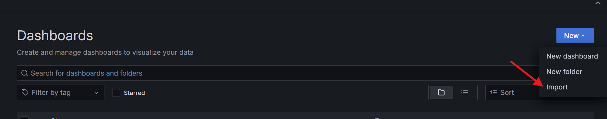
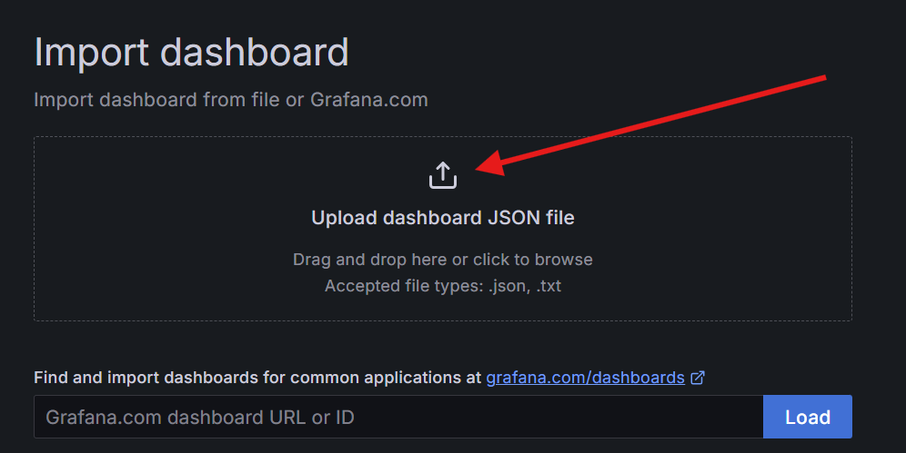

# Service Health Dashboard Documentation

## Purpose

The `Service Health Dashboard` provides a comprehensive overview of the health and performance of various components in the system, including Azure Edge, AIO services, MQTT brokers, and Kubernetes clusters.
It is designed to help operators quickly identify and diagnose issues by visualizing key metrics and health indicators.

---

## Panels Overview

### 1. **Azure Edge**

#### **Azure Edge Scenario Health**

- **Description**: Displays the health of various Azure Edge scenarios, including message queue (MQ) operations like publish, subscribe, and unsubscribe, as well as end-to-end health checks.
- **Metrics Used**:
  - `aio_broker_publish_route_replication_correctness`
  - `aio_broker_subscribe_route_replication_correctness`
  - `aio_broker_unsubscribe_route_replication_correctness`
  - `aio_broker_message_delivery_check_total_messages_lost`
- **Thresholds**:
  - Green: Healthy (value = 1)
  - Red: Critical (value = 0)

#### **Azure Edge Service Health**

- **Description**: Monitors authentication failures, authorization failures, backpressure, and dropped QoS0 messages for Azure Edge services.
- **Metrics Used**:
  - `aio_broker_authentication_failures`
  - `aio_broker_authorization_deny`
  - `aio_broker_backpressure_packets_rejected`
  - `aio_broker_qos0_messages_dropped`
- **Thresholds**:
  - Green: Healthy (value = 1)
  - Red: Critical (value = 0)

---

### 2. **AIO**

#### **AIO Service Health**

- **Description**: Tracks the health of AIO connectors, dataflows, and brokers.
- **Metrics Used**:
  - Connectors: `aio_opc_mqtt_message_publishing_duration_count`
  - Dataflows: `aio_dataflow_messages_sent`, `aio_dataflow_errors`
  - Brokers: `aio_broker_authentication_failures`, `aio_broker_qos0_messages_dropped`
- **Thresholds**:
  - Green: Healthy (value = 1)
  - Red: Critical (value = 0)

#### **AIO Scenario Health**

- **Description**: Evaluates the health of Akri workloads and broker replication correctness.
- **Metrics Used**:
  - Akri Health: `kube_deployment_status_replicas_ready`, `kube_daemonset_status_number_ready`
  - Broker Health: `aio_broker_publish_route_replication_correctness`, `aio_broker_payload_check_total_messages_lost`
- **Thresholds**:
  - Green: Healthy (value = 1)
  - Red: Critical (value = 0)

#### **Broker Overall Messages Delivered**

- **Description**: Shows the percentage of messages successfully delivered by the broker.
- **Metrics Used**:
  - `aio_broker_message_delivery_check_total_messages_lost`
- **Thresholds**:
  - Blue: >98%
  - Yellow: 80-98%
  - Red: <80%

#### **Broker Subscribe/Unsubscribe/Publish Health**

- **Description**: Displays the health of subscribe, unsubscribe, and publish routes.
- **Metrics Used**:
  - `aio_broker_subscribe_route_replication_correctness`
  - `aio_broker_unsubscribe_route_replication_correctness`
  - `aio_broker_publish_route_replication_correctness`
- **Thresholds**:
  - Blue: >98%
  - Yellow: 80-98%
  - Red: <80%

#### **AIO Broker Connected Sessions**

- **Description**: Tracks the number of active sessions connected to the broker.
- **Metrics Used**:
  - `aio_broker_connected_sessions`
- **Thresholds**:
  - Green: Healthy
  - Red: Critical (sessions > 80)

#### **Broker Messages Delivered Success Rate**

- **Description**: Displays the success rate of messages delivered by the broker, aggregated across all topics.
- **Metrics Used**:
  - `aio_broker_message_delivery_check_total_messages_lost`
- **Thresholds**:
  - Blue: >98%
  - Yellow: 80-98%
  - Red: <80%

#### **Dataflows Messages Sent by EndPointType and DataflowId**

- **Description**: Monitors the rate of messages sent by dataflows, grouped by endpoint type and dataflow ID.
- **Metrics Used**:
  - `aio_dataflow_messages_sent`
- **Thresholds**:
  - Green: Healthy
  - Red: Critical (no messages sent)

#### **Broker Inbound/Outbound Messages**

- **Description**: Monitors the rate of inbound and outbound messages per second, grouped by category.
- **Metrics Used**:
  - Inbound: `aio_broker_publishes_received`
  - Outbound: `aio_broker_publishes_sent`

---

### 3. **MQTT**

#### **Mqtt Broker SLO**

- **Description**: Monitors MQTT broker service level objectives (SLOs), including authentication failures, authorization denials, backpressure, and dropped QoS0 messages.
- **Metrics Used**:
  - `aio_broker_authentication_failures`
  - `aio_broker_authorization_deny`
  - `aio_broker_backpressure_packets_rejected`
  - `aio_broker_qos0_messages_dropped`
- **Thresholds**:
  - Green: Healthy (value = 1)
  - Red: Critical (value = 0)

---

### 4. **Kubernetes**

#### **Kubernetes Node Health**

- **Description**: Evaluates the health of Kubernetes nodes based on readiness, CPU, memory, and disk usage.
- **Metrics Used**:
  - Node Readiness: `kube_node_status_condition`
  - Node CPU: `node_cpu_seconds_total`
  - Node Memory: `node_memory_MemTotal_bytes`, `node_memory_MemFree_bytes`
  - Node Disk: `node_filesystem_avail_bytes`
- **Thresholds**:
  - Green: Healthy (value = 1)
  - Yellow: Warning (value = 0.5)
  - Red: Critical (value = 0)

#### **Kubernetes Workload Health**

- **Description**: Monitors the health of Kubernetes workloads, including readiness, container restarts, CPU, and memory usage.
- **Metrics Used**:
  - Workload Readiness: `kube_deployment_status_replicas_ready`
  - Container Restarts: `kube_pod_container_status_restarts_total`
  - Container CPU: `container_cpu_cfs_throttled_periods_total`
  - Container Memory: `container_memory_working_set_bytes`
- **Thresholds**:
  - Green: Healthy (value = 1)
  - Yellow: Warning (value = 0.5)
  - Red: Critical (value = 0)

---

## Setting Up the Dashboard

To set up the `Service Health Dashboard`, you need to manually import the dashboard JSON file into Azure Managed Grafana.

1. Click the import button on the right-hand side.

   

2. Click import JSON.

   

3. Choose the `service-health-dashboard.json` file from the `docs/observability` directory.

Once imported, you can start monitoring the health and performance of your system using the panels described above.

---

## Conclusion

The `Service Health Dashboard` provides a centralized view of system health, enabling proactive monitoring and troubleshooting. Each panel is tailored to highlight specific metrics and thresholds, ensuring that operators can quickly identify and address potential issues.
