## Scenario Overview

Digital Inspection and Survey enables automated inspection through digital thread technologies, leveraging computer vision, sensor fusion, and AI-powered analytics to replace manual inspection processes. This solution improves inspection accuracy, speed, and consistency while providing digital traceability of quality data across the production lifecycle.

## Capability Evaluation Framework

This scenario has been evaluated across four key dimensions:

- **Technical Fit** (0-10): Direct requirement match, performance alignment, integration complexity
- **Business Value** (0-10): Impact magnitude, value realization timeline, ROI potential
- **Implementation Practicality** (0-10): Complexity assessment, resource requirements, risk level
- **Platform Cohesion** (0-10): Cross-capability benefits, data flow optimization, shared infrastructure

## Critical Capabilities & Implementation Details

<!-- markdownlint-disable MD033 -->
| Capability Group                                                                             | Critical Capabilities                                                                                                                                                                                                                                                | Implementation Details for Digital Inspection                                                                                                                                             | Status                                                                                                       |
|----------------------------------------------------------------------------------------------|----------------------------------------------------------------------------------------------------------------------------------------------------------------------------------------------------------------------------------------------------------------------|-------------------------------------------------------------------------------------------------------------------------------------------------------------------------------------------|--------------------------------------------------------------------------------------------------------------|
| **[Protocol Translation & Device Management][protocol-translation-device-management]**       | - [OPC UA Data Ingestion][opc-ua-data-ingestion] - [Device Twin Management][device-twin-management] - [Broad Industrial Protocol Support][broad-industrial-protocol-support]                                                                                   | - Connect to inspection equipment and systems - Create digital twins of inspection assets - Support protocols for specialized inspection devices                                    | [Available][available] [Available][available] In Development                                           |
| **[Edge Cluster Platform][edge-cluster-platform]**                                           | - [Edge Compute Orchestration][edge-compute-orchestration] - [Edge Application CI/CD][edge-application-cicd]                                                                                                                                                      | - Deploy local processing for inspection systems - Manage containerized vision applications                                                                                            | [Available][available-2] [Available][available-2]                                                         |
| **[Edge Industrial Application Platform][edge-industrial-application-platform]**             | - [Edge Camera Control][edge-camera-control] - [Edge Data Stream Processing][edge-data-stream-processing] - [Edge Inferencing Application Framework][edge-inferencing-application-framework] - [Edge Dashboard Visualization][edge-dashboard-visualization] | - Manage vision inspection cameras and systems - Process real-time inspection data streams - Run defect detection ML models at the edge - Display inspection results and metrics | [Available][available-4] [Available][available-4] [Available][available-6] [Available][available-4] |
| **[Cloud Data Platform][cloud-data-platform]**                                               | - [Cloud Data Platform Services][cloud-data-platform-services] - [Data Governance & Lineage][data-governance-lineage] - [Machine Learning Feature Store][machine-learning-feature-store]                                                                       | - Store inspection data and images - Maintain inspection data traceability - Manage features for inspection models                                                                  | [Available][available-8] In Development In Development                                                 |
| **[Cloud AI Platform][cloud-ai-platform]**                                                   | - [Cloud AI/ML Model Training][cloud-ai-ml-model-training] - [MLOps Toolchain][mlops-toolchain] - [Computer Vision Platform][computer-vision-platform]                                                                                                         | - Train advanced defect detection models - Manage model lifecycle for inspection - Develop specialized vision models                                                                | Planned Planned Planned                                                                                |
| **[Cloud Insights Platform][cloud-insights-platform]**                                       | - [Automated Incident Response & Remediation][automated-incident-response-remediation] - [Cloud Observability Foundation][cloud-observability-foundation]                                                                                                         | - Automate responses to detected defects - Apply advanced analytics to inspection data                                                                                                 | In Development In Development                                                                             |
| **[Advanced Simulation & Digital Twin Platform][advanced-simulation-digital-twin-platform]** | - [Augmented Reality Visualization][augmented-reality-visualization] - [3D Digital Twin][3d-digital-twin]                                                                                                                                                         | - AR-assisted inspection workflows - 3D models of inspected products and equipment                                                                                                     | External External                                                                                         |
<!-- markdownlint-enable MD033 -->

## Maturity-Based Implementation Roadmap

### Proof of Concept (PoC) Phase - 3 weeks

**Focus**: Basic vision system integration and defect detection

**Core Capabilities**:

- **[Edge Camera Control][edge-camera-control]** (Technical: 10, Business: 9, Practical: 8, Cohesion: 9)
  - Industrial camera system integration
  - Basic image capture capabilities
  - Camera calibration and management

- **[Edge Data Stream Processing][edge-data-stream-processing]** (Technical: 9, Business: 9, Practical: 8, Cohesion: 9)
  - Real-time image processing pipeline
  - Basic image analytics
  - Defect data collection

- **[Edge Dashboard Visualization][edge-dashboard-visualization]** (Technical: 8, Business: 8, Practical: 9, Cohesion: 7)
  - Inspection results visualization
  - Basic defect tracking dashboard
  - Simple alerting for detected issues

- **[OPC UA Data Ingestion][opc-ua-data-ingestion]** (Technical: 9, Business: 7, Practical: 9, Cohesion: 8)
  - Integration with production line equipment
  - Capture of contextual production data
  - System synchronization for inspection timing

**Suggested Expected Value**: 15-25% reduction in manual inspection requirements

### Proof of Value (PoV) Phase - 10 weeks

**Focus**: AI-powered defect detection and automated analytics

**Additional Capabilities**:

- **[Edge Inferencing Application Framework][edge-inferencing-application-framework]** (Technical: 8, Business: 9, Practical: 7, Cohesion: 9)
  - Real-time defect classification models
  - Advanced pattern recognition
  - Local model execution for immediate results

- **[Device Twin Management][device-twin-management]** (Technical: 8, Business: 7, Practical: 8, Cohesion: 8)
  - Digital representation of inspection equipment
  - Virtual state tracking of inspection systems
  - Equipment parameter management

- **[Cloud Data Platform Services][cloud-data-platform-services]** (Technical: 8, Business: 8, Practical: 8, Cohesion: 9)
  - Centralized inspection data repository
  - Image and defect data storage
  - Historical trend analytics

- **[Computer Vision Platform][computer-vision-platform]** (Technical: 9, Business: 9, Practical: 7, Cohesion: 8)
  - Advanced computer vision algorithm development
  - Specialized vision model training
  - Custom defect detection capabilities

**Suggested Expected Value**: 40-60% reduction in quality escapes and 30-50% improvement in inspection speed

### Production Phase - 6 months

**Focus**: Enterprise integration and full automation

**Additional Capabilities**:

- **[Data Governance & Lineage][data-governance-lineage]** (Technical: 8, Business: 7, Practical: 7, Cohesion: 8)
  - Inspection data traceability
  - Full quality record management
  - Regulatory compliance documentation

- **[Automated Incident Response & Remediation][automated-incident-response-remediation]** (Technical: 7, Business: 8, Practical: 7, Cohesion: 8)
  - Automated quality incident workflows
  - Defect response procedures
  - Integration with quality management systems

- **[Cloud AI/ML Model Training][cloud-ai-ml-model-training]** (Technical: 8, Business: 9, Practical: 7, Cohesion: 8)
  - Advanced defect detection models
  - Continuous model training on new data
  - Fine-tuning of inspection algorithms

- **[Broad Industrial Protocol Support][broad-industrial-protocol-support]** (Technical: 8, Business: 7, Practical: 7, Cohesion: 8)
  - Integration with specialized inspection equipment
  - Support for legacy inspection systems
  - Multi-vendor equipment integration

**Suggested Expected Value**: 60-80% reduction in manual inspection and 40-60% faster quality issue detection

### Scale Phase - 15 months

**Focus**: Advanced inspection intelligence across enterprise

**Additional Capabilities**:

- **[MLOps Toolchain][mlops-toolchain]** (Technical: 8, Business: 8, Practical: 7, Cohesion: 9)
  - Automated model lifecycle management
  - Continuous model improvement
  - Enterprise model governance

- **[Machine Learning Feature Store][machine-learning-feature-store]** (Technical: 8, Business: 8, Practical: 7, Cohesion: 9)
  - Centralized management of inspection features
  - Feature reuse across multiple models
  - Accelerated model development

- **[Augmented Reality Visualization][augmented-reality-visualization]** (Technical: 9, Business: 9, Practical: 6, Cohesion: 8)
  - AR-assisted inspection workflows
  - Visual guidance for complex inspections
  - Real-time overlay of inspection results

- **[3D Digital Twin][3d-digital-twin]** (Technical: 9, Business: 8, Practical: 6, Cohesion: 8)
  - Full 3D modeling of inspected products
  - Virtual inspection and validation
  - Defect mapping to 3D product models

**Suggested Expected Value**: 80-90% automation of inspection processes and 70-85% reduction in quality-related costs

## Implementation Phase Legend

| Phase          | Duration  | Focus                                                | Value Achievement                         |
|----------------|-----------|------------------------------------------------------|-------------------------------------------|
| **PoC**        | 3 weeks   | Basic vision system integration and defect detection | 15-25% reduction in manual inspection     |
| **PoV**        | 10 weeks  | AI-powered defect detection and automated analytics  | 40-60% reduction in quality escapes       |
| **Production** | 6 months  | Enterprise integration and full automation           | 60-80% reduction in manual inspection     |
| **Scale**      | 15 months | Advanced inspection intelligence across enterprise   | 80-90% automation of inspection processes |

## Enhanced Key Capabilities Mapping with Implementation Phases

```mermaid
%%{init: {
  'theme': 'default',
  'themeVariables': { 'fontSize': '14px', 'fontFamily': 'trebuchet ms', 'lineHeight': '1.4' },
  'flowchart': { 'htmlLabels': true, 'curve': 'basis' },
  'width': '1600px',
  'height': '1200px'
}}%%
graph RL
    classDef main fill:#4285F4,stroke:#0D47A1,color:white,stroke-width:3px
    classDef capabilityGroup fill:#1976D2,stroke:#0D47A1,color:white,stroke-width:2px
    classDef categoryPoC fill:#9C27B0,stroke:#6A1B9A,color:white,stroke-width:2px
    classDef categoryPoV fill:#FF5722,stroke:#D84315,color:white,stroke-width:2px
    classDef categoryProd fill:#607D8B,stroke:#455A64,color:white,stroke-width:2px
    classDef categoryScale fill:#795548,stroke:#5D4037,color:white,stroke-width:2px

    %% Capability status classes
    classDef available fill:#00C853,stroke:#009624,color:white,stroke-width:1px
    classDef inDevelopment fill:#FFD600,stroke:#FFAB00,color:black,stroke-width:1px
    classDef planned fill:#FF6D00,stroke:#FF3D00,color:white,stroke-width:1px
    classDef external fill:#8D6E63,stroke:#5D4037,color:white,stroke-width:1px

    %% Main Scenario
    MainScenario[Digital Inspection & Survey<br/>AI-Powered Quality Automation]

    %% PoC Phase Capabilities (3 weeks)
    EdgeCamera[Edge Camera Control<br/>Score: 10/9/8/9]
    EdgeStreamPoC[Edge Data Stream Processing<br/>Score: 9/9/8/9]
    EdgeDashPoC[Edge Dashboard Visualization<br/>Score: 8/8/9/7]
    OPCDataIngestion[OPC UA Data Ingestion<br/>Score: 9/7/9/8]

    %% PoV Phase Capabilities (10 weeks)
    EdgeInference[Edge Inferencing Application Framework<br/>Score: 8/9/7/9]
    DeviceTwin[Device Twin Management<br/>Score: 8/7/8/8]
    CloudDataServices[Cloud Data Platform<br/>Score: 8/8/8/9]
    ComputerVision[Computer Vision Platform<br/>Score: 9/9/7/8]

    %% Production Phase Capabilities (6 months)
    DataGovernance[Data Governance & Lineage<br/>Score: 8/7/7/8]
    AutoIncident[Automated Incident Response<br/>Score: 7/8/7/8]
    CloudMLTraining[Cloud AI/ML Model Training<br/>Score: 8/9/7/8]
    IndustrialProtocol[Broad Industrial Protocol Support<br/>Score: 8/7/7/8]

    %% Scale Phase Capabilities (15 months)
    MLOps[MLOps Toolchain<br/>Score: 8/8/7/9]
    FeatureStore[ML Feature Store<br/>Score: 8/8/7/9]
    ARVisualization[Augmented Reality Visualization<br/>Score: 9/9/6/8]
    DigitalTwin[3D Digital Twin<br/>Score: 9/8/6/8]

    %% Phase-specific Capability Groups
    EdgeIndustrialAppPoC[PoC: Edge Industrial Application Platform<br/>3 weeks]
    ProtocolTranslationPoC[PoC: Protocol Translation & Device Management<br/>3 weeks]

    EdgeIndustrialAppPoV[PoV: Edge Industrial Application Platform<br/>10 weeks]
    ProtocolTranslationPoV[PoV: Protocol Translation & Device Management<br/>10 weeks]
    CloudDataPlatformPoV[PoV: Cloud Data Platform<br/>10 weeks]
    CloudAIPlatformPoV[PoV: Cloud AI Platform<br/>10 weeks]

    CloudDataPlatformProd[Production: Cloud Data Platform<br/>6 months]
    CloudInsightsPlatformProd[Production: Cloud Insights Platform<br/>6 months]
    CloudAIPlatformProd[Production: Cloud AI Platform<br/>6 months]
    ProtocolTranslationProd[Production: Protocol Translation & Device Management<br/>6 months]

    CloudAIPlatformScale[Scale: Cloud AI Platform<br/>15 months]
    CloudDataPlatformScale[Scale: Cloud Data Platform<br/>15 months]
    AdvancedSimulationScale[Scale: Advanced Simulation & Digital Twin<br/>15 months]

    %% Individual Capabilities to Phase-specific Groups
    EdgeCamera --> EdgeIndustrialAppPoC
    EdgeStreamPoC --> EdgeIndustrialAppPoC
    EdgeDashPoC --> EdgeIndustrialAppPoC
    OPCDataIngestion --> ProtocolTranslationPoC

    EdgeInference --> EdgeIndustrialAppPoV
    DeviceTwin --> ProtocolTranslationPoV
    CloudDataServices --> CloudDataPlatformPoV
    ComputerVision --> CloudAIPlatformPoV

    DataGovernance --> CloudDataPlatformProd
    AutoIncident --> CloudInsightsPlatformProd
    CloudMLTraining --> CloudAIPlatformProd
    IndustrialProtocol --> ProtocolTranslationProd

    MLOps --> CloudAIPlatformScale
    FeatureStore --> CloudDataPlatformScale
    ARVisualization --> AdvancedSimulationScale
    DigitalTwin --> AdvancedSimulationScale

    %% Phase-specific Groups to Main Scenario
    EdgeIndustrialAppPoC --> MainScenario
    ProtocolTranslationPoC --> MainScenario

    EdgeIndustrialAppPoV --> MainScenario
    ProtocolTranslationPoV --> MainScenario
    CloudDataPlatformPoV --> MainScenario
    CloudAIPlatformPoV --> MainScenario

    CloudDataPlatformProd --> MainScenario
    CloudInsightsPlatformProd --> MainScenario
    CloudAIPlatformProd --> MainScenario
    ProtocolTranslationProd --> MainScenario

    CloudAIPlatformScale --> MainScenario
    CloudDataPlatformScale --> MainScenario
    AdvancedSimulationScale --> MainScenario

    %% Apply styles
    MainScenario:::main

    EdgeIndustrialAppPoC:::categoryPoC
    ProtocolTranslationPoC:::categoryPoC

    EdgeIndustrialAppPoV:::categoryPoV
    ProtocolTranslationPoV:::categoryPoV
    CloudDataPlatformPoV:::categoryPoV
    CloudAIPlatformPoV:::categoryPoV

    CloudDataPlatformProd:::categoryProd
    CloudInsightsPlatformProd:::categoryProd
    CloudAIPlatformProd:::categoryProd
    ProtocolTranslationProd:::categoryProd

    CloudAIPlatformScale:::categoryScale
    CloudDataPlatformScale:::categoryScale
    AdvancedSimulationScale:::categoryScale

    %% Apply capability status styles
    EdgeCamera:::available
    EdgeStreamPoC:::available
    EdgeDashPoC:::available
    OPCDataIngestion:::available
    EdgeInference:::available
    DeviceTwin:::available
    CloudDataServices:::available

    DataGovernance:::inDevelopment
    AutoIncident:::inDevelopment
    IndustrialProtocol:::inDevelopment
    FeatureStore:::inDevelopment

    CloudMLTraining:::planned
    ComputerVision:::planned
    MLOps:::planned

    ARVisualization:::external
    DigitalTwin:::external

    linkStyle default stroke-width:2px,fill:none,stroke:#999
```

## Capability Status Legend

<!-- markdownlint-disable MD033 -->
| Status                                                  | Description                                                                            |
|---------------------------------------------------------|----------------------------------------------------------------------------------------|
| ■ **Available**      | These capabilities are mostly implemented and ready to use in the edge-ai platform     |
| ■ **In Development** | These capabilities are partially implemented or currently in active development        |
| ■ **Planned**        | These capabilities are on our roadmap but implementation has not yet started           |
| ■ **External**       | These capabilities require integration with external systems or third-party components |
<!-- markdownlint-enable MD033 -->

> **Important**: Before implementing this scenario, review the [Prerequisites][prerequisites] document for hardware, software, permissions, and system requirements.

## Expected Outcomes

- Reduction in manual inspection requirements by 60-80%
- Improvement in defect detection accuracy by 30-50%
- Decrease in quality escapes by 40-70%
- Increased inspection speed by 400-600%
- Enhanced compliance documentation and traceability by 50-80%
- Reduced quality-related costs by 20-40%
- More consistent quality assessment across facilities by 30-60%
- Improved production yield by 5-15%
- Enhanced product quality by 10-25%

## Advanced Capability Extensions

- **[Computer Vision Platform][computer-vision-platform]** (Technical: 9, Business: 9, Practical: 7, Cohesion: 9)
  - Advanced vision model training framework
  - Object recognition and defect detection capabilities
  - Transfer learning from pre-trained models

- **[Data Governance & Lineage][data-governance-lineage]** (Technical: 8, Business: 7, Practical: 7, Cohesion: 8)
  - Complete traceability of inspection data
  - Regulatory compliance for quality inspections
  - Audit trail for quality verification

## Next Steps & Related Resources

- Review the [Prerequisites][prerequisites] for implementation requirements
- Explore the [Capability Group Mapping][capability-group-mapping] for detailed capability assessment
- See the [Blueprints README][blueprints-readme] for deployment options
- Review [Implementation Guide][implementation-guide] for step-by-step deployment instructions

<!-- Reference Links -->
[available]: /src/100-edge/110-iot-ops
[available-2]: /src/100-edge/100-cncf-cluster
[available-4]: /src/100-edge/120-observability
[available-6]: /src/100-edge/130-ml-ops
[available-8]: /src/000-cloud/030-data
[prerequisites]: ./prerequisites.md
[capability-group-mapping]: ./digital-inspection-survey-capability-mapping.md
[blueprints-readme]: /blueprints/README.md
[implementation-guide]: /docs/implementation-guides/digital-inspection-implementation.md
[protocol-translation-device-management]: /docs/capabilities/protocol-translation-device-management/README.md
[opc-ua-data-ingestion]: /docs/capabilities/protocol-translation-device-management/opc-ua-data-ingestion.md
[device-twin-management]: /docs/capabilities/protocol-translation-device-management/device-twin-management.md
[broad-industrial-protocol-support]: /docs/capabilities/protocol-translation-device-management/broad-industrial-protocol-support.md
[edge-cluster-platform]: /docs/capabilities/edge-cluster-platform/README.md
[edge-compute-orchestration]: /docs/capabilities/edge-cluster-platform/edge-compute-orchestration-platform.md
[edge-application-cicd]: /docs/capabilities/edge-cluster-platform/edge-application-cicd.md
[edge-industrial-application-platform]: /docs/capabilities/edge-industrial-application-platform/README.md
[edge-camera-control]: /docs/capabilities/edge-industrial-application-platform/edge-camera-control.md
[edge-data-stream-processing]: /docs/capabilities/edge-industrial-application-platform/edge-data-stream-processing.md
[edge-inferencing-application-framework]: /docs/capabilities/edge-industrial-application-platform/edge-inferencing-application-framework.md
[edge-dashboard-visualization]: /docs/capabilities/edge-industrial-application-platform/edge-dashboard-visualization.md
[cloud-data-platform]: /docs/capabilities/cloud-data-platform/README.md
[cloud-data-platform-services]: /docs/capabilities/cloud-data-platform/cloud-data-platform-services.md
[data-governance-lineage]: /docs/capabilities/cloud-data-platform/data-governance-lineage.md
[machine-learning-feature-store]: /docs/capabilities/cloud-data-platform/machine-learning-feature-store.md
[cloud-ai-platform]: /docs/capabilities/cloud-ai-platform/README.md
[cloud-ai-ml-model-training]: /docs/capabilities/cloud-ai-platform/cloud-ai-ml-model-training-management.md
[mlops-toolchain]: /docs/capabilities/cloud-ai-platform/mlops-toolchain.md
[computer-vision-platform]: /docs/capabilities/cloud-ai-platform/computer-vision-platform.md
[cloud-insights-platform]: /docs/capabilities/cloud-insights-platform/README.md
[automated-incident-response-remediation]: /docs/capabilities/cloud-insights-platform/automated-incident-response-remediation.md
[cloud-observability-foundation]: /docs/capabilities/cloud-insights-platform/cloud-observability-foundation.md
[advanced-simulation-digital-twin-platform]: /docs/capabilities/advanced-simulation-digital-twin-platform/README.md
[augmented-reality-visualization]: /docs/capabilities/advanced-simulation-digital-twin-platform/augmented-reality-visualization.md
[3d-digital-twin]: /docs/capabilities/advanced-simulation-digital-twin-platform/3d-digital-twin.md

---

<!-- markdownlint-disable MD036 -->
*🤖 Crafted with precision by ✨Copilot following brilliant human instruction,
then carefully refined by our team of discerning human reviewers.*
<!-- markdownlint-enable MD036 -->
