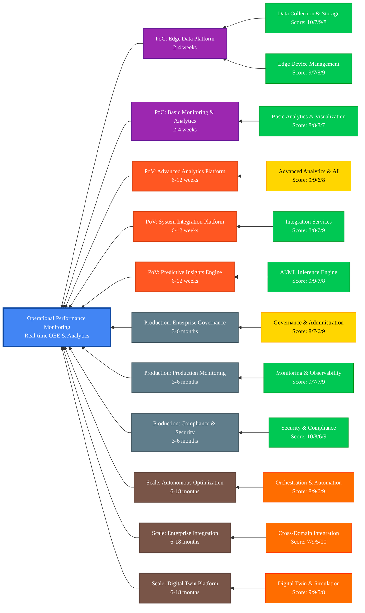

## Scenario Overview

**Business Context:** Manufacturing and industrial operations face increasing pressure to optimize Overall Equipment Effectiveness (OEE), reduce unplanned downtime, and improve operational efficiency. Traditional monitoring approaches rely on manual data collection and reactive maintenance, leading to significant productivity losses and increased operational costs.

**Solution Approach:** This scenario leverages edge AI capabilities to deliver real-time operational intelligence through comprehensive equipment monitoring, predictive analytics, and automated performance optimization. The solution provides continuous visibility into operational performance while enabling proactive optimization and maintenance decisions.

**Strategic Value:** Organizations implementing this scenario typically achieve 15-25% improvements in OEE, 30-40% reductions in unplanned downtime, and 20-30% improvements in maintenance efficiency through predictive insights and automated optimization.

**Implementation Scope:** This scenario demonstrates comprehensive operational performance monitoring through 4 implementation phases, leveraging 12 platform capabilities to deliver real-time OEE monitoring, predictive analytics, and performance optimization across 6-18 months.

## Implementation Approach

This scenario follows a structured, phase-based implementation approach designed to minimize risk while maximizing business value realization:

### Phase-Based Implementation

- **PoC Phase (2-4 weeks):** Foundation capabilities including data collection, edge device management, and basic visualization for operational visibility
- **PoV Phase (6-12 weeks):** Value demonstration through predictive analytics, advanced visualization, and integration with existing operational systems
- **Production Phase (3-6 months):** Enterprise-grade deployment with comprehensive security, governance, and production-ready monitoring capabilities
- **Scale Phase (6-18 months):** Enterprise transformation through digital twins, automated optimization, and cross-facility integration

### Key Implementation Principles

- **Business Value First:** Each phase delivers measurable improvements in OEE and operational efficiency before proceeding
- **Risk Mitigation:** Incremental implementation reduces technical and operational risk while building stakeholder confidence
- **Stakeholder Alignment:** Regular validation with operational teams ensures solution meets real-world operational requirements
- **Platform Integration:** Leverage existing operational systems and data sources for accelerated deployment and adoption

## Resource Organization

This scenario's documentation and resources are organized to support different stakeholder needs and implementation phases:

### Core Documentation

- **[Operational Performance Monitoring Prerequisites][operational-performance-monitoring-prerequisites]:** Comprehensive technical and organizational requirements for successful implementation
- **[Capability Mapping][capability-mapping]:** Detailed capability analysis with scoring, implementation phases, and integration patterns

### Implementation Resources

**Platform Components:**

- **Data Collection & Storage:** Edge-based data ingestion with local buffering and cloud synchronization
- **AI/ML Inference Engine:** Predictive analytics for equipment performance and maintenance optimization
- **Analytics & Visualization:** Real-time dashboards, KPI monitoring, and operational intelligence
- **Integration Services:** Connectivity with ERP, MES, SCADA, and other operational systems

**Technical Architecture:**

- **Edge Layer:** Data collection, local processing, and real-time analytics at the operational edge
- **Cloud Layer:** Advanced analytics, machine learning, and enterprise integration services
- **Integration Layer:** Bidirectional connectivity with existing operational and business systems
- **Security Layer:** End-to-end security, compliance, and governance framework

## Prerequisites & Dependencies

### Technical Prerequisites

**Infrastructure Requirements:**

- Edge computing platform with sufficient processing power for real-time analytics
- Network connectivity between operational equipment and edge devices
- Cloud platform services for advanced analytics and enterprise integration
- Industrial protocol connectivity (OPC UA, Modbus, MQTT) for equipment integration

**Equipment Requirements:**

- Operational equipment with monitoring interfaces and data accessibility
- OEE monitoring systems or capability to calculate availability, performance, and quality metrics
- Production rate sensors, downtime tracking, and quality inspection systems
- Energy consumption meters and environmental monitoring capabilities

### Organizational Prerequisites

**Stakeholder Engagement:**

- Operations management commitment to data-driven performance optimization
- IT and OT collaboration for integrated platform deployment
- Maintenance team engagement for predictive analytics adoption
- Quality team involvement for performance and quality correlation analysis

**Process Readiness:**

- Defined OEE calculation standards and performance benchmarks
- Established maintenance procedures and work order management processes
- Quality control processes with measurable performance indicators
- Change management capability for operational process improvements

## Getting Started Guide

### Phase 1: Assessment & Planning (1-2 weeks)

1. **Operational Assessment:**
   - Conduct comprehensive review of current operational monitoring capabilities
   - Identify critical equipment and key performance indicators
   - Document existing data sources and integration requirements
   - Assess operational team readiness and training needs

2. **Technical Readiness:**
   - Validate prerequisite infrastructure and connectivity requirements
   - Review security and compliance requirements with IT and security teams
   - Plan edge device deployment locations and network connectivity
   - Establish data governance policies and access controls

3. **Stakeholder Alignment:**
   - Confirm business objectives and success criteria with operations leadership
   - Establish cross-functional project team with operations, IT, and maintenance stakeholders
   - Define implementation timeline and resource allocation
   - Plan change management and training approach

### Phase 2: PoC Implementation (2-4 weeks)

1. **Foundation Deployment:**
   - Deploy edge devices at pilot operational areas
   - Implement basic data collection from critical equipment
   - Establish connectivity with selected operational systems
   - Configure basic OEE dashboards and monitoring

2. **Validation & Testing:**
   - Validate data accuracy and completeness
   - Test real-time dashboard performance and usability
   - Confirm integration with existing operational processes
   - Gather feedback from operational teams

3. **Success Measurement:**
   - Measure baseline operational performance metrics
   - Document operational visibility improvements
   - Assess stakeholder satisfaction and adoption
   - Plan PoV phase capabilities and timeline

### Phase 3: Value Demonstration (6-12 weeks)

Continue with PoV implementation focusing on predictive analytics, advanced visualization, and measurable business value delivery.

## Key Resources & Documentation

### Platform Documentation

- **[Edge AI Platform Overview][edge-ai-platform-overview]:** Complete platform capabilities and architecture
- **[Getting Started Guide][getting-started-guide]:** Platform setup and initial configuration
- **[Security Framework][security-framework]:** Comprehensive security and compliance guidance

### Related Scenarios

- **[Predictive Maintenance][predictive-maintenance]:** Equipment-focused predictive analytics and maintenance optimization
- **[Digital Inspection Survey][digital-inspection-survey]:** Quality-focused monitoring and inspection automation
- **[Quality Process Optimization][quality-process-optimization]:** Quality system integration and optimization

### Technical Implementation

- **[IoT Operations Module][iot-operations-module]:** Industrial connectivity and device management
- **[Analytics Components][analytics-components]:** Data processing and analytics capabilities
- **[Security Implementation][security-implementation]:** Security and identity management

### Support Resources

- **[Contribution Guidelines][contribution-guidelines]:** Contributing to scenario development and improvement
- **[Project Planning Templates][project-planning-templates]:** Additional planning and documentation templates
- **[Community Support][community-support]:** Getting help and connecting with the community

## Implementation Capability Mapping

---

<!-- markdownlint-disable MD036 -->
*🤖 Crafted with precision by ✨Copilot following brilliant human instruction,
then carefully refined by our team of discerning human reviewers.*
<!-- markdownlint-enable MD036 -->

<!-- Reference Links -->
[analytics-components]: /src/500-application/README.md
[capability-mapping]: ./operational-performance-monitoring-capability-mapping.md
[community-support]: /SUPPORT.md
[contribution-guidelines]: /CONTRIBUTING.md
[digital-inspection-survey]: ../digital-inspection-survey/README.md
[edge-ai-platform-overview]: /docs/README.md
[getting-started-guide]: /docs/getting-started/README.md
[iot-operations-module]: /src/100-edge/110-iot-ops/terraform/README.md
[operational-performance-monitoring-prerequisites]: ./prerequisites.md
[predictive-maintenance]: ../predictive-maintenance/README.md
[project-planning-templates]: /docs/project-planning/templates/README.md
[quality-process-optimization]: ../quality-process-optimization-automation/README.md
[security-framework]: /docs/solution-security-plan-library/README.md
[security-implementation]: /src/000-cloud/010-security-identity/terraform/README.md
