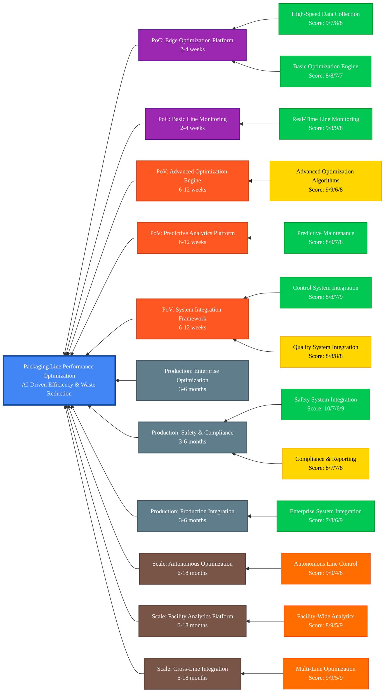

## Scenario Overview

**Business Context:** Packaging operations face increasing pressure to optimize throughput, reduce waste, and improve efficiency while maintaining quality standards. Traditional packaging line management relies on manual adjustments and reactive troubleshooting, leading to suboptimal performance and significant waste generation.

**Solution Approach:** This scenario leverages edge AI capabilities to deliver real-time packaging line optimization through continuous performance monitoring, predictive analytics, and automated parameter adjustment. The solution provides intelligent optimization recommendations while maintaining packaging quality and safety standards.

**Strategic Value:** Organizations implementing this scenario typically achieve 20-30% improvements in packaging line efficiency, 25-40% reductions in packaging waste, and 15-25% improvements in overall equipment effectiveness through intelligent optimization and predictive maintenance.

**Implementation Scope:** This scenario demonstrates comprehensive packaging line optimization through 4 implementation phases, leveraging 11 platform capabilities to deliver real-time optimization, predictive maintenance, and automated quality control across 6-18 months.

## Implementation Approach

This scenario follows a structured, phase-based implementation approach designed to minimize production disruption while maximizing efficiency gains:

### Phase-Based Implementation

- **PoC Phase (2-4 weeks):** Foundation capabilities including data collection, basic monitoring, and initial optimization algorithms for single packaging line validation
- **PoV Phase (6-12 weeks):** Value demonstration through advanced optimization, predictive analytics, and integration with existing packaging control systems
- **Production Phase (3-6 months):** Enterprise-grade deployment with comprehensive safety systems, quality integration, and production-ready optimization capabilities
- **Scale Phase (6-18 months):** Enterprise transformation through multi-line optimization, automated control, and facility-wide performance management

### Key Implementation Principles

- **Safety First:** All optimization maintains packaging line safety standards and emergency procedures
- **Quality Assurance:** Optimization algorithms prioritize quality maintenance while improving efficiency
- **Minimal Disruption:** Incremental implementation minimizes production downtime and operational risk
- **Continuous Learning:** Machine learning models continuously improve optimization based on operational feedback

## Resource Organization

This scenario's documentation and resources are organized to support different stakeholder needs and implementation phases:

### Core Documentation

- **[Packaging Line Performance Optimization Prerequisites][packaging-line-performance-optimization-prerequisites]:** Comprehensive technical and organizational requirements for successful implementation
- **[Capability Mapping][capability-mapping]:** Detailed capability analysis with scoring, implementation phases, and integration patterns

### Implementation Resources

**Platform Components:**

- **Real-Time Data Collection:** High-speed sensor integration with packaging line monitoring and control systems
- **Optimization Engine:** Advanced algorithms for packaging line parameter optimization and performance improvement
- **Predictive Analytics:** Machine learning models for equipment maintenance prediction and quality forecasting
- **Control System Integration:** Seamless integration with existing packaging PLCs, SCADA, and MES systems

**Technical Architecture:**

- **Edge Layer:** Real-time data collection, local optimization processing, and immediate feedback control
- **Cloud Layer:** Advanced analytics, machine learning model training, and enterprise performance management
- **Integration Layer:** Bi-directional connectivity with packaging control systems and enterprise planning systems
- **Safety Layer:** Comprehensive safety system integration with emergency override capabilities

## Prerequisites & Dependencies

### Technical Prerequisites

**Infrastructure Requirements:**

- High-performance edge computing platform capable of real-time optimization processing
- High-speed sensor infrastructure for packaging line monitoring and data collection
- Network connectivity supporting real-time control feedback and cloud analytics
- Integration capability with existing packaging control systems (PLCs, SCADA, MES)

**Packaging Line Requirements:**

- Modern packaging equipment with digital control interfaces and parameter adjustment capability
- Sensor infrastructure for monitoring key performance indicators (speed, quality, efficiency)
- Safety systems compatible with automated optimization and emergency override procedures
- Quality control systems capable of integration with optimization feedback loops

### Organizational Prerequisites

**Stakeholder Engagement:**

- Production management commitment to AI-driven packaging optimization
- Operations team readiness for technology adoption and workflow integration
- Maintenance team engagement for predictive maintenance and optimization-driven scheduling
- Quality assurance team involvement for optimization-quality integration

**Process Readiness:**

- Established packaging performance baselines and key performance indicators
- Documented packaging procedures and quality standards
- Change management capability for optimization-driven process improvements
- Safety protocols compatible with automated optimization systems

## Getting Started Guide

### Phase 1: Assessment & Planning (1-2 weeks)

1. **Packaging Line Assessment:**
   - Conduct comprehensive review of current packaging line performance and capabilities
   - Identify optimization opportunities and key performance bottlenecks
   - Document existing control systems and integration requirements
   - Establish baseline performance metrics and improvement targets

2. **Technical Readiness:**
   - Validate prerequisite infrastructure and sensor deployment requirements
   - Review safety and compliance requirements with operations and safety teams
   - Plan edge device deployment locations and control system integration points
   - Establish data governance policies for packaging performance data

3. **Stakeholder Alignment:**
   - Confirm business objectives and success criteria with production leadership
   - Establish cross-functional project team with operations, maintenance, and quality stakeholders
   - Define implementation timeline and resource allocation requirements
   - Plan change management and training approach for optimization adoption

### Phase 2: PoC Implementation (2-4 weeks)

1. **Foundation Deployment:**
   - Deploy edge devices and sensors at pilot packaging line
   - Implement basic data collection and monitoring capabilities
   - Establish connectivity with selected packaging control systems
   - Configure initial optimization algorithms and performance dashboards

2. **Validation & Testing:**
   - Validate data accuracy and real-time processing performance
   - Test optimization algorithm performance and safety integration
   - Confirm integration with existing packaging control systems
   - Gather feedback from production and maintenance teams

3. **Success Measurement:**
   - Measure baseline vs. optimized packaging line performance
   - Document efficiency improvements and waste reduction achievements
   - Assess stakeholder satisfaction and system usability
   - Plan PoV phase expansion and advanced capability deployment

### Phase 3: Value Demonstration (6-12 weeks)

Continue with PoV implementation focusing on advanced optimization algorithms, predictive maintenance integration, and measurable business value delivery.

## Key Resources & Documentation

### Platform Documentation

- **[Edge AI Platform Overview][edge-ai-platform-overview]:** Complete platform capabilities and architecture
- **[Getting Started Guide][getting-started-guide]:** Platform setup and initial configuration
- **[Security Framework][security-framework]:** Comprehensive security and compliance guidance

### Related Scenarios

- **[Operational Performance Monitoring][operational-performance-monitoring]:** Broader operational analytics and performance management
- **[Quality Process Optimization][quality-process-optimization]:** Quality-focused optimization and automation
- **[Yield Process Optimization][yield-process-optimization]:** Production yield optimization and improvement

### Technical Implementation

- **[IoT Operations Module][iot-operations-module]:** Industrial connectivity and device management
- **[Analytics Components][analytics-components]:** Data processing and optimization analytics capabilities
- **[Security Implementation][security-implementation]:** Security and identity management

### Support Resources

- **[Contribution Guidelines][contribution-guidelines]:** Contributing to scenario development and improvement
- **[Project Planning Templates][project-planning-templates]:** Additional planning and documentation templates
- **[Community Support][community-support]:** Getting help and connecting with the community

## Implementation Capability Mapping

---

<!-- markdownlint-disable MD036 -->
*🤖 Crafted with precision by ✨Copilot following brilliant human instruction,
then carefully refined by our team of discerning human reviewers.*
<!-- markdownlint-enable MD036 -->

<!-- Reference Links -->
[analytics-components]: /src/500-application/README.md
[capability-mapping]: ./packaging-line-performance-optimization-capability-mapping.md
[community-support]: /SUPPORT.md
[contribution-guidelines]: /CONTRIBUTING.md
[edge-ai-platform-overview]: /docs/README.md
[getting-started-guide]: /docs/getting-started/README.md
[iot-operations-module]: /src/100-edge/110-iot-ops/terraform/README.md
[operational-performance-monitoring]: ../operational-performance-monitoring/README.md
[packaging-line-performance-optimization-prerequisites]: ./prerequisites.md
[project-planning-templates]: /docs/project-planning/templates/README.md
[quality-process-optimization]: ../quality-process-optimization-automation/README.md
[security-framework]: /docs/solution-security-plan-library/README.md
[security-implementation]: /src/000-cloud/010-security-identity/terraform/README.md
[yield-process-optimization]: ../yield-process-optimization/README.md
