## Scenario Overview

Predictive Maintenance enables AI-driven predictive analysis for critical asset lifecycle management, providing proactive maintenance strategies that minimize equipment downtime, extend asset life, and optimize maintenance costs. This solution transforms traditional reactive maintenance approaches into predictive, data-driven maintenance programs that prevent failures before they occur.

## Capability Evaluation Framework

This scenario has been evaluated across four key dimensions:

- **Technical Fit** (0-10): Direct requirement match, performance alignment, integration complexity
- **Business Value** (0-10): Impact magnitude, value realization timeline, ROI potential
- **Implementation Practicality** (0-10): Complexity assessment, resource requirements, risk level
- **Platform Cohesion** (0-10): Cross-capability benefits, data flow optimization, shared infrastructure

## Critical Capabilities & Implementation Details

<!-- markdownlint-disable MD033 -->
| Capability Group                                                                             | Critical Capabilities                                                                                                                                                                                                | Implementation Details for Predictive Maintenance                                                                                                                                                | Status                                                                           |
|----------------------------------------------------------------------------------------------|----------------------------------------------------------------------------------------------------------------------------------------------------------------------------------------------------------------------|--------------------------------------------------------------------------------------------------------------------------------------------------------------------------------------------------|----------------------------------------------------------------------------------|
| **[Protocol Translation & Device Management][protocol-translation-device-management]**       | - [OPC UA Data Ingestion][opc-ua-data-ingestion] - [Device Twin Management][device-twin-management] - [Broad Industrial Protocol Support][broad-industrial-protocol-support]                                   | - Connect to equipment sensors and condition monitoring systems - Create digital twins of critical assets and equipment - Support protocols for diverse maintenance and monitoring devices | [Available][available] [Available][available] In Development               |
| **[Edge Cluster Platform][edge-cluster-platform]**                                           | - [Edge Compute Orchestration][edge-compute-orchestration] - [Edge Application CI/CD][edge-application-cicd]                                                                                                      | - Deploy local processing for maintenance analytics systems - Manage containerized predictive maintenance applications                                                                        | [Available][available-2] [Available][available-2]                             |
| **[Edge Industrial Application Platform][edge-industrial-application-platform]**             | - [Edge Data Stream Processing][edge-data-stream-processing] - [Edge Inferencing Application Framework][edge-inferencing-application-framework] - [Edge Dashboard Visualization][edge-dashboard-visualization] | - Process real-time sensor and condition monitoring data - Run failure prediction and anomaly detection models - Display asset health metrics and maintenance recommendations              | [Available][available-4] [Available][available-5] [Available][available-4] |
| **[Cloud Data Platform][cloud-data-platform]**                                               | - [Cloud Data Platform Services][cloud-data-platform-services] - [Data Governance & Lineage][data-governance-lineage] - [Machine Learning Feature Store][machine-learning-feature-store]                       | - Store asset condition data and maintenance history - Maintain asset data traceability and maintenance lineage - Manage features for predictive maintenance models                        | [Available][available-7] In Development In Development                     |
| **[Cloud AI Platform][cloud-ai-platform]**                                                   | - [Cloud AI/ML Model Training][cloud-ai-ml-model-training] - [MLOps Toolchain][mlops-toolchain]                                                                                                                   | - Train advanced failure prediction and maintenance optimization models - Manage model lifecycle for predictive maintenance                                                                | Planned Planned                                                               |
| **[Cloud Insights Platform][cloud-insights-platform]**                                       | - [Automated Incident Response & Remediation][automated-incident-response-remediation] - [Cloud Observability Foundation][cloud-observability-foundation]                                                         | - Automate responses to equipment failures and maintenance alerts - Apply advanced analytics to maintenance and asset data                                                                    | In Development In Development                                                 |
| **[Advanced Simulation & Digital Twin Platform][advanced-simulation-digital-twin-platform]** | - [3D Digital Twin][3d-digital-twin] - [Augmented Reality Visualization][augmented-reality-visualization]                                                                                                         | - 3D models of assets and maintenance optimization systems - AR-assisted maintenance workflows and asset visualization                                                                        | External External                                                             |
<!-- markdownlint-enable MD033 -->

## Maturity-Based Implementation Roadmap

### Proof of Concept (PoC) Phase - 3 weeks

**Focus**: Basic condition monitoring and asset data collection

**Core Capabilities**:

- **[Edge Data Stream Processing][edge-data-stream-processing]** (Technical: 9, Business: 8, Practical: 9, Cohesion: 9)
  - Real-time sensor data processing and condition monitoring
  - Vibration, temperature, and performance data analytics
  - Asset health scoring and trend analysis

- **[Edge Dashboard Visualization][edge-dashboard-visualization]** (Technical: 8, Business: 9, Practical: 9, Cohesion: 7)
  - Asset condition dashboards and health monitoring
  - Real-time equipment performance visualization
  - Maintenance alert and notification systems

- **[OPC UA Data Ingestion][opc-ua-data-ingestion]** (Technical: 9, Business: 8, Practical: 9, Cohesion: 8)
  - Integration with equipment sensors and monitoring systems
  - High-frequency condition monitoring data acquisition
  - Equipment operational data synchronization

- **[Edge Compute Orchestration][edge-compute-orchestration]** (Technical: 8, Business: 7, Practical: 9, Cohesion: 8)
  - Deployment of maintenance monitoring applications
  - Container orchestration for maintenance analytics services
  - Edge infrastructure management for asset monitoring

**Suggested Expected Value**: 15-25% improvement in equipment health visibility and early issue detection

### Proof of Value (PoV) Phase - 10 weeks

**Focus**: AI-powered failure prediction and maintenance optimization

**Additional Capabilities**:

- **[Edge Inferencing Application Framework][edge-inferencing-application-framework]** (Technical: 9, Business: 9, Practical: 7, Cohesion: 9)
  - Real-time failure prediction models and anomaly detection
  - Equipment remaining useful life (RUL) calculations
  - Automated maintenance scheduling recommendations

- **[Device Twin Management][device-twin-management]** (Technical: 8, Business: 8, Practical: 8, Cohesion: 8)
  - Digital representation of critical assets and equipment
  - Virtual state tracking of asset health and performance
  - Asset lifecycle and maintenance history modeling

- **[Cloud Data Platform Services][cloud-data-platform-services]** (Technical: 8, Business: 8, Practical: 8, Cohesion: 9)
  - Centralized asset data repository and maintenance history
  - Historical failure pattern analytics and trending
  - Cross-facility asset performance comparison

- **[Broad Industrial Protocol Support][broad-industrial-protocol-support]** (Technical: 8, Business: 7, Practical: 7, Cohesion: 8)
  - Integration with diverse maintenance and monitoring equipment
  - Support for legacy asset monitoring systems
  - Multi-vendor equipment and sensor integration

**Suggested Expected Value**: 25-40% reduction in unplanned downtime and 20-35% improvement in maintenance efficiency

### Production Phase - 6 months

**Focus**: Enterprise maintenance automation and digital twin integration

**Additional Capabilities**:

- **[Data Governance & Lineage][data-governance-lineage]** (Technical: 8, Business: 7, Practical: 7, Cohesion: 8)
  - Asset data traceability across maintenance operations
  - Regulatory compliance for maintenance and safety records
  - Complete maintenance audit trail and documentation

- **[Automated Incident Response & Remediation][automated-incident-response-remediation]** (Technical: 7, Business: 9, Practical: 7, Cohesion: 8)
  - Automated maintenance workflow initiation and work order generation
  - Equipment shutdown and safety procedure automation
  - Integration with computerized maintenance management systems (CMMS)

- **[Cloud AI/ML Model Training][cloud-ai-ml-model-training]** (Technical: 8, Business: 9, Practical: 7, Cohesion: 8)
  - Advanced failure prediction and maintenance optimization models
  - Continuous model training on asset and maintenance data
  - Maintenance strategy optimization algorithm development

- **[Edge Application CI/CD][edge-application-cicd]** (Technical: 8, Business: 7, Practical: 8, Cohesion: 8)
  - Automated deployment of maintenance analytics applications
  - Continuous integration for maintenance model updates
  - Version control for maintenance algorithms and configurations

**Suggested Expected Value**: 40-60% reduction in unplanned downtime and 30-50% reduction in maintenance costs

### Scale Phase - 15 months

**Focus**: Advanced maintenance intelligence and enterprise-wide optimization

**Additional Capabilities**:

- **[MLOps Toolchain][mlops-toolchain]** (Technical: 8, Business: 8, Practical: 7, Cohesion: 9)
  - Automated maintenance model lifecycle management
  - Continuous maintenance model improvement and optimization
  - Enterprise maintenance model governance and standards

- **[Machine Learning Feature Store][machine-learning-feature-store]** (Technical: 8, Business: 8, Practical: 7, Cohesion: 9)
  - Centralized management of asset condition and maintenance features
  - Feature reuse across maintenance prediction models
  - Accelerated maintenance model development and deployment

- **[3D Digital Twin][3d-digital-twin]** (Technical: 9, Business: 8, Practical: 6, Cohesion: 8)
  - Complete 3D modeling of assets and maintenance systems
  - Virtual maintenance simulation and optimization
  - Digital asset lifecycle management and planning

- **[Augmented Reality Visualization][augmented-reality-visualization]** (Technical: 9, Business: 8, Practical: 6, Cohesion: 8)
  - AR-assisted maintenance workflows and procedures
  - Visual guidance for complex maintenance tasks
  - Real-time overlay of asset health and maintenance information

**Suggested Expected Value**: 60-80% reduction in unplanned downtime and 50-70% optimization in maintenance costs

## Implementation Phase Legend

| Phase          | Duration  | Focus                                                              | Value Achievement                                 |
|----------------|-----------|--------------------------------------------------------------------|---------------------------------------------------|
| **PoC**        | 3 weeks   | Basic condition monitoring and asset data collection               | 15-25% improvement in equipment health visibility |
| **PoV**        | 10 weeks  | AI-powered failure prediction and maintenance optimization         | 25-40% reduction in unplanned downtime            |
| **Production** | 6 months  | Enterprise maintenance automation and digital twin integration     | 40-60% reduction in unplanned downtime            |
| **Scale**      | 15 months | Advanced maintenance intelligence and enterprise-wide optimization | 60-80% reduction in unplanned downtime            |

## Enhanced Key Capabilities Mapping with Implementation Phases

```mermaid
%%{init: {
  'theme': 'default',
  'themeVariables': { 'fontSize': '14px', 'fontFamily': 'trebuchet ms', 'lineHeight': '1.4' },
  'flowchart': { 'htmlLabels': true, 'curve': 'basis' },
  'width': '1600px',
  'height': '1200px'
}}%%
graph RL
    classDef main fill:#4285F4,stroke:#0D47A1,color:white,stroke-width:3px
    classDef capabilityGroup fill:#1976D2,stroke:#0D47A1,color:white,stroke-width:2px
    classDef categoryPoC fill:#9C27B0,stroke:#6A1B9A,color:white,stroke-width:2px
    classDef categoryPoV fill:#FF5722,stroke:#D84315,color:white,stroke-width:2px
    classDef categoryProd fill:#607D8B,stroke:#455A64,color:white,stroke-width:2px
    classDef categoryScale fill:#795548,stroke:#5D4037,color:white,stroke-width:2px

    %% Capability status classes
    classDef available fill:#00C853,stroke:#009624,color:white,stroke-width:1px
    classDef inDevelopment fill:#FFD600,stroke:#FFAB00,color:black,stroke-width:1px
    classDef planned fill:#FF6D00,stroke:#FF3D00,color:white,stroke-width:1px
    classDef external fill:#8D6E63,stroke:#5D4037,color:white,stroke-width:1px

    %% Main Scenario
    MainScenario[Predictive Maintenance<br/>AI-Driven Asset Lifecycle Management]

    %% PoC Phase Capabilities (3 weeks)
    EdgeStreamMaint[Edge Data Stream Processing<br/>Score: 9/8/9/9]
    EdgeDashMaint[Edge Dashboard Visualization<br/>Score: 8/9/9/7]
    OPCMaintData[OPC UA Data Ingestion<br/>Score: 9/8/9/8]
    EdgeComputeMaint[Edge Compute Orchestration<br/>Score: 8/7/9/8]

    %% PoV Phase Capabilities (10 weeks)
    EdgeInferenceMaint[Edge Inferencing Framework<br/>Score: 9/9/7/9]
    DeviceTwinMaint[Device Twin Management<br/>Score: 8/8/8/8]
    CloudDataMaint[Cloud Data Platform<br/>Score: 8/8/8/9]
    IndustrialProtocolMaint[Broad Industrial Protocol Support<br/>Score: 8/7/7/8]

    %% Production Phase Capabilities (6 months)
    DataGovernanceMaint[Data Governance & Lineage<br/>Score: 8/7/7/8]
    AutoIncidentMaint[Automated Incident Response<br/>Score: 7/9/7/8]
    CloudMLMaint[Cloud AI/ML Model Training<br/>Score: 8/9/7/8]
    EdgeCICDMaint[Edge Application CI/CD<br/>Score: 8/7/8/8]

    %% Scale Phase Capabilities (15 months)
    MLOpsMaint[MLOps Toolchain<br/>Score: 8/8/7/9]
    FeatureStoreMaint[ML Feature Store<br/>Score: 8/8/7/9]
    DigitalTwinMaint[3D Digital Twin<br/>Score: 9/8/6/8]
    ARVisualizationMaint[Augmented Reality Visualization<br/>Score: 9/8/6/8]

    %% Phase-specific Capability Groups
    EdgeIndustrialAppMaintPoC[PoC: Edge Industrial Application Platform<br/>3 weeks]
    ProtocolTranslationMaintPoC[PoC: Protocol Translation & Device Management<br/>3 weeks]
    EdgeClusterMaintPoC[PoC: Edge Cluster Platform<br/>3 weeks]

    EdgeIndustrialAppMaintPoV[PoV: Edge Industrial Application Platform<br/>10 weeks]
    ProtocolTranslationMaintPoV[PoV: Protocol Translation & Device Management<br/>10 weeks]
    CloudDataPlatformMaintPoV[PoV: Cloud Data Platform<br/>10 weeks]

    CloudDataPlatformMaintProd[Production: Cloud Data Platform<br/>6 months]
    CloudInsightsPlatformMaintProd[Production: Cloud Insights Platform<br/>6 months]
    CloudAIPlatformMaintProd[Production: Cloud AI Platform<br/>6 months]
    EdgeClusterMaintProd[Production: Edge Cluster Platform<br/>6 months]

    CloudAIPlatformMaintScale[Scale: Cloud AI Platform<br/>15 months]
    CloudDataPlatformMaintScale[Scale: Cloud Data Platform<br/>15 months]
    AdvancedSimulationMaintScale[Scale: Advanced Simulation & Digital Twin<br/>15 months]

    %% Individual Capabilities to Phase-specific Groups
    EdgeStreamMaint --> EdgeIndustrialAppMaintPoC
    EdgeDashMaint --> EdgeIndustrialAppMaintPoC
    OPCMaintData --> ProtocolTranslationMaintPoC
    EdgeComputeMaint --> EdgeClusterMaintPoC

    EdgeInferenceMaint --> EdgeIndustrialAppMaintPoV
    DeviceTwinMaint --> ProtocolTranslationMaintPoV
    CloudDataMaint --> CloudDataPlatformMaintPoV
    IndustrialProtocolMaint --> ProtocolTranslationMaintPoV

    DataGovernanceMaint --> CloudDataPlatformMaintProd
    AutoIncidentMaint --> CloudInsightsPlatformMaintProd
    CloudMLMaint --> CloudAIPlatformMaintProd
    EdgeCICDMaint --> EdgeClusterMaintProd

    MLOpsMaint --> CloudAIPlatformMaintScale
    FeatureStoreMaint --> CloudDataPlatformMaintScale
    DigitalTwinMaint --> AdvancedSimulationMaintScale
    ARVisualizationMaint --> AdvancedSimulationMaintScale

    %% Phase-specific Groups to Main Scenario
    EdgeIndustrialAppMaintPoC --> MainScenario
    ProtocolTranslationMaintPoC --> MainScenario
    EdgeClusterMaintPoC --> MainScenario

    EdgeIndustrialAppMaintPoV --> MainScenario
    ProtocolTranslationMaintPoV --> MainScenario
    CloudDataPlatformMaintPoV --> MainScenario

    CloudDataPlatformMaintProd --> MainScenario
    CloudInsightsPlatformMaintProd --> MainScenario
    CloudAIPlatformMaintProd --> MainScenario
    EdgeClusterMaintProd --> MainScenario

    CloudAIPlatformMaintScale --> MainScenario
    CloudDataPlatformMaintScale --> MainScenario
    AdvancedSimulationMaintScale --> MainScenario

    %% Apply styles
    MainScenario:::main

    EdgeIndustrialAppMaintPoC:::categoryPoC
    ProtocolTranslationMaintPoC:::categoryPoC
    EdgeClusterMaintPoC:::categoryPoC

    EdgeIndustrialAppMaintPoV:::categoryPoV
    ProtocolTranslationMaintPoV:::categoryPoV
    CloudDataPlatformMaintPoV:::categoryPoV

    CloudDataPlatformMaintProd:::categoryProd
    CloudInsightsPlatformMaintProd:::categoryProd
    CloudAIPlatformMaintProd:::categoryProd
    EdgeClusterMaintProd:::categoryProd

    CloudAIPlatformMaintScale:::categoryScale
    CloudDataPlatformMaintScale:::categoryScale
    AdvancedSimulationMaintScale:::categoryScale

    %% Apply capability status styles
    EdgeStreamMaint:::available
    EdgeDashMaint:::available
    OPCMaintData:::available
    EdgeComputeMaint:::available
    EdgeInferenceMaint:::available
    DeviceTwinMaint:::available
    CloudDataMaint:::available
    EdgeCICDMaint:::available

    DataGovernanceMaint:::inDevelopment
    AutoIncidentMaint:::inDevelopment
    IndustrialProtocolMaint:::inDevelopment
    FeatureStoreMaint:::inDevelopment

    CloudMLMaint:::planned
    MLOpsMaint:::planned

    DigitalTwinMaint:::external
    ARVisualizationMaint:::external

    linkStyle default stroke-width:2px,fill:none,stroke:#999
```

## Capability Status Legend

<!-- markdownlint-disable MD033 -->
| Status                                                  | Description                                                                            |
|---------------------------------------------------------|----------------------------------------------------------------------------------------|
| ■ **Available**      | These capabilities are mostly implemented and ready to use in the edge-ai platform     |
| ■ **In Development** | These capabilities are partially implemented or currently in active development        |
| ■ **Planned**        | These capabilities are on our roadmap but implementation has not yet started           |
| ■ **External**       | These capabilities require integration with external systems or third-party components |
<!-- markdownlint-enable MD033 -->

> **Important**: Before implementing this scenario, review the [Prerequisites][prerequisites] document for hardware, software, permissions, and system requirements.

## Expected Outcomes

- Reduction in unplanned downtime by 60-80%
- Decrease in maintenance costs by 30-50%
- Extension of asset lifecycle and useful life by 20-40%
- Improvement in maintenance efficiency and productivity by 40-70%
- Enhanced equipment reliability and availability by 50-80%
- Reduced maintenance inventory and spare parts costs by 25-45%
- More predictable maintenance scheduling and resource planning by 60-90%
- Improved safety through predictive equipment monitoring by 30-60%
- Enhanced compliance and maintenance documentation by 40-80%

## Advanced Capability Extensions

- **[MLOps Toolchain][mlops-toolchain]** (Technical: 8, Business: 8, Practical: 7, Cohesion: 9)
  - Automated maintenance model lifecycle management framework
  - Continuous maintenance model improvement capabilities
  - Enterprise maintenance model governance and versioning

- **[Data Governance & Lineage][data-governance-lineage]** (Technical: 8, Business: 7, Practical: 7, Cohesion: 8)
  - Complete traceability of asset data across maintenance operations
  - Regulatory compliance for maintenance and safety management systems
  - Audit trail for maintenance verification and validation

## Next Steps & Related Resources

- Review the [Prerequisites][prerequisites] for implementation requirements
- Explore the [Capability Group Mapping][capability-group-mapping] for detailed capability assessment
- See the [Blueprints README][blueprints-readme] for deployment options
- Review [Implementation Guide][implementation-guide] for step-by-step deployment instructions

<!-- Reference Links -->
[available]: /src/100-edge/110-iot-ops
[available-2]: /src/100-edge/100-cncf-cluster
[available-4]: /src/100-edge/120-observability
[available-5]: /src/100-edge/130-ml-ops
[available-7]: /src/000-cloud/030-data
[prerequisites]: ./prerequisites.md
[capability-group-mapping]: ./predictive-maintenance-capability-mapping.md
[blueprints-readme]: /blueprints/README.md
[implementation-guide]: /docs/implementation-guides/predictive-maintenance-implementation.md
[protocol-translation-device-management]: /docs/capabilities/protocol-translation-device-management/README.md
[opc-ua-data-ingestion]: /docs/capabilities/protocol-translation-device-management/opc-ua-data-ingestion.md
[device-twin-management]: /docs/capabilities/protocol-translation-device-management/device-twin-management.md
[broad-industrial-protocol-support]: /docs/capabilities/protocol-translation-device-management/broad-industrial-protocol-support.md
[edge-cluster-platform]: /docs/capabilities/edge-cluster-platform/README.md
[edge-compute-orchestration]: /docs/capabilities/edge-cluster-platform/edge-compute-orchestration-platform.md
[edge-application-cicd]: /docs/capabilities/edge-cluster-platform/edge-application-cicd.md
[edge-industrial-application-platform]: /docs/capabilities/edge-industrial-application-platform/README.md
[edge-data-stream-processing]: /docs/capabilities/edge-industrial-application-platform/edge-data-stream-processing.md
[edge-inferencing-application-framework]: /docs/capabilities/edge-industrial-application-platform/edge-inferencing-application-framework.md
[edge-dashboard-visualization]: /docs/capabilities/edge-industrial-application-platform/edge-dashboard-visualization.md
[cloud-data-platform]: /docs/capabilities/cloud-data-platform/README.md
[cloud-data-platform-services]: /docs/capabilities/cloud-data-platform/cloud-data-platform-services.md
[data-governance-lineage]: /docs/capabilities/cloud-data-platform/data-governance-lineage.md
[machine-learning-feature-store]: /docs/capabilities/cloud-data-platform/machine-learning-feature-store.md
[cloud-ai-platform]: /docs/capabilities/cloud-ai-platform/README.md
[cloud-ai-ml-model-training]: /docs/capabilities/cloud-ai-platform/cloud-ai-ml-model-training-management.md
[mlops-toolchain]: /docs/capabilities/cloud-ai-platform/mlops-toolchain.md
[cloud-insights-platform]: /docs/capabilities/cloud-insights-platform/README.md
[automated-incident-response-remediation]: /docs/capabilities/cloud-insights-platform/automated-incident-response-remediation.md
[cloud-observability-foundation]: /docs/capabilities/cloud-insights-platform/cloud-observability-foundation.md
[advanced-simulation-digital-twin-platform]: /docs/capabilities/advanced-simulation-digital-twin-platform/README.md
[3d-digital-twin]: /docs/capabilities/advanced-simulation-digital-twin-platform/3d-digital-twin.md
[augmented-reality-visualization]: /docs/capabilities/advanced-simulation-digital-twin-platform/augmented-reality-visualization.md

---

<!-- markdownlint-disable MD036 -->
*🤖 Crafted with precision by ✨Copilot following brilliant human instruction,
then carefully refined by our team of discerning human reviewers.*
<!-- markdownlint-enable MD036 -->
