## Scenario Overview

Quality Process Optimization Automation enables AI-driven quality process automation leveraging real-time analytics, predictive modeling, and digital twins to optimize manufacturing quality control, reduce defects, and enable continuous process improvement. This solution transforms traditional reactive quality management into proactive, predictive quality assurance that prevents defects before they occur.

## Capability Evaluation Framework

This scenario has been evaluated across four key dimensions:

- **Technical Fit** (0-10): Direct requirement match, performance alignment, integration complexity
- **Business Value** (0-10): Impact magnitude, value realization timeline, ROI potential
- **Implementation Practicality** (0-10): Complexity assessment, resource requirements, risk level
- **Platform Cohesion** (0-10): Cross-capability benefits, data flow optimization, shared infrastructure

## Critical Capabilities & Implementation Details

<!-- markdownlint-disable MD033 -->
| Capability Group                                                                             | Critical Capabilities                                                                                                                                                                                                                                                | Implementation Details for Quality Process Automation                                                                                                                                                                  | Status                                                                                                       |
|----------------------------------------------------------------------------------------------|----------------------------------------------------------------------------------------------------------------------------------------------------------------------------------------------------------------------------------------------------------------------|------------------------------------------------------------------------------------------------------------------------------------------------------------------------------------------------------------------------|--------------------------------------------------------------------------------------------------------------|
| **[Protocol Translation & Device Management][protocol-translation-device-management]**       | - [OPC UA Data Ingestion][opc-ua-data-ingestion] - [Device Twin Management][device-twin-management] - [Broad Industrial Protocol Support][broad-industrial-protocol-support]                                                                                   | - Connect to quality measurement equipment and sensors - Create digital twins of quality control systems - Support protocols for diverse quality inspection devices                                              | [Available][available] [Available][available] In Development                                           |
| **[Edge Cluster Platform][edge-cluster-platform]**                                           | - [Edge Compute Orchestration][edge-compute-orchestration] - [Edge Application CI/CD][edge-application-cicd]                                                                                                                                                      | - Deploy local processing for quality control systems - Manage containerized quality analytics applications                                                                                                         | [Available][available-2] [Available][available-2]                                                         |
| **[Edge Industrial Application Platform][edge-industrial-application-platform]**             | - [Edge Data Stream Processing][edge-data-stream-processing] - [Edge Inferencing Application Framework][edge-inferencing-application-framework] - [Edge Dashboard Visualization][edge-dashboard-visualization] - [Edge Camera Control][edge-camera-control] | - Process real-time quality measurement data streams - Run quality prediction and defect detection models - Display quality metrics and control charts - Manage quality inspection cameras and vision systems | [Available][available-4] [Available][available-5] [Available][available-4] [Available][available-4] |
| **[Cloud Data Platform][cloud-data-platform]**                                               | - [Cloud Data Platform Services][cloud-data-platform-services] - [Data Governance & Lineage][data-governance-lineage] - [Machine Learning Feature Store][machine-learning-feature-store]                                                                       | - Store quality measurement data and inspection results - Maintain quality data traceability and audit trails - Manage features for quality prediction models                                                    | [Available][available-8] In Development In Development                                                 |
| **[Cloud AI Platform][cloud-ai-platform]**                                                   | - [Cloud AI/ML Model Training][cloud-ai-ml-model-training] - [MLOps Toolchain][mlops-toolchain] - [Computer Vision Platform][computer-vision-platform]                                                                                                         | - Train advanced quality prediction and optimization models - Manage model lifecycle for quality control - Develop specialized vision models for quality inspection                                              | Planned Planned Planned                                                                                |
| **[Cloud Insights Platform][cloud-insights-platform]**                                       | - [Automated Incident Response & Remediation][automated-incident-response-remediation] - [Cloud Observability Foundation][cloud-observability-foundation]                                                                                                         | - Automate responses to quality deviations and alerts - Apply advanced analytics to quality control data                                                                                                            | In Development In Development                                                                             |
| **[Advanced Simulation & Digital Twin Platform][advanced-simulation-digital-twin-platform]** | - [3D Digital Twin][3d-digital-twin] - [Augmented Reality Visualization][augmented-reality-visualization]                                                                                                                                                         | - 3D models of quality control processes and equipment - AR-assisted quality inspection and process optimization                                                                                                    | External External                                                                                         |
<!-- markdownlint-enable MD033 -->

## Maturity-Based Implementation Roadmap

### Proof of Concept (PoC) Phase - 3 weeks

**Focus**: Basic quality data collection and real-time monitoring

**Core Capabilities**:

- **[Edge Data Stream Processing][edge-data-stream-processing]** (Technical: 9, Business: 8, Practical: 9, Cohesion: 9)
  - Real-time quality measurement data processing
  - Statistical process control calculations
  - Quality alert generation and notification

- **[Edge Dashboard Visualization][edge-dashboard-visualization]** (Technical: 8, Business: 9, Practical: 9, Cohesion: 7)
  - Quality control charts and dashboards
  - Real-time process capability monitoring
  - Quality trend visualization and alerts

- **[OPC UA Data Ingestion][opc-ua-data-ingestion]** (Technical: 9, Business: 7, Practical: 9, Cohesion: 8)
  - Integration with quality measurement equipment
  - Capture of quality sensor and inspection data
  - Synchronization with production process data

- **[Edge Compute Orchestration][edge-compute-orchestration]** (Technical: 8, Business: 7, Practical: 9, Cohesion: 8)
  - Deployment of quality monitoring applications
  - Container orchestration for quality services
  - Edge infrastructure management for quality systems

**Suggested Expected Value**: 15-25% improvement in quality issue detection speed

### Proof of Value (PoV) Phase - 10 weeks

**Focus**: AI-powered quality prediction and automated control

**Additional Capabilities**:

- **[Edge Inferencing Application Framework][edge-inferencing-application-framework]** (Technical: 8, Business: 9, Practical: 7, Cohesion: 9)
  - Real-time quality prediction models
  - Defect classification and root cause analysis
  - Process optimization recommendations

- **[Device Twin Management][device-twin-management]** (Technical: 8, Business: 7, Practical: 8, Cohesion: 8)
  - Digital representation of quality control equipment
  - Virtual state tracking of measurement devices
  - Equipment parameter optimization

- **[Cloud Data Platform Services][cloud-data-platform-services]** (Technical: 8, Business: 8, Practical: 8, Cohesion: 9)
  - Centralized quality data repository
  - Historical quality trend analytics
  - Cross-facility quality comparison

- **[Edge Camera Control][edge-camera-control]** (Technical: 8, Business: 8, Practical: 8, Cohesion: 8)
  - Automated visual quality inspection
  - Camera-based defect detection systems
  - Visual quality measurement integration

**Suggested Expected Value**: 25-40% reduction in quality defects and 30-50% faster quality response

### Production Phase - 6 months

**Focus**: Enterprise quality automation and digital twin integration

**Additional Capabilities**:

- **[Data Governance & Lineage][data-governance-lineage]** (Technical: 8, Business: 8, Practical: 7, Cohesion: 8)
  - Quality data traceability across production
  - Regulatory compliance for quality records
  - Complete quality audit trail management

- **[Automated Incident Response & Remediation][automated-incident-response-remediation]** (Technical: 7, Business: 9, Practical: 7, Cohesion: 8)
  - Automated quality incident workflows
  - Process adjustment recommendations
  - Integration with quality management systems

- **[Cloud AI/ML Model Training][cloud-ai-ml-model-training]** (Technical: 8, Business: 9, Practical: 7, Cohesion: 8)
  - Advanced quality prediction models
  - Continuous model training on quality data
  - Process optimization algorithm development

- **[Broad Industrial Protocol Support][broad-industrial-protocol-support]** (Technical: 8, Business: 7, Practical: 7, Cohesion: 8)
  - Integration with diverse quality equipment
  - Support for legacy quality measurement systems
  - Multi-vendor quality device integration

**Suggested Expected Value**: 40-60% reduction in quality defects and 50-70% improvement in process capability

### Scale Phase - 15 months

**Focus**: Advanced quality intelligence and enterprise-wide optimization

**Additional Capabilities**:

- **[MLOps Toolchain][mlops-toolchain]** (Technical: 8, Business: 8, Practical: 7, Cohesion: 9)
  - Automated quality model lifecycle management
  - Continuous quality model improvement
  - Enterprise quality model governance

- **[Machine Learning Feature Store][machine-learning-feature-store]** (Technical: 8, Business: 8, Practical: 7, Cohesion: 9)
  - Centralized management of quality features
  - Feature reuse across quality models
  - Accelerated quality model development

- **[3D Digital Twin][3d-digital-twin]** (Technical: 9, Business: 8, Practical: 6, Cohesion: 8)
  - Complete 3D modeling of quality processes
  - Virtual quality process optimization
  - Digital quality process simulation

- **[Computer Vision Platform][computer-vision-platform]** (Technical: 9, Business: 9, Practical: 7, Cohesion: 8)
  - Advanced vision-based quality inspection
  - Automated quality classification systems
  - Multi-modal quality assessment capabilities

**Suggested Expected Value**: 60-80% reduction in quality defects and 70-90% improvement in quality efficiency

## Implementation Phase Legend

| Phase          | Duration  | Focus                                                          | Value Achievement                             |
|----------------|-----------|----------------------------------------------------------------|-----------------------------------------------|
| **PoC**        | 3 weeks   | Basic quality data collection and real-time monitoring         | 15-25% improvement in quality issue detection |
| **PoV**        | 10 weeks  | AI-powered quality prediction and automated control            | 25-40% reduction in quality defects           |
| **Production** | 6 months  | Enterprise quality automation and digital twin integration     | 40-60% reduction in quality defects           |
| **Scale**      | 15 months | Advanced quality intelligence and enterprise-wide optimization | 60-80% reduction in quality defects           |

## Enhanced Key Capabilities Mapping with Implementation Phases

```mermaid
%%{init: {
  'theme': 'default',
  'themeVariables': { 'fontSize': '14px', 'fontFamily': 'trebuchet ms', 'lineHeight': '1.4' },
  'flowchart': { 'htmlLabels': true, 'curve': 'basis' },
  'width': '1600px',
  'height': '1200px'
}}%%
graph RL
    classDef main fill:#4285F4,stroke:#0D47A1,color:white,stroke-width:3px
    classDef capabilityGroup fill:#1976D2,stroke:#0D47A1,color:white,stroke-width:2px
    classDef categoryPoC fill:#9C27B0,stroke:#6A1B9A,color:white,stroke-width:2px
    classDef categoryPoV fill:#FF5722,stroke:#D84315,color:white,stroke-width:2px
    classDef categoryProd fill:#607D8B,stroke:#455A64,color:white,stroke-width:2px
    classDef categoryScale fill:#795548,stroke:#5D4037,color:white,stroke-width:2px

    %% Capability status classes
    classDef available fill:#00C853,stroke:#009624,color:white,stroke-width:1px
    classDef inDevelopment fill:#FFD600,stroke:#FFAB00,color:black,stroke-width:1px
    classDef planned fill:#FF6D00,stroke:#FF3D00,color:white,stroke-width:1px
    classDef external fill:#8D6E63,stroke:#5D4037,color:white,stroke-width:1px

    %% Main Scenario
    MainScenario[Quality Process Optimization Automation<br/>AI-Driven Quality Excellence]

    %% PoC Phase Capabilities (3 weeks)
    EdgeStreamQuality[Edge Data Stream Processing<br/>Score: 9/8/9/9]
    EdgeDashQuality[Edge Dashboard Visualization<br/>Score: 8/9/9/7]
    OPCQualityData[OPC UA Data Ingestion<br/>Score: 9/7/9/8]
    EdgeComputeQuality[Edge Compute Orchestration<br/>Score: 8/7/9/8]

    %% PoV Phase Capabilities (10 weeks)
    EdgeInferenceQuality[Edge Inferencing Framework<br/>Score: 8/9/7/9]
    DeviceTwinQuality[Device Twin Management<br/>Score: 8/7/8/8]
    CloudDataQuality[Cloud Data Platform<br/>Score: 8/8/8/9]
    EdgeCameraQuality[Edge Camera Control<br/>Score: 8/8/8/8]

    %% Production Phase Capabilities (6 months)
    DataGovernanceQuality[Data Governance & Lineage<br/>Score: 8/8/7/8]
    AutoIncidentQuality[Automated Incident Response<br/>Score: 7/9/7/8]
    CloudMLQuality[Cloud AI/ML Model Training<br/>Score: 8/9/7/8]
    IndustrialProtocolQuality[Broad Industrial Protocol Support<br/>Score: 8/7/7/8]

    %% Scale Phase Capabilities (15 months)
    MLOpsQuality[MLOps Toolchain<br/>Score: 8/8/7/9]
    FeatureStoreQuality[ML Feature Store<br/>Score: 8/8/7/9]
    DigitalTwinQuality[3D Digital Twin<br/>Score: 9/8/6/8]
    ComputerVisionQuality[Computer Vision Platform<br/>Score: 9/9/7/8]

    %% Phase-specific Capability Groups
    EdgeIndustrialAppQualityPoC[PoC: Edge Industrial Application Platform<br/>3 weeks]
    ProtocolTranslationQualityPoC[PoC: Protocol Translation & Device Management<br/>3 weeks]
    EdgeClusterQualityPoC[PoC: Edge Cluster Platform<br/>3 weeks]

    EdgeIndustrialAppQualityPoV[PoV: Edge Industrial Application Platform<br/>10 weeks]
    ProtocolTranslationQualityPoV[PoV: Protocol Translation & Device Management<br/>10 weeks]
    CloudDataPlatformQualityPoV[PoV: Cloud Data Platform<br/>10 weeks]

    CloudDataPlatformQualityProd[Production: Cloud Data Platform<br/>6 months]
    CloudInsightsPlatformQualityProd[Production: Cloud Insights Platform<br/>6 months]
    CloudAIPlatformQualityProd[Production: Cloud AI Platform<br/>6 months]
    ProtocolTranslationQualityProd[Production: Protocol Translation & Device Management<br/>6 months]

    CloudAIPlatformQualityScale[Scale: Cloud AI Platform<br/>15 months]
    CloudDataPlatformQualityScale[Scale: Cloud Data Platform<br/>15 months]
    AdvancedSimulationQualityScale[Scale: Advanced Simulation & Digital Twin<br/>15 months]

    %% Individual Capabilities to Phase-specific Groups
    EdgeStreamQuality --> EdgeIndustrialAppQualityPoC
    EdgeDashQuality --> EdgeIndustrialAppQualityPoC
    OPCQualityData --> ProtocolTranslationQualityPoC
    EdgeComputeQuality --> EdgeClusterQualityPoC

    EdgeInferenceQuality --> EdgeIndustrialAppQualityPoV
    DeviceTwinQuality --> ProtocolTranslationQualityPoV
    CloudDataQuality --> CloudDataPlatformQualityPoV
    EdgeCameraQuality --> EdgeIndustrialAppQualityPoV

    DataGovernanceQuality --> CloudDataPlatformQualityProd
    AutoIncidentQuality --> CloudInsightsPlatformQualityProd
    CloudMLQuality --> CloudAIPlatformQualityProd
    IndustrialProtocolQuality --> ProtocolTranslationQualityProd

    MLOpsQuality --> CloudAIPlatformQualityScale
    FeatureStoreQuality --> CloudDataPlatformQualityScale
    DigitalTwinQuality --> AdvancedSimulationQualityScale
    ComputerVisionQuality --> CloudAIPlatformQualityScale

    %% Phase-specific Groups to Main Scenario
    EdgeIndustrialAppQualityPoC --> MainScenario
    ProtocolTranslationQualityPoC --> MainScenario
    EdgeClusterQualityPoC --> MainScenario

    EdgeIndustrialAppQualityPoV --> MainScenario
    ProtocolTranslationQualityPoV --> MainScenario
    CloudDataPlatformQualityPoV --> MainScenario

    CloudDataPlatformQualityProd --> MainScenario
    CloudInsightsPlatformQualityProd --> MainScenario
    CloudAIPlatformQualityProd --> MainScenario
    ProtocolTranslationQualityProd --> MainScenario

    CloudAIPlatformQualityScale --> MainScenario
    CloudDataPlatformQualityScale --> MainScenario
    AdvancedSimulationQualityScale --> MainScenario

    %% Apply styles
    MainScenario:::main

    EdgeIndustrialAppQualityPoC:::categoryPoC
    ProtocolTranslationQualityPoC:::categoryPoC
    EdgeClusterQualityPoC:::categoryPoC

    EdgeIndustrialAppQualityPoV:::categoryPoV
    ProtocolTranslationQualityPoV:::categoryPoV
    CloudDataPlatformQualityPoV:::categoryPoV

    CloudDataPlatformQualityProd:::categoryProd
    CloudInsightsPlatformQualityProd:::categoryProd
    CloudAIPlatformQualityProd:::categoryProd
    ProtocolTranslationQualityProd:::categoryProd

    CloudAIPlatformQualityScale:::categoryScale
    CloudDataPlatformQualityScale:::categoryScale
    AdvancedSimulationQualityScale:::categoryScale

    %% Apply capability status styles
    EdgeStreamQuality:::available
    EdgeDashQuality:::available
    OPCQualityData:::available
    EdgeComputeQuality:::available
    EdgeInferenceQuality:::available
    DeviceTwinQuality:::available
    CloudDataQuality:::available
    EdgeCameraQuality:::available

    DataGovernanceQuality:::inDevelopment
    AutoIncidentQuality:::inDevelopment
    IndustrialProtocolQuality:::inDevelopment
    FeatureStoreQuality:::inDevelopment

    CloudMLQuality:::planned
    MLOpsQuality:::planned
    ComputerVisionQuality:::planned

    DigitalTwinQuality:::external

    linkStyle default stroke-width:2px,fill:none,stroke:#999
```

## Capability Status Legend

<!-- markdownlint-disable MD033 -->
| Status                                                  | Description                                                                            |
|---------------------------------------------------------|----------------------------------------------------------------------------------------|
| ■ **Available**      | These capabilities are mostly implemented and ready to use in the edge-ai platform     |
| ■ **In Development** | These capabilities are partially implemented or currently in active development        |
| ■ **Planned**        | These capabilities are on our roadmap but implementation has not yet started           |
| ■ **External**       | These capabilities require integration with external systems or third-party components |
<!-- markdownlint-enable MD033 -->

> **Important**: Before implementing this scenario, review the [Prerequisites][prerequisites] document for hardware, software, permissions, and system requirements.

## Expected Outcomes

- Reduction in quality defects by 40-80%
- Improvement in process capability indices (Cpk) by 25-50%
- Decrease in quality-related costs by 30-60%
- Faster quality issue detection and resolution by 50-75%
- Enhanced quality data traceability and compliance by 60-90%
- Reduced quality inspection time by 40-70%
- More consistent quality performance across facilities by 40-80%
- Improved customer satisfaction through better quality by 20-40%
- Enhanced production yield through quality optimization by 10-25%

## Advanced Capability Extensions

- **[Computer Vision Platform][computer-vision-platform]** (Technical: 9, Business: 9, Practical: 7, Cohesion: 8)
  - Advanced vision-based quality inspection framework
  - Multi-modal quality assessment capabilities
  - Automated quality classification and defect detection

- **[Data Governance & Lineage][data-governance-lineage]** (Technical: 8, Business: 8, Practical: 7, Cohesion: 8)
  - Complete traceability of quality data across production
  - Regulatory compliance for quality management systems
  - Audit trail for quality verification and validation

## Next Steps & Related Resources

- Review the [Prerequisites][prerequisites] for implementation requirements
- Explore the [Capability Group Mapping][capability-group-mapping] for detailed capability assessment
- See the [Blueprints README][blueprints-readme] for deployment options
- Review [Implementation Guide][implementation-guide] for step-by-step deployment instructions

<!-- Reference Links -->
[available]: /src/100-edge/110-iot-ops
[available-2]: /src/100-edge/100-cncf-cluster
[available-4]: /src/100-edge/120-observability
[available-5]: /src/100-edge/130-ml-ops
[available-8]: /src/000-cloud/030-data
[prerequisites]: ./prerequisites.md
[capability-group-mapping]: ./quality-process-optimization-automation-capability-mapping.md
[blueprints-readme]: /blueprints/README.md
[implementation-guide]: /docs/implementation-guides/quality-process-optimization-implementation.md
[protocol-translation-device-management]: /docs/capabilities/protocol-translation-device-management/README.md
[opc-ua-data-ingestion]: /docs/capabilities/protocol-translation-device-management/opc-ua-data-ingestion.md
[device-twin-management]: /docs/capabilities/protocol-translation-device-management/device-twin-management.md
[broad-industrial-protocol-support]: /docs/capabilities/protocol-translation-device-management/broad-industrial-protocol-support.md
[edge-cluster-platform]: /docs/capabilities/edge-cluster-platform/README.md
[edge-compute-orchestration]: /docs/capabilities/edge-cluster-platform/edge-compute-orchestration-platform.md
[edge-application-cicd]: /docs/capabilities/edge-cluster-platform/edge-application-cicd.md
[edge-industrial-application-platform]: /docs/capabilities/edge-industrial-application-platform/README.md
[edge-data-stream-processing]: /docs/capabilities/edge-industrial-application-platform/edge-data-stream-processing.md
[edge-inferencing-application-framework]: /docs/capabilities/edge-industrial-application-platform/edge-inferencing-application-framework.md
[edge-dashboard-visualization]: /docs/capabilities/edge-industrial-application-platform/edge-dashboard-visualization.md
[edge-camera-control]: /docs/capabilities/edge-industrial-application-platform/edge-camera-control.md
[cloud-data-platform]: /docs/capabilities/cloud-data-platform/README.md
[cloud-data-platform-services]: /docs/capabilities/cloud-data-platform/cloud-data-platform-services.md
[data-governance-lineage]: /docs/capabilities/cloud-data-platform/data-governance-lineage.md
[machine-learning-feature-store]: /docs/capabilities/cloud-data-platform/machine-learning-feature-store.md
[cloud-ai-platform]: /docs/capabilities/cloud-ai-platform/README.md
[cloud-ai-ml-model-training]: /docs/capabilities/cloud-ai-platform/cloud-ai-ml-model-training-management.md
[mlops-toolchain]: /docs/capabilities/cloud-ai-platform/mlops-toolchain.md
[computer-vision-platform]: /docs/capabilities/cloud-ai-platform/computer-vision-platform.md
[cloud-insights-platform]: /docs/capabilities/cloud-insights-platform/README.md
[automated-incident-response-remediation]: /docs/capabilities/cloud-insights-platform/automated-incident-response-remediation.md
[cloud-observability-foundation]: /docs/capabilities/cloud-insights-platform/cloud-observability-foundation.md
[advanced-simulation-digital-twin-platform]: /docs/capabilities/advanced-simulation-digital-twin-platform/README.md
[3d-digital-twin]: /docs/capabilities/advanced-simulation-digital-twin-platform/3d-digital-twin.md
[augmented-reality-visualization]: /docs/capabilities/advanced-simulation-digital-twin-platform/augmented-reality-visualization.md

---

<!-- markdownlint-disable MD036 -->
*🤖 Crafted with precision by ✨Copilot following brilliant human instruction,
then carefully refined by our team of discerning human reviewers.*
<!-- markdownlint-enable MD036 -->
