## Scenario Overview

Yield Process Optimization enables advanced IIoT process optimization for manufacturing yield improvement through real-time analytics, predictive modeling, automated process control, and continuous optimization algorithms. This solution transforms traditional reactive process management into proactive, predictive process optimization that maximizes yield while maintaining quality and operational efficiency.

## Capability Evaluation Framework

This scenario has been evaluated across four key dimensions:

- **Technical Fit** (0-10): Direct requirement match, performance alignment, integration complexity
- **Business Value** (0-10): Impact magnitude, value realization timeline, ROI potential
- **Implementation Practicality** (0-10): Complexity assessment, resource requirements, risk level
- **Platform Cohesion** (0-10): Cross-capability benefits, data flow optimization, shared infrastructure

## Critical Capabilities & Implementation Details

<!-- markdownlint-disable MD033 -->
| Capability Group                                                                             | Critical Capabilities                                                                                                                                                                                                | Implementation Details for Yield Process Optimization                                                                                                                                   | Status                                                                           |
|----------------------------------------------------------------------------------------------|----------------------------------------------------------------------------------------------------------------------------------------------------------------------------------------------------------------------|-----------------------------------------------------------------------------------------------------------------------------------------------------------------------------------------|----------------------------------------------------------------------------------|
| **[Protocol Translation & Device Management][protocol-translation-device-management]**       | - [OPC UA Data Ingestion][opc-ua-data-ingestion] - [Device Twin Management][device-twin-management] - [Broad Industrial Protocol Support][broad-industrial-protocol-support]                                   | - Connect to process control systems and instrumentation - Create digital twins of process equipment and control loops - Support protocols for diverse process automation systems | [Available][available] [Available][available] In Development               |
| **[Edge Cluster Platform][edge-cluster-platform]**                                           | - [Edge Compute Orchestration][edge-compute-orchestration] - [Edge Application CI/CD][edge-application-cicd]                                                                                                      | - Deploy local processing for process optimization systems - Manage containerized process analytics applications                                                                     | [Available][available-2] [Available][available-2]                             |
| **[Edge Industrial Application Platform][edge-industrial-application-platform]**             | - [Edge Data Stream Processing][edge-data-stream-processing] - [Edge Inferencing Application Framework][edge-inferencing-application-framework] - [Edge Dashboard Visualization][edge-dashboard-visualization] | - Process high-frequency process data streams in real-time - Run yield prediction and process optimization models - Display process performance and yield optimization metrics    | [Available][available-4] [Available][available-5] [Available][available-4] |
| **[Cloud Data Platform][cloud-data-platform]**                                               | - [Cloud Data Platform Services][cloud-data-platform-services] - [Data Governance & Lineage][data-governance-lineage] - [Machine Learning Feature Store][machine-learning-feature-store]                       | - Store process data and yield optimization results - Maintain process data traceability and lineage - Manage features for yield optimization models                              | [Available][available-7] In Development In Development                     |
| **[Cloud AI Platform][cloud-ai-platform]**                                                   | - [Cloud AI/ML Model Training][cloud-ai-ml-model-training] - [MLOps Toolchain][mlops-toolchain]                                                                                                                   | - Train advanced yield optimization and process control models - Manage model lifecycle for process optimization                                                                  | Planned Planned                                                               |
| **[Cloud Insights Platform][cloud-insights-platform]**                                       | - [Automated Incident Response & Remediation][automated-incident-response-remediation] - [Cloud Observability Foundation][cloud-observability-foundation]                                                         | - Automate responses to process deviations and yield losses - Apply advanced analytics to process optimization data                                                                  | In Development In Development                                                 |
| **[Advanced Simulation & Digital Twin Platform][advanced-simulation-digital-twin-platform]** | - [3D Digital Twin][3d-digital-twin] - [Augmented Reality Visualization][augmented-reality-visualization]                                                                                                         | - 3D models of process equipment and optimization systems - AR-assisted process optimization and troubleshooting                                                                     | External External                                                             |
<!-- markdownlint-enable MD033 -->

## Maturity-Based Implementation Roadmap

### Proof of Concept (PoC) Phase - 3 weeks

**Focus**: Real-time process data collection and basic yield monitoring

**Core Capabilities**:

- **[Edge Data Stream Processing][edge-data-stream-processing]** (Technical: 10, Business: 8, Practical: 9, Cohesion: 9)
  - High-frequency process data stream processing
  - Real-time yield calculation and trending
  - Process parameter correlation analysis

- **[Edge Dashboard Visualization][edge-dashboard-visualization]** (Technical: 8, Business: 9, Practical: 9, Cohesion: 7)
  - Process yield dashboards and control charts
  - Real-time process performance visualization
  - Yield trend analysis and alerting

- **[OPC UA Data Ingestion][opc-ua-data-ingestion]** (Technical: 9, Business: 8, Practical: 9, Cohesion: 8)
  - Integration with process control systems
  - High-speed process data acquisition
  - Process equipment synchronization

- **[Edge Compute Orchestration][edge-compute-orchestration]** (Technical: 8, Business: 7, Practical: 9, Cohesion: 8)
  - Deployment of process optimization applications
  - Container orchestration for process services
  - Edge infrastructure management for process systems

**Suggested Expected Value**: 15-25% improvement in yield visibility and process understanding

### Proof of Value (PoV) Phase - 10 weeks

**Focus**: AI-powered yield prediction and process optimization

**Additional Capabilities**:

- **[Edge Inferencing Application Framework][edge-inferencing-application-framework]** (Technical: 9, Business: 9, Practical: 7, Cohesion: 9)
  - Real-time yield prediction models
  - Process parameter optimization algorithms
  - Automated process adjustment recommendations

- **[Device Twin Management][device-twin-management]** (Technical: 8, Business: 8, Practical: 8, Cohesion: 8)
  - Digital representation of process equipment
  - Virtual state tracking of process control systems
  - Process parameter optimization modeling

- **[Cloud Data Platform Services][cloud-data-platform-services]** (Technical: 8, Business: 8, Practical: 8, Cohesion: 9)
  - Centralized process data repository
  - Historical yield analytics and trending
  - Cross-facility process comparison

- **[Broad Industrial Protocol Support][broad-industrial-protocol-support]** (Technical: 8, Business: 7, Practical: 7, Cohesion: 8)
  - Integration with diverse process control systems
  - Support for legacy process automation equipment
  - Multi-vendor process system integration

**Suggested Expected Value**: 25-40% yield improvement and 30-50% reduction in process variations

### Production Phase - 6 months

**Focus**: Enterprise process optimization and automated control

**Additional Capabilities**:

- **[Data Governance & Lineage][data-governance-lineage]** (Technical: 8, Business: 7, Practical: 7, Cohesion: 8)
  - Process data traceability across production
  - Regulatory compliance for process control
  - Complete process optimization audit trail

- **[Automated Incident Response & Remediation][automated-incident-response-remediation]** (Technical: 7, Business: 9, Practical: 7, Cohesion: 8)
  - Automated process incident workflows
  - Process parameter adjustment automation
  - Integration with manufacturing execution systems

- **[Cloud AI/ML Model Training][cloud-ai-ml-model-training]** (Technical: 8, Business: 9, Practical: 7, Cohesion: 8)
  - Advanced yield optimization models
  - Continuous model training on process data
  - Process control algorithm development

- **[Edge Application CI/CD][edge-application-cicd]** (Technical: 8, Business: 7, Practical: 8, Cohesion: 8)
  - Automated deployment of process optimization applications
  - Continuous integration for process analytics
  - Version control for process optimization algorithms

**Suggested Expected Value**: 40-60% yield improvement and 50-70% reduction in process optimization cycle time

### Scale Phase - 15 months

**Focus**: Advanced process intelligence and enterprise-wide optimization

**Additional Capabilities**:

- **[MLOps Toolchain][mlops-toolchain]** (Technical: 8, Business: 8, Practical: 7, Cohesion: 9)
  - Automated process model lifecycle management
  - Continuous process model improvement
  - Enterprise process model governance

- **[Machine Learning Feature Store][machine-learning-feature-store]** (Technical: 8, Business: 8, Practical: 7, Cohesion: 9)
  - Centralized management of process features
  - Feature reuse across process optimization models
  - Accelerated process model development

- **[3D Digital Twin][3d-digital-twin]** (Technical: 9, Business: 8, Practical: 6, Cohesion: 8)
  - Complete 3D modeling of process systems
  - Virtual process optimization and simulation
  - Digital process what-if analysis

- **[Augmented Reality Visualization][augmented-reality-visualization]** (Technical: 9, Business: 8, Practical: 6, Cohesion: 8)
  - AR-assisted process optimization workflows
  - Visual guidance for process parameter adjustment
  - Real-time overlay of optimization recommendations

**Suggested Expected Value**: 60-80% yield improvement and 70-90% optimization in process efficiency

## Implementation Phase Legend

| Phase          | Duration  | Focus                                                          | Value Achievement                      |
|----------------|-----------|----------------------------------------------------------------|----------------------------------------|
| **PoC**        | 3 weeks   | Real-time process data collection and basic yield monitoring   | 15-25% improvement in yield visibility |
| **PoV**        | 10 weeks  | AI-powered yield prediction and process optimization           | 25-40% yield improvement               |
| **Production** | 6 months  | Enterprise process optimization and automated control          | 40-60% yield improvement               |
| **Scale**      | 15 months | Advanced process intelligence and enterprise-wide optimization | 60-80% yield improvement               |

## Enhanced Key Capabilities Mapping with Implementation Phases

```mermaid
%%{init: {
  'theme': 'default',
  'themeVariables': { 'fontSize': '14px', 'fontFamily': 'trebuchet ms', 'lineHeight': '1.4' },
  'flowchart': { 'htmlLabels': true, 'curve': 'basis' },
  'width': '1600px',
  'height': '1200px'
}}%%
graph RL
    classDef main fill:#4285F4,stroke:#0D47A1,color:white,stroke-width:3px
    classDef capabilityGroup fill:#1976D2,stroke:#0D47A1,color:white,stroke-width:2px
    classDef categoryPoC fill:#9C27B0,stroke:#6A1B9A,color:white,stroke-width:2px
    classDef categoryPoV fill:#FF5722,stroke:#D84315,color:white,stroke-width:2px
    classDef categoryProd fill:#607D8B,stroke:#455A64,color:white,stroke-width:2px
    classDef categoryScale fill:#795548,stroke:#5D4037,color:white,stroke-width:2px

    %% Capability status classes
    classDef available fill:#00C853,stroke:#009624,color:white,stroke-width:1px
    classDef inDevelopment fill:#FFD600,stroke:#FFAB00,color:black,stroke-width:1px
    classDef planned fill:#FF6D00,stroke:#FF3D00,color:white,stroke-width:1px
    classDef external fill:#8D6E63,stroke:#5D4037,color:white,stroke-width:1px

    %% Main Scenario
    MainScenario[Yield Process Optimization<br/>AI-Driven Manufacturing Excellence]

    %% PoC Phase Capabilities (3 weeks)
    EdgeStreamYield[Edge Data Stream Processing<br/>Score: 10/8/9/9]
    EdgeDashYield[Edge Dashboard Visualization<br/>Score: 8/9/9/7]
    OPCYieldData[OPC UA Data Ingestion<br/>Score: 9/8/9/8]
    EdgeComputeYield[Edge Compute Orchestration<br/>Score: 8/7/9/8]

    %% PoV Phase Capabilities (10 weeks)
    EdgeInferenceYield[Edge Inferencing Framework<br/>Score: 9/9/7/9]
    DeviceTwinYield[Device Twin Management<br/>Score: 8/8/8/8]
    CloudDataYield[Cloud Data Platform<br/>Score: 8/8/8/9]
    IndustrialProtocolYield[Broad Industrial Protocol Support<br/>Score: 8/7/7/8]

    %% Production Phase Capabilities (6 months)
    DataGovernanceYield[Data Governance & Lineage<br/>Score: 8/7/7/8]
    AutoIncidentYield[Automated Incident Response<br/>Score: 7/9/7/8]
    CloudMLYield[Cloud AI/ML Model Training<br/>Score: 8/9/7/8]
    EdgeCICDYield[Edge Application CI/CD<br/>Score: 8/7/8/8]

    %% Scale Phase Capabilities (15 months)
    MLOpsYield[MLOps Toolchain<br/>Score: 8/8/7/9]
    FeatureStoreYield[ML Feature Store<br/>Score: 8/8/7/9]
    DigitalTwinYield[3D Digital Twin<br/>Score: 9/8/6/8]
    ARVisualizationYield[Augmented Reality Visualization<br/>Score: 9/8/6/8]

    %% Phase-specific Capability Groups
    EdgeIndustrialAppYieldPoC[PoC: Edge Industrial Application Platform<br/>3 weeks]
    ProtocolTranslationYieldPoC[PoC: Protocol Translation & Device Management<br/>3 weeks]
    EdgeClusterYieldPoC[PoC: Edge Cluster Platform<br/>3 weeks]

    EdgeIndustrialAppYieldPoV[PoV: Edge Industrial Application Platform<br/>10 weeks]
    ProtocolTranslationYieldPoV[PoV: Protocol Translation & Device Management<br/>10 weeks]
    CloudDataPlatformYieldPoV[PoV: Cloud Data Platform<br/>10 weeks]

    CloudDataPlatformYieldProd[Production: Cloud Data Platform<br/>6 months]
    CloudInsightsPlatformYieldProd[Production: Cloud Insights Platform<br/>6 months]
    CloudAIPlatformYieldProd[Production: Cloud AI Platform<br/>6 months]
    EdgeClusterYieldProd[Production: Edge Cluster Platform<br/>6 months]

    CloudAIPlatformYieldScale[Scale: Cloud AI Platform<br/>15 months]
    CloudDataPlatformYieldScale[Scale: Cloud Data Platform<br/>15 months]
    AdvancedSimulationYieldScale[Scale: Advanced Simulation & Digital Twin<br/>15 months]

    %% Individual Capabilities to Phase-specific Groups
    EdgeStreamYield --> EdgeIndustrialAppYieldPoC
    EdgeDashYield --> EdgeIndustrialAppYieldPoC
    OPCYieldData --> ProtocolTranslationYieldPoC
    EdgeComputeYield --> EdgeClusterYieldPoC

    EdgeInferenceYield --> EdgeIndustrialAppYieldPoV
    DeviceTwinYield --> ProtocolTranslationYieldPoV
    CloudDataYield --> CloudDataPlatformYieldPoV
    IndustrialProtocolYield --> ProtocolTranslationYieldPoV

    DataGovernanceYield --> CloudDataPlatformYieldProd
    AutoIncidentYield --> CloudInsightsPlatformYieldProd
    CloudMLYield --> CloudAIPlatformYieldProd
    EdgeCICDYield --> EdgeClusterYieldProd

    MLOpsYield --> CloudAIPlatformYieldScale
    FeatureStoreYield --> CloudDataPlatformYieldScale
    DigitalTwinYield --> AdvancedSimulationYieldScale
    ARVisualizationYield --> AdvancedSimulationYieldScale

    %% Phase-specific Groups to Main Scenario
    EdgeIndustrialAppYieldPoC --> MainScenario
    ProtocolTranslationYieldPoC --> MainScenario
    EdgeClusterYieldPoC --> MainScenario

    EdgeIndustrialAppYieldPoV --> MainScenario
    ProtocolTranslationYieldPoV --> MainScenario
    CloudDataPlatformYieldPoV --> MainScenario

    CloudDataPlatformYieldProd --> MainScenario
    CloudInsightsPlatformYieldProd --> MainScenario
    CloudAIPlatformYieldProd --> MainScenario
    EdgeClusterYieldProd --> MainScenario

    CloudAIPlatformYieldScale --> MainScenario
    CloudDataPlatformYieldScale --> MainScenario
    AdvancedSimulationYieldScale --> MainScenario

    %% Apply styles
    MainScenario:::main

    EdgeIndustrialAppYieldPoC:::categoryPoC
    ProtocolTranslationYieldPoC:::categoryPoC
    EdgeClusterYieldPoC:::categoryPoC

    EdgeIndustrialAppYieldPoV:::categoryPoV
    ProtocolTranslationYieldPoV:::categoryPoV
    CloudDataPlatformYieldPoV:::categoryPoV

    CloudDataPlatformYieldProd:::categoryProd
    CloudInsightsPlatformYieldProd:::categoryProd
    CloudAIPlatformYieldProd:::categoryProd
    EdgeClusterYieldProd:::categoryProd

    CloudAIPlatformYieldScale:::categoryScale
    CloudDataPlatformYieldScale:::categoryScale
    AdvancedSimulationYieldScale:::categoryScale

    %% Apply capability status styles
    EdgeStreamYield:::available
    EdgeDashYield:::available
    OPCYieldData:::available
    EdgeComputeYield:::available
    EdgeInferenceYield:::available
    DeviceTwinYield:::available
    CloudDataYield:::available
    EdgeCICDYield:::available

    DataGovernanceYield:::inDevelopment
    AutoIncidentYield:::inDevelopment
    IndustrialProtocolYield:::inDevelopment
    FeatureStoreYield:::inDevelopment

    CloudMLYield:::planned
    MLOpsYield:::planned

    DigitalTwinYield:::external
    ARVisualizationYield:::external

    linkStyle default stroke-width:2px,fill:none,stroke:#999
```

## Capability Status Legend

<!-- markdownlint-disable MD033 -->
| Status                                                  | Description                                                                            |
|---------------------------------------------------------|----------------------------------------------------------------------------------------|
| ■ **Available**      | These capabilities are mostly implemented and ready to use in the edge-ai platform     |
| ■ **In Development** | These capabilities are partially implemented or currently in active development        |
| ■ **Planned**        | These capabilities are on our roadmap but implementation has not yet started           |
| ■ **External**       | These capabilities require integration with external systems or third-party components |
<!-- markdownlint-enable MD033 -->

> **Important**: Before implementing this scenario, review the [Prerequisites][prerequisites] document for hardware, software, permissions, and system requirements.

## Expected Outcomes

- Improvement in manufacturing yield by 40-80%
- Reduction in process variations by 50-70%
- Decrease in process optimization cycle time by 60-80%
- Faster process issue detection and resolution by 70-85%
- Enhanced process data traceability and compliance by 50-80%
- Reduced material waste through yield optimization by 30-60%
- More consistent process performance across facilities by 40-70%
- Improved production efficiency through process optimization by 25-50%
- Enhanced product quality through yield management by 15-35%

## Advanced Capability Extensions

- **[MLOps Toolchain][mlops-toolchain]** (Technical: 8, Business: 8, Practical: 7, Cohesion: 9)
  - Automated process model lifecycle management framework
  - Continuous process model improvement capabilities
  - Enterprise process model governance and versioning

- **[Data Governance & Lineage][data-governance-lineage]** (Technical: 8, Business: 7, Practical: 7, Cohesion: 8)
  - Complete traceability of process data across manufacturing
  - Regulatory compliance for process control systems
  - Audit trail for process optimization activities

## Next Steps & Related Resources

- Review the [Prerequisites][prerequisites] for implementation requirements
- Explore the [Capability Group Mapping][capability-group-mapping] for detailed capability assessment
- See the [Blueprints README][blueprints-readme] for deployment options
- Review [Implementation Guide][implementation-guide] for step-by-step deployment instructions

<!-- Reference Links -->
[available]: /src/100-edge/110-iot-ops
[available-2]: /src/100-edge/100-cncf-cluster
[available-4]: /src/100-edge/120-observability
[available-5]: /src/100-edge/130-ml-ops
[available-7]: /src/000-cloud/030-data
[prerequisites]: ./prerequisites.md
[capability-group-mapping]: ./yield-process-optimization-capability-mapping.md
[blueprints-readme]: /blueprints/README.md
[implementation-guide]: /docs/implementation-guides/yield-process-optimization-implementation.md
[protocol-translation-device-management]: /docs/capabilities/protocol-translation-device-management/README.md
[opc-ua-data-ingestion]: /docs/capabilities/protocol-translation-device-management/opc-ua-data-ingestion.md
[device-twin-management]: /docs/capabilities/protocol-translation-device-management/device-twin-management.md
[broad-industrial-protocol-support]: /docs/capabilities/protocol-translation-device-management/broad-industrial-protocol-support.md
[edge-cluster-platform]: /docs/capabilities/edge-cluster-platform/README.md
[edge-compute-orchestration]: /docs/capabilities/edge-cluster-platform/edge-compute-orchestration-platform.md
[edge-application-cicd]: /docs/capabilities/edge-cluster-platform/edge-application-cicd.md
[edge-industrial-application-platform]: /docs/capabilities/edge-industrial-application-platform/README.md
[edge-data-stream-processing]: /docs/capabilities/edge-industrial-application-platform/edge-data-stream-processing.md
[edge-inferencing-application-framework]: /docs/capabilities/edge-industrial-application-platform/edge-inferencing-application-framework.md
[edge-dashboard-visualization]: /docs/capabilities/edge-industrial-application-platform/edge-dashboard-visualization.md
[cloud-data-platform]: /docs/capabilities/cloud-data-platform/README.md
[cloud-data-platform-services]: /docs/capabilities/cloud-data-platform/cloud-data-platform-services.md
[data-governance-lineage]: /docs/capabilities/cloud-data-platform/data-governance-lineage.md
[machine-learning-feature-store]: /docs/capabilities/cloud-data-platform/machine-learning-feature-store.md
[cloud-ai-platform]: /docs/capabilities/cloud-ai-platform/README.md
[cloud-ai-ml-model-training]: /docs/capabilities/cloud-ai-platform/cloud-ai-ml-model-training-management.md
[mlops-toolchain]: /docs/capabilities/cloud-ai-platform/mlops-toolchain.md
[cloud-insights-platform]: /docs/capabilities/cloud-insights-platform/README.md
[automated-incident-response-remediation]: /docs/capabilities/cloud-insights-platform/automated-incident-response-remediation.md
[cloud-observability-foundation]: /docs/capabilities/cloud-insights-platform/cloud-observability-foundation.md
[advanced-simulation-digital-twin-platform]: /docs/capabilities/advanced-simulation-digital-twin-platform/README.md
[3d-digital-twin]: /docs/capabilities/advanced-simulation-digital-twin-platform/3d-digital-twin.md
[augmented-reality-visualization]: /docs/capabilities/advanced-simulation-digital-twin-platform/augmented-reality-visualization.md

---

<!-- markdownlint-disable MD036 -->
*🤖 Crafted with precision by ✨Copilot following brilliant human instruction,
then carefully refined by our team of discerning human reviewers.*
<!-- markdownlint-enable MD036 -->
