This roadmap aggregates and deduplicates all capabilities from the top six Edge AI project scenarios. Capabilities are grouped by project phase (PoC, PoV, Production, Scale), with each table showing:

- **Capability**: The unique capability required for that phase
- **Status**: Implementation status (with color/emoji labels)
- **Scenario Count**: Number of scenarios where the capability appears in this phase
- **Scenarios**: List of scenario(s) requiring the capability in that phase

Capabilities are ordered by frequency (most common first) within each phase.

---

**Impact Legend:**

- 🔴 **Critical**: Essential for business success, high-priority outcomes
- 🟡 **High**: Important operational improvements, significant value
- 🟢 **Medium**: Beneficial enhancements, measurable improvements
- 🔵 **Strategic**: Long-term advantages, competitive differentiation

## Status Legend

| Status                  | Meaning                                                                  |
|-------------------------|--------------------------------------------------------------------------|
| ✅ Ready to Deploy       | Components available for immediate deployment with minimal configuration |
| 🔵 Development Required | Framework and APIs provided, custom logic development needed             |
| 🟣 Planned Components   | Scheduled for future accelerator releases - plan accordingly             |
| 🟦 External Integration | Requires third-party solutions or custom development                     |

---

## PoC Phase

| Capability                   | Status            | Scenario Count | Impact      | Scenarios                                                                                                                                                                                           |
|------------------------------|-------------------|----------------|-------------|-----------------------------------------------------------------------------------------------------------------------------------------------------------------------------------------------------|
| Edge Data Stream Processing  | ✅ Ready to Deploy | 6              | 🔴 Critical | Digital Inspection Survey, Operational Performance Monitoring, Packaging Line Performance Optimization, Predictive Maintenance, Quality Process Optimization Automation, Yield Process Optimization |
| Edge Dashboard Visualization | ✅ Ready to Deploy | 6              | 🔴 Critical | Digital Inspection Survey, Operational Performance Monitoring, Packaging Line Performance Optimization, Predictive Maintenance, Quality Process Optimization Automation, Yield Process Optimization |
| OPC UA Data Ingestion        | ✅ Ready to Deploy | 6              | 🔴 Critical | Digital Inspection Survey, Operational Performance Monitoring, Packaging Line Performance Optimization, Predictive Maintenance, Quality Process Optimization Automation, Yield Process Optimization |
| Edge Compute Orchestration   | ✅ Ready to Deploy | 6              | 🔴 Critical | Digital Inspection Survey, Operational Performance Monitoring, Packaging Line Performance Optimization, Predictive Maintenance, Quality Process Optimization Automation, Yield Process Optimization |
| Edge Camera Control          | ✅ Ready to Deploy | 3              | 🟢 Medium   | Digital Inspection Survey, Quality Process Optimization Automation, Packaging Line Performance Optimization                                                                                         |

---

## PoV Phase

| Capability                                | Status                                          | Scenario Count | Impact      | Scenarios                                                                                                                                                                                           |
|-------------------------------------------|-------------------------------------------------|----------------|-------------|-----------------------------------------------------------------------------------------------------------------------------------------------------------------------------------------------------|
| Edge Inferencing Application Framework    | 🔵 Development Required                         | 6              | 🔴 Critical | Digital Inspection Survey, Operational Performance Monitoring, Packaging Line Performance Optimization, Predictive Maintenance, Quality Process Optimization Automation, Yield Process Optimization |
| Device Twin Management                    | 🔵 Development Required                         | 6              | 🔴 Critical | Digital Inspection Survey, Operational Performance Monitoring, Packaging Line Performance Optimization, Predictive Maintenance, Quality Process Optimization Automation, Yield Process Optimization |
| Cloud Data Platform Services              | ✅ Ready to Deploy                               | 6              | 🔴 Critical | Digital Inspection Survey, Operational Performance Monitoring, Packaging Line Performance Optimization, Predictive Maintenance, Quality Process Optimization Automation, Yield Process Optimization |
| Automated Incident Response & Remediation | 🔵 Development Required                         | 6              | 🔴 Critical | Digital Inspection Survey, Operational Performance Monitoring, Packaging Line Performance Optimization, Predictive Maintenance, Quality Process Optimization Automation, Yield Process Optimization |
| MLOps Toolchain                           | 🟣 Planned Components                           | 6              | 🔴 Critical | Digital Inspection Survey, Operational Performance Monitoring, Packaging Line Performance Optimization, Predictive Maintenance, Quality Process Optimization Automation, Yield Process Optimization |
| Cloud AI/ML Model Training                | 🔵 Development Required / 🟣 Planned Components | 6              | 🔴 Critical | Digital Inspection Survey, Operational Performance Monitoring, Packaging Line Performance Optimization, Predictive Maintenance, Quality Process Optimization Automation, Yield Process Optimization |

---

## Production Phase

| Capability                                | Status                                          | Scenario Count | Impact      | Scenarios                                                                                                                                                                                           |
|-------------------------------------------|-------------------------------------------------|----------------|-------------|-----------------------------------------------------------------------------------------------------------------------------------------------------------------------------------------------------|
| Data Governance & Lineage                 | 🔵 Development Required / 🟣 Planned Components | 6              | 🔴 Critical | Digital Inspection Survey, Operational Performance Monitoring, Packaging Line Performance Optimization, Predictive Maintenance, Quality Process Optimization Automation, Yield Process Optimization |
| Broad Industrial Protocol Support         | 🟣 Planned Components                           | 6              | 🔴 Critical | Digital Inspection Survey, Operational Performance Monitoring, Packaging Line Performance Optimization, Predictive Maintenance, Quality Process Optimization Automation, Yield Process Optimization |
| Cloud Observability Foundation            | 🔵 Development Required                         | 6              | 🔴 Critical | Digital Inspection Survey, Operational Performance Monitoring, Packaging Line Performance Optimization, Predictive Maintenance, Quality Process Optimization Automation, Yield Process Optimization |
| Automated Incident Response & Remediation | 🔵 Development Required                         | 6              | 🔴 Critical | Digital Inspection Survey, Operational Performance Monitoring, Packaging Line Performance Optimization, Predictive Maintenance, Quality Process Optimization Automation, Yield Process Optimization |
| MLOps Toolchain                           | 🟣 Planned Components                           | 6              | 🔴 Critical | Digital Inspection Survey, Operational Performance Monitoring, Packaging Line Performance Optimization, Predictive Maintenance, Quality Process Optimization Automation, Yield Process Optimization |
| Cloud AI/ML Model Training                | 🟣 Planned Components                           | 6              | 🔴 Critical | Digital Inspection Survey, Operational Performance Monitoring, Packaging Line Performance Optimization, Predictive Maintenance, Quality Process Optimization Automation, Yield Process Optimization |

---

## Scale Phase

| Capability                                | Status                  | Scenario Count | Impact       | Scenarios                                                                                                                                                                                           |
|-------------------------------------------|-------------------------|----------------|--------------|-----------------------------------------------------------------------------------------------------------------------------------------------------------------------------------------------------|
| Edge Application CI/CD                    | ✅ Ready to Deploy       | 6              | 🔴 Critical  | Digital Inspection Survey, Operational Performance Monitoring, Packaging Line Performance Optimization, Predictive Maintenance, Quality Process Optimization Automation, Yield Process Optimization |
| Asset/Quality/Yield Digital Twin Platform | 🟦 External Integration | 6              | 🔴 Critical  | Digital Inspection Survey, Operational Performance Monitoring, Packaging Line Performance Optimization, Predictive Maintenance, Quality Process Optimization Automation, Yield Process Optimization |
| Process Simulation Engine                 | 🟦 External Integration | 6              | 🔴 Critical  | Digital Inspection Survey, Operational Performance Monitoring, Packaging Line Performance Optimization, Predictive Maintenance, Quality Process Optimization Automation, Yield Process Optimization |
| Predictive Analytics Engine               | 🟦 External Integration | 3              | 🟢 Medium    | Operational Performance Monitoring, Predictive Maintenance, Quality Process Optimization Automation                                                                                                 |
| Computer Vision Platform                  | 🟣 Planned Components   | 2              | 🟢 Medium    | Digital Inspection Survey, Quality Process Optimization Automation                                                                                                                                  |
| Federated Learning Framework              | 🟦 External Integration | 1              | 🔵 Strategic | Digital Inspection Survey                                                                                                                                                                           |
| Cloud Container Platform Infrastructure   | 🟦 External Integration | 1              | 🔵 Strategic | Digital Inspection Survey                                                                                                                                                                           |
| Augmented Reality Platform                | 🟦 External Integration | 1              | 🔵 Strategic | Digital Inspection Survey                                                                                                                                                                           |
| 3D Digital Twin Platform                  | 🟦 External Integration | 1              | 🔵 Strategic | Digital Inspection Survey                                                                                                                                                                           |

---

_Note: This roadmap is automatically generated from scenario documentation. For details on each capability, see the scenario READMEs in `/docs/project-planning/scenarios/`._

## Vision

Deliver production-ready Infrastructure as Code and application solutions that enable reliable AI deployment in edge computing environments. Demonstrate best practices for AI-assisted engineering workflows while fostering a healthy, collaborative open-source community focused on solving real-world edge AI challenges.

## Contribution Prioritization

**Priority Alignment**: We prioritize contributions and development efforts that align with the strategic focus areas outlined in this roadmap. Community contributions aligned with these themes will receive priority review and integration support. Other valuable contributions will be addressed as time and resources allow.

## Strategic Overview

```mermaid
graph TB
    subgraph Foundation ["🏗️ Foundation Layer"]
        IaC["Expanded Infrastructure as Code<br/>• Multi-Framework Support<br/>• Component Library Growth<br/>• Blueprint Expansion"]
        Security["🔒 Security-First Architecture<br/>• Zero-Trust Edge<br/>• AI Model Security<br/>• Compliance Automation"]
        Automation["🤖 Script Organization & Automation<br/>• Unified Framework<br/>• CI/CD Enhancement<br/>• Quality Assurance"]
    end

    subgraph Intelligence ["🧠 Intelligence Layer"]
        Planning["📊 Project Planning Capabilities<br/>• Enhanced Scenario Library<br/>• AI Planning Assistant<br/>• Blueprint Recommendations"]
        Learning["🎓 AI-Assisted Engineering<br/>• Copilot Optimization<br/>• Learning Pathways<br/>• Best Practice Integration"]
    end

    subgraph Application ["🎯 Application Layer"]
        Scenarios["Priority Scenarios<br/>• Digital Inspection<br/>• Performance Monitoring<br/>• Predictive Maintenance<br/>• Quality & Yield Optimization"]
        Robotics["🤖 Robotics Integration<br/>• Unified Architecture<br/>• Cross-Platform Components<br/>• Community Convergence"]
    end

    subgraph Community ["🌟 Community Ecosystem"]
        OSS["Healthy Open Source<br/>• Collaborative Development<br/>• Knowledge Sharing<br/>• Real-world Problem Solving"]
    end

    %% Relationships
    IaC --> Planning
    Security --> Scenarios
    Automation --> Learning
    Planning --> Scenarios
    Learning --> Scenarios
    Scenarios --> Robotics
    Planning --> Robotics
    Learning --> OSS
    Scenarios --> OSS
    Robotics --> OSS

    %% Styling
    classDef foundation fill:#e1f5fe,stroke:#01579b,stroke-width:2px
    classDef intelligence fill:#f3e5f5,stroke:#4a148c,stroke-width:2px
    classDef application fill:#e8f5e8,stroke:#1b5e20,stroke-width:2px
    classDef community fill:#fff3e0,stroke:#e65100,stroke-width:2px

    class IaC,Security,Automation foundation
    class Planning,Learning intelligence
    class Scenarios,Robotics application
    class OSS community
```

## Strategic Focus Areas

### 🏗️ Expanded Infrastructure as Code

**Objective**: Build the most comprehensive and modular IaC platform for edge AI deployments

**Key Initiatives**:

- **Multi-Framework Support**: Continue to ensure IaC parity between Terraform and Bicep for Azure-native deployments
- **Component Library Growth**: Develop additional cloud and edge components addressing emerging edge AI patterns and customer use cases
- **Blueprint Expansion**: Create specialized blueprints for industry-specific edge AI scenarios
- **Cloud Capabilities**: Extend support for hybrid and occasionally-connected edge deployments
- **Infrastructure Automation**: Enhance automated provisioning and configuration management

**Impact**: Accelerates deployment timelines from weeks to hours while ensuring production-grade reliability

### 🔒 Security-First Architecture

**Objective**: Establish edge AI security as a foundational element, not an afterthought

**Key Initiatives**:

- **Zero-Trust Edge**: Implement comprehensive zero-trust security models for edge deployments
- **AI Model Security**: Develop frameworks for secure AI model deployment, versioning, and protection
- **Edge Identity Management**: Create robust identity and access management for edge devices and applications
- **Compliance Automation**: Build automated compliance checking and reporting for industry standards
- **Security Monitoring**: Integrate advanced security monitoring and threat detection for edge environments

**Impact**: Enables enterprise-grade edge AI deployments with built-in security best practices

### 📊 Project Planning Capabilities

**Objective**: Expand AI-powered project planning to cover the complete edge AI development lifecycle

**Key Initiatives**:

- **Enhanced Scenario Library**: Develop comprehensive scenario coverage across industries and use cases
- **Capability Mapping Evolution**: Create dynamic capability mapping with real-time implementation guidance
- **AI Planning Assistant**: Advance AI-powered project planning with intelligent recommendation engines
- **Blueprint Recommendation Engine**: Build intelligent system for recommending optimal component combinations
- **Project Template Expansion**: Create industry-specific project templates and accelerators

**Impact**: Empowers teams to plan and execute edge AI projects with confidence and reduced risk

### 🎓 AI-Assisted Engineering Learning

**Objective**: Pioneer the integration of AI assistance into infrastructure engineering workflows

**Key Initiatives**:

- **Copilot Optimization**: Enhance GitHub Copilot prompts and workflows for infrastructure development
- **Learning Pathways**: Create guided learning experiences for edge AI infrastructure engineering
- **Default Practice Integration**: Embed AI-assisted default practice recommendations throughout the platform
- **Knowledge Base Evolution**: Develop comprehensive knowledge base that supports AI-assisted development
- **Community Learning Platform**: Build collaborative learning experiences leveraging AI assistance

**Impact**: Reduces the learning curve for edge AI infrastructure while improving code quality and consistency

### 🤖 Script Organization & Automation

**Objective**: Streamline development workflows through intelligent automation and organization

**Key Initiatives**:

- **Unified Script Framework**: Reorganize automation scripts into a coherent, discoverable framework
- **CI/CD Pipeline Enhancement**: Develop advanced deployment pipelines with automated testing and validation
- **Development Environment Automation**: Create seamless developer onboarding and environment setup
- **Documentation Automation**: Implement automated documentation generation and maintenance
- **Quality Assurance Automation**: Expand automated testing, linting, and validation across all components

**Impact**: Reduces development friction and ensures consistent quality across all project components

### 🎯 Priority Scenarios Enablement

**Objective**: Ensure our platform fully supports the six critical edge AI implementation scenarios

**Priority Scenarios**:

1. **Digital Inspection & Survey** - Automated quality control and inspection workflows
2. **Operational Performance Monitoring** - Real-time monitoring and optimization systems
3. **Packaging Line Performance Optimization** - Manufacturing efficiency improvements
4. **Predictive Maintenance** - AI-powered equipment maintenance strategies
5. **Quality Process Optimization** - Automated quality assurance workflows
6. **Yield Process Optimization** - Production optimization and waste reduction

**Key Initiatives**:

- **Scenario-Specific Components**: Develop specialized infrastructure components for each priority scenario
- **Reference Implementations**: Create complete, production-ready implementations for each scenario
- **Industry Partnerships**: Collaborate with industry partners to validate and enhance scenario implementations
- **Performance Optimization**: Ensure optimal performance characteristics for each scenario type
- **Documentation Excellence**: Provide comprehensive implementation guides and default practices

**Impact**: Enables rapid deployment of proven edge AI solutions across critical industrial use cases

### 🤖 Robotics Accelerator Integration

**Objective**: Seamlessly integrate the upcoming Robotics Accelerator to create a unified edge AI and robotics platform

**Key Initiatives**:

- **Unified Architecture**: Design compatible infrastructure patterns between edge AI and robotics platforms
- **Cross-Platform Components**: Develop shared components that serve both edge AI and robotics use cases
- **Integrated Deployment Pipelines**: Create unified deployment workflows supporting both platforms
- **Shared Knowledge Base**: Integrate documentation and project planning across both accelerators
- **Community Convergence**: Foster collaboration between edge AI and robotics development communities

**Impact**: Creates the industry's most comprehensive platform for intelligent edge systems, combining AI and robotics capabilities

## Implementation Timeline

### Current Phase (2025 Q2-Q3)

- Complete foundational IaC framework
- Enhance security baseline implementations
- Expand priority scenario coverage
- Advance AI-assisted development capabilities

### Next Phase (2025 Q4-2026 Q1)

- Expand hyper-velocity development workflows with AI-assisted code generation
- Integrate advanced security features
- Integrate robotics accelerator foundations
- Scale community contribution programs

## Success Metrics

- **Deployment Speed**: Time from project start to production deployment
- **Community Growth**: Active contributor and user community expansion
- **Industry Adoption**: Enterprise adoption across priority scenarios
- **Code Quality**: Automated quality metrics and community feedback
- **Security Posture**: Security incident reduction and robust compliance conformance

## Getting Involved

This roadmap reflects our community's collective vision. We welcome contributions, feedback, and collaboration across all focus areas:

- **Review our [project planning framework](project-planning/README.md)** to understand current capabilities
- **Explore our [priority scenarios](project-planning/scenarios/README.md)** to identify component contribution opportunities
- **Join our community discussions** to shape the roadmap evolution
- **Contribute to priority focus areas** to maximize impact and community adoption

## Document Status

This roadmap is a living document that evolves with our community and the rapidly changing edge AI landscape.
