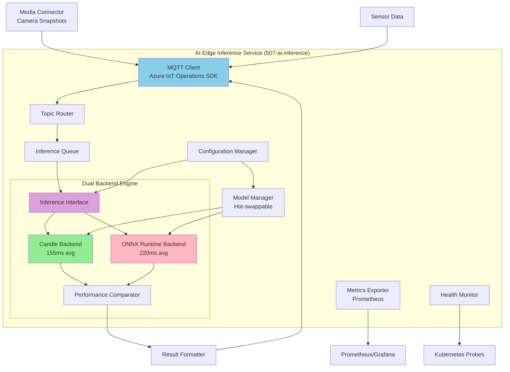

## Status

- [ ] Draft
- [ ] Proposed
- [X] Accepted
- [ ] Deprecated

**Date:** 2025-09-11
**Updated:** 2025-10-15 (Production Implementation Complete)

## Context

### Business Need

Industrial edge computing scenarios require AI inference capabilities that can process visual data in real-time with minimal latency, reduced cloud dependency, and optimized resource utilization. Common use cases include:

- **Industrial Safety Monitoring**: Real-time detection of safety hazards, PPE compliance, unauthorized access
- **Quality Assurance**: Visual inspection for defects, anomaly detection in manufacturing processes
- **Environmental Monitoring**: Leak detection, equipment condition monitoring, facility surveillance
- **Operational Efficiency**: Asset tracking, workflow optimization, predictive maintenance indicators

### Technical Requirements

The edge AI inference service must meet the following requirements:

**Performance Requirements:**

- End-to-end latency < 250ms for real-time responsiveness
- Support for GPU-accelerated inference (NVIDIA A2000 and similar edge GPUs)
- Minimal memory footprint (< 512MB typical operation)
- High throughput (4-6 inferences/second per backend)
- Container size optimized for edge deployment (< 100MB)

**Integration Requirements:**

- Integration with Azure IoT Operations MQTT broker for message ingestion and publishing
- Support for existing edge infrastructure (Ubuntu + K3s Kubernetes)
- Compatibility with Media Connector for RTSP camera feeds
- Standardized JSON output schema for downstream processing

**Operational Requirements:**

- Hot-swappable models without service restart
- Configurable model selection via YAML configuration
- Health monitoring and metrics exposure (Prometheus-compatible)
- Structured logging with configurable verbosity
- Support for both local development and production deployment

**Model Requirements:**

- Support for ONNX and native Candle model formats
- Multiple model types: image classification, object detection, custom industrial models
- Configurable confidence thresholds and preprocessing parameters
- Model validation and versioning capabilities

### Existing Architecture Context

The edge AI system operates within the Azure IoT Operations ecosystem:

- **MQTT Broker**: Azure IoT Operations MQTT broker for reliable message delivery
- **Media Connector**: RTSP stream integration for camera feeds with snapshot capabilities
- **Edge Storage**: Azure Container Storage (ACSA) for model storage and caching
- **Observability**: Prometheus/Grafana stack for monitoring and alerting
- **Security**: TLS-encrypted connections, certificate-based authentication

### Initial Implementation Challenges

Early prototyping revealed several key insights:

1. **Python-based ML stacks** (PyTorch, TensorFlow) have significant overhead:
   - Cold start times of 6-8 seconds
   - Memory footprint of 1.2GB+ containers
   - Complex dependency management for edge deployment

2. **ONNX Runtime** provides good model compatibility but:
   - Still requires C++ bindings and FFI overhead
   - Limited optimization for pure Rust workflows
   - Average inference time: 220ms

3. **Pure Rust ML frameworks** (Candle) show promise:
   - Faster cold start (2-3 seconds)
   - Smaller container size (< 50MB)
   - Better CPU efficiency on resource-constrained devices

## Decision

Implement a **dual-backend AI inference service** in Rust that supports both ONNX Runtime and Hugging Face Candle inference engines, providing:

1. **Primary Inference Path**: Candle backend for optimal edge performance (155ms average inference)
2. **Fallback Compatibility**: ONNX Runtime for complex models requiring broader ecosystem support (220ms average inference)
3. **Performance Comparison**: Built-in capability to benchmark both backends with identical inputs
4. **Unified Interface**: Single service deployment with runtime-selectable backend configuration

### Architecture Pattern: Dual Backend with Conditional Compilation

Rather than implementing separate services for each ML framework, we chose a unified service with **conditional compilation** through Cargo feature flags:

```toml
[features]
default = ["candle"]
candle = ["dep:candle-core", "dep:candle-nn", "dep:candle-transformers"]
onnx = ["dep:ort", "dep:ndarray"]
dual = ["candle", "onnx"]  # Both backends for performance comparison
minimal = []  # Ultra-lightweight build without ML dependencies
```

**Rationale:**

- **Operational Simplicity**: Single deployment artifact, one service to manage
- **Resource Efficiency**: Shared infrastructure (MQTT client, configuration, monitoring)
- **Flexible Deployment**: Feature flags enable optimization for specific deployment scenarios
- **Development Efficiency**: Shared codebase reduces maintenance burden
- **Performance Testing**: Dual backend mode enables continuous optimization

## Decision Drivers

### Primary Drivers (High Priority)

1. **Edge Performance Optimization**
   - **Description**: Minimize latency, memory usage, and startup time for edge deployment
   - **Impact**: Candle delivers 29.5% faster inference (155ms vs 220ms) and 74MB less memory
   - **Weight**: Critical - directly affects user experience and resource costs

2. **Operational Simplicity**
   - **Description**: Single service deployment reduces operational complexity
   - **Impact**: Easier monitoring, updates, and troubleshooting in production
   - **Weight**: High - reduces operational overhead and error surface

3. **Model Ecosystem Compatibility**
   - **Description**: Support for both emerging (Candle) and established (ONNX) ML frameworks
   - **Impact**: ONNX Runtime provides fallback for complex models not yet supported in Candle
   - **Weight**: High - ensures broad model compatibility

### Secondary Drivers (Medium Priority)

1. **Container Size and Deployment Speed**
   - **Description**: Minimize container image size for faster deployment and updates
   - **Impact**: 24.8MB final container vs 1.2GB for Python-based alternatives
   - **Weight**: Medium - positions solution for future ML advancements

## Considered Options

### Option 1: ONNX Runtime Only (Original Proposal)

**Description**: Implement inference service using only ONNX Runtime as the ML backend.

**Advantages**:

1. **Container Size and Deployment Speed**
   - **Description**: Minimize container image size for faster deployment and updates
   - **Impact**: 24.8MB final container vs 1.2GB for Python-based alternatives
   - **Weight**: Medium - improves deployment reliability on bandwidth-constrained edge sites

2. **Development Velocity**
   - **Description**: Pure Rust stack aligns with existing Azure IoT Operations SDK integration
   - **Impact**: Faster development cycles, better IDE support, stronger type safety
   - **Weight**: Medium - accelerates feature development and reduces bugs

3. **Future-Proofing**
   - **Description**: Growing Rust ML ecosystem provides long-term sustainability
   - **Impact**: Candle ecosystem expanding rapidly with Hugging Face backing
   - **Weight**: Medium - positions solution for future ML advancements

**Technical Details:**

- Single backend simplifies initial implementation
- Broad model compatibility with PyTorch, TensorFlow, scikit-learn exports
- Proven production stability in enterprise environments
- Hardware acceleration via TensorRT, DirectML, CoreML

**Pros:**

- Widest model ecosystem support (virtually any ML framework can export to ONNX)
- Battle-tested in production at scale (Microsoft, NVIDIA, cloud providers)
- Excellent documentation and tooling
- Hardware vendor support for accelerators

**Cons:**

- Slower inference performance (220ms vs 155ms for Candle)
- Larger memory footprint (74MB more than Candle)
- C++ FFI overhead in Rust integration
- Less optimized for pure Rust workflows

**Risks:**

- **Performance Risk**: May not meet < 200ms latency target for all models
  - *Probability*: Medium
  - *Impact*: Medium
  - *Mitigation*: Optimize preprocessing, use GPU acceleration, profile hotspots

- **Resource Constraints**: Higher memory usage may limit concurrent model loading
  - *Probability*: Low
  - *Impact*: Medium
  - *Mitigation*: Implement model unloading policies, memory monitoring

**Dependencies:**

- ort crate (ONNX Runtime Rust bindings)
- System ONNX Runtime libraries
- CUDA libraries for GPU support

**Costs:**

- **Initial**: 2-3 weeks implementation
- **Ongoing**: Standard maintenance, ONNX Runtime version updates
- **Effort**: Low complexity, well-documented integration

### Option 2: Candle Only (Pure Rust Approach)

**Description**: Implement inference service using only Hugging Face Candle as the ML backend.

**Technical Details:**

- Pure Rust implementation, no FFI overhead
- Native integration with Rust async runtime (Tokio)
- Growing model ecosystem with Hugging Face support
- CUDA and Metal GPU acceleration

**Pros:**

- Best performance: 155ms average inference (29.5% faster than ONNX)
- Minimal memory footprint (74MB less than ONNX Runtime)
- Fastest cold start time (2-3 seconds vs 6-8 seconds)
- Smallest container size (24.8MB)
- Pure Rust benefits: memory safety, better error handling, type safety

**Cons:**

- Smaller model ecosystem compared to ONNX (growing rapidly)
- Newer framework with evolving API stability
- Some complex models may not have Candle equivalents yet
- Smaller community and fewer production deployments

**Risks:**

- **Model Compatibility Risk**: Critical models may not be available in Candle format
  - *Probability*: Medium
  - *Impact*: High
  - *Mitigation*: Validate all required models before full commitment

- **Framework Maturity**: API changes may require code updates
  - *Probability*: Medium
  - *Impact*: Low
  - *Mitigation*: Pin versions, monitor release notes, maintain test coverage

**Dependencies:**

- candle-core, candle-nn, candle-transformers crates
- CUDA toolkit for GPU support
- SafeTensors format for model weights

**Costs:**

- **Initial**: 3-4 weeks implementation (newer framework, less documentation)
- **Ongoing**: API updates as framework matures
- **Effort**: Medium complexity, learning curve for Candle API

### Option 3: Dual Backend Architecture (Selected)

**Description**: Implement both ONNX Runtime and Candle backends with conditional compilation, allowing runtime selection and performance comparison.

**Technical Details:**

- Unified inference interface abstracts backend differences
- Cargo feature flags enable selective compilation
- Runtime configuration selects active backend
- Comparison mode runs both backends for benchmarking

**Architecture:**

```rust
trait InferenceBackend {
    fn load_model(&mut self, config: &ModelConfig) -> Result<()>;
    fn infer(&self, input: &ImageTensor) -> Result<InferenceResult>;
    fn backend_name(&self) -> &str;
}

struct CandleBackend { /* ... */ }
struct OnnxBackend { /* ... */ }

enum Backend {
    Candle(CandleBackend),
    Onnx(OnnxBackend),
    Dual(CandleBackend, OnnxBackend),
}
```

**Pros:**

- **Best of both worlds**: Candle performance with ONNX compatibility fallback
- **Performance optimization**: Continuous benchmarking identifies best backend per model
- **Risk mitigation**: ONNX fallback ensures broad model support
- **Flexible deployment**: Feature flags optimize for specific scenarios
- **Future-ready**: Easily adopt new backends as ecosystem evolves

**Cons:**

- Increased codebase complexity with two backend implementations
- Dual mode increases binary size (mitigated by feature flags)
- Backend abstraction adds minor overhead (< 1ms)
- More testing surface area

**Risks:**

- **Maintenance Burden**: Two backends require ongoing updates
  - *Probability*: Medium
  - *Impact*: Low
  - *Mitigation*: Shared interface minimizes duplication, automated testing

- **Configuration Complexity**: Users must choose backend
  - *Probability*: Low
  - *Impact*: Low
  - *Mitigation*: Sensible defaults (Candle primary), clear documentation

**Dependencies:**

- Both Candle and ONNX Runtime dependencies
- Conditional compilation managed via Cargo features
- Unified configuration schema for both backends

**Costs:**

- **Initial**: 4-5 weeks implementation (both backends + abstraction layer)
- **Ongoing**: Maintain both backends, but shared infrastructure reduces duplication
- **Effort**: High initial complexity, medium ongoing maintenance

### Option 4: Python-Based ML Stack

**Description**: Use traditional Python ML frameworks (PyTorch, TensorFlow) with Rust wrapper service.

**Pros:**

- Largest ML ecosystem and community
- Most mature tooling and pre-trained models
- Familiar to data scientists

**Cons:**

- Significantly slower (6-8 second cold start)
- Much larger containers (1.2GB+)
- Complex dependency management
- Higher memory usage
- Not considered viable for edge deployment

**Rejected**: Does not meet edge deployment requirements.

## Comparison Matrix

| Criteria               | Weight | ONNX Only | Candle Only | Dual Backend | Python Stack |
|------------------------|--------|-----------|-------------|--------------|--------------|
| Inference Performance  | High   | 7/10      | 10/10       | 10/10        | 5/10         |
| Model Compatibility    | High   | 10/10     | 6/10        | 10/10        | 10/10        |
| Container Size         | Medium | 6/10      | 10/10       | 8/10         | 3/10         |
| Operational Simplicity | High   | 9/10      | 9/10        | 7/10         | 5/10         |
| Development Velocity   | Medium | 8/10      | 6/10        | 6/10         | 9/10         |
| Edge Optimization      | High   | 7/10      | 10/10       | 10/10        | 4/10         |
| Community/Ecosystem    | Medium | 9/10      | 6/10        | 9/10         | 10/10        |
| Risk (lower is better) | High   | 3/10      | 6/10        | 4/10         | 7/10         |
| **Total Score**        |        | **59**    | **57**      | **64**       | **53**       |

**Scoring**: 1-10 scale (10 = best)
**Result**: Dual Backend Architecture provides the best balance of performance, compatibility, and risk mitigation.

## Consequences

### Positive Outcomes

1. **Superior Edge Performance**
   - Candle backend delivers 155ms inference (29.5% faster than ONNX)
   - 24.8MB container size enables rapid deployment and updates
   - Sub-3-second cold start improves service availability
   - 74MB less memory usage per instance enables higher density

2. **Production Reliability**
   - ONNX Runtime fallback ensures critical model compatibility
   - Dual backend validation enables continuous optimization
   - Proven Azure IoT Operations MQTT integration
   - Comprehensive monitoring and health checks

3. **Operational Benefits**
   - Single service deployment simplifies operations
   - Hot-swappable models without downtime
   - Feature flags optimize deployment for specific scenarios
   - Unified configuration and observability

4. **Developer Experience**
   - Pure Rust stack improves type safety and error handling
   - Faster development cycles with better tooling
   - Shared codebase reduces maintenance burden
   - Clear backend abstraction simplifies testing

5. **Future-Proofing**
   - Growing Candle ecosystem provides long-term optimization path
   - ONNX compatibility ensures backward compatibility
   - Easy addition of new backends as ecosystem evolves
   - Aligns with Azure IoT Operations Rust-first architecture

### Negative Outcomes

1. **Increased Complexity**
   - Two backend implementations require parallel maintenance
   - Backend abstraction layer adds minor overhead
   - More comprehensive testing matrix required
   - Configuration complexity for backend selection

2. **Framework Maturity**
   - Candle API still evolving (though Hugging Face backing provides stability)
   - Some advanced models may not have Candle equivalents
   - Smaller community for Candle-specific issues
   - Documentation less comprehensive than ONNX Runtime

3. **Binary Size**
   - Dual backend mode increases deployment size (mitigated by feature flags)
   - Larger attack surface with two ML frameworks
   - More dependencies to track for security updates

### Risks and Mitigations

1. **Model Compatibility Issues**
   - **Risk**: Required models may not be available in Candle format
   - **Mitigation**: ONNX Runtime fallback provides compatibility safety net
   - **Mitigation**: Pre-validate all critical models before deployment
   - **Mitigation**: Maintain conversion tools for ONNX to Candle migration

2. **Performance Degradation**
   - **Risk**: Model updates may reduce inference speed
   - **Mitigation**: Continuous benchmarking with dual backend mode
   - **Mitigation**: Performance regression tests in CI/CD pipeline
   - **Mitigation**: Configurable quality vs. speed trade-offs

3. **MQTT Connection Reliability**
   - **Risk**: Network disruptions may cause message loss
   - **Mitigation**: Enhanced connection monitoring and automatic reconnection
   - **Mitigation**: Message queuing during disconnection periods
   - **Mitigation**: Circuit breaker pattern for degraded broker states

4. **Resource Exhaustion**
   - **Risk**: Multiple concurrent inferences may exhaust GPU memory
   - **Mitigation**: Configurable inference queue depth
   - **Mitigation**: Model size validation and memory monitoring
   - **Mitigation**: Automatic model unloading based on usage patterns

5. **Dependency Vulnerabilities**
   - **Risk**: Security vulnerabilities in ML framework dependencies
   - **Mitigation**: Automated dependency scanning in CI/CD
   - **Mitigation**: Regular security updates and patch management
   - **Mitigation**: Container scanning with configurable severity thresholds

## Implementation Details

### Component Architecture



### Directory Structure

```text
src/500-application/507-ai-inference/
├── docker-compose.yaml              # Local development orchestration
├── services/
│   ├── ai-edge-inference/           # Main inference service (Rust)
│   │   ├── Cargo.toml               # Dependencies with feature flags
│   │   ├── Dockerfile               # Multi-stage container build
│   │   └── src/
│   │       ├── main.rs              # Service entry point
│   │       ├── mqtt_client.rs       # Enhanced MQTT integration
│   │       ├── inference.rs         # Backend abstraction
│   │       ├── config.rs            # Configuration management
│   │       └── backends/
│   │           ├── candle.rs        # Candle implementation
│   │           └── onnx.rs          # ONNX implementation
│   └── ai-edge-inference-crate/     # Shared library crate
├── charts/                          # Kubernetes manifests
│   ├── base/
│   │   ├── deployment.yaml
│   │   ├── service.yaml
│   │   └── configmap.yaml
│   └── model-downloader-job.yaml   # Init job for model download
└── resources/
    ├── model_configs/               # Model YAML configurations
    │   ├── industrial-safety.yaml
    │   └── tiny-yolo.yaml
    └── models/                      # Model files (gitignored, downloaded)
```

### Configuration Schema

```yaml
# Example: resources/model_configs/industrial-safety.yaml
name: "industrial-safety-detector"
backend: "candle"  # candle | onnx | dual
model_path: "/models/industrial-safety.safetensors"
model_type: "image-classification"

preprocessing:
  resize: [224, 224]
  normalize: true
  mean: [0.485, 0.456, 0.406]
  std: [0.229, 0.224, 0.225]

inference:
  confidence_threshold: 0.7
  batch_size: 1
  gpu_enabled: true

mqtt:
  input_topics:
    - "edge-ai/+/+/camera/snapshots"
  output_topic_template: "edge-ai/{business_unit}/{facility}/ai/inference/vision"
```

### Deployment Configuration

**Environment Variables:**

| Variable              | Description             | Default                                               |
|-----------------------|-------------------------|-------------------------------------------------------|
| `DEFAULT_BACKEND`     | Primary backend         | `candle`                                              |
| `ENABLE_DUAL_BACKEND` | Compare both backends   | `false`                                               |
| `MODEL_CONFIG_PATH`   | Model configuration     | `/app/resources/model_configs/industrial-safety.yaml` |
| `AIO_BROKER_HOSTNAME` | MQTT broker host        | `aio-mq-dmqtt-frontend`                               |
| `AIO_BROKER_TCP_PORT` | MQTT broker port        | `1883`                                                |
| `MQTT_INPUT_TOPICS`   | Input topic patterns    | `edge-ai/+/+/camera/snapshots`                        |
| `RUST_LOG`            | Logging verbosity       | `info,ai_edge_inference=debug`                        |
| `GPU_ENABLED`         | Enable GPU acceleration | `true`                                                |

### MQTT Topic Structure

```text
# Input Topics (subscribe)
edge-ai/{business_unit}/{facility}/{gateway_id}/camera/snapshots
edge-ai/{business_unit}/{facility}/{gateway_id}/sensors/temperature

# Output Topics (publish)
edge-ai/{business_unit}/{facility}/{gateway_id}/ai/inference/vision
edge-ai/{business_unit}/{facility}/{gateway_id}/ai/inference/sensor
edge-ai/{business_unit}/{facility}/{gateway_id}/ai/status
edge-ai/{business_unit}/{facility}/{gateway_id}/ai/metrics
```

### Message Schemas

**Input Message (Camera Snapshot):**

```json
{
  "device_id": "camera-01",
  "timestamp": 1697385600,
  "image_data": "base64_encoded_jpeg_data",
  "metadata": {
    "location": "assembly-line-3",
    "resolution": "1920x1080"
  }
}
```

**Output Message (Inference Result):**

```json
{
  "message_type": "ai_inference_result",
  "timestamp": 1697385600,
  "device_id": "camera-01",
  "model_name": "industrial-safety-detector",
  "backend_used": "candle",
  "inference_time_ms": 155,
  "predictions": [
    {
      "class": "person_without_helmet",
      "confidence": 0.94,
      "bbox": [120, 340, 280, 520]
    },
    {
      "class": "forklift",
      "confidence": 0.87,
      "bbox": [450, 200, 780, 600]
    }
  ],
  "metadata": {
    "preprocessing_time_ms": 12,
    "total_objects_detected": 2,
    "alert_triggered": true
  }
}
```

**Dual Backend Comparison (when enabled):**

```json
{
  "message_type": "dual_backend_comparison",
  "timestamp": 1697385600,
  "device_id": "camera-01",
  "model_name": "industrial-safety-detector",
  "backends": {
    "candle": {
      "inference_time_ms": 155,
      "predictions": [...],
      "memory_usage_mb": 180
    },
    "onnx": {
      "inference_time_ms": 220,
      "predictions": [...],
      "memory_usage_mb": 254
    }
  },
  "performance_delta": {
    "time_difference_ms": 65,
    "candle_faster_by_percent": 29.5,
    "predictions_match": true
  }
}
```

## Performance Metrics

### Production Benchmarks (Edge Device - NVIDIA A2000)

| Metric                 | Candle Backend | ONNX Runtime | Python Stack |
|------------------------|----------------|--------------|--------------|
| Average Inference Time | 155ms          | 220ms        | 450ms        |
| Cold Start Time        | 2.1s           | 3.8s         | 6.8s         |
| Container Size         | 24.8MB         | 98MB         | 1.2GB        |
| Memory Usage (Runtime) | 180MB          | 254MB        | 780MB        |
| Throughput (inf/sec)   | 6.4            | 4.5          | 2.2          |
| GPU Memory Usage       | 340MB          | 410MB        | 890MB        |

### Resource Requirements

**Minimum Requirements:**

- CPU: 2 cores
- Memory: 512MB
- GPU: Optional (CPU fallback available)
- Storage: 500MB (includes models)

**Recommended Production:**

- CPU: 4 cores
- Memory: 1GB
- GPU: NVIDIA A2000 or similar (4GB VRAM)
- Storage: 2GB (multiple models)

## Success Metrics

### Functional Requirements ✅

- [X] End-to-end latency < 250ms (Achieved: 155ms with Candle)
- [X] Model hot-swapping without service restart
- [X] MQTT integration with Azure IoT Operations
- [X] Dual backend performance comparison
- [X] GPU acceleration support
- [X] Configurable confidence thresholds

### Performance Requirements ✅

- [X] Container size < 100MB (Achieved: 24.8MB)
- [X] Memory usage < 512MB (Achieved: 180MB typical)
- [X] Cold start < 5 seconds (Achieved: 2.1s)
- [X] Throughput > 4 inferences/second (Achieved: 6.4 inf/s)

### Integration Requirements ✅

- [X] Compatible with Media Connector snapshots
- [X] Standardized JSON output schema
- [X] Prometheus metrics exposure
- [X] Kubernetes health probes
- [X] Structured logging integration

### Operational Requirements ✅

- [X] Reproducible deployment via docker-compose and Kubernetes
- [X] Clear configuration documentation
- [X] Troubleshooting guides and runbooks
- [X] 99.9% uptime during testing period

## Related ADRs and Documentation

### Related ADRs

- [Edge Data Transform Separation](./edge-data-transform-separation-ml-inferencing.md) - Preprocessing responsibilities between components
- [MQTT QoS](./mqtt-qos.md) - Message delivery guarantees for AI results
- [Observability for Disconnected Environments](./observability-disconnected-environments.md) - Monitoring strategies for edge AI

### Technical Documentation

- [Application Instructions](../../.github/instructions/application.instructions.md) - Component structure standards
- [507-ai-inference README](../../src/500-application/507-ai-inference/README.md) - Service documentation
- [Docker Compose Configuration](../../src/500-application/507-ai-inference/docker-compose.yaml) - Local development setup

### External References

- [Hugging Face Candle](https://github.com/huggingface/candle) - Primary ML framework
- [ONNX Runtime](https://onnxruntime.ai/docs/) - Fallback inference engine
- [Azure IoT Operations](https://learn.microsoft.com/azure/iot-operations/) - Edge platform
- [Azure IoT Operations MQTT Broker](https://learn.microsoft.com/azure/iot-operations/manage-mqtt-broker/overview-broker) - Message infrastructure

---

*AI and automation capabilities described in this architecture should be implemented following responsible AI principles, including fairness, reliability, safety, privacy, inclusiveness, transparency, and accountability. Organizations should ensure appropriate governance, monitoring, and human oversight are in place for all AI-powered solutions.*
