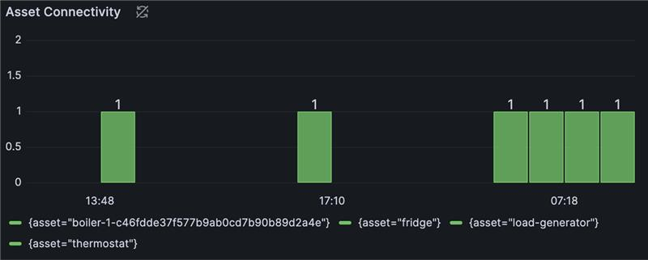

# Asset Connectivity Monitoring

Date: 2024-03-27

## Status

[For this library of ADRs, mark the most applicable status at which it was stored in the original project. This can help provide context and validity for folks reviewing this ADR. If it has been deprecated you can add a note on why and date it.]

- [ ] Draft
- [X] Proposed
- [ ] Accepted
- [ ] Deprecated

## Context

Assets' connectivity state can change due to downtime of the devices or network issues. The
operator needs to be informed about the connectivity state of the assets to ensure the
devices are operational and the data is available.
Additionally subsystems depending on OT data from the devices can be notified about the
connectivity state of the assets and trigger the necessary and relevant actions.

## Decision

The connectivity state of the assets will be monitored and displayed in a user-friendly way in a Grafana dashboard.

## Decision Drivers

- We want to achieve transparency about the connectivity state of the assets
- We want to make the connectivity state available in the Local and Enterprise UNS and for subsystems

## Considered Options

There are different ways to monitor the connectivity state of the assets:

a. display the connectivity state in a Grafana dashboard on the factory floor
b. publish the connectivity state to an MQTT broker and make it available in the Local and Enterprise UNS

## Decision Conclusion

OPC UA Broker can log connectivity state of an asset and needs to be configured to expose the logs. Configure observability as documented, and ensure you install Azure IoT Operations OPC UA broker with the setting `connectors.values.openTelemetry.endpoints.default.emitLogs=true`.

```sh
az iot ops create --cluster <> --resource-group <> --name <> \
    --otherparams <...> \
    --ops-config observability.metrics.openTelemetryCollectorAddress=<> \
    --ops-config connectors.values.openTelemetry.endpoints.default.emitLogs=true
```

Since the OPC UA Broker utilizes OpenTelemetry, we can simply define an OpenTelemetry overlay configuration to setup a pipeline that emits logs to [loki](https://github.com/open-telemetry/opentelemetry-collector-contrib/tree/main/exporter/lokiexporter#readme).


A good starting point is the repository [azure-edge-extensions-aio-observability-gitops](https://github.com/Azure-Samples/azure-edge-extensions-aio-observability-gitops) which contains the necessary configuration files to setup the OpenTelemetry Collector and Loki.

### Installation

Leverage the sample repo [azure-edge-extensions-aio-observability-gitops Readme](https://github.com/Azure-Samples/azure-edge-extensions-aio-observability-gitops?tab=readme-ov-file#getting-started) and follow the Installation and Quickstart steps to configure a sample environment.

### Loki Configuration

Loki can be used as a datasource in a Grafana dashboard to display the connectivity state of the assets. So you can use **logQL** to query the logs and to make them available in visualizations. You can refer to the [Loki documentation](https://grafana.com/docs/loki/latest/) for more details.

1. Add the Loki datasource to Grafana, if you are using the sample referenced above this will already be configured. More details can be found in the [Grafana documentation](https://grafana.com/docs/grafana/latest/datasources/loki/).

2. Create a new dashboard in Grafana and add a new panel to display the connectivity state of the assets. You can use the following query to display the logs:

```logQL
sum by(asset) (
  max_over_time(
    {job="azure-iot-operations/opcua-connector"} |= `Session for asset` 
    | pattern `<_>Session for asset <asset>/<_> is <connectivityState>"<_>` 
    | label_format connectivity=`{{ if eq "connected" .connectivityState }}1{{else}}0{{end}}` 
    | unwrap connectivity [$__interval]
  )
)
```

An example **Asset Connectivity** panel:


