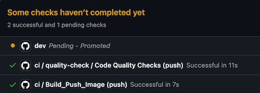

# CI/CD. Multi-Environment Promotional Flow with GitOps

Date: **2024-06-27**

## Status

- [ ] Draft
- [ ] Proposed
- [X] Accepted
- [ ] Deprecated

## Context

CI/CD flow is an essential part of a software development lifecycle regardless of the chosen technologies, build and deployment techniques.
It ensures continuous integration and promotes application changes across environments.
This ADR outlines the concepts and implementation specifics of the CI/CD flow utilizing GitOps.

## Concept

Application developers write their code and debug and test it both locally and on the development environment.
The code is stored in the Source Code Git repository and includes the actual source code along with descriptors for building and deploying the application.
These descriptors typically include a Dockerfile and manifest templates. The Dockerfile is used by the CI pipeline to build a Docker image,
while the manifest templates are used by the CD process to deploy the application across multiple environments in a multistage fashion.

The CD process takes templates from a Source Code repository and generates manifests for each environment, referencing a Docker image
and containing environment-specific variable values. These manifests are stored in the Manifests GitOps repository, organized by branches or folders,
and declaratively describe the desired state of the application in Kubernetes clusters for each environment.
A GitOps operator running on each cluster reconciles the current state with the desired state by applying these manifests.

The entire loop is closed by monitoring which application versions are deployed on which clusters and when.

Due to the pull-based, asynchronous nature of GitOps deployments, the GitOps CD flow is inherently more complex than traditional push-based implementations.
It aims to address the following challenges:

- **Visibility**: It is crucial to have a clear view of the entire CI/CD flow and to be able to determine its current state at any given time.
- **Promotion**: A key capability of a CD flow is to promote a new change to the next environment only after it has been successfully validated in the previous environment.

## Implementation

This ADR provides a CI/CD flow implementation with a chain of GitHub Action workflows.

### Repositories

The entire flow is based on three GitHub repositories: *Source Code*, *Config* and *GitOps*.

- *Source Code* repository contains the application source code along with a Docker file and manifest templates, such as Helm charts.
- *Config* repository contains environment-specific [application configuration](https://learn.microsoft.com/en-us/azure/azure-arc/kubernetes/conceptual-workload-management#application-configurations) values.
These configurations are application-centric, such as logging levels, number of replicas, feature flags, localizations, etc.
Refer to [Define application configurations](https://github.com/microsoft/kalypso/blob/main/cicd/setup.md#define-application-configurations) for more details on the *Config* repository structure.
- *GitOps* repository contains the application manifests ready for deployment in each environment.

### CI

The *ci* workflow is triggered by a commit to the main branch.
It executes standard CI procedures, including linting, security scanning, code analysis, unit testing, and building and pushing Docker images.
The Docker image is tagged with a SemVer version number (e.g., *0.0.1-18*),
where *0.0.1* represents the current application version and *18* is the build number. Additionally, the new Docker image is tagged with the *latest* tag.

At the end, the *ci* workflow updates the GitHub commit status to *ci/Build_Push_Image* and triggers the *deploy* workflow,
passing the commit ID, environment name, and image tag as parameters.

### Deploy

The *deploy* workflow takes Helm manifest templates from the source repository based on the source commit ID.
It generates Kubernetes manifests by applying configuration values from the *Config* repository, using the branch corresponding to the current environment (e.g., *dev*).
Once the manifests are generated, the workflow creates a PR to the GitOps repository on the relevant environment branch (e.g., *dev*).

The workflow updates the Git commit with the status *{env} Promoted*, specifying that the change has been promoted to the environment.

The GitOps repository is read-only for humans. All PRs to the GitOps repository are generated by the
CI/CD process to ensure that the repository content is derived from the source and config repositories.
This approach guarantees that all CI best practices, such as security scanning, checks, and code quality validation, are applied.
Each branch in the GitOps repository represents an environment and is configured with protection rules and approving personas.

Additionally, PRs to the GitOps repository are automatically checked with scanning tools to enforce Kubernetes security best practices.

Refer to *GitOps Security Plan* for more details on security consideration with GitOps.

### Notify on PR

The *notify-on-pr* workflow is triggered when the PR with the manifests is merged to the environment branch in the GitOps repository.
It notifies the source repository, which serves as the main orchestrator of the CD flow, by invoking the *post-deployment* workflow.

### Post Deployment

The *post-deployment* workflow checks if the deployment is successful across all clusters, subscribed on this change.
This workflow polls Azure Resource Graph, waiting until all registered GitOps configurations are in compliance with the GitOps commit id.

If one of the clusters reports a failure, the workflow fails. It updates the Git commit status in the source repository as failed and the whole promotion flow stops.

Once all configurations are compliant, the workflow updates the source commit id with *{env} Deployed {GitOps commitid}* status.

The workflow checks if the change that started the CD should be promoted (e.g. originated in *main*) to the next environment and if the next environment is configured.
It starts a new cycle by triggering the deploy workflow for the next environment.
The whole process stops when there is no next environment in the chain.

### Notify on Config Change

The *notify-on-config-change* workflow is triggered when the PR with configuration values change is merged to the environment in the *Config* repository.
It notifies the source repository to regenerate manifests for this environment by invoking the *deploy* workflow, passing the environment name as a parameter.
Since it is an environment specific configuration change, it is not promoted to the next environment.

## Future Considerations

The related topics are highlighted in separate ADRs:

- GitOps operator. Azure Arc GitOps vs Flux vs ArgoCD
- Workload and Configuration Management
- Deployment Observability
- Secret Management on the Edge with GitOps
- GitOps Security Plan
