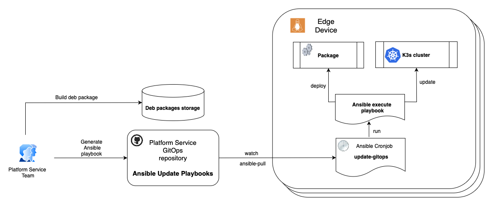

## Status

- [ ] Draft
- [ ] Proposed
- [X] Accepted
- [ ] Rejected
- [ ] Deprecated

## Context

To consistently and effectively uncover and maximize the value of new and existing AI/ML workloads on the edge, a dependable and resilient edge environment is essential.
Each edge device consists of the operating system, such as Azure Linux, and the runtime platform, such as a K3s Kubernetes cluster.
These device components need to be periodically updated, configured, and monitored. At scale, with tens of application versions coupled with hundreds of Edge devices, a reliable solution is required to provide these capabilities efficiently.

## Decision

[Option 1. Arc for servers](#1-arc-for-servers) - Ongoing maintenance and configuration will be facilitated via Azure (ex: Azure Policy) enabled with Arc.

## Capabilities

The evaluation of available options has been done with regards to the following capabilities:

| Capability                     | Description                                                                                                                                                |
|--------------------------------|------------------------------------------------------------------------------------------------------------------------------------------------------------|
| OS Updates                     | Deliver comprehensive OS updates across the entire fleet of Edge devices, including package version upgrades, security patches, and configuration changes. |
| Platform (K3s) Updates         | Deliver Kubernetes updates across the entire fleet of Edge devices.                                                                                        |
| Observability                  | OS and platform level observability.                                                                                                                       |
| Troubleshooting/Ad-hoc Control | Provide on-demand troubleshooting capabilities for edge devices.                                                                                           |
| Access Management              | Ensure proper access controls and permissions are enforced for device to remote resources.                                                                 |
| Support for Scale              | Handle many edge devices.                                                                                                                                  |

## Considered options

### 1. Arc (for Servers)

This solution uses [Azure Arc for Servers](https://learn.microsoft.com/azure/azure-arc/servers/overview) to extend the capabilities of Azure to edge devices by utilizing an agent that is installed on the device to connect it to Azure.
Configuration and management of edge devices may then be facilitated through the Azure control plane via Azure Policy and other Azure management tools.

#### Arc (for Servers): Capabilities matching

| Capability                     | Support | Comments                                                                                                                                                   |
|--------------------------------|---------|------------------------------------------------------------------------------------------------------------------------------------------------------------|
| OS Updates                     | ✅       | Standard cloud operations are available to facilitate OS updates (Azure Arc extensions, Azure Update Manager, Azure Automation, etc.)                      |
| Platform (K3s) Updates         | ✅       | Platform updates can be achieved through similar mechanisms to OS updates.                                                                                 |
| Observability                  | 🟡      | The connected machine agent itself does not provide observability features, but provides the ability to deploy Azure Monitor Agent onto connected devices. |
| Troubleshooting/Ad-hoc Control | ✅       | Provides direct access to connected machines for troubleshooting or other manual tasks (eg: service restarts)                                              |
| Access Management              | ✅       | Allows use of Entra for access management.                                                                                                                 |
| Support for Scale              | ✅       | No other scale limits apply beyond standard Azure resource limits.                                                                                         |

#### Arc (for Servers): Concerns

- This solution assumes there are edge workloads that require continuous and ongoing management from the cloud. Alternate solutions may be necessary for workloads that do not fit this model.
- There is limited support for ARM architectures, which may impact compatibility with certain edge devices.

### 2. GitOps and Ansible

This solution leverages the [ansible-pull](https://docs.ansible.com/ansible/latest/cli/ansible-pull.html) command, enabling devices to fetch and execute playbooks directly from a Git repository.
Similar to GitOps operators in Kubernetes, this approach ensures that Ansible playbooks are centrally stored, version-controlled, and executed independently on each device.
By utilizing a cron scheduler, devices asynchronously pull and apply configurations, eliminating the need for a centralized push mechanism. This inversion of Ansible's default push-based architecture into a pull-based model provides near-unlimited scalability.



An example of Ansible pull configuration:

```yaml
- hosts: localhost
  tasks:
  - name: update cron job (ansible-pull)
    cron:
      name: apply-gitops-updates
      minute: "*/1"
      user: platform-svc
      job: |
        ansible-pull -o -U https://github.com/kaizentm/platform-svc-gitops -C dev ./os-updates/update.yml > $HOME/os-updates.log 2>$HOME/os-updates.err
```

#### GitOps and Ansible: Capabilities matching

| Capability                     | Support | Comments                                                                                                                                                                                     |
|--------------------------------|---------|----------------------------------------------------------------------------------------------------------------------------------------------------------------------------------------------|
| OS Updates                     | ✅       | Platform team is responsible for preparing Ansible playbooks for OS updates and pushing them to the GitOps repository.                                                                       |
| Platform (K3s) Updates         | ✅       | Platform team is responsible for preparing Ansible playbooks for K3s updates and pushing them to the GitOps repository.                                                                      |
| Observability                  | ❌       | The approach itself doesn't provide any OS or platform level observability. It just enables deploying observability components on edge devices.                                              |
| Troubleshooting/Ad-hoc Control | ❌       |                                                                                                                                                                                              |
| Access Management              | ❌       |                                                                                                                                                                                              |
| Support for Scale              | ✅       | Ansible playbooks in the GitOps repositories are grouped by a reasonable number of device types. The actual number of physical edge devices, representing these device types doesn't matter. |

#### GitOps and Ansible: Concerns

- This is a custom solution that requires ongoing maintenance and support by the customer.
- The solution provides only the `transport` layer, responsible for delivering playbooks to edge devices and executing them. Tasks such as preparing, scheduling, and monitoring updates are outside its scope.
- It lacks built-in OS and platform-level observability.
- The `GitOps and Ansible` approach is well-suited for deploying un-containerized workloads. It integrates effectively into a structured SDLC with a promotional CD flow and a properly configured observability stack.

## Consequences

- Azure capabilities will enhance device management at scale.
- Improved efficiency in device updates and compliance monitoring.
- Limited support for ARM64 may impact future decisions around device procurement.
- Data will need to be gathered on throughput from operations via Arc due to limited network bandwidth at stores (4 kbps). These findings may influence the direction of future strategies.
- In any case, careful planning of operations must take place to avoid disruptions.

## References

- [Azure Arc for Servers Overview](https://learn.microsoft.com/azure/azure-arc/servers/overview)
- [Azure Policy Documentation](https://learn.microsoft.com/azure/governance/policy/overview)
- [Azure Update Manager](https://learn.microsoft.com/azure/automation/update-management/overview)
- [Azure Monitor Agent](https://learn.microsoft.com/azure/azure-monitor/agents/azure-monitor-agent-overview)
- [Ansible Pull Documentation](https://docs.ansible.com/ansible/latest/cli/ansible-pull.html)
- [K3s Kubernetes Distribution](https://k3s.io/)
- [Deployment on the Edge with GitOps](./deployment-on-edge-gitops.md)

*AI and automation capabilities described in this scenario should be implemented following responsible AI principles, including fairness, reliability, safety, privacy, inclusiveness, transparency, and accountability. Organizations should ensure appropriate governance, monitoring, and human oversight are in place for all AI-powered solutions.*
