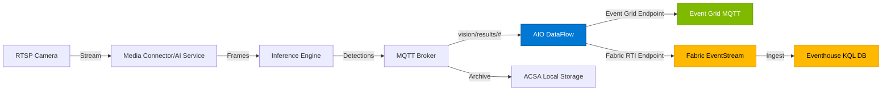
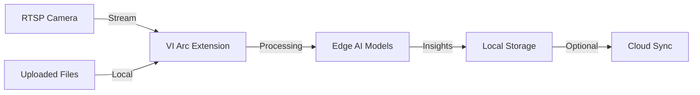

## Executive Summary

This document compares our custom edge AI inference solutions against Azure Video Indexer (VI), analyzing both cloud-based VI and VI enabled by Azure Arc. Our solutions range from simple snapshot-based inference to advanced buffered stream processing, each optimized for different use cases.

**Quick Recommendation Matrix**:

| Requirement | Recommended Solution |
|-------------|---------------------|
| Sub-second object detection latency | **Our Option 2** (Buffered Stream, 50-200ms) |
| Rich multi-modal insights (30+ AI models) | **Azure VI Cloud** (transcription, OCR, faces, emotions, etc.) |
| Edge deployment with data residency | **Azure VI Arc** or **Our Option 1/2** |
| Custom object detection (domain-specific) | **Our Solutions** (trainable YOLOv3/custom models) |
| Budget-constrained deployment | **Our Option 1** (open-source, infrastructure-only costs) |
| Live video with real-time bounding boxes | **Azure VI Arc** (live streams) or **Our Option 2** |
| Uploaded video deep analysis | **Azure VI Cloud** (30+ models, summarization, search) |
| Minimal development effort | **Azure VI Arc/Cloud** (managed service) |

## Solution Overview

### Our Edge AI Inference Solutions

We developed **four architectural approaches** for real-time object detection on edge clusters:

**Option 1: Optimized Snapshot-Based** (Recommended Phase 1)

* **Latency**: 500-1000ms
* **Architecture**: RTSP → Media Connector → MQTT snapshots (0.5s intervals) → AI Inference (YOLOv3)
* **Deployment**: Azure IoT Operations, Kubernetes
* **Models**: YOLOv3-Tiny (80 COCO classes), custom ONNX models
* **Cost**: Infrastructure only (edge nodes, MQTT broker)

**Option 2: Buffered Stream Processing** (Low Latency)

* **Latency**: 50-200ms
* **Architecture**: RTSP → Media Connector → Shared Memory Ring Buffer → AI Inference via gRPC
* **Deployment**: Azure IoT Operations, Kubernetes with pod affinity
* **Models**: Same as Option 1, with frame-level processing
* **Cost**: Infrastructure + development (gRPC implementation)

**Option 3: Direct In-Process Inference** (Lowest Latency)

* **Latency**: 30-100ms
* **Architecture**: RTSP → Media Connector with embedded inference engine
* **Deployment**: Single container, tightly coupled
* **Models**: ONNX Runtime, TensorRT, OpenVINO
* **Cost**: Infrastructure only, simpler deployment

**Option 4: Direct RTSP Connection** (Independent Scaling)

* **Latency**: 50-150ms
* **Architecture**: RTSP Camera → AI Inference (direct connection) + Media Connector (archival)
* **Deployment**: Dual RTSP streams, independent services
* **Models**: AI service implements RTSP client (GStreamer/FFmpeg)
* **Cost**: Infrastructure + higher camera CPU load

**Integration**: All options publish detection results to MQTT, enabling downstream integration with:

* Fabric RTI (real-time cloud analytics)
* Event Grid (event-driven workflows)
* Azure Monitor (observability)

### Azure Video Indexer Solutions

**Azure VI Cloud** (SaaS)

* **Deployment**: Fully managed cloud service
* **Video Sources**: Uploaded files only (no live streams)
* **AI Models**: 30+ models across video, audio, and multimodal analysis
* **Latency**: Minutes to hours (upload + processing)
* **Cost**: Per-minute processing charges + storage

**Azure VI Enabled by Azure Arc** (Hybrid)

* **Deployment**: Arc extension on Kubernetes (validated on Azure Local)
* **Video Sources**: Live streams + uploaded files
* **AI Models**: Subset of cloud models (see feature matrix below)
* **Latency**: Near real-time for live streams
* **Cost**: Arc extension license + infrastructure

## Feature Comparison Matrix

### Video Analysis Capabilities

| Feature | Our Solutions | Azure VI Cloud | Azure VI Arc |
|---------|---------------|----------------|--------------|
| **Object Detection** | ✅ Custom (80 COCO classes) | ✅ General objects + tracking | ✅ General + custom (natural language/image) |
| **People Detection** | ✅ YOLOv3 person class | ✅ Face detection, grouping, tracking | ✅ People + vehicles (first-party) |
| **Custom Objects** | ✅ Train custom ONNX models | ❌ Limited to predefined objects | ✅ Natural language or image-based |
| **Bounding Boxes** | ✅ Real-time overlay | ✅ Post-processing | ✅ Real-time overlay (live) |
| **Object Tracking** | ⚠️ Frame-to-frame (manual) | ✅ Built-in across video | ✅ Built-in |
| **Face Recognition** | ❌ Not implemented | ✅ Celebrity (1M+) + custom | ⚠️ Limited (uploaded only) |
| **OCR (Text Extraction)** | ❌ Not implemented | ✅ Visual text extraction | ❌ Not available |
| **Scene Detection** | ❌ Not implemented | ✅ Scene segmentation | ✅ Available (uploaded) |
| **Shot Detection** | ❌ Not implemented | ✅ Shot changes | ✅ Available (uploaded) |
| **Keyframe Extraction** | ⚠️ Snapshots only | ✅ Intelligent keyframes | ✅ Available (uploaded) |
| **Rolling Credits** | ❌ Not implemented | ✅ Detect start/end credits | ❌ Not available |
| **Slate Detection** | ❌ Not implemented | ✅ Clapperboard, color bars | ❌ Not available |
| **Clothing Detection** | ❌ Not implemented | ✅ Clothing types + featured | ❌ Not available |

### Audio Analysis Capabilities

| Feature | Our Solutions | Azure VI Cloud | Azure VI Arc |
|---------|---------------|----------------|--------------|
| **Speech-to-Text** | ❌ Not implemented | ✅ 50+ languages | ✅ Available (uploaded) |
| **Translation** | ❌ Not implemented | ✅ Many languages | ✅ Available (uploaded) |
| **Speaker Identification** | ❌ Not implemented | ✅ Up to 16 speakers | ❌ Not available |
| **Sentiment Analysis** | ❌ Not implemented | ✅ Speech + visual text | ❌ Not available |
| **Audio Effects** | ❌ Not implemented | ✅ Sirens, gunshots, laughter, etc. | ❌ Not available |
| **Noise Reduction** | ❌ Not implemented | ✅ Telephony/Skype filters | ❌ Not available |
| **Closed Captions** | ❌ Not implemented | ✅ VTT, TTML, SRT | ✅ Available (uploaded) |

### Multimodal & Advanced Features

| Feature | Our Solutions | Azure VI Cloud | Azure VI Arc |
|---------|---------------|----------------|--------------|
| **Keyword Extraction** | ❌ Not implemented | ✅ Speech + visual text | ❌ Not available |
| **Named Entities** | ❌ Not implemented | ✅ Brands, locations, people (NLP) | ❌ Not available |
| **Topic Inference** | ❌ Not implemented | ✅ IPTC, Wikipedia ontologies | ❌ Not available |
| **Content Moderation** | ❌ Not implemented | ✅ Visual + textual moderation | ❌ Not available |
| **Summarization** | ❌ Not implemented | ✅ GenAI video summaries | ✅ Available (both modes) |
| **Deep Search** | ⚠️ Basic (MQTT topic filters) | ✅ Full-text, face, keyword search | ⚠️ Limited |
| **Recommendations** | ❌ Not implemented | ✅ Metadata-based recommendations | ❌ Not available |

## Architectural Comparison

### Deployment Models

| Aspect | Our Solutions | Azure VI Cloud | Azure VI Arc |
|--------|---------------|----------------|--------------|
| **Deployment Location** | Edge (K8s/K3s) | Azure Cloud | Edge (Arc K8s) |
| **Infrastructure** | Self-managed | Fully managed | Hybrid (Arc-managed) |
| **Network Dependency** | Optional (edge-only) | Required (upload/download) | Optional (live); Required (uploaded) |
| **Data Residency** | Full control (edge) | Cloud (Azure region) | Edge + optional cloud sync |
| **Scalability** | Manual (pod scaling) | Auto-scale (Azure) | Manual (Arc cluster) |
| **Updates/Patching** | Manual (kubectl) | Automatic (Microsoft) | Arc-managed |
| **Prerequisites** | K8s cluster, MQTT broker | Azure subscription | Arc-enabled K8s cluster |

### Video Source Support

| Video Source | Our Solutions | Azure VI Cloud | Azure VI Arc |
|--------------|---------------|----------------|--------------|
| **Live RTSP Streams** | ✅ Primary use case | ❌ Not supported | ✅ Supported |
| **Uploaded Files** | ⚠️ Batch processing (manual) | ✅ Primary use case | ✅ Supported |
| **Video Formats** | H.264 (RTSP) | Many (MP4, AVI, MOV, etc.) | Many |
| **Camera Integration** | ONVIF, RTSP | N/A (file upload) | RTSP, file upload |
| **Concurrent Streams** | Limited by edge resources | N/A | Limited by Arc resources |

### Processing Pipeline

**Our Solutions** (with Existing DataFlow Infrastructure):



**Infrastructure Components**:

* **AIO DataFlow**: `starter-kit/mqtt-cloud/mqtt-to-event-grid-df.yaml` (Event Grid) or `130-messaging/modules/fabric-rti/` (Fabric RTI)
* **Event Grid Endpoint**: `starter-kit/endpoints/eventgrid-df-endpoint.yaml` (SystemAssignedManagedIdentity)
* **Fabric RTI Endpoint**: Terraform module with Kafka protocol (`bootstrap_server:9093`)
* **ACSA Local Storage**: `starter-kit/mqtt-file-system/mqtt-to-file-system-df.yaml` (edge archival)

**Azure VI Cloud**:


**Azure VI Arc**:



## Performance Comparison

### Latency Analysis

| Metric | Our Opt 1 | Our Opt 2 | Our Opt 3 | Our Opt 4 | Azure VI Cloud | Azure VI Arc (Live) |
|--------|-----------|-----------|-----------|-----------|----------------|---------------------|
| **Detection Latency** | 500-1000ms | 50-200ms | 30-100ms | 50-150ms | N/A (batch) | 50-500ms (est.) |
| **End-to-End (capture→result)** | 0.5-1s | 50-200ms | 30-100ms | 50-150ms | Minutes-hours | Sub-second |
| **Upload Time** | N/A | N/A | N/A | N/A | Varies (network) | N/A |
| **Processing Time (1 min video)** | Real-time | Real-time | Real-time | Real-time | 1-5 minutes | Near real-time |

**Use Case Suitability by Latency**:

* **< 100ms** (safety-critical): Our Option 3, possibly Option 2
* **< 500ms** (operational monitoring): Our Options 2, 4, Azure VI Arc (live)
* **< 2s** (general surveillance): Our Option 1, Azure VI Arc (live)
* **Batch/archival** (compliance, analysis): Azure VI Cloud, Azure VI Arc (uploaded)

### Throughput & Scalability

| Metric | Our Solutions | Azure VI Cloud | Azure VI Arc |
|--------|---------------|----------------|--------------|
| **Cameras per Node** | 4-8 (edge hardware) | Unlimited (cloud) | 4-16 (Arc cluster) |
| **Frames per Second** | 1-30 fps (configurable) | N/A (full video) | 15-30 fps (live) |
| **Max Concurrent Streams** | Edge CPU/GPU limited | N/A | Arc cluster limited |
| **Video Length Limit** | Unlimited (streaming) | 4 hours (single file) | Unlimited (live) |
| **Storage Requirements** | Low (results only) | High (full video + insights) | Medium (depends on retention) |

### Resource Utilization (per camera)

| Resource | Our Opt 1 | Our Opt 2 | Our Opt 3 | Azure VI Arc (Live) |
|----------|-----------|-----------|-----------|---------------------|
| **CPU** | 500m-1000m | 700m-1200m | 400m-800m | 1000m-2000m (est.) |
| **Memory** | 512 MB - 1 GB | 700 MB - 1.5 GB | 400 MB - 1 GB | 2-4 GB (est.) |
| **GPU** | Optional | Optional | Optional | Optional/Recommended |
| **Network (Ingress)** | 3-5 Mbps | 3-5 Mbps | 3-5 Mbps | 3-5 Mbps |
| **Network (Egress)** | 10-100 KB/s | 10-100 KB/s | 10-100 KB/s | Varies (insights) |
| **Storage (per day)** | 10-50 MB | 10-50 MB | 10-50 MB | 1-10 GB (with archival) |

## Cost Analysis

### Our Solutions - Total Cost of Ownership (5 cameras, 3 years)

**Infrastructure Costs**:

| Component | Quantity | Unit Cost | 3-Year Total |
|-----------|----------|-----------|--------------|
| Edge Server (8-core, 32GB) | 1 | $3,000 | $3,000 |
| Optional GPU (NVIDIA T4) | 1 | $2,500 | $2,500 |
| Network (included) | - | - | $0 |
| Power/Cooling | - | $50/month | $1,800 |
| **Subtotal Infrastructure** | | | **$7,300** |

**Software/Development Costs**:

| Component | Cost Type | Estimated Cost |
|-----------|-----------|----------------|
| Kubernetes (K3s/AKS Edge) | Free | $0 |
| MQTT Broker (AIO) | Included | $0 |
| ONNX Models (YOLOv3) | Open-source | $0 |
| Development (Option 1) | One-time | $10,000-20,000 |
| Development (Option 2) | One-time | $30,000-50,000 |
| Maintenance (annual) | Ongoing | $5,000/year |
| **Subtotal Software** | | **$25,000-65,000** |

**Total 3-Year TCO (Our Option 1, baseline)**: ~$32,300-$72,300 (~$2,150-$4,820/camera/year)

**ACSA Storage Optimization Impact** (see [ACSA Storage Architecture](../getting-started/acsa-storage-architecture-for-vision.md)):

With selective cloud sync (event-driven uploads only), ACSA reduces cloud egress and storage costs:

* **Baseline cloud costs** (full sync): $66/month egress + $28/month storage = $94/month
* **ACSA selective sync** (90% reduction): $6.60/month egress + $6/month storage = $12.60/month
* **3-Year savings**: $81.40/month × 36 months = **$2,930**

**Total 3-Year TCO (Our Option 1, ACSA-optimized)**: ~$29,370-$69,370 (~$1,960-$4,625/camera/year)

### Azure Video Indexer Cloud - Pricing

**Processing Costs** (as of Dec 2025):

| Tier | Price per Minute | 5 Cameras (8h/day, 30 days) |
|------|------------------|------------------------------|
| Standard Indexing | $0.12/min | $8,640/month |
| Advanced Indexing | $0.24/min | $17,280/month |
| **3-Year Total (Standard)** | | **$311,040** |
| **3-Year Total (Advanced)** | | **$622,080** |

**Additional Costs**:

* Storage: ~$50-100/month (Azure Blob)
* Bandwidth: Negligible (download insights)
* API calls: Included

**Total 3-Year TCO (Azure VI Cloud, Standard)**: ~$313,800 (~$20,920/camera/year)

### Azure Video Indexer Arc - Pricing

**Arc Extension License** (estimated):

* Base license: $500-1,000/month per cluster
* Per-camera license: $50-100/month per stream

**5 Cameras, 3-Year TCO**:

| Component | Monthly Cost | 3-Year Total |
|-----------|--------------|--------------|
| Arc Extension (base) | $750 | $27,000 |
| Per-Camera (5 × $75) | $375 | $13,500 |
| Infrastructure (same as ours) | $242 | $8,700 |
| **Total** | **$1,367** | **$49,200** |

**Per Camera/Year**: ~$3,280

### Cost Comparison Summary (5 cameras, 3 years)

| Solution | Total Cost | Per Camera/Year | Notes |
|----------|-----------|-----------------|-------|
| **Our Option 1 (baseline)** | $32K-$72K | $2,150-$4,820 | One-time dev, low OpEx |
| **Our Option 1 (ACSA-optimized)** | $29K-$69K | $1,960-$4,625 | **+ selective sync savings** |
| **Our Option 2** | $52K-$102K | $3,467-$6,800 | Higher dev cost (gRPC) |
| **Azure VI Arc** | ~$49K | ~$3,280 | Managed service, limited AI features |
| **Azure VI Cloud** | ~$314K | ~$20,920 | Rich AI features, high OpEx |

**ACSA Optimization Impact**: Selective cloud sync (event-driven uploads) reduces egress and storage costs by ~$2,930 over 3 years. This optimization applies to all our edge AI solutions and hybrid scenarios. See [ACSA Storage Architecture](../getting-started/acsa-storage-architecture-for-vision.md) for detailed configuration.

**Cost Efficiency Ranking** (lowest to highest):

1. Our Option 1 with ACSA optimization (if dev team available)
2. Our Option 1 baseline (if dev team available)
3. Azure VI Arc (managed, mid-range)
4. Our Option 2 (low latency, higher dev)
5. Azure VI Cloud (premium features, highest cost)

## Trade-offs & Decision Matrix

### When to Choose Our Edge AI Solutions

**Strong Fit**:

* ✅ Need sub-second detection latency (< 500ms)
* ✅ Budget constraints (< $5K/camera/year)
* ✅ Custom object detection (domain-specific models)
* ✅ Full data residency requirements (no cloud upload)
* ✅ Existing edge infrastructure (Kubernetes, MQTT)
* ✅ In-house ML/DevOps team available
* ✅ Simple use case: object detection only

**Weak Fit**:

* ❌ Need rich multi-modal insights (transcription, faces, OCR, etc.)
* ❌ No ML/Kubernetes expertise in-house
* ❌ Require managed service with SLA
* ❌ Need advanced features (summarization, search, recommendations)
* ❌ Uploaded video analysis (vs live streams)

### When to Choose Azure Video Indexer Cloud

**Strong Fit**:

* ✅ Need comprehensive AI insights (30+ models)
* ✅ Uploaded video files (archival, compliance, content creation)
* ✅ Transcription, translation, accessibility requirements
* ✅ Deep search, recommendations, content moderation
* ✅ Prefer fully managed service (no infrastructure)
* ✅ Regulatory compliance (Microsoft-managed)
* ✅ Budget allows $20K+/camera/year

**Weak Fit**:

* ❌ Need real-time processing (< 5 minutes)
* ❌ Live video streams (not supported)
* ❌ Cost sensitivity (high per-minute charges)
* ❌ Data residency restrictions (cloud-only)
* ❌ Custom object detection models

### When to Choose Azure Video Indexer Arc

**Strong Fit**:

* ✅ Need managed edge deployment (Arc-enabled K8s)
* ✅ Live video streams + uploaded files
* ✅ Custom object detection (natural language/image-based)
* ✅ Data residency with optional cloud sync
* ✅ Real-time bounding boxes on live streams
* ✅ Mid-range budget ($3K-5K/camera/year)
* ✅ Some AI features (subset of cloud VI)

**Weak Fit**:

* ❌ Need lowest latency (< 100ms)
* ❌ Require all 30+ cloud VI models (limited subset on Arc)
* ❌ Budget under $3K/camera/year
* ❌ No Arc infrastructure or expertise
* ❌ Audio analysis requirements (limited on Arc)

## Hybrid Deployment Scenarios

### Scenario 1: Our Edge Inference + Azure VI Cloud (Best of Both)

**Architecture**:

* **Edge**: Our Option 1/2 for real-time object detection (< 1s latency)
* **Cloud**: Azure VI Cloud for deep analysis of flagged events

**Workflow**:

1. Edge AI detects anomaly (e.g., person in restricted area)
2. Media Connector saves 30-second clip to local storage
3. Event trigger uploads clip to Azure VI Cloud for deep analysis
4. VI Cloud returns transcription, faces, OCR, sentiment for investigation

**Benefits**:

* Real-time alerts from edge (low latency)
* Rich forensic analysis from cloud (30+ models)
* Cost-efficient (only upload anomalies, not all footage)
* Data residency for normal operations, cloud for exceptions

**Cost Example** (5 cameras, 3 years):

* Edge AI (Our Option 1, ACSA-optimized): $29K-$69K
* VI Cloud (100 hours/year flagged events): ~$10K/year = $30K/3 years
* **Total**: $59K-$99K (vs $314K for full VI Cloud)
* **ACSA selective sync benefit**: Uploads only anomalies + 30s context windows, avoiding $2,930 in baseline egress costs

### Scenario 2: Azure VI Arc (Live) + Azure VI Cloud (Deep Analysis)

**Architecture**:

* **Edge**: Azure VI Arc for live stream monitoring + basic uploaded analysis
* **Cloud**: Azure VI Cloud for advanced indexing (summarization, search)

**Workflow**:

1. VI Arc processes live streams for real-time people/vehicle detection
2. Store recorded footage locally on edge
3. Periodically sync selected videos to cloud for advanced indexing
4. Use VI Cloud for deep search, content creation, compliance

**Benefits**:

* Managed service (both edge and cloud)
* Full feature set available (Arc live + Cloud advanced)
* Flexible data retention (edge + cloud)
* Microsoft SLA and support

**Cost Example** (5 cameras, 3 years):

* VI Arc: ~$49K
* VI Cloud (500 hours/year uploaded): ~$50K/year = $150K/3 years
* **Total**: ~$199K (hybrid flexibility)

### Scenario 3: Our Edge Inference + Fabric RTI (Cloud Analytics)

**Architecture**:

* **Edge**: Our Option 1/2 for object detection
* **Cloud**: Fabric RTI for historical analytics, dashboards, KQL queries

**Workflow**:

1. Edge AI publishes detection results to MQTT
2. AIO DataFlow routes results to Fabric EventStream
3. EventStream ingests to Eventhouse (KQL DB)
4. Build Power BI dashboards for trends, anomalies, heatmaps

**Benefits**:

* Real-time edge inference (< 1s)
* Cloud analytics for business intelligence
* Cost-efficient (structured data only, not video)
* Existing Fabric investment leveraged

**Cost Example** (5 cameras, 3 years):

* Edge AI (Our Option 1, ACSA-optimized): $29K-$69K
* Fabric RTI (Eventhouse): ~$500/month = $18K/3 years
* **Total**: $47K-$87K
* **ACSA benefit**: Edge-local KQL queries via ACSA cache reduce Fabric RTI bandwidth by 80% for dashboard queries

## ONNX Model Comparison for Edge Vision

### Object Detection Models

Our edge AI solutions support multiple ONNX object detection models optimized for different use cases:

| Model | Size | Latency (Jetson) | mAP | Use Case | ONNX Available |
|-------|------|------------------|-----|----------|----------------|
| **YOLOv3-Tiny** | 33 MB | 15-25ms | 33.1% | Real-time basic detection | ✅ ONNX Model Zoo |
| **YOLOv8n** | 6 MB | 10-20ms | 37.3% | Lightweight real-time | ✅ Ultralytics export |
| **EfficientDet-D0** | 15 MB | 30-50ms | 34.6% | Small object detection | ✅ TF Object Detection |
| **EfficientDet-D1** | 25 MB | 50-100ms | 40.5% | Balanced accuracy/speed | ✅ TF Object Detection |
| **MobileNet-SSD** | 23 MB | 8-15ms | 22.1% | Ultra-fast detection | ✅ TF Object Detection |
| **Faster R-CNN** | 109 MB | 150-300ms | 42.0% | High accuracy offline | ✅ torchvision |
| **Mask R-CNN** | 178 MB | 200-400ms | 37.1% | Instance segmentation | ✅ torchvision |

### Image Classification Models

| Model | Size | Latency (Jetson) | Top-1 Acc | Use Case | ONNX Available |
|-------|------|------------------|-----------|----------|----------------|
| **MobileNetV2** | 14 MB | 5-10ms | 72.0% | Lightweight classification | ✅ ONNX Model Zoo |
| **ResNet18** | 45 MB | 8-15ms | 69.8% | General classification | ✅ ONNX Model Zoo |
| **ResNet50** | 98 MB | 15-30ms | 76.1% | Higher accuracy | ✅ ONNX Model Zoo |
| **EfficientNet-B0** | 20 MB | 10-20ms | 77.1% | Best accuracy/size | ✅ TensorFlow export |
| **ViT-Small** | 87 MB | 40-80ms | 79.9% | Transformer-based | ✅ Hugging Face |

### Semantic Segmentation Models

| Model | Size | Latency (Jetson) | mIoU | Use Case | ONNX Available |
|-------|------|------------------|------|----------|----------------|
| **DeepLabV3+ (MobileNet)** | 19 MB | 50-120ms | 72.4% | People counting zones | ✅ torchvision |
| **U-Net (ResNet34)** | 94 MB | 80-150ms | 68.5% | Medical/defect segmentation | ✅ Custom export |
| **SegFormer-B0** | 15 MB | 30-60ms | 76.2% | Efficient segmentation | ✅ Hugging Face |

### Specialized Vision Models

| Model | Size | Task | Use Case | ONNX Available |
|-------|------|------|----------|----------------|
| **CRAFT** | 45 MB | Text detection | Serial number reading | ✅ Custom export |
| **TrOCR** | 334 MB | Text recognition | OCR for quality marks | ✅ Hugging Face |
| **ResNet50 (thermal)** | 98 MB | Thermal anomaly | Predictive maintenance | ✅ Custom fine-tune |

### Model Selection Guidelines

**For Manufacturing QC (Scenario 1)**:

* **Primary**: EfficientDet-D0/D1 (superior small defect detection vs YOLOv3-Tiny)
* **Alternative**: Mask R-CNN (pixel-perfect defect boundaries, offline audit)
* **Text verification**: CRAFT + TrOCR (part ID/serial number validation)

**For Retail Analytics (Scenario 2)**:

* **Primary**: DeepLabV3+ MobileNet (semantic segmentation for occupancy zones)
* **Alternative**: YOLOv8n (fast people counting with bounding boxes)
* **Privacy-preserving**: MobileNetV2 (crowd density classification, no PII)

**For Predictive Maintenance (Scenario 3)**:

* **Primary**: ResNet50 thermal variant (thermal anomaly detection)
* **Multi-modal**: Custom fusion model (thermal + visual + vibration)
* **Backup**: EfficientNet-B0 (visual equipment classification)

**For Smart Building (Scenario 4)**:

* **Primary**: DeepLabV3+ (zone occupancy, people flow analysis)
* **Alternative**: ViT-Small (complex scene understanding, if latency allows)
* **Anomaly detection**: ResNet18 (faster than ResNet50, sufficient accuracy)

### Performance vs Accuracy Trade-offs

**Latency Requirements**:

* **< 50ms**: YOLOv8n, MobileNet-SSD, MobileNetV2
* **< 100ms**: YOLOv3-Tiny, EfficientDet-D0, ResNet18
* **< 200ms**: EfficientDet-D1, DeepLabV3+ MobileNet, Faster R-CNN
* **< 500ms**: Mask R-CNN, ViT-Small, TrOCR

**Accuracy Requirements**:

* **Basic (< 35% mAP)**: YOLOv3-Tiny, MobileNet-SSD (sufficient for people counting)
* **Good (35-40% mAP)**: YOLOv8n, EfficientDet-D0/D1 (quality control, safety)
* **High (> 40% mAP)**: Faster R-CNN, Mask R-CNN (compliance, forensics)

**Model Optimization Techniques**:

* **Quantization**: INT8 reduces model size by 4x, speeds up inference 2-4x (ONNX Runtime supports)
* **Pruning**: Remove 30-50% weights with < 1% accuracy loss (requires retraining)
* **Knowledge Distillation**: Train small model to mimic large model (YOLOv8n from YOLOv8l)
* **TensorRT Optimization**: Convert ONNX → TensorRT for 2-5x speedup on NVIDIA GPUs

### Model Update and MLOps

All models can be deployed via:

* **Azure ML Arc Extension**: Managed deployment with autoscaling and model registry
* **GitOps/Flux**: Version-controlled model deployment via container images
* **Custom pipelines**: MQTT-triggered model updates for edge autonomy

See [MLOps Tooling for Vision Inference](../solution-technology-paper-library/mlops-tooling-requirements.md) for detailed workflows.

## Recommendations by Use Case

### Manufacturing Quality Control

**Requirement**: Detect defects on production line, < 200ms latency, 24/7 operation

**Recommendation**: **Our Option 2 (Buffered Stream)** with **EfficientDet-D0**

* **Rationale**: Sub-200ms latency critical for stopping line, EfficientDet superior for small defects vs YOLOv3-Tiny
* **Model**: EfficientDet-D0 (50-100ms, 40.5% mAP) or Mask R-CNN for pixel-level defect boundaries
* **Trade-off**: Custom model training required for domain-specific defect types
* **Alternative**: Azure VI Arc (if 500ms acceptable and custom detection via natural language)

### Retail Customer Analytics

**Requirement**: Count customers, queue analysis, heatmaps, store in cloud for BI

**Recommendation**: **Our Option 1 + Fabric RTI**

* **Rationale**: 1s latency sufficient, cost-efficient, cloud analytics for trends
* **Trade-off**: No face recognition (privacy-friendly)
* **Alternative**: Azure VI Arc (if face demographics needed)

### Security & Surveillance (Compliance)

**Requirement**: Record all footage, searchable by face/voice, 7-year retention

**Recommendation**: **Azure VI Cloud**

* **Rationale**: Deep search, face recognition, transcription, long-term storage
* **Trade-off**: High cost, cloud-only (check data residency regulations)
* **Alternative**: Our Option 1 + selective VI Cloud uploads for flagged events

### Smart City Traffic Monitoring

**Requirement**: Real-time vehicle detection, edge processing, 50+ cameras

**Recommendation**: **Our Option 4 (Direct RTSP)** or **Azure VI Arc**

* **Rationale**: Scalable (independent inference services), edge processing
* **Trade-off**: Our Option 4 requires camera multi-stream support
* **Alternative**: Azure VI Arc for managed deployment at scale

### Content Creation & Media Production

**Requirement**: Summarize footage, extract highlights, generate captions, transcribe

**Recommendation**: **Azure VI Cloud**

* **Rationale**: Best-in-class summarization, transcription, search, editing tools
* **Trade-off**: Batch processing only (no real-time)
* **Alternative**: None (VI Cloud is purpose-built for this)

## Technical Integration Patterns

### Our Solutions → Azure Services

**MQTT to Event Grid** (Using Existing Template):

The repo provides production-ready templates in `src/starter-kit/dataflows-acsa-egmqtt-bidirectional/yaml/`:

```bash
# Instantiate existing template for vision analytics
export UNIQUE_POSTFIX="vision"
export DATA_SOURCE="vision/results/#"
export ENDPOINT_NAME="vision-event-grid"
export DATA_DESTINATION="vision/detections"

envsubst < src/starter-kit/dataflows-acsa-egmqtt-bidirectional/yaml/mqtt-cloud/mqtt-to-event-grid-df.yaml | \
  kubectl apply -f -
```

<details>
<summary>Template Structure (Click to expand)</summary>

```yaml
# Template: src/starter-kit/dataflows-acsa-egmqtt-bidirectional/yaml/mqtt-cloud/mqtt-to-event-grid-df.yaml
apiVersion: connectivity.iotoperations.azure.com/v1
kind: Dataflow
metadata:
  name: mqtt-to-event-grid-df-${UNIQUE_POSTFIX}
  namespace: azure-iot-operations
spec:
  profileRef: df-profile
  mode: enabled
  operations:
    - operationType: source
      name: mqtt-source
      sourceSettings:
        endpointRef: default
        dataSources: ["${DATA_SOURCE}"]  # Set to "vision/results/#"
        serializationFormat: Json
    - operationType: destination
      name: event-grid-destination
      destinationSettings:
        endpointRef: ${ENDPOINT_NAME}
        dataDestination: ${DATA_DESTINATION}
```

**Event Grid Endpoint Configuration** (`endpoints/eventgrid-df-endpoint.yaml`):

```yaml
apiVersion: connectivity.iotoperations.azure.com/v1
kind: DataflowEndpoint
metadata:
  name: ${ENDPOINT_NAME}  # "vision-event-grid"
  namespace: azure-iot-operations
spec:
  endpointType: Mqtt
  mqttSettings:
    host: "${EVENT_GRID_NAMESPACE}.${LOCATION}-1.ts.eventgrid.azure.net:8883"
    authentication:
      method: SystemAssignedManagedIdentity
      systemAssignedManagedIdentitySettings: {}
    tls:
      mode: Enabled
```

</details>

**MQTT to Fabric RTI** (Using Existing Terraform Module):

The repo provides a complete Terraform implementation in `src/100-edge/130-messaging/terraform/modules/fabric-rti/`:

```hcl
# Use existing Fabric RTI DataFlow module
module "vision_fabric_dataflow" {
  source = "../../src/100-edge/130-messaging/terraform/modules/fabric-rti"

  # Fabric connection (from 032-fabric-rti component)
  fabric_eventstream_endpoint = {
    bootstrap_server = "<eventhouse>.kusto.fabric.microsoft.com:9093"
    topic_name       = "vision-detections"
  }
  fabric_workspace = var.fabric_workspace

  # Asset configuration (vision camera)
  asset_name = "vision-camera-01"
  adr_namespace = var.adr_namespace

  # AIO dependencies
  aio_instance         = var.aio_instance
  aio_identity         = var.aio_identity
  aio_dataflow_profile = var.aio_dataflow_profile
  custom_location_id   = var.custom_location_id

  # Standard variables
  resource_prefix = var.resource_prefix
  environment     = var.environment
  instance        = var.instance
}
```

**Key Features**:

* ✅ **Kafka endpoint** to Fabric EventStream (managed identity authentication)
* ✅ **Asset-based routing** (filters by camera/device)
* ✅ **Automatic role assignment** (Fabric workspace Contributor for AIO identity)
* ✅ **Passthrough transformation** (JSON serialization)

**Alternative: Blueprint Deployment**:

For complete Fabric RTI provisioning (EventStream + Eventhouse + DataFlow), use the existing blueprint:

```bash
cd blueprints/fabric-rti/terraform
terraform init
terraform apply \
  -var="fabric_workspace_name=vision-analytics" \
  -var="should_create_fabric_eventhouse=true"
```

See `blueprints/fabric-rti/terraform/README.md` for full configuration options.

### Infrastructure Reusability Summary

| Integration Pattern | ADR Example | Existing Implementation | Status |
|---------------------|-------------|------------------------|--------|
| MQTT → Event Grid | Conceptual YAML | ✅ `starter-kit/mqtt-cloud/mqtt-to-event-grid-df.yaml` | **READY** - Parameterized template |
| Event Grid Endpoint | Not shown | ✅ `starter-kit/endpoints/eventgrid-df-endpoint.yaml` | **READY** - Managed identity auth |
| MQTT → Fabric RTI | Conceptual YAML | ✅ `130-messaging/modules/fabric-rti/` (Terraform) | **READY** - Kafka endpoint with auto role assignment |
| Fabric Provisioning | Not shown | ✅ `000-cloud/031-fabric/`, `032-fabric-rti/` | **READY** - Eventhouse + EventStream |
| Complete Blueprint | Not shown | ✅ `blueprints/fabric-rti/terraform/` | **READY** - End-to-end orchestration |

**Deployment Options**:

1. **YAML Templates** (Kubernetes-native): Use `starter-kit` templates with `envsubst` for parameter substitution
2. **Terraform Modules** (IaC): Use component modules (`130-messaging/modules/fabric-rti/`) for granular control
3. **Blueprints** (Complete Solutions): Use `blueprints/fabric-rti/` for end-to-end Fabric RTI deployment

### Azure VI Arc → Cloud Sync

**Insight Export Configuration**:

```json
{
  "exportConfig": {
    "destination": "AzureBlobStorage",
    "container": "vi-insights",
    "schedule": "daily",
    "filters": {
      "confidence": ">0.8",
      "objectTypes": ["person", "vehicle"]
    }
  }
}
```

## Migration Paths

### From Our Solution to Azure VI Arc

**Phase 1: Parallel Deployment** (2-4 weeks)

* Deploy Azure VI Arc alongside existing solution
* Configure same RTSP cameras in both systems
* Compare results, latency, resource usage

**Phase 2: Gradual Migration** (4-8 weeks)

* Migrate cameras one at a time to VI Arc
* Update downstream consumers (MQTT → VI Arc API)
* Validate feature parity

**Phase 3: Decommission** (1-2 weeks)

* Remove custom AI inference services
* Archive old MQTT data
* Document new VI Arc integration patterns

**Challenges**:

* API differences (MQTT pub/sub vs VI Arc REST API)
* Custom models (may need retraining for VI Arc)
* Cost increase (license fees vs open-source)

### From Azure VI Cloud to Our Solution

**Phase 1: Edge Setup** (4-6 weeks)

* Deploy Kubernetes cluster, MQTT broker
* Implement Our Option 1 (Optimized Snapshots)
* Train custom models on VI Cloud-labeled data

**Phase 2: Dual Processing** (2-4 weeks)

* Process videos with both systems
* Validate detection accuracy (F1 score comparison)
* Adjust confidence thresholds

**Phase 3: Cloud Offload** (2-4 weeks)

* Migrate to edge-primary, cloud-exception model
* Implement hybrid workflow (edge detection + cloud deep analysis)
* Reduce VI Cloud usage to < 20% of original volume

**Benefits**:

* 80-90% cost reduction (reduce VI Cloud minutes)
* Real-time capabilities (vs batch processing)
* Data residency compliance

## Conclusion

**No single solution fits all scenarios.** The optimal choice depends on:

1. **Latency Requirements**: Sub-second → Our Options 2/3; Minutes acceptable → Azure VI Cloud
2. **Feature Breadth**: Object detection only → Our solutions; Multi-modal insights → Azure VI
3. **Cost Constraints**: < $5K/camera/year → Our solutions; > $10K acceptable → Azure VI
4. **Operational Model**: Self-managed → Our solutions; Managed service → Azure VI Arc/Cloud
5. **Video Sources**: Live streams → Our solutions or VI Arc; Uploaded files → VI Cloud

**Recommended Starting Points**:

* **Proof of Concept**: Our Option 1 (low cost, fast deployment)
* **Production (Low Latency)**: Our Option 2 or Azure VI Arc (live)
* **Production (Rich Insights)**: Azure VI Cloud or hybrid (Our + VI Cloud)
* **Enterprise Scale**: Azure VI Arc (managed) or Our Option 4 (self-managed)

**Evolution Path**: Start with Our Option 1 → Evaluate latency/features → Migrate to Option 2 (if latency-critical) or Azure VI Arc (if managed service preferred) → Add Azure VI Cloud for deep analysis (hybrid model).

## References

* [Azure Video Indexer Overview](https://learn.microsoft.com/en-us/azure/azure-video-indexer/video-indexer-overview)
* [Azure Video Indexer Enabled by Arc](https://learn.microsoft.com/en-us/azure/azure-video-indexer/arc/azure-video-indexer-enabled-by-arc-overview)
* [Our Real-Time Inference Architecture ADR](./real-time-vision-inference-architecture.md)
* [Our Implementation Guide](../getting-started/real-time-inference-implementation.md)
* [Simple Vision Example](../getting-started/simple-vision-example.md)
* [Fabric RTI Vision Analytics](../getting-started/fabric-rti-vision-analytics.md)
