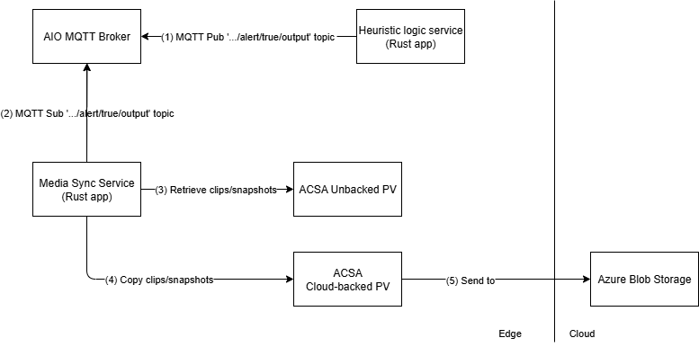

## Status

- [ ] Draft
- [ ] Proposed
- [X] Accepted
- [ ] Deprecated

## Context

Customers require a secure and efficient solution to stream and capture video from edge-attached cameras for tasks such as anomaly detection, archiving live or captured media, and performing related operations. This includes capabilities like buffering, recording, and taking snapshots for various media endpoints, as well as integrating with MQTT-based interfaces through the AIO [Media Connector](https://learn.microsoft.com/azure/iot-operations/discover-manage-assets/overview-media-connector).
This solution focuses on enabling the following:

- Securely creating and managing edge-attached media sources as system assets, including defining asset endpoints and credentials for accessing media sources like IP cameras.
- Storing video files or snapshots locally on the edge, sending snapshots to the MQTT broker with reference data, and archiving live or captured media.
- Streaming video in multiple formats and resolutions using a media server to handle video retrieved from camera assets.

> **Note:** This ADR does not include actual inferencing or detection of the captured media. It focuses solely on the secure streaming, storage, and management of video and image data.

## Scenario 1 - Live Video stream

This scenario covers use cases when an anomaly has been detected and Operations Team (OT) team member wants to stream live video to see details.

Data flow:

(1) - Camera streams a video

(2)(3) - Operations Team sends a command to an MQTT topic through MQTT client

(4) - Media Connector is subscribed to the stream control topic, receives JSON with the stream configuration

(5) - Media Connector starts streaming an RTSP feed to Media Server based on received configuration.

(6) - Web UI Application connects to Media Server and receives RTSP Stream

## Scenario 2 - Snapshots and Clips

This scenario covers use case when an anomaly is detected and subsequently confirmed using additional deterministic logic, an OT team member seeks to further review snapshots and video clips of the anomaly for deeper analysis.

### 2.1 Trigger to start saving snapshots and clips to the Edge

Data flow:

(1) - Camera streams a video

(2) - A bash script calls on Mosquitto MQTT client.

(3) - MQTT client publishes to the AIO MQTT Broker with a message to start saving clips/snapshots to a file system destination.

(4) - Media Connector is subscribed to the asset task topics, receives JSON with the storage configuration for `clip-to-fs` or `snapshot-to-fs` tasks.

(5) - Media Connector starts saving clips/snapshots to a persisted volume with unbacked [Azure Container Storage enabled by Azure Arc](https://learn.microsoft.com/azure/azure-arc/container-storage/overview) (ACSA)

### 2.2 Move files from unbacked to backed ACSA for confirmed events

Data flow:

(1) - The Deterministic Logic Service publishes to AIO MQTT Broker to the event topic with the timestamp of when the anomaly was detected.

(2) - The Media Sync Service subscribed to the event topic, retrieves the message.

(3) - The Media Sync Service finds and retrieves the clips/snapshot files stored in unbacked persisted volume within the time range configured for the event.

(4) - The Media Sync Service copies the clips and files to the cloud backed persisted volume.

(5) - The files in ACSA Cloud backed persisted volume is then synced to Azure Blob Storage.

### 2.3 Retrieve clips and snapshots for a specified start time and duration

Data flow:

(1) - Operations Team calls Mosquitto MQTT Client to send message to AIO MQTT Broker.

(2) - Mosquitto MQTT Client publishes message to AIO MQTT Broker

(3) - The Media Sync subscribes and retrieves message from the topic

(4) - The Media Sync finds and retrieves the clips/snapshot files stored in unbacked persisted volume within the time range specified by Operations Team

(5) - The Media Sync copies the clips and files to the cloud backed persisted volume.

(6) - The files in ACSA Cloud backed persisted volume is then synced to Azure Blob Storage.

## Decision

Based on the features available to securely interact and operate edge-attached cameras provided by the [Media Connector](https://learn.microsoft.com/azure/iot-operations/discover-manage-assets/overview-media-connector). The connector deploys to an Arc-enabled Kubernetes cluster on the edge as part of an Azure IoT Operations deployment.

**Production Deployment**: The Media Connector is deployed via blueprints (e.g., `blueprints/full-single-node-cluster`) by enabling the `should_enable_akri_media_connector` flag or using the `custom_akri_connectors` variable for advanced configuration.

**Local Development**: A Docker Compose development environment is available in `src/500-application/508-media-connector` for testing without requiring a full Kubernetes cluster.

## Decision Drivers (optional)

The main purpose of the media connector for the solution's use case is to interact with edge-attached cameras through Asset task configurations:

- **snapshot-to-mqtt**: Capture snapshots and publish to MQTT topics for real-time AI inference
- **clip-to-fs**: Save video clips to local file system with Azure Container Storage integration
- **snapshot-to-fs**: Save snapshots to persistent storage
- **stream-to-rtsp/stream-to-rtsps**: Proxy live streams to RTSP endpoints for operator access

Snapshots published to the AIO MQTT Broker enable real-time predictions based on the snapshot data. Combining confidence scores with data received from other sources allows for additional analysis and better confidence of whether the captured video meets the threshold to trigger an event.

For live operator access, the Media Connector can proxy live feeds to a media server (e.g., [MediaMTX](https://github.com/bluenviron/mediamtx)) for display in operator dashboards. **Note**: MediaMTX or equivalent media server deployment is required for production when using `stream-to-rtsp` or `stream-to-rtsps` task types.

The chosen approach lends itself to be used simultaneous with other components such as [Azure Container Storage enabled by Azure Arc](https://learn.microsoft.com/azure/azure-arc/container-storage/overview) (ACSA) which moves clips associated with the event time frame from local shared storage to cloud ingest storage. These clips are then synchronized with Azure Blob Storage in the cloud.

## Considered Options (optional)

The use of OSS Akri to detect and discover network attached IP camera was considered but lacked the required built in features provided by the Media Connector.

## Consequences

We justified that Media Connector used in conjunction with the Media Server is suitable for current edge environment and solution scenario.

## Future Considerations (optional)

In the current ADR, the following is out-of-scope:

- Providing continuous real-time inference and indexing on live video frames
- Implementation of a Web UI Application that connects to the Media Server and receives the RTSP Stream
- Management of camera credentials with Azure Key Vault integration for asset endpoint profiles
- Automated camera discovery and registration workflows
- Multi-site media synchronization and federated storage

*AI and automation capabilities described in this scenario should be implemented following responsible AI principles, including fairness, reliability, safety, privacy, inclusiveness, transparency, and accountability. Organizations should ensure appropriate governance, monitoring, and human oversight are in place for all AI-powered solutions.*
