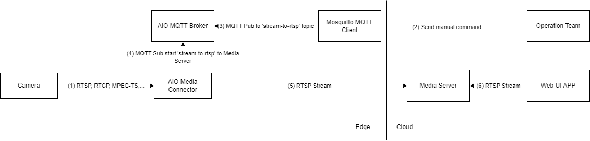

# Video and Image Capture from Edge-Attached Cameras

Date: **2024-03-05**

Author: **Alain Uyidi**

## Status (optional)

- [X] Draft
- [ ] Proposed
- [ ] Accepted
- [ ] Deprecated

## Context

Customers require a secure and efficient solution to stream and capture video from edge-attached cameras for tasks such as anomaly detection, archiving live or captured media, and performing related operations. This includes capabilities like buffering, recording, and taking snapshots for various media endpoints, as well as integrating with MQTT-based interfaces through the AIO [Media Connector](https://learn.microsoft.com/en-us/azure/iot-operations/discover-manage-assets/overview-media-connector).
This solution focuses on enabling the following:

- Securely creating and managing edge-attached media sources as system assets, including defining asset endpoints and credentials for accessing media sources like IP cameras.
- Storing video files or snapshots locally on the edge, sending snapshots to the MQTT broker with reference data, and archiving live or captured media.
- Streaming video in multiple formats and resolutions using a media server to handle video retrieved from camera assets.

> **Note:** This ADR does not include actual inferencing or detection of the captured media. It focuses solely on the secure streaming, storage, and management of video and image data.

## Scenario 1 - Live Video stream

This scenario covers use cases when an anomaly has been detected and Operations Team (OT) team member wants to stream live video to see details.

Data flow:

(1) - Camera streams a video

(2)(3) - Operations Team sends a command to an MQTT 'stream-to-rtsp' topic through MQTT Mosquitto Client

(4) - Media Connector is subscribed to MQTT 'stream-to-rtsp' topic, receives JSON with the stream configuration

(5) - Media Connector starts streaming an RTSP feed to Media Server based on received configuration.

(6) - Web UI Application connects to Media Server and receives RTSP Stream

## Scenario 2 - Snapshots and Clips

This scenario covers use case when an anomaly is detected and subsequently confirmed using additional deterministic logic, an OT team member seeks to further review snapshots and video clips of the anomaly for deeper analysis.

### 2.1 Trigger to start saving snapshots and clips to the Edge.

Data flow:

(1) - Camera streams a video

(2) - A bash script calls on Mosquitto MQTT client.

(3) - Mosquitto MQTT client publishes to the AIO MQTT Broker with a message to start saving clips/snapshots to a file system destination.

(4) - Media Connector is subscribed to the 'clips-fs/snapshots-fs' topic, receives JSON with the storage configuration.

(4) - Media Connector starts saving clips/snapshots to a persisted volume with unbacked [Azure Container Storage enabled by Azure Arc](https://learn.microsoft.com/en-us/azure/azure-arc/container-storage/overview) (ACSA)

### 2.2 Move files from unbacked to backed ACSA for confirmed events.

Data flow:

(1) - The Deterministic Logic Service publishes to AIO MQTT Broker to the event topic with the timestamp of when the anomaly was detected.

(2) - The Media Sync Service subscribed to the event topic, retrieves the message.

(3) - The Media Sync Service finds and retrieves the clips/snapshot files stored in unbacked persisted volume within the time range configured for the event.

(4) - The Media Sync Service copies the clips and files to the cloud backed persisted volume.

(5) - The files in ACSA Cloud backed persisted volume is then synced to Azure Blob Storage.

### 2.3 Retrieve clips and snapshots for a specified start time and duration.

Data flow:

(1) - Operations Team calls Mosquitto MQTT Client to send message to AIO MQTT Broker.

(2) - Mosquitto MQTT Client publishes message to AIO MQTT Broker

(3) - The Media Sync subscribes and retrieves message from the topic

(4) - The Media Sync finds and retrieves the clips/snapshot files stored in unbacked persisted volume within the time range specified by Operations Team

(5) - The Media Sync copies the clips and files to the cloud backed persisted volume.

(6) - The files in ACSA Cloud backed persisted volume is then synced to Azure Blob Storage.

## Decision

Based on the features available for to securely interact and operate an edge-attached camera provided by the [Media Connector](https://learn.microsoft.com/en-us/azure/iot-operations/discover-manage-assets/overview-media-connector). The connector deploys to an Arc-enabled Kubernetes cluster on the edge as part of an Azure IoT Operations deployment.

## Decision Drivers (optional)

The main purpose of the media connector for the solutions's use case is to interact with the edge-attached camera with the ability to perform a number of mRPC requests such as start/stop a live rtsp feed from the camera and record snapshots on-demand for further analysis. Furthermore, the capability to send snapshots to the AIO MQTT Broker through the Media Connector to get a realtime prediction based on the snapshot data from MQTT. Combining confidence scores with data received from other sources
could allow for additional analysis and better confidence of whether the captured video meets the threshold to trigger an event.

In addition, an mRPC request can be sent to the Media Connector to enable a live feed. This live feed is transmitted to a [MediaMTX Media Server](https://github.com/bluenviron/mediamtx) in the cloud and displayed in a UI.

The chosen approach lends itself to be used simultaneous with other components such as [Azure Container Storage enabled by Azure Arc](https://learn.microsoft.com/en-us/azure/azure-arc/container-storage/overview) (ACSA) which moves clips associated with the event timeframe from local shared storage to cloud ingest storage. These clips are then synchronized with Azure Blob Storage in the cloud.

## Considered Options (optional)

The use of OSS Akri to detect and discover network attached IP camera was considered but lacked the required built in features provided by the Media Connector.

## Consequences

We justified that Media Connector used in conjuction with the Media Server is suitable for current edge environment and solution scenario.

## Future Considerations (optional)

In the current ADR, the following is out-of-scope:

- Using other feature and components to wrap functionality of performing pre-defined mRPC commands to the Media Connector
- Providing continuous realtime inference and indexing on the live video frames
- Implementation of a Web UI Application that connects to the Media Server and receives the RTSP Stream
- Manage camera username and passwords with Azure Key Vault to ensure security of the user credentials defined in the asset endpoint profile [https://docs.microsoft.com/azure/key-vault/secrets/overview-storage-keys](https://docs.microsoft.com/azure/key-vault/secrets/overview-storage-keys)
