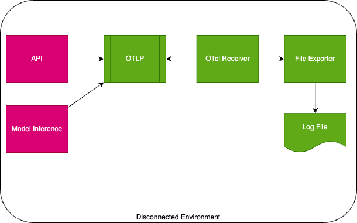
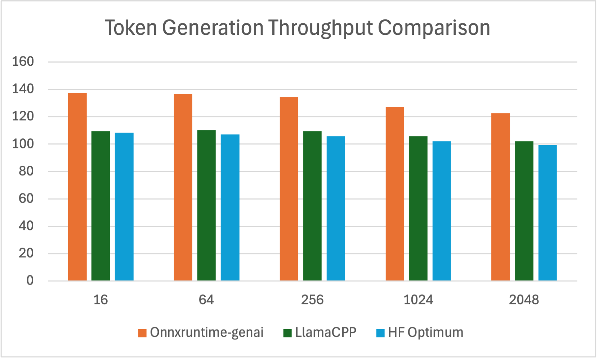
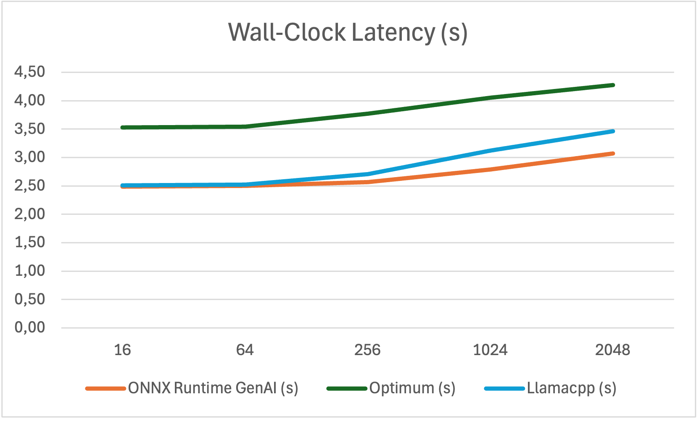
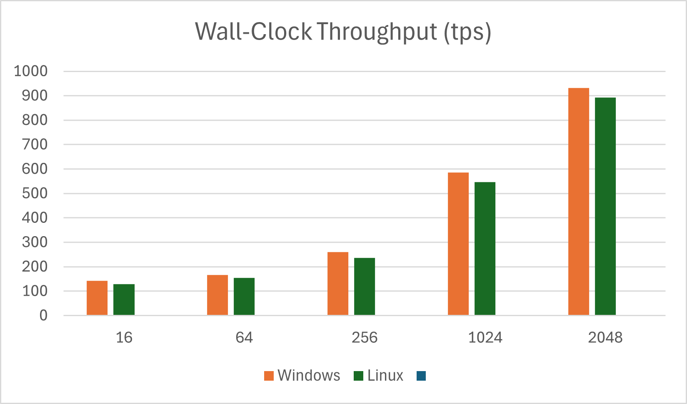
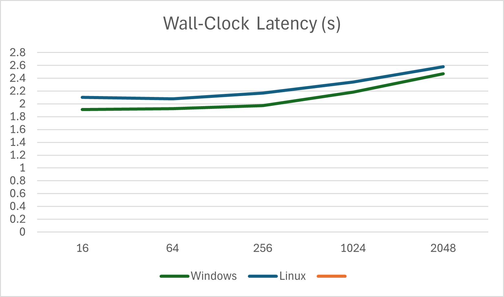

# Model Inferencing on Disconnected Windows Environments

Date: 2025-03-07

Authors: Omer Demir

## Status

- [ ] Draft
- [X] Proposed
- [ ] Accepted
- [ ] Deprecated

## Context

Small Language Model inferencing  on disconnected environments presents unique challenges, especially on **Windows-based systems** where:

- No internet connectivity is available (fully offline deployment).
- Local inference must be optimized for low latency.
- Hardware resources (CPU/GPU) need to be efficiently utilized.
- Model execution must be Windows-compatible (no reliance on Linux-based tools).

Given these constraints, we evaluated multiple inference engines to determine the best solution for running SLM inference in an on-prem, disconnected Windows environment.

## Decision

We selected **ONNX Runtime GenAI** as the best inference engine for running SLM inference on Windows-based, offline environments due to:

- Optimized performance: Best token throughput and lowest latency.
- Full Windows compatibility: No need for extensive modifications.
- Support for ONNX models: Works with most popular GenAI models for efficient inference
  - [DeepSeek](https://huggingface.co/deepseek-ai/DeepSeek-R1)
  - [Gemma](https://huggingface.co/google/gemma-2-2b)
  - [Llama *](https://huggingface.co/meta-llama/Llama-3.1-8B-Instruct)
  - [Mistral](https://huggingface.co/mistralai/Mistral-7B-v0.1)
  - [Phi (language + vision)](https://huggingface.co/microsoft)
  - [Qwen](https://huggingface.co/Qwen/Qwen2.5-VL-7B-Instruct)
  - [Nemotron](https://huggingface.co/nvidia/Nemotron-Mini-4B-Instruct)
  - [Granite](https://huggingface.co/ibm-granite/granite-3.2-8b-instruct)
  - [AMD OLMo](https://huggingface.co/amd/AMD-OLMo-1B)
- No cloud dependencies: Fully supports disconnected environments.

## Decision Drivers

- Ability to run RAG without internet access.
- Fast inference speed ( < 5s total for responses).
- Efficient GPU utilization on Windows.
- Ease of integration with on-prem infrastructure.

## Considered Options

### Option 1: ONNX Runtime GenAI ✅ (Selected)

**Pros:**

- Best performance (higher token throughput, lower latency).
- Windows-native support without extra dependencies.
- Works with ONNX-optimized models like Phi-3 Mini.
- Provides graph optimizations.
- Fully self-contained for offline execution.

**Cons:**

- Requires manual model conversion using `onnxruntime-genai.builder` if there is no Onnx version published.

### Option 2: LlamaCPP

**Pros:**

- Good performance on CPU-only environments.
- Fully self-contained for offline execution.

**Cons:**

- GPU support is limited on Windows.
- Requires custom Windows builds, adding complexity.

### Option 3: Hugging Face Optimum

**Pros:**

- Supports various ONNX models.
- Provides graph optimizations.
- Fully self-contained for offline execution.

**Cons:**

- Does not optimize model inferencing like usage of KV-cache, input/ouput binding, pre/post processing/
- Lower token throughput than ONNX Runtime GenAI.

### Option 4: NVIDIA Triton Inference Server

**Pros:**

- Multi-GPU scalability and efficient batching.

**Cons:**

- Not feasible for offline Windows environments (requires Docker).
- Higher resource overhead compared to ONNX Runtime GenAI.

*Note*: Nvidia Triton option was not added to benchmark due to restriction of Docker usage on disconnected environment. For further consideration, it needs to be tested.

## Consequences

By selecting **ONNX Runtime GenAI**, we achieve:

- Disconnected RAG capabilities on Windows environments.
- Optimized inference speeds, keeping response times low.
- Better resource utilization in on-prem settings.

## Additional Considerations for Disconnected Environments

### Logging & Telemetry

For disconnected environments, the chosen solution was leveraging OpenTelemetry to export file logs. After these logs are produced, using log clients to periodically import exported logs to Azure Log Monitor, Grafana, and similar applications for visualization.

## Future Considerations

- Further optimizing ONNX models for better efficiency.
- Exploring additional fine-tuning techniques for model inferencing.
- Monitoring new developments in ONNX Runtime GenAI.

## Benchmark Results

For the benchmark, it was used **Microsoft’s Phi-3 Mini ONNX model** ([Hugging Face link](https://huggingface.co/microsoft/Phi-3-mini-4k-instruct-onnx)) for testing, deployed on an **Azure ND96amsr_A100_v4 instance** (1x A100 80GB GPU). In addition, we used fixed generation length **256 tokens**, with **5** warmup run and **10** repetition.

We tested following combinations;

- Onnxruntime-genai Windows vs Linux
- Onnxruntime-genai vs Huggingface Optimum

### Average Token Generation Throughput (tokens per second, tps)

| Batch Size | Prompt Length | Onnxruntime-genai | LlamaCPP | HF Optimum | Speed Up ORT/LlamaCPP Ratio | Speed Up ORT/Optimum Ratio |
|------------|---------------|-------------------|----------|------------|-----------------------------|----------------------------|
| 1          | 16            | 137.59            | 109.47   | 108.345    | 1.26                        | 1.27                       |
| 1          | 64            | 136.82            | 110.26   | 107.135    | 1.24                        | 1.28                       |
| 1          | 256           | 134.45            | 109.42   | 105.755    | 1.23                        | 1.36                       |
| 1          | 1024          | 127.34            | 105.60   | 102.114    | 1.21                        | 1.50                       |
| 1          | 2048          | 122.62            | 102.00   | 99.345     | 1.20                        | 1.59                       |

### Wall-clock Latency Optimum vs ONNX Runtime GenAI

| Prompt Length | ONNX Runtime GenAI (s) | Optimum (s) | Llamacpp (s) |
|---------------|------------------------|-------------|--------------|
| 16            | 2.491                  | 3.526       | 2.51         |
| 64            | 2.502                  | 3.545       | 2.52         |
| 256           | 2.571                  | 3.772       | 2.71         |
| 1024          | 2.790                  | 4.049       | 3.12         |
| 2048          | 3.073                  | 4.279       | 3.46         |

### Wall-Clock Throughput with Onnxruntime-genai Windows vs Linux (tps)

| Prompt Length | Windows | Linux  |
|---------------|---------|--------|
| 16            | 142.18  | 129.52 |
| 64            | 166.20  | 154.18 |
| 256           | 259.48  | 235.68 |
| 1024          | 585.68  | 545.91 |
| 2048          | 932.03  | 892.12 |

### Wall-Clock Latency with Onnxruntime-genai Windows vs Linux (s)

| Prompt Length | Windows | Linux |
|---------------|---------|-------|
| 16            | 1.913   | 2.1   |
| 64            | 1.925   | 2.08  |
| 256           | 1.973   | 2.17  |
| 1024          | 2.185   | 2.34  |
| 2048          | 2.472   | 2.58  |

## References

- [ONNX Runtime GenAI documentation](https://onnxruntime.ai/docs/genai/)
- [LlamaCPP](https://github.com/ggerganov/llama.cpp)
- [Hugging Face Optimum](https://github.com/huggingface/optimum)
- [NVIDIA Triton Inference Server](https://developer.nvidia.com/nvidia-triton-inference-server)
- [Phi-3 Mini ONNX Model](https://huggingface.co/microsoft/Phi-3-mini-4k-instruct-onnx)
