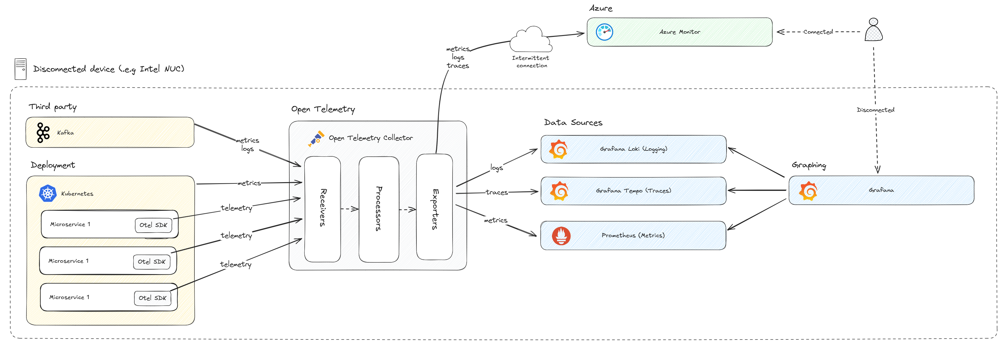

# Observability solution options in fully disconnected Kubernetes clusters

Date: 2024-03-18

Authors: Adele Churchill, Andrew Cardy, Siobhan Baynes

## Status

[For this library of ADRs, mark the most applicable status at which it was stored in the original project. This can help provide context and validity for folks reviewing this ADR. If it has been deprecated you can add a note on why and date it.]

- [ ] Draft
- [ ] Proposed
- [x] Accepted
- [ ] Deprecated

## Context

For a defense customer with edge solution requirements for fully disconnected Kubernetes clusters, this document focuses on the solution on how this data could be processed while a node is completely disconnected. In addition, this document looks to investigate more deeply into the OpenTelemetry space and make use of industry-standard open-source tooling.
The differences between configuration in connected and disconnected modes should be kept to a minimum.

Ultimately it breaks down into the following requirements:

- Support both connected/disconnected scenarios.
  - Potentially use an OpenTelemetry connector as an abstraction.
- Destination to be chosen at deployment time.
  - Azure deployments will always be connected.
  - Edge deployments will always be disconnected.
- Ideally, we would like to make this as simple as possible for the end user, so we would like to minimize the number of different web portals that they need to go to to troubleshoot any problems.

In considering the above requirements, we should consider the personas who would look to make use of this data, these are detailed below.

## Decision

OpenTelemetry Collector has been chosen in both connected and disconnected scenarios. This will enable sending data to Azure Monitor when connected or to the disconnected stack when disconnected thus enabling the code to be destination agnostic and all changes to be done via the OpenTelemetry configuration file.  
The disconnected stack will be configured as per the diagram below:

The OpenTelemetry Collector will send metrics to Prometheus for storage and processing. This will then be surfaced by Grafana. Traces will be sent to Grafana Tempo as this is tightly integrated with Grafana. Logs will be sent to Grafana Loki as this is also tightly integrated with Grafana. Grafana can then be used as the single dashboard through which to view all of, metrics, traces, and logs.

## Decision Drivers

### Developers

A developer should be able to:

- View application logs and distributed traces to diagnose issues.
  - Logs must be queryable.

### System Administrator

A system administrator should be able to:

- View application metrics to understand the performance of a node.
  - Metrics must be graphed for easy viewing.
  - Metrics should help inform node tuning (i.e. settings for prioritization, etc.)

## Considered Options

### Observability Tool Support

| Tool          | Metrics | Tracing | Logging | Alerting | Notes                                               |
|---------------|---------|---------|---------|----------|-----------------------------------------------------|
| App Insights  | Yes     | Yes     | Yes     | Yes      | Not suitable for disconnected scenarios             |
| Jaeger        | No\*    | Yes     | No      | No       | \* Supports trace metrics when combined Prometheus. |
| Zipkin        | No      | Yes     | No      | No       |                                                     |
| ELK Stack     | Yes     | Yes     | Yes     | Yes      | Elasticsearch, Logstash, Kibana                     |
| Prometheus    | Yes\*   | No      | No      | Yes      | \* Yes when combined with Grafana                   |
| Grafana Loki  | No      | No      | Yes     | No       | Storage and processing, visualized by Grafana       |
| Grafana Tempo | No      | Yes     | No      | No       | Storage and processing, visualized by Grafana       |

### Middlewares

| Tool                    | Notes                                                             |
|-------------------------|-------------------------------------------------------------------|
| FluentBit               | Connects to various telemetry sources, including K8s.             |
| OpenTelemetry Collector | Connects to telemetry sources supporting Open Telemetry protocol. |

### Zipkin

Zipkin is a distributed tracing tool. It has a contributed OpenTelemetry exporter which accepts traces only.

[OpenTelemetry Zipkin Exporter](https://github.com/open-telemetry/opentelemetry-collector-contrib/tree/main/exporter/zipkinexporter)

Zipkin was used by the a different ISE Crew, but rather as a default choice as it was supported by Dapr, which they were using at the time.

### Jaeger

Jaeger is a popular community choice and appears to have more features than Zipkin including trace comparison, which may be useful for dev/test scenarios. It also includes the ability to add metrics and dashboards by adding Prometheus and Grafana. Out of the box, it also includes additional features such as hot paths, dependencies and trace comparison.

Jaeger supports OpenTelemetry input via its own collector implementation. It can display and process both tracing and with Prometheus and Grafana, it can also process and display metrics.

Jaeger also creates metrics based on the traces it receives and exports them to Prometheus. It however doesn't support ingestion of custom metrics.

The downside is that it does not support logs as an input.

### ELK Stack

ELK stands for Elastic, Logstash and Kibana. Together, these form a stack which allows processing of logs, traces and metrics. While this is a useful stack, and core components are free to use, it does appear to be a more heavy-weight solution for our needs. It also has a cloud offering, which makes understanding the free/open-source component usage a little harder.

### Prometheus

Prometheus is based on processing and displaying metrics, with custom dashboards provided by Grafana. It doesn't have support for logs, and actively suggests [not to do so](https://prometheus.io/docs/introduction/faq/#how-to-feed-logs-into-prometheus).

It does support alerting, as does Grafana.

### Grafana Tempo

Grafana Tempo is a backend storage and processing tool for tracing. The tracing stored within Tempo can be visualized using Grafana.

### Grafana Loki

Grafana Tempo is a backend storage and processing tool for logging. The logs stored within Loki can be visualized using Grafana.

### Open Telemetry Collector

An Open Telemetry collector consists of a processing pipeline, including receivers, processors and exporters. The collector is able to take input over the OpenTelemetry protocol and other sources via contributed receivers. Similarly, it can output using Open Telemetry protocol or to proprietary protocols via contributed exporters. Processing can be added such as batching.

Using a collector will allow us to abstract the configuration of telemetry destinations away from the components acting as data sources. This means that there is a single component with configuration for metrics, logging and tracing.

### FluentBit

FluentBit appears to be similar in functionality to the Open Telemetry collector. Using FluentBit would still require tools to process and view metrics traces and logs. FluentBit would then ostensibly just replace our OpenTelemetry collector with a more heavyweight, opinionated tool.

## Consequences

This architecture will allow capturing and visualizing all forms of telemetry (logs, metrics and traces) in a disconnected scenario.

Given the proposed architecture, with its collector centric configuration, any changes to data-sources, storage or visualization tools should be straight forward to introduce. This supports future use cases where the current tooling isn't sufficient.

## Future Considerations

In the current ADR, the following is out-of-scope:

- Viewing traces from multiple disconnected nodes would be desirable, but is out of scope for this investigation. We should try to avoid solutions that may make implementing this feature difficult to implement in the future.
- Selecting telemetry destinations at runtime is out of scope, but the solution should allow for this in the future.
- Offline caching (store and forward) to keep data in a queue and push when connected is restored, is not considered in this document
