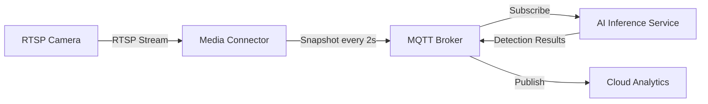
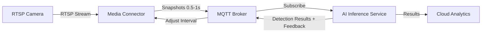
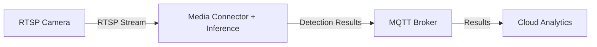
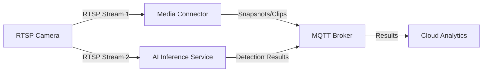

## Status

- [X] Draft
- [ ] Proposed
- [ ] Accepted
- [ ] Deprecated

## Context

Edge AI vision applications require real-time or near-real-time inference on video streams from IP cameras. The current architecture uses a snapshot-based approach where the Media Connector captures frames at configurable intervals (default 2 seconds) and publishes them to MQTT for asynchronous processing by AI Inference services. While this approach works well for many scenarios, it introduces latency and may miss critical events occurring between snapshots.

This ADR explores four architectural approaches for implementing real-time vision inference on edge clusters, evaluating trade-offs between latency, resource utilization, implementation complexity, and system scalability.

### Current Architecture (Snapshot-Based)



**Characteristics**:

- **Latency**: 2+ seconds (snapshot interval + processing time)
- **Resource Usage**: Low (snapshots only)
- **Missed Events**: High risk between snapshots
- **Implementation**: Simple, proven pattern
- **Scalability**: Excellent (decoupled services)

### Requirements

- **Latency Target**: Sub-second detection latency for critical events
- **Frame Coverage**: Process sufficient frames to avoid missing events
- **Resource Constraints**: Edge devices with limited CPU/GPU/memory
- **Integration**: Compatible with existing MQTT-based architecture
- **Cloud Analytics**: Support for historical analysis via Fabric RTI or similar
- **Multi-Camera**: Scale to 4-8 cameras per edge node

## Decision Drivers

1. **Detection Latency**: Time from event occurrence to detection notification
2. **Event Coverage**: Percentage of events successfully detected (no missed frames)
3. **Resource Efficiency**: CPU, GPU, memory, network bandwidth utilization
4. **Implementation Complexity**: Development effort, testing, and maintenance
5. **System Reliability**: Fault tolerance, error handling, recovery mechanisms
6. **Scalability**: Ability to add cameras and scale inference workloads
7. **Integration Compatibility**: Alignment with existing Azure IoT Operations patterns
8. **Operational Observability**: Logging, metrics, debugging capabilities

## Considered Options

### Option 1: Optimized Snapshot-Based Architecture (Evolutionary)

**Description**: Enhance the existing snapshot-based approach with higher frequency snapshots and dynamic interval adjustment based on event detection feedback.



**Implementation Details**:

- Reduce snapshot interval to 0.5-1 second (from default 2s)
- Implement adaptive interval logic: increase frequency when objects detected, decrease during idle periods
- Use MQTT feedback loop for dynamic adjustment
- Optimize JPEG encoding and MQTT message size
- Add snapshot queue buffering for burst handling

**Pros**:

- Minimal changes to existing architecture
- Proven MQTT-based decoupling
- Easy to implement and test
- Maintains existing observability patterns
- Low risk deployment

**Cons**:

- Still has ~1 second minimum latency
- May miss very fast events (< 1 second duration)
- Higher MQTT traffic and network bandwidth
- Increased storage for snapshot buffering
- Not truly "real-time" for critical scenarios

**Resource Impact**:

- CPU: +15% (higher snapshot frequency + encoding)
- Memory: +50 MB per camera (snapshot buffering)
- Network: +2-4 Mbps per camera (JPEG snapshots at 0.5s)
- Storage: +100 MB per camera per hour (buffering)

**Use Cases**: Monitoring applications where 0.5-1s latency is acceptable (perimeter security, occupancy counting, traffic monitoring).

### Option 2: Buffered Stream Processing with Shared Memory

**Description**: Media Connector maintains a ring buffer of decoded frames in shared memory. AI Inference service reads frames directly from the buffer using inter-process communication (IPC) or gRPC streaming.


**Implementation Details**:

- Media Connector decodes RTSP stream and writes raw frames to shared memory (`/dev/shm` or Kubernetes `emptyDir`)
- Ring buffer holds 30-60 frames (~2-4 seconds at 15 fps)
- AI Inference service reads frames via memory-mapped file or gRPC
- Frame metadata includes timestamp, sequence number, camera ID
- MQTT used only for detection results (not raw frames)

**Pros**:

- Low latency: 50-200ms (frame decode + inference)
- No frame loss (all frames available in buffer)
- Reduced network overhead (no MQTT for raw frames)
- Maintains service decoupling
- Supports multiple inference consumers

**Cons**:

- Medium complexity: requires IPC/gRPC implementation
- Shared memory management overhead
- Frame synchronization logic needed
- Higher memory footprint
- Requires both services on same node (pod affinity)

**Resource Impact**:

- CPU: +10% (frame decoding, no JPEG encoding)
- Memory: +200 MB per camera (ring buffer for raw frames)
- Network: -50% vs Option 1 (MQTT only for results)
- Storage: Minimal (in-memory only)

**Use Cases**: Applications needing sub-second latency with multi-consumer support (multiple inference models on same stream).

### Option 3: Direct In-Process Inference (Tightly Coupled)

**Description**: Integrate the inference engine directly into the Media Connector process, eliminating inter-service communication entirely.



**Implementation Details**:

- Media Connector embeds inference engine (ONNX Runtime, TensorRT, OpenVINO)
- Frames decoded once and passed directly to inference
- Single process handles capture, inference, result publishing
- Model management via ConfigMap or PVC
- Health checks monitor both capture and inference

**Pros**:

- Lowest latency: 30-100ms (frame decode + inference)
- Minimal memory copying (zero-copy frame passing)
- Simplest deployment (single container)
- Lowest resource overhead
- Easiest debugging (single process)

**Cons**:

- Tight coupling breaks service separation
- Difficult to scale inference independently
- Model updates require Media Connector restart
- Single point of failure (capture + inference)
- Limited to one inference model per camera
- Violates microservices best practices

**Resource Impact**:

- CPU: +5% (no IPC overhead)
- Memory: +100 MB per camera (single process, no duplication)
- Network: Minimal (MQTT results only)
- Storage: Minimal

**Use Cases**: Single-camera, single-model applications with extreme latency requirements (< 100ms).

### Option 4: Direct RTSP Connection to AI Inference Service

**Description**: AI Inference service connects directly to camera RTSP stream, bypassing Media Connector entirely for inference workloads.



**Implementation Details**:

- AI Inference service implements RTSP client (GStreamer, FFmpeg)
- Each inference service connects directly to camera
- Media Connector used only for snapshots, clips, and archival
- Dual RTSP connections to same camera (within limits)
- Frame rate and resolution configurable per connection

**Pros**:

- Low latency: 50-150ms (direct stream access)
- Independent scaling of inference services
- Media Connector failure doesn't impact inference
- Flexible frame rate selection per use case
- Multiple models can connect to same camera

**Cons**:

- Camera resource limits (max 2-4 concurrent RTSP streams)
- Duplicate network bandwidth (multiple streams)
- Credential management complexity (inference needs camera access)
- Higher camera CPU load
- No centralized frame buffering

**Resource Impact**:

- CPU: +20% per inference service (RTSP decoding)
- Memory: +150 MB per camera per inference service
- Network: +3-5 Mbps per camera per inference service (raw RTSP)
- Camera CPU: +30% per additional stream

**Use Cases**: Scenarios requiring independent inference scaling with cameras supporting multiple concurrent RTSP connections.

## Decision

**Selected Approach**: Start with **Option 1 (Optimized Snapshot-Based)**, with a migration path to **Option 2 (Buffered Stream Processing)** for latency-critical applications.

### Rationale

1. **Evolutionary Risk Mitigation**: Option 1 requires minimal changes to the proven architecture, reducing deployment risk.
2. **Latency Adequacy**: For most vision AI use cases (object detection, occupancy counting, anomaly detection), 0.5-1 second latency is acceptable.
3. **Clear Upgrade Path**: The architecture can evolve to Option 2 when sub-second latency becomes a hard requirement, preserving existing investments.
4. **Operational Familiarity**: Teams already understand MQTT-based patterns, reducing operational learning curve.
5. **Resource Efficiency**: Option 1 provides a good balance of latency improvement without excessive resource overhead.

### Implementation Phasing

#### Phase 1: Optimized Snapshots (Weeks 1-2)

- Reduce snapshot interval to 0.5 seconds in Media Connector configuration
- Implement MQTT message size optimization (compression, resolution tuning)
- Add snapshot queue buffering (100 MB ring buffer per camera)
- Deploy adaptive interval logic based on detection feedback
- Monitor latency, network bandwidth, CPU usage

#### Phase 2: Evaluation and Decision Point (Week 3)

- Collect metrics: end-to-end latency, event coverage, resource utilization
- User acceptance testing with operational teams
- Decision: Continue with Phase 1 or proceed to Phase 3

#### Phase 3: Buffered Stream Processing (Optional, Weeks 4-6)

- Implement shared memory ring buffer in Media Connector
- Develop gRPC streaming API for frame access
- Update AI Inference service to consume gRPC frames
- Deploy with pod affinity rules (co-locate services)
- Migrate cameras one at a time, compare metrics

## Consequences

### Positive

- **Reduced Latency**: From 2s to 0.5-1s (60-75% improvement) in Phase 1
- **Improved Event Coverage**: Fewer missed events with higher snapshot frequency
- **Low Risk**: Evolutionary approach minimizes deployment risk
- **Operational Continuity**: Existing monitoring, logging, and debugging tools continue to work
- **Cost Efficiency**: Reuses existing infrastructure and expertise

### Negative

- **Not True Real-Time**: 0.5s latency may still be insufficient for safety-critical applications (e.g., collision avoidance)
- **Increased Network Traffic**: Higher snapshot frequency increases MQTT traffic by 2-4x
- **Resource Overhead**: Additional CPU and memory for snapshot buffering
- **Technical Debt**: Phase 1 is a stopgap; Phase 3 may still be required for demanding use cases

### Neutral

- **Migration Flexibility**: Architecture supports future migration to Option 2 or 4 without major refactoring
- **Monitoring Requirements**: New metrics needed for adaptive interval logic and queue depths

## Monitoring and Success Criteria

### Key Metrics

- **Detection Latency**: Time from event occurrence to MQTT result publication (target: < 1s)
- **Event Coverage**: Percentage of ground-truth events detected (target: > 95%)
- **Snapshot Queue Depth**: Number of queued snapshots awaiting inference (target: < 10)
- **Network Bandwidth**: MQTT traffic per camera (target: < 5 Mbps)
- **CPU Utilization**: Media Connector and AI Inference CPU (target: < 70%)
- **Memory Usage**: Snapshot buffer memory per camera (target: < 100 MB)

### Success Criteria (Phase 1)

- [ ] Detection latency reduced to < 1 second for 95th percentile
- [ ] Zero dropped snapshots under normal load (4 cameras per node)
- [ ] Event coverage > 95% in validation tests
- [ ] CPU utilization remains < 70% on edge nodes
- [ ] Network bandwidth < 5 Mbps per camera

### Rollback Criteria

- Detection latency exceeds 1.5 seconds for 90th percentile
- CPU utilization consistently > 85%
- Network bandwidth causes MQTT broker saturation
- Snapshot queue depth consistently > 20 (indicates backlog)

## Implementation Guide Reference

For detailed step-by-step implementation instructions, see:

- [Real-Time Inference Implementation Guide](../getting-started/real-time-inference-implementation.md)

## References

- [Simple Vision Example](../getting-started/simple-vision-example.md)
- [Fabric RTI Vision Analytics](../getting-started/fabric-rti-vision-analytics.md)
- [Edge Video Streaming and Image Capture ADR](./edge-video-streaming-and-image-capture.md)
- [Azure IoT Operations Media Connector](https://learn.microsoft.com/azure/iot-operations/discover-manage-assets/overview-media-connector)
- [MQTT Integration Patterns](https://learn.microsoft.com/azure/iot-operations/manage-mqtt-broker/overview-iot-mq)

## Related ADRs

- [Edge Video Streaming and Image Capture](./edge-video-streaming-and-image-capture.md)
- [AI Edge Inference Dual Backend Architecture](./ai-edge-inference-dual-backend-architecture.md)
- [ONVIF Connector Camera Integration](./onvif-connector-camera-integration.md)

## Appendix: Performance Comparison Table

| Metric | Current (2s) | Option 1 (0.5s) | Option 2 (Buffer) | Option 3 (In-Process) | Option 4 (Direct RTSP) |
|--------|--------------|-----------------|-------------------|------------------------|------------------------|
| **Latency (ms)** | 2000-2500 | 500-1000 | 50-200 | 30-100 | 50-150 |
| **Event Coverage** | 60-70% | 90-95% | 99% | 99% | 99% |
| **CPU (+%)** | Baseline | +15% | +10% | +5% | +20% |
| **Memory (+MB/cam)** | Baseline | +50 | +200 | +100 | +150 |
| **Network (+Mbps/cam)** | 1 | 3 | 0.5 | 0.1 | 4 |
| **Implementation Effort** | - | Low | Medium | Low | Medium |
| **Operational Complexity** | Low | Low | Medium | Low | High |
| **Scalability** | Excellent | Excellent | Good | Poor | Fair |
| **Service Decoupling** | Excellent | Excellent | Good | Poor | Good |

## Appendix: Camera Compatibility Matrix

| Camera Feature | Option 1 | Option 2 | Option 3 | Option 4 |
|----------------|----------|----------|----------|----------|
| **Max RTSP Streams** | 1 | 1 | 1 | 2+ required |
| **H.264 Encoding** | Required | Required | Required | Required |
| **ONVIF Support** | Optional | Optional | Optional | Recommended |
| **Frame Rate** | Any | Any | Any | Configurable |
| **Resolution** | Any | Any | Any | Configurable |
| **Authentication** | Via Media Connector | Via Media Connector | Via Media Connector | Direct |

## Appendix: Deployment Considerations

### Option 1: Configuration Changes

```yaml
# Media Connector ConfigMap
apiVersion: v1
kind: ConfigMap
metadata:
  name: media-connector-config
data:
  snapshot-interval: "0.5"  # seconds
  snapshot-quality: "80"    # JPEG quality (0-100)
  snapshot-buffer-size: "100"  # MB
  adaptive-interval-enabled: "true"
  adaptive-interval-min: "0.5"
  adaptive-interval-max: "5.0"
```

### Option 2: Shared Memory Volume

```yaml
# Pod spec with shared memory
apiVersion: v1
kind: Pod
spec:
  containers:
  - name: media-connector
    volumeMounts:
    - name: frame-buffer
      mountPath: /dev/shm
  - name: ai-inference
    volumeMounts:
    - name: frame-buffer
      mountPath: /dev/shm
  volumes:
  - name: frame-buffer
    emptyDir:
      medium: Memory
      sizeLimit: 500Mi
```

### Option 3: Single Container Deployment

```yaml
# Combined Media Connector + Inference
apiVersion: apps/v1
kind: Deployment
spec:
  template:
    spec:
      containers:
      - name: media-inference
        image: media-connector-with-inference:latest
        resources:
          requests:
            memory: "512Mi"
            cpu: "500m"
```

### Option 4: Dual RTSP Connections

```yaml
# AI Inference with direct RTSP access
apiVersion: v1
kind: Secret
metadata:
  name: camera-credentials
type: Opaque
data:
  rtsp-url: cnRzcDovL3VzZXI6cGFzc0BjYW1lcmEuZXhhbXBsZS5jb206NTU0L3N0cmVhbTE=
---
apiVersion: apps/v1
kind: Deployment
spec:
  template:
    spec:
      containers:
      - name: ai-inference
        env:
        - name: RTSP_URL
          valueFrom:
            secretKeyRef:
              name: camera-credentials
              key: rtsp-url
```
