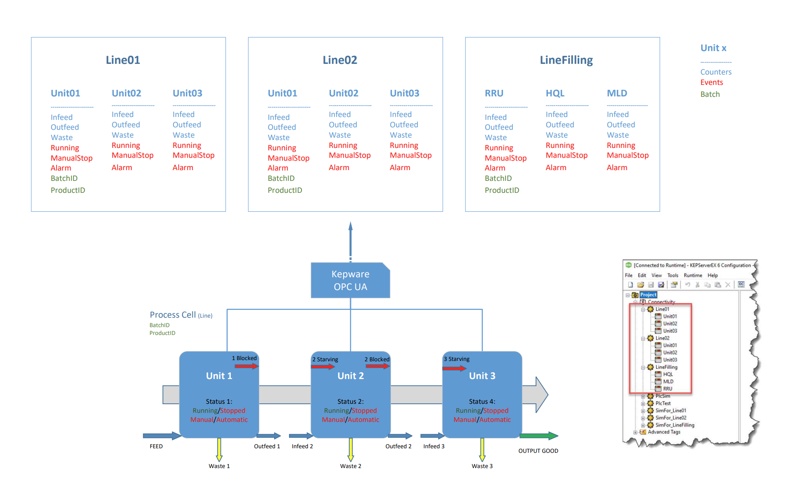

# Assets Metadata and UNS MQTT Topic Structure

Date: 2024-04-24

This document describes how we will store assets metadata and how we will use it to generate MQTT topics structure for the UNS.

## Status

[For this library of ADRs, mark the most applicable status at which it was stored in the original project. This can help provide context and validity for folks reviewing this ADR. If it has been deprecated you can add a note on why and date it.]

- [ ] Draft
- [X] Proposed
- [ ] AcceptedS
- [ ] Deprecated

## Context

For the current prototype, we consider two production sites (ex: DK/HI and FR/CH). Each site will have one area and three production lines. Each production line have several assets (edge nodes) that produces simulated tags through Kepware OPC UA Server.



We consider the following metadata:

| Country | Site | Area | ProductionLine | AssetName | NodeID                          | TagName    | QueueSize | ObservabilityMode | Sampling Interval Milliseconds |
|---------|------|------|----------------|-----------|---------------------------------|------------|-----------|-------------------|--------------------------------|
| DK      | HI   | 24A  | Line01         | Unit01    | ns=2;s=Line01.Unit01.Alarm      | Alarm      | 1         | none              | 100                            |
| DK      | HI   | 24A  | Line01         | Unit01    | ns=2;s=Line01.Unit01.BatchID    | BatchID    | 1         | none              | 100                            |
| DK      | HI   | 24A  | Line01         | Unit01    | ns=2;s=Line01.Unit01.Infeed     | Infeed     | 1         | none              | 100                            |
| DK      | HI   | 24A  | Line01         | Unit01    | ns=2;s=Line01.Unit01.ManualStop | ManualStop | 1         | none              | 100                            |
| DK      | HI   | 24A  | Line01         | Unit01    | ns=2;s=Line01.Unit01.Outfeed    | Outfeed    | 1         | none              | 100                            |
| DK      | HI   | 24A  | Line01         | Unit01    | ns=2;s=Line01.Unit01.ProductID  | ProductID  | 1         | none              | 100                            |
| DK      | HI   | 24A  | Line01         | Unit01    | ns=2;s=Line01.Unit01.Running    | Running    | 1         | none              | 100                            |
| DK      | HI   | 24A  | Line01         | Unit01    | ns=2;s=Line01.Unit01.Waste      | Waste      | 1         | none              | 100                            |
| DK      | HI   | 24A  | Line01         | Unit02    | ns=2;s=Line01.Unit02.Alarm      | Alarm      | 1         | none              | 100                            |
| DK      | HI   | 24A  | Line01         | Unit02    | ns=2;s=Line01.Unit02.Infeed     | Infeed     | 1         | none              | 100                            |
| DK      | HI   | 24A  | Line01         | Unit02    | ns=2;s=Line01.Unit02.ManualStop | ManualStop | 1         | none              | 100                            |
| DK      | HI   | 24A  | Line01         | Unit02    | ns=2;s=Line01.Unit02.Outfeed    | Outfeed    | 1         | none              | 100                            |
| DK      | HI   | 24A  | Line01         | Unit02    | ns=2;s=Line01.Unit02.Running    | Running    | 1         | none              | 100                            |
| DK      | HI   | 24A  | Line01         | Unit02    | ns=2;s=Line01.Unit02.Waste      | Waste      | 1         | none              | 100                            |
| DK      | HI   | 24A  | Line01         | Unit03    | ns=2;s=Line01.Unit03.Alarm      | Alarm      | 1         | none              | 100                            |
| DK      | HI   | 24A  | Line01         | Unit03    | ns=2;s=Line01.Unit03.Infeed     | Infeed     | 1         | none              | 100                            |
| DK      | HI   | 24A  | Line01         | Unit03    | ns=2;s=Line01.Unit03.ManualStop | ManualStop | 1         | none              | 100                            |
| DK      | HI   | 24A  | Line01         | Unit03    | ns=2;s=Line01.Unit03.Outfeed    | Outfeed    | 1         | none              | 100                            |
| DK      | HI   | 24A  | Line01         | Unit03    | ns=2;s=Line01.Unit03.Running    | Running    | 1         | none              | 100                            |
| DK      | HI   | 24A  | Line01         | Unit03    | ns=2;s=Line01.Unit03.Waste      | Waste      | 1         | none              | 100                            |
| DK      | HI   | 24A  | Line02         | Unit01    | ns=2;s=Line02.Unit01.Alarm      | Alarm      | 1         | none              | 100                            |
| DK      | HI   | 24A  | Line02         | Unit01    | ns=2;s=Line02.Unit01.BatchID    | BatchID    | 1         | none              | 100                            |
| DK      | HI   | 24A  | Line02         | Unit01    | ns=2;s=Line02.Unit01.Infeed     | Infeed     | 1         | none              | 100                            |
| DK      | HI   | 24A  | Line02         | Unit01    | ns=2;s=Line02.Unit01.ManualStop | ManualStop | 1         | none              | 100                            |
| DK      | HI   | 24A  | Line02         | Unit01    | ns=2;s=Line02.Unit01.Outfeed    | Outfeed    | 1         | none              | 100                            |
| DK      | HI   | 24A  | Line02         | Unit01    | ns=2;s=Line02.Unit01.ProductID  | ProductID  | 1         | none              | 100                            |
| DK      | HI   | 24A  | Line02         | Unit01    | ns=2;s=Line02.Unit01.Running    | Running    | 1         | none              | 100                            |
| DK      | HI   | 24A  | Line02         | Unit01    | ns=2;s=Line02.Unit01.Waste      | Waste      | 1         | none              | 100                            |
| DK      | HI   | 24A  | Line02         | Unit02    | ns=2;s=Line02.Unit02.Alarm      | Alarm      | 1         | none              | 100                            |
| DK      | HI   | 24A  | Line02         | Unit02    | ns=2;s=Line02.Unit02.Infeed     | Infeed     | 1         | none              | 100                            |
| DK      | HI   | 24A  | Line02         | Unit02    | ns=2;s=Line02.Unit02.ManualStop | ManualStop | 1         | none              | 100                            |
| DK      | HI   | 24A  | Line02         | Unit02    | ns=2;s=Line02.Unit02.Outfeed    | Outfeed    | 1         | none              | 100                            |
| DK      | HI   | 24A  | Line02         | Unit02    | ns=2;s=Line02.Unit02.Running    | Running    | 1         | none              | 100                            |
| DK      | HI   | 24A  | Line02         | Unit02    | ns=2;s=Line02.Unit02.Waste      | Waste      | 1         | none              | 100                            |
| DK      | HI   | 24A  | Line02         | Unit03    | ns=2;s=Line02.Unit03.Alarm      | Alarm      | 1         | none              | 100                            |
| DK      | HI   | 24A  | Line02         | Unit03    | ns=2;s=Line02.Unit03.Infeed     | Infeed     | 1         | none              | 100                            |
| DK      | HI   | 24A  | Line02         | Unit03    | ns=2;s=Line02.Unit03.ManualStop | ManualStop | 1         | none              | 100                            |
| DK      | HI   | 24A  | Line02         | Unit03    | ns=2;s=Line02.Unit03.Outfeed    | Outfeed    | 1         | none              | 100                            |
| DK      | HI   | 24A  | Line02         | Unit03    | ns=2;s=Line02.Unit03.Running    | Running    | 1         | none              | 100                            |
| DK      | HI   | 24A  | Line02         | Unit03    | ns=2;s=Line02.Unit03.Waste      | Waste      | 1         | none              | 100                            |
| FR      | CH   | NNPI | Line01         | Unit01    | ns=2;s=Line01.Unit01.Alarm      | Alarm      | 1         | none              | 100                            |
| FR      | CH   | NNPI | Line01         | Unit01    | ns=2;s=Line01.Unit01.BatchID    | BatchID    | 1         | none              | 100                            |
| FR      | CH   | NNPI | Line01         | Unit01    | ns=2;s=Line01.Unit01.Infeed     | Infeed     | 1         | none              | 100                            |
| FR      | CH   | NNPI | Line01         | Unit01    | ns=2;s=Line01.Unit01.ManualStop | ManualStop | 1         | none              | 100                            |
| FR      | CH   | NNPI | Line01         | Unit01    | ns=2;s=Line01.Unit01.Outfeed    | Outfeed    | 1         | none              | 100                            |
| FR      | CH   | NNPI | Line01         | Unit01    | ns=2;s=Line01.Unit01.ProductID  | ProductID  | 1         | none              | 100                            |
| FR      | CH   | NNPI | Line01         | Unit01    | ns=2;s=Line01.Unit01.Running    | Running    | 1         | none              | 100                            |
| FR      | CH   | NNPI | Line01         | Unit01    | ns=2;s=Line01.Unit01.Waste      | Waste      | 1         | none              | 100                            |
| FR      | CH   | NNPI | Line01         | Unit02    | ns=2;s=Line01.Unit02.Alarm      | Alarm      | 1         | none              | 100                            |
| FR      | CH   | NNPI | Line01         | Unit02    | ns=2;s=Line01.Unit02.Infeed     | Infeed     | 1         | none              | 100                            |
| FR      | CH   | NNPI | Line01         | Unit02    | ns=2;s=Line01.Unit02.ManualStop | ManualStop | 1         | none              | 100                            |
| FR      | CH   | NNPI | Line01         | Unit02    | ns=2;s=Line01.Unit02.Outfeed    | Outfeed    | 1         | none              | 100                            |
| FR      | CH   | NNPI | Line01         | Unit02    | ns=2;s=Line01.Unit02.Running    | Running    | 1         | none              | 100                            |
| FR      | CH   | NNPI | Line01         | Unit02    | ns=2;s=Line01.Unit02.Waste      | Waste      | 1         | none              | 100                            |
| FR      | CH   | NNPI | Line01         | Unit03    | ns=2;s=Line01.Unit03.Alarm      | Alarm      | 1         | none              | 100                            |
| FR      | CH   | NNPI | Line01         | Unit03    | ns=2;s=Line01.Unit03.Infeed     | Infeed     | 1         | none              | 100                            |
| FR      | CH   | NNPI | Line01         | Unit03    | ns=2;s=Line01.Unit03.ManualStop | ManualStop | 1         | none              | 100                            |
| FR      | CH   | NNPI | Line01         | Unit03    | ns=2;s=Line01.Unit03.Outfeed    | Outfeed    | 1         | none              | 100                            |
| FR      | CH   | NNPI | Line01         | Unit03    | ns=2;s=Line01.Unit03.Running    | Running    | 1         | none              | 100                            |
| FR      | CH   | NNPI | Line01         | Unit03    | ns=2;s=Line01.Unit03.Waste      | Waste      | 1         | none              | 100                            |
| FR      | CH   | NNPI | Line02         | Unit01    | ns=2;s=Line02.Unit01.Alarm      | Alarm      | 1         | none              | 100                            |
| FR      | CH   | NNPI | Line02         | Unit01    | ns=2;s=Line02.Unit01.BatchID    | BatchID    | 1         | none              | 100                            |
| FR      | CH   | NNPI | Line02         | Unit01    | ns=2;s=Line02.Unit01.Infeed     | Infeed     | 1         | none              | 100                            |
| FR      | CH   | NNPI | Line02         | Unit01    | ns=2;s=Line02.Unit01.ManualStop | ManualStop | 1         | none              | 100                            |
| FR      | CH   | NNPI | Line02         | Unit01    | ns=2;s=Line02.Unit01.Outfeed    | Outfeed    | 1         | none              | 100                            |
| FR      | CH   | NNPI | Line02         | Unit01    | ns=2;s=Line02.Unit01.ProductID  | ProductID  | 1         | none              | 100                            |
| FR      | CH   | NNPI | Line02         | Unit01    | ns=2;s=Line02.Unit01.Running    | Running    | 1         | none              | 100                            |
| FR      | CH   | NNPI | Line02         | Unit01    | ns=2;s=Line02.Unit01.Waste      | Waste      | 1         | none              | 100                            |
| FR      | CH   | NNPI | Line02         | Unit02    | ns=2;s=Line02.Unit02.Alarm      | Alarm      | 1         | none              | 100                            |
| FR      | CH   | NNPI | Line02         | Unit02    | ns=2;s=Line02.Unit02.Infeed     | Infeed     | 1         | none              | 100                            |
| FR      | CH   | NNPI | Line02         | Unit02    | ns=2;s=Line02.Unit02.ManualStop | ManualStop | 1         | none              | 100                            |
| FR      | CH   | NNPI | Line02         | Unit02    | ns=2;s=Line02.Unit02.Outfeed    | Outfeed    | 1         | none              | 100                            |
| FR      | CH   | NNPI | Line02         | Unit02    | ns=2;s=Line02.Unit02.Running    | Running    | 1         | none              | 100                            |
| FR      | CH   | NNPI | Line02         | Unit02    | ns=2;s=Line02.Unit02.Waste      | Waste      | 1         | none              | 100                            |
| FR      | CH   | NNPI | Line02         | Unit03    | ns=2;s=Line02.Unit03.Alarm      | Alarm      | 1         | none              | 100                            |
| FR      | CH   | NNPI | Line02         | Unit03    | ns=2;s=Line02.Unit03.Infeed     | Infeed     | 1         | none              | 100                            |
| FR      | CH   | NNPI | Line02         | Unit03    | ns=2;s=Line02.Unit03.ManualStop | ManualStop | 1         | none              | 100                            |
| FR      | CH   | NNPI | Line02         | Unit03    | ns=2;s=Line02.Unit03.Outfeed    | Outfeed    | 1         | none              | 100                            |
| FR      | CH   | NNPI | Line02         | Unit03    | ns=2;s=Line02.Unit03.Running    | Running    | 1         | none              | 100                            |
| FR      | CH   | NNPI | Line02         | Unit03    | ns=2;s=Line02.Unit03.Waste      | Waste      | 1         | none              | 100                            |

We expect it to be published into the Enterprise UNS with the following structure:

```sh
Enterprise/
└── FR/
    └── CH/
        └── NNPI
            └── Line01
               └── Unit01
                    ├── Infeed
                    ├── Outfeed
                    ├── Waste
                    ├── Running
                    ├── ManualStop
                    ├── Alarm
                    ├── BatchID
                    └── ProductID
                └── Unit02
                    ├── Infeed
                    ├── Outfeed
                    ├── Waste
                    ├── Running
                    ├── ManualStop
                    └── Alarm
                └── Unit03
                    ├── Infeed
                    ├── Outfeed
                    ├── Waste
                    ├── Running
                    ├── ManualStop
                    └── Alarm
└── DK/
    └── HI/
        └── 24A
            └── Line01
               └── Unit01
                    ├── Infeed
                    ├── Outfeed
                    ├── Waste
                    ├── Running
                    ├── ManualStop
                    ├── Alarm
                    ├── BatchID
                    └── ProductID
                └── Unit02
                    ├── Infeed
                    ├── Outfeed
                    ├── Waste
                    ├── Running
                    ├── ManualStop
                    └── Alarm
                └── Unit03
                    ├── Infeed
                    ├── Outfeed
                    ├── Waste
                    ├── Running
                    ├── ManualStop
                    └── Alarm
```

## Decision

Metadata about assets needs to be stored and reused to create a UNS friendly topic structure into Azure IoT MQ.

## Decision Drivers

- We want to store the metadata in a central place, when the assets are created (batch)
- We want to allow operator to update the metadata from this central place and ensure the changes are reflected in the Local and Enterprise UNS
- We want to ensure the MQTT topic structure is consistent across the enterprise

## Considered Options

We considered the following options to store the assets metadata:

- [Azure tags](https://learn.microsoft.com/en-us/azure/azure-resource-manager/management/tag-resources): as every asset is an Azure resource, we can benefit from the usual Azure tags to store the metadata.
- Asset custom properties: [Azure IoT Operations assets](https://learn.microsoft.com/en-us/azure/iot-operations/manage-devices-assets/overview-manage-assets#manage-assets-as-azure-resources-in-a-centralized-registry) can have a key/value property bags with any custom properties.
It is stored directly at the resource level in Azure, and it can be set using the Azure CLI, ARM Templates (batch operation) or through the Azure IoT Operations portal (manual).
- [IoT MQ State Store](https://learn.microsoft.com/en-us/azure/iot-operations/develop/concept-about-state-store-protocol): The MQ state store is a distributed storage system within the Azure IoT Operations cluster. It allows to store key-value data that could be used for such kind of metadata.

## Decision Conclusion

Azure IoT Operations asset custom properties seem to be the best candidate to store this metadata information and let operators update it in the future, **BUT** no automation is currently supported (Azure CLI / Bicep) to ingest these properties at scale.

For now, we will store it **temporary** in Azure resources tags, while starting a discussion with product group to understand when we will be able to use custom properties.

Another script will be responsible to extract metadata from the Azure resources tags and publish it into the Enterprise UNS. Once in the Enterprise UNS, it can be replicated into different production sites Local UNS (through MQTT bridge) and used inside data processor to build UNS topic path when data is ingested from Kepware simulated PLC, through the OPC UA broker.

What we imagine to have in the Enterprise UNS:

```sh
Meta/
└── DK/
    └── HI/
        └── 24A
            └── Line01
               └── Unit01
                    └── azure-iot-operations
                        └── data
                            └── kepware-opc-ua-connector
                                └── line01-unit01: { "UnsTopicName": "DK/HI/24A/Line01/Unit01" }
                                    └── Outfeed: { "SpecificTagMetadata": "SpecificTagMetadataValue" }
                                └── line01-unit02: { "UnsTopicName": "DK/HI/24A/Line01/Unit02" }
                                    └── Outfeed: { "SpecificTagMetadata": "SpecificTagMetadataValue" }
                                └── line01-unit03: { "UnsTopicName": "DK/HI/24A/Line01/Unit02" }
                                    └── Outfeed: { "SpecificTagMetadata": "SpecificTagMetadataValue" }
└── FR/
    └── CH/
        └── NNPI
            └── Line01
               └── Unit01
                    └── azure-iot-operations
                        └── data
                            └── kepware-opc-ua-connector
                                └── line01-unit01: { "UnsTopicName": "FR/CH/NNPI/Line01/Unit01" }
                                    └── Outfeed: { "SpecificTagMetadata": "SpecificTagMetadataValue" }
                                └── line01-unit02: { "UnsTopicName": "FR/CH/NNPI/Line01/Unit02" }
                                    └── Outfeed: { "SpecificTagMetadata": "SpecificTagMetadataValue" }
                                └── line01-unit03: { "UnsTopicName": "FR/CH/NNPI/Line01/Unit02" }
                                    └── Outfeed: { "SpecificTagMetadata": "SpecificTagMetadataValue" }
```

Then, it's possible to replicate this structure into the Local UNS of each production site, for example in DK/HI:

```console
Meta/
└── DK/
    └── HI/
        └── 24A
            └── Line01
               └── Unit01
                    └── azure-iot-operations
                        └── data
                            └── kepware-opc-ua-connector
                                └── line01-unit01: { "UnsTopicName": "DK/HI/24A/Line01/Unit01" }
                                    └── Outfeed: { "SpecificTagMetadata": "SpecificTagMetadataValue" }
                                └── line01-unit02: { "UnsTopicName": "DK/HI/24A/Line01/Unit02" }
                                    └── Outfeed: { "SpecificTagMetadata": "SpecificTagMetadataValue" }
                                └── line01-unit03: { "UnsTopicName": "DK/HI/24A/Line01/Unit02" }
                                    └── Outfeed: { "SpecificTagMetadata": "SpecificTagMetadataValue" }
```

This will be used to create a reference data at the local UNS structure when we have a mapping between OPC-UA broker generated topic name and UNS desired destination. Something like:

```json
{
    "UnsTopicName": "DK/HI/24A/Line01/Unit01",
    "OpcUaTopicName": "azure-iot-operations/data/kepware-opc-ua-connector/line01-unit01"
},
{
    "UnsTopicName": "DK/HI/24A/Line01/Unit02",
    "OpcUaTopicName": "azure-iot-operations/data/kepware-opc-ua-connector/line01-unit02"
},
{
    "UnsTopicName": "DK/HI/24A/Line01/Unit03",
    "OpcUaTopicName": "azure-iot-operations/data/kepware-opc-ua-connector/line01-unit03"
}
```

The we can use the data set to enrich the incoming data with the UNS topic path and route it to the right destination using dynamic output path in the data processor.

The final expected result for data in Local UNS will be the following:

```console
DK/
└── HI/
    └── 24A
        └── Line01
           └── Unit01
                ├── Infeed
                ├── Outfeed
                ├── Waste
                ├── Running
                ├── ManualStop
                ├── Alarm
                ├── BatchID
                └── ProductID
            └── Unit02
                ├── Infeed
                ├── Outfeed
                ├── Waste
                ├── Running
                ├── ManualStop
                └── Alarm
            └── Unit03
                ├── Infeed
                ├── Outfeed
                ├── Waste
                ├── Running
                ├── ManualStop
                └── Alarm
        └── Line02
           └── Unit01
                ├── Infeed
                ├── Outfeed
                ├── Waste
                ├── Running
                ├── ManualStop
                ├── Alarm
                ├── BatchID
                └── ProductID
            └── Unit02
                ├── Infeed
                ├── Outfeed
                ├── Waste
                ├── Running
                ├── ManualStop
                └── Alarm
            └── Unit03
                ├── Infeed
                ├── Outfeed
                ├── Waste
                ├── Running
                ├── ManualStop
                └── Alarm
        └── LineFilling
           └── RRU
                ├── Infeed
                ├── Outfeed
                ├── Waste
                ├── Running
                ├── ManualStop
                ├── Alarm
                ├── BatchID
                └── ProductID
            └── HQL
                ├── Infeed
                ├── Outfeed
                ├── Waste
                ├── Running
                ├── ManualStop
                └── Alarm
            └── MLD
                ├── Infeed
                ├── Outfeed
                ├── Waste
                ├── Running
                ├── ManualStop
                └── Alarm
```
