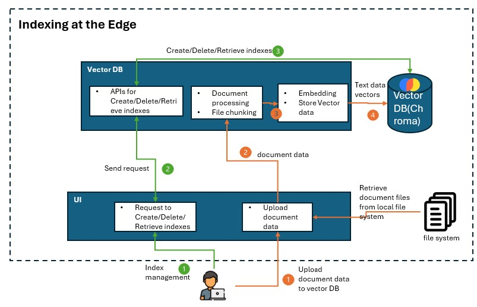
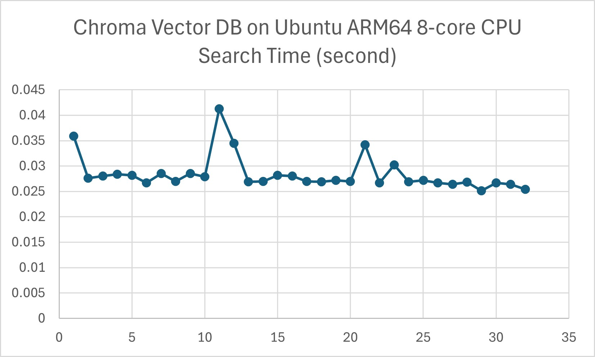

## Status

- [ ] Draft
- [ ] Proposed
- [X] Accepted
- [ ] Deprecated

## Context

With the increasing complexity of in-car assistance systems, the technical documentation searching becomes essential for enhancing the user experience. In resource-constrained in-car embedded systems, running a Retrieval-Augmented Generation (RAG) solution for document searching is a typical approach. Traditional cloud-based solutions are not viable due to offline constraints, thus on-device vector search is a crucial requirement in our scenario.

The solution scenario focuses on RAG searching for car manuals in an offline in-car environment on Qualcomm Android Automotive OS (AAOS) device.
Vector DB is used for indexing management and searching from the manuals and return the search results to SLM for RAG response.
A proof of concept (PoC) has been developed using ChromaDB for this use case. However, we need to compare and justify if ChromaDB or other vector DB is better suited in this edge environment.

A decision needs be made to select the most suitable vector database for continued development.

The architectures below illustrates the role of a vector DB is playing in the RAG on Edge application:

## Decision

Chroma DB would be a best fit for current PoC solution requirements due to its small footprint, easy deployment, acceptable speed, compatibility with the solution requirements.

It has slower indexing mechanism, but the experimental latency test on Ubuntu ARM64 is acceptable for now. It's not optimized for massive datasets but the dataset on car manuals does not require an increasing large scale of dataset. However, in serverless mode, Java is not officially supported.

FAISS (Facebook AI Similarity Search) could be another choice, but it has high RAM consumption and does not officially support Java, which is a customer requirement.

The last option could be Qdrant. Though the main concern is that its native server mode may need heavy engineering efforts for AAOS deployment.

## Decision Drivers

The below decision drivers are based on the requirements of the in-car offline RAG search scenario.

- Works offline (no cloud dependency)
A suitable vector DB should support fully local indexing and querying without requiring cloud services.
- Consumes low resources (RAM, CPU, and storage)
An AAOS environment running on a Qualcomm chip has constrained CPU, RAM, and storage. A suitable vector DB should possess a low storage footprint and low RAM usage for resource-constrained devices, along with low CPU consumption for faster search.
- Compatibility with edge environment, required frameworks, language SDK, etc.
- Performance on an embedded system
A suitable vector DB should support fast indexing and searching on an embedded system.

## Considered Options

The below lightweight vector DB candidates will be compared:

- ChromaDB
- Qdrant
- FAISS

### Comparison on Works Offline and Easily Packaged

Comparison metrics below measures if it is easily packaged with minimum dependencies and deployable to a resource constrained embedded system device.

| VDB      | open source     | lightweight | offline support | Serverless Mode                                            | Dependencies                                 | Packaging for AAOS                                |
|----------|-----------------|-------------|-----------------|------------------------------------------------------------|----------------------------------------------|---------------------------------------------------|
| ChromaDB | Yes (MIT)       | yes         | fully offline   | Yes, can be used as an in-process DB in a same application | Minimal (uses SQLite by default)             | Easier due to its serverless nature               |
| Qdrant   | Yes(Apache 2.0) | medium      | fully offline   | No, requires running a separate server                     | Requires Rust-based server with dependencies | Harder, as it requires a running database service |
| FAISS    | Yes (MIT)       | yes         | fully offline   | Yes, fully in-memory runs as a local library               | Minimal (library-only)                       | Easier, since it's a library-only solution        |

ChromaDB and FAISS are easier to deploy on AAOS because they don't require running a separate database server.

### Comparison on Software Features & Compatibility

Comparison metrics below compare the software features and measure the compatibility for the edge environment and development requirements, including development complexity and the supported indexing mechanism.

The indexing mechanism affects both indexing speed - how fast new documents are added to the database, and search speed - how quickly a query can find the closest vector matches.
Hierarchical Navigable Small World (HNSW) indexing is well known for efficient approximate nearest neighbor (ANN) search, thus the comparison metrics include if HNSW indexing is supported.

Besides, vector quantization support is compared as an important feature for reducing the memory footprint and improving the search speed.

| VDB      | ARM-compatible                     | LangChain Support    | supported languages                                                               | support HNSW indexing                            | support feature extraction | support quantization | production ready                                                                                                         | Persistence Support |
|----------|------------------------------------|----------------------|-----------------------------------------------------------------------------------|--------------------------------------------------|----------------------------|----------------------|--------------------------------------------------------------------------------------------------------------------------|---------------------|
| ChromaDB | Yes (Pure Python, runs on ARM64)   | Official integration | Python(primary), HTTP(any languages that supports HTTP requests)                  | No                                               | Yes                        | No (Not natively)    | Not fully production-ready. Actively developed and may evolving breaking changes.                                        | Yes                 |
| Qdrant   | Yes (Has ARM64 Docker images)      | Official integration | Rust(primary), Python,Java, Go, HTTP                                              | yes, natively use as the primary index structure | No                         | Yes                  | Fully production-ready (not include feature extraction)                                                                  | Yes                 |
| FAISS    | Yes (Meta officially supports ARM) | Official integration | C++(primary), Python, community wrappers for Java(unofficial), (no built-in HTTP) | yes as one of its indexing options               | No                         | Yes                  | Production-ready for specific use cases (not include feature extraction), as it lacks built-in persistence and REST API. | No                  |

Qdrant is strong at scalable vector searching where high availability in k8s cluster is required. However in our case, scalable vector search is not applicable for a car manual search scenario

Qdrant is generally considered more production-ready compared to Chroma DB.

### Comparison on Resource Consumption & Performance

Comparison metrics below measures the resource consumption, which can affect vector search efficiency on a resource constrained device.

| VDB      | Storage Usage                             | RAM usage                                                                                               | CPU usage                                                                                                                                            |
|----------|-------------------------------------------|---------------------------------------------------------------------------------------------------------|------------------------------------------------------------------------------------------------------------------------------------------------------|
| ChromaDB | Uses SQLite by default to store data      | Configurable. Support both RAM and disk based indexing. Depends on dataset size when RAM-based indexing | Moderate. As it doesn't require extra server overhead. But not support HNSW which have less CPU consumption                                          |
| Qdrant   | Uses RocksDB for on-disk storage          | Configurable. Server-based design increases CPU&RAM usage. Support both RAM and disk based indexing.    | Higher. Server based mode makes it more CPU consumption than an in-process library. Default HNSW have less CPU consumption                           |
| FAISS    | fully in-memory unless manually save/load | High. Vectors stored in memory, no disk based indexing                                                  | Low. Running as a library makes it avoiding extra server overhead and consume less CPU. If use HNSW for indexing, it will have less CPU consumption. |

In RAM-based search, vector DB loads all vectors into RAM, which enables a fast search. In disk-based search, vector DB loads vectors from disk to RAM when needed, which is slower than RAM-based search but can handle larger datasets.

Chroma DB could be slower than FAISS for large datasets due to its indexing mechanism. However in our experiment on Ubuntu ARM64 8-core CPU edge environment, indexing with 40 HTML files, 32MB data in total, ChromaDB's searching speed is acceptable for the required use case. However further latency test with a larger dataset is needed.

## Consequences

We justified that Chroma DB is suitable for current edge environment and solution scenario.

This document provides alternative vector DB options if the solution requirements change.

## Future Considerations

- Further latency test on a larger dataset is needed for the 3 vector DBs to assess real-world performance.

- Once a vector DB is selected, evaluate its actual RAM consumption under different indexing methods and quantization configurations, balancing latency and recall trade-offs.

## Reference

- [Chroma DB Vs Qdrant - Key Differences](https://airbyte.com/data-engineering-resources/chroma-db-vs-qdrant)
- [FAISS vs Chroma: A Battle of Efficiency in Vector Storage](https://myscale.com/blog/faiss-vs-chroma-efficiency-vector-storage-battle/)
- [Which Vector Database Should You Use?](https://medium.com/the-ai-forum/which-vector-database-should-you-use-choosing-the-best-one-for-your-needs-5108ec7ba133)
- [Qdrant Technical Guide](https://qdrant.tech/documentation/guides/)

*AI and automation capabilities described in this scenario should be implemented following responsible AI principles, including fairness, reliability, safety, privacy, inclusiveness, transparency, and accountability. Organizations should ensure appropriate governance, monitoring, and human oversight are in place for all AI-powered solutions.*
