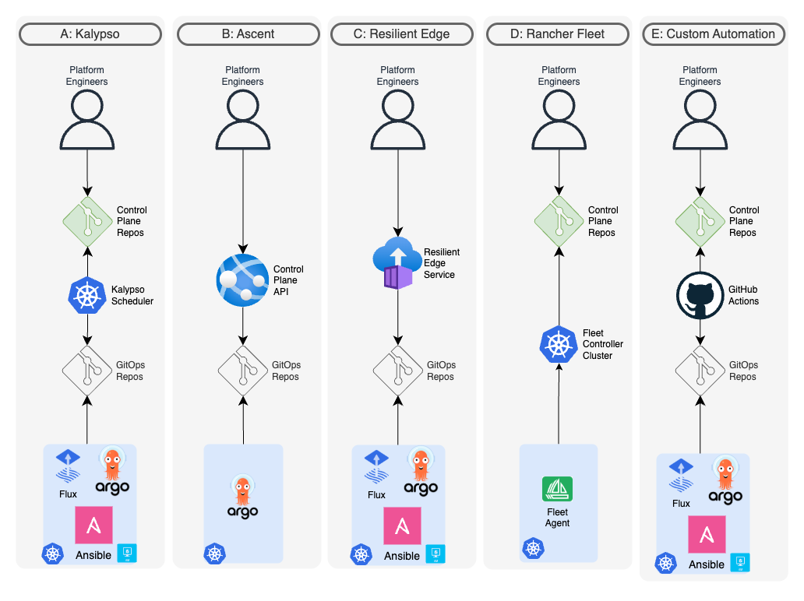
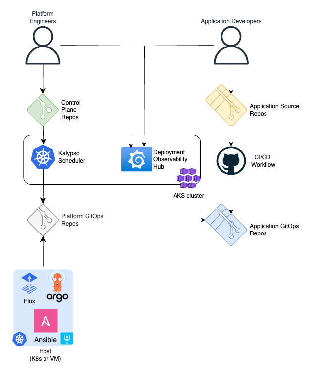
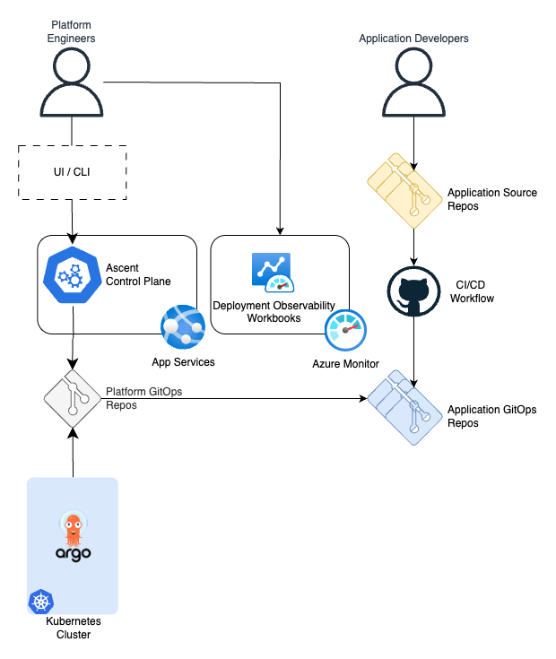
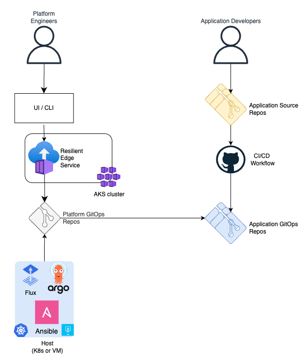
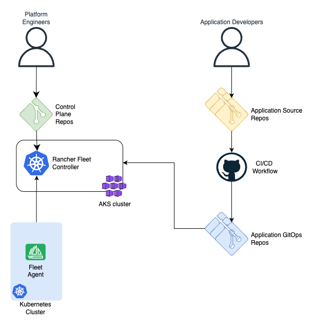
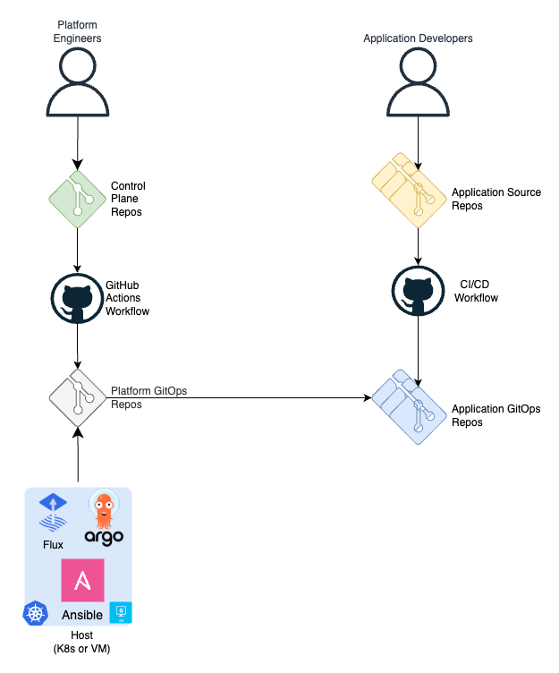

# Workload and Configuration Management

Date: **2024-06-10**

## Status

- [ ] Draft
- [ ] Proposed
- [X] Accepted
- [ ] Deprecated

## Context

There are multiple workloads, including applications, services, and ML models, that need to be deployed across various targets such as Kubernetes clusters and VMs, both at the Edge and in the cloud.
Each workload follows its own lifecycle, progressing through environments like Dev and QA before reaching production. Even with a small number of applications and clusters,
deciding which workloads should be deployed on which targets, and with what configurations at each stage, is a tedious and error-prone task. Therefore, a solution is needed to reduce complexity and make the process scalable.

## Decision

After evaluating various options, including open-source projects, Microsoft product group efforts, and custom automation, the decision was made to adopt the open-source project [Kalypso](https://github.com/microsoft/kalypso).
Kalypso offers a composable solution for workload and configuration management in multi-cluster and multi-tenant environments using GitOps principles.

## Capabilities

The evaluation of available options has been done with regards to the following capabilities, that are expected to be provided by a workload management system:

| Capability                  | Description                                                                                                                                                                                                                    |
|-----------------------------|--------------------------------------------------------------------------------------------------------------------------------------------------------------------------------------------------------------------------------|
| Workload assignment         | Assign what workloads should be deployed on what deployment targets in each environment                                                                                                                                        |
| Configuration composition   | Compose configuration values for application assignments from different configuration hierarchy/graph levels                                                                                                                   |
| Namespace as a service      | Provide each workload assignment with a workspace, containing all it needs like platform configs, secret providers, limits, quotas, service account, policies, etc.                                                            |
| Multi-cluster scalability   | Scalable with regards to a number of clusters                                                                                                                                                                                  |
| Promotion flow              | Cross environment configurations are promoted through a chain of environments to production. It is enforced that such configurations are not applied to production before being successfully tested on the lower environments. |
| Deployment observability    | Monitor what workload and configuration values are deployed on what deployment target across environments                                                                                                                      |
| Reconciler agnostic         | No hard dependency on how exactly (Flux, ArgoCD, Ansible, etc). the deployment is performed on each deployment target                                                                                                          |
| Non-containerized workloads | Assign and configure non-containerized workloads (e.g. Debian packages)                                                                                                                                                        |
| Platform as code            | Keep platform definition, such as environments, deployment targets, workloads, configurations, etc. in a Source Control Management system                                                                                      |
| UI/CLI                      | Provide a UI/CLI to define platform entities                                                                                                                                                                                   |

## Considered Options

The following options were considered. Each aims to solve the problem of Kubernetes fleet configuration management by providing a way to control what applications are deployed, where they are deployed, and with what configurations.
They define the desired state of the fleet. The actual deployment process, including when it happens and with what authorizations and approvals, is a separate concern that may vary with each application and host. Some of the considered tools also address this reconciliation aspect.

> **NOTE**
>
> At the time this ADR was created, the Workload Orchestration Azure service (aka Configuration Manager) was under development and wasn't considered a realistic option.

### Option A. Kalypso

- [Kalypso GitHub repository](https://github.com/microsoft/kalypso)
- [Workload management in a multi-cluster environment with GitOps](https://learn.microsoft.com/azure/azure-arc/kubernetes/conceptual-workload-management)
- [Explore workload management in a multi-cluster environment with GitOps](https://learn.microsoft.com/azure/azure-arc/kubernetes/workload-management)

Kalypso is a composable solution consisting of the following components:

- Application CI/CD templates with GitOps​
  - Promote application changes across environments in GitOps fashion​
- Control Plane. Kalypso Scheduler​.
  - Assign applications to the clusters​
  - Compose platform configurations​
  - Dedicate namespace-as-a-service for the applications on the clusters​
- Deployment Observability Hub​
  - Monitor what application versions are deployed to what clusters in the environments​

Platform engineers define the deployment platform with a set of high level abstractions such as environments, cluster types, workloads, configurations, assignment policies, etc.
These abstraction are CRD objects, that are processed by Kalypso Scheduler on a management Kubernetes cluster.
The output of the scheduler is put in a platform GitOps repository that contains assignments, composed configurations and relevant platform services needed by the workloads.

The Deployment Observability Hub collects information about scheduled deployments from the application GitOps repositories and the actual deployment state from all clusters in the fleet. It provides a set of Grafana dashboards that enable the following activities:

- Monitor what workload and configuration versions are deployed to clusters/hosts in the environments
- Compare environments and see deployment discrepancy (e.g. how my "stage" environment is different from "prod")
- Track deployment history per environment, per application/service, per microservice
- Compare desired deployment state to the reality and see deployment drift

**Capabilities matching**

| Capability                  | Support | Comments                                                                                                                                                                                                                                                                                                                                                                                                                                                                                                                                                                        |
|-----------------------------|---------|---------------------------------------------------------------------------------------------------------------------------------------------------------------------------------------------------------------------------------------------------------------------------------------------------------------------------------------------------------------------------------------------------------------------------------------------------------------------------------------------------------------------------------------------------------------------------------|
| Workload assignment         | YES     | Workload assignment is based on capability matching, so that workloads and deployment targets are marked with capabilities/tags and Kalypso Scheduler performs automatic assignment                                                                                                                                                                                                                                                                                                                                                                                             |
| Configuration composition   | YES     | Platform engineers define a [configuration graph](https://learn.microsoft.com/azure/azure-arc/kubernetes/conceptual-workload-management#configuration-graph-model) and Kalypso Scheduler composes configuration values for each application assignment based on capability matching                                                                                                                                                                                                                                                                                             |
| Namespace as a service      | YES     | Platform engineers define a namespace structure for workloads assigned to clusters. Each namespace can include resources necessary for the workload, such as service accounts, ConfigMaps, secret provider classes, as well as resources that enforce limits and quotas.                                                                                                                                                                                                                                                                                                        |
| Multi-cluster scalability   | YES     | Kalypso Scheduler assigns and configures workloads at the cluster type level, rather than at the cluster level. A cluster type represents a group of similar clusters in terms of applications and configurations. Each cluster type might be backed up by any number of clusters that consume Kalypso's output and deploy applications and configurations with GitOps. The Deployment Observability Hub component operates at the cluster level and it stores the deployment state data for each cluster in a database, capable of handling any reasonable number of clusters. |
| Promotion flow              | YES     | There is an explicit definition of environments. By the means of GitHub action workflows, Kalypso Scheduler enforces global configurations to be promoted across a chain of environments.                                                                                                                                                                                                                                                                                                                                                                                       |
| Deployment observability    | YES     | Deployment observability hub provides out-of-the-box Grafana dashboards to monitor what workload versions are deployed on what clusters                                                                                                                                                                                                                                                                                                                                                                                                                                         |
| Reconciler agnostic         | YES     | Kalypso Scheduler generates workload assignments and configuration compositions using templates. Every cluster type may have different reconciler (e.g. FLux, ArgoCD, Ansible, etc.) and the scheduler will use different templates while assigning applications to them.                                                                                                                                                                                                                                                                                                       |
| Non-containerized workloads | YES     | Leveraging the templates flexibility, Kalypso Scheduler generates Ansible playbooks to deploy and configure non-containerized workloads                                                                                                                                                                                                                                                                                                                                                                                                                                         |
| Platform as code            | YES     | Platform engineers define the deployment platform with CRD objects such as environment, cluster types, workloads, etc. It's very common to keep and maintain these definitions in a Git repository and deliver them to the Kalypso management cluster with GitOps.                                                                                                                                                                                                                                                                                                              |
| UI/CLI                      | NO      | By default, Kalypso Scheduler relies on the `Platform as Code` concept, so that the input is provided through a Git repository. However, customer is free to implement a preferable UI solution (e.g. VS code extension) to manipulate Kalypso Scheduler CRD objects.                                                                                                                                                                                                                                                                                                           |

**Concerns**

- The solution requires a dedicated management cluster to host Kalypso Scheduler and Deployment Observability Hub
- If the Platform Team is not familiar with Git, they might require a custom UI on top of Kalypso Scheduler
- Kalypso is an open-source solution. It's not a managed service.

### Option B. Ascent

- [Ascent GitHub repository](https://github.com/Azure-Samples/Ascent)

Project Edge Ascent was inspired by Kalypso and implemented similar concepts but in a different way.
This is a FastAPI-based application that exposes API endpoints to define applications, clusters, namespaces and target assignment policies.
The service processes these entities, assigns applications to the clusters using capability matching approach, generates ArgoCD resources and puts them in a GitOps repository, which is observed by the clusters in the fleet.

**Capabilities matching**

| Capability                  | Support | Comments                                                                                                                                                                                                                                                                                                    |
|-----------------------------|---------|-------------------------------------------------------------------------------------------------------------------------------------------------------------------------------------------------------------------------------------------------------------------------------------------------------------|
| Workload assignment         | YES     | Workload assignment is based on capability matching, so that applications and clusters are marked with capabilities/tags and Ascent performs automatic assignment                                                                                                                                           |
| Configuration composition   | NO      |                                                                                                                                                                                                                                                                                                             |
| Namespace as a service      | NO      |                                                                                                                                                                                                                                                                                                             |
| Multi-cluster scalability   | YES     | Ascent stores all the input data in a database, which is capable of handling a reasonable scale. The output is a GitOps repository consumed by any number of clusters.                                                                                                                                      |
| Promotion flow              | NO      |                                                                                                                                                                                                                                                                                                             |
| Deployment observability    | Partial | The observability solution is based on ArgoCD metrics, which are fed into Azure Monitor. It gives information about the deployment process health across the clusters at the low level, but there is a lack a unified logical data model that operate at the level applications, versions and environments. |
| Reconciler agnostic         | NO      | Ascent requires ArgoCD as a GitOps operator on the clusters.                                                                                                                                                                                                                                                |
| Non-containerized workloads | NO      | Kubernetes only with ArgoCD                                                                                                                                                                                                                                                                                 |
| Platform as code            | NO      | Platform engineers can define Ascent abstractions in a Git repository and then have a CI/CD pipeline deliver them to Ascent trough available API                                                                                                                                                            |
| UI/CLI                      | NO      | Ascent exposes API only. It is up to the customer how to use it.                                                                                                                                                                                                                                            |

**Concerns**

- The solution requires Azure App Services to be hosted on. It requires access management to the API.
- The solution requires either UI/CLI to be built or a Git CI/CD setup to be configured by the customer.
- Ascent is an open-source solution. It's not a managed service.

### Option C. Resilient Edge

- [ResEdge GitHub repository](https://github.com/cse-labs/res-edge-labs/blob/pragmatical/docs/docs/README.md)

Resilient Edge is based on a database with an API service that exposes endpoints for applications, namespaces that assemble applications in bundles, clusters and cluster groups.
Namespaces are configured with expressions that resolve to what clusters the applications, included in the namespace are supposed to be deployed.
There is also an automation process that processes all defined entities, evaluates target clusters for applications,
generates manifests with the templates provided for each application and pushes the manifests to a platform GitOps repository, which is observed by the clusters in the fleet.

**Capabilities matching**

| Capability                  | Support | Comments                                                                                                                                                                                                                                                                           |
|-----------------------------|---------|------------------------------------------------------------------------------------------------------------------------------------------------------------------------------------------------------------------------------------------------------------------------------------|
| Workload assignment         | YES     | Workload assignment is based on expressions that include hierarchy rules and capability matching                                                                                                                                                                                   |
| Configuration composition   | YES     | Platform configuration composition is application centric and based on based Kustomize overlays                                                                                                                                                                                    |
| Namespace as a service      | YES     | Each application refers a template to generate assignment manifests. The template can define a namespace for the application and it's content                                                                                                                                      |
| Multi-cluster scalability   | YES     | ResEdge stores all the input data in a database, which is capable of handling a reasonable scale. The output is a GitOps repository consumed by any number of clusters.                                                                                                            |
| Promotion flow              | NO      |                                                                                                                                                                                                                                                                                    |
| Deployment observability    | NO      |                                                                                                                                                                                                                                                                                    |
| Reconciler agnostic         | YES     | ResEdge generates manifests using templates. Every application can be delivered to the clusters by different reconcilers (e.g. FLux, ArgoCD, Ansible, etc.)                                                                                                                        |
| Non-containerized workloads | YES     | Leveraging the templates flexibility, ResEdge can generate Ansible playbooks to deploy and configure non-containerized workloads                                                                                                                                                   |
| Platform as code            | NO      | Platform engineers can define ResEdge abstractions in a Git repository and then have a CI/CD pipeline deliver them to Ascent trough available API                                                                                                                                  |
| UI/CLI                      | YES     | There is a basic web UX for Res-Edge. It provides CRUD for the core entities - Application, Cluster, Group, Namespace. There is `ds` CLI that provides some basic quires and updates to the ResEdge entities, but it can't be used to completely define and maintain the platform. |

**Concerns**

- It is difficult to define a [configuration graph](https://learn.microsoft.com/azure/azure-arc/kubernetes/conceptual-workload-management#configuration-graph-model) with the Kustomize approach
- The automation process regenerates all manifests on each run, leading to the "render the universe" problem. This results in scalability limitations and implicit cross-dependencies, where a small change to one application or cluster can impact the entire fleet.
- The solution requires a dedicated management cluster to host ResEdge API service and a SQL database. The service requires maintenance and user access management.
- ResEdge is not an open-source solution. It lives in a private repository. It is expected that customer clones it, develops and maintains on its own.

### Option D. Rancher Fleet

- [Rancher Fleet GitHub repository](https://fleet.rancher.io/)

Platform engineers define the deployment platform with a set of high level abstractions such as clusters, cluster groups, GitOps repositories, assignment rules, etc.
These abstractions are CRD objects, processed by Rancher Fleet controller, hosted on a management Kubernetes cluster. Each cluster runs a Fleet Agent, which connects to the controller cluster and grabs assigned manifests.

**Capabilities matching**

| Capability                  | Support | Comments                                                                                                                                                                                                                                                                            |
|-----------------------------|---------|-------------------------------------------------------------------------------------------------------------------------------------------------------------------------------------------------------------------------------------------------------------------------------------|
| Workload assignment         | YES     | Workload assignment is based on expressions that include hierarchy rules and capability matching                                                                                                                                                                                    |
| Configuration composition   | YES     | The assignment expressions include configuration customizations. They are based on Helm values and the overlays approach, similar to Kustomize                                                                                                                                      |
| Namespace as a service      | NO      |                                                                                                                                                                                                                                                                                     |
| Multi-cluster scalability   | NO      | Each cluster in a fleet is represented by an object in the controller Kubernetes cluster. The number of these clusters is limited by the controller cluster resources.                                                                                                              |
| Promotion flow              | NO      |                                                                                                                                                                                                                                                                                     |
| Deployment observability    | YES     | The deployment state across all clusters is reflected by the Rancher Fleet objects on the controller cluster                                                                                                                                                                        |
| Reconciler agnostic         | NO      | Hard dependency on Rancher Fleet Agent                                                                                                                                                                                                                                              |
| Non-containerized workloads | NO      | Kubernetes only                                                                                                                                                                                                                                                                     |
| Platform as code            | YES     | Platform engineers define the deployment platform with CRD objects such as clusters, cluster groups, repositories, assignment rules, etc. It's very common to keep and maintain these definitions in a Git repository and deliver them to the Fleet controller cluster with GitOps. |
| UI/CLI                      | YES     | A set of CLIs such as `fleet`, `fleet-agent` and `fleet-controller` help with maintaining the system. However, all abstractions (CRDs) are supposed to be created with a standard Kubernetes API.                                                                                   |

**Concerns**

- The controller cluster is a single point of failure, imposing additional requirements regarding availability and connectivity from the fleet clusters.
- Hard dependency on Rancher Fleet Agent reconciler
- The solution requires a dedicated management cluster to host Fleet controller
- If the Platform Team is not familiar with Git, they might require a custom UI on top of Rancher Fleet
- Rancher Fleet is an open-source solution. It's not a managed service.

### Option E. Custom GitHub Actions Workflow

Platform engineers define the deployment platform with a set of high level abstractions such as environments, clusters, applications, assignment rules in a Control Plane repository.
A GitHub Actions workflow uses scripts and CLI tools to process the abstractions, defined in the repo, generates assignment manifests and pushes them to the platform GitOps repository.

**Concerns**

The capabilities matching map depends on the exact implementation. There are fundamental concerns that are applicable to any solution like this:

- High latency. All workflow executions are synchronized, which places an upper bound on the scalability of the system during peak deployment periods.
- Render the universe. Each workflow run regenerates everything.
  - Without extracting the automation to a service, the process of generating manifests scales with `O(a*c)`, where `a` is the number of applications and `c` is the number of clusters.
  - A single invalid manifest may break manifest generations for the unrelated applications.

## Future Considerations

The related topics are highlighted in separate ADRs:

- [Deployment on the Edge with GitOps](./deployment-on-edge-gitops.md)
- [GitOps operator for an Azure Arc enabled cluster](./gitops-operator.md)
- [CI/CD. Multi-Environment Promotional Flow with GitOps](./cicd-gitops.md)
- Deployment Observability
- Secret Management on the Edge with GitOps
- GitOps Security Plan
