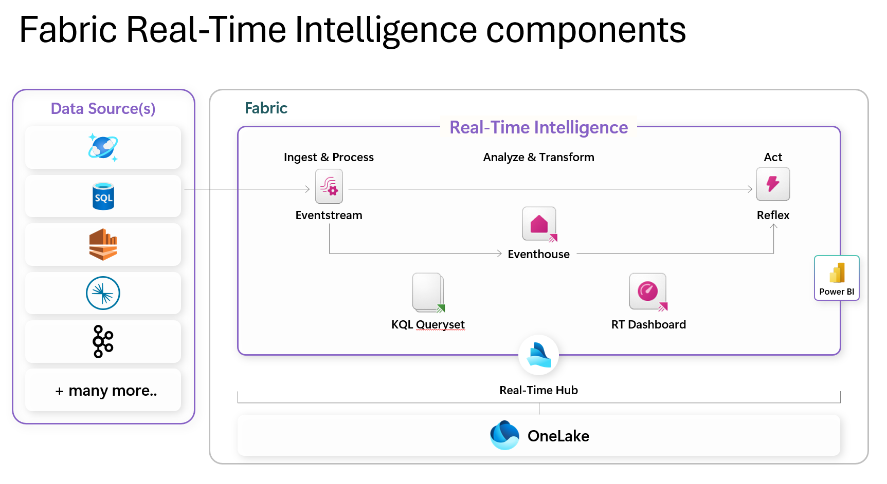
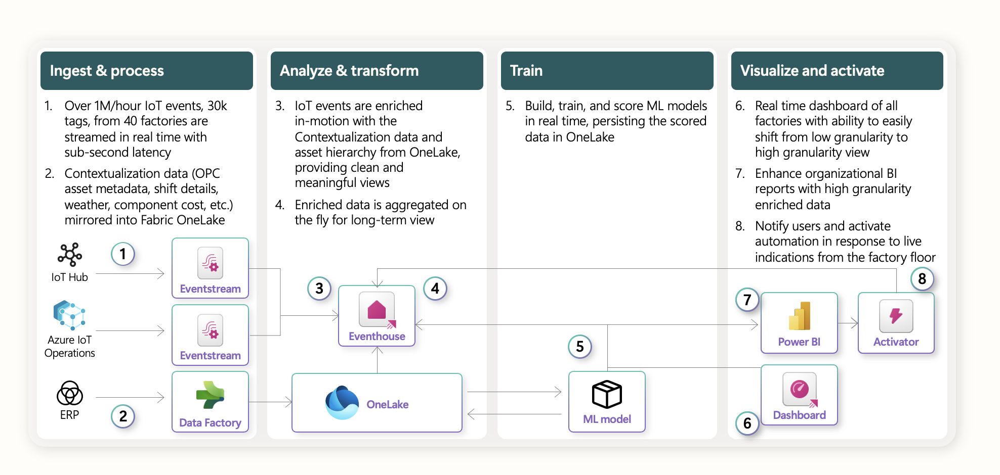
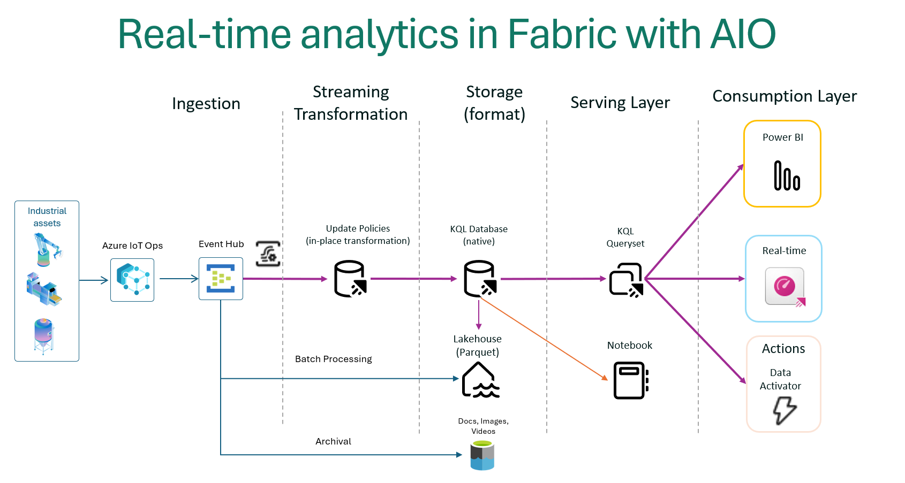
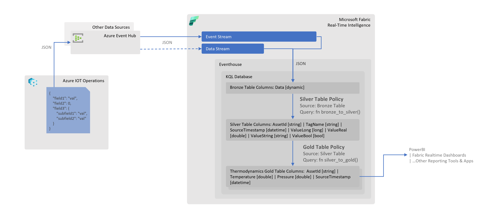
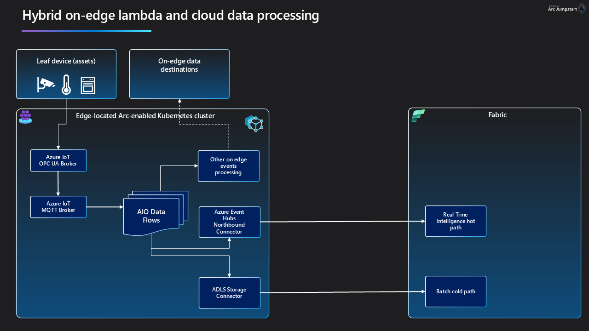

## Overview

The influx of high granularity data from edge computing systems is rapidly increasing. This data
comes from sensors, IoT devices, digital applications, business
processes, telemetry, logs, and more. Because of the massive volume and
wide variety of data, analyzing a single data point out of trillions of
records from industrial assets with low latency and high accuracy, has
always become increasingly challenging.

Additionally, excessive data storage on the edge compute layer increases
its gravity leading to increased security and governance risks. Edge
devices are also notoriously insecure and hence security is a paramount
consideration for customers. Given that most of the data processed on
the edge is for streaming or near real-time applications, customers want
to move older data to the cloud for further processing and consumption.


## Hybrid Edge to Cloud Data Processing using Adaptive Cloud Strategies

All physical plant industries are experiencing a significant increase in devices connecting
to cloud networks through locally operated edge computing systems.
This setup is particularly common in industrial clients, where large
volumes of data are collected from sensors and devices monitoring
industrial processes. This data is transmitted to the cloud via edge
computing environments such as Azure IoT Operations, arriving in various
formats and velocities.

Typically, edge data requires cleaning and transformation to be valuable
for downstream analytical processes.

While some of the data processing can occur at the Edge using Azure IoT
Operations(AIO) data management modules, the volume often exceeds Edge
processing capacity. Consequently, the data must be transferred to
cloud-based systems like Microsoft Fabric or Azure Data Lake Storage,
where it can be stored long-term and enriched with data from other
sources for enhanced analytics. This method, where both edge and cloud
systems share data processing responsibilities, is known as Hybrid
Edge-Cloud processing.

Shown below is a simple diagram illustrating the Edge Hybrid Design
pattern of a shared responsibility between the edge and the cloud:


## Data gravity and analytics at the edge

Data gravity means that accumulated data attracts more data and applications due to its mass and value.
With the rapid growth of edge data from IoT devices, sensors, and real-time analytics, bringing
applications closer to the data could have its own benefits and implications, which need to be carefully evaluated. This shift from cloud to edge computing reduces latency, enhances performance
, and speeds up decision-making by processing data locally, optimizing efficiency and responsiveness.

### Implications of data gravity on edge applications

Data gravity has several important implications:

* Centralization of Data   : As data accumulates, it attracts more data and applications, leading to centralized data hubs.
* Performance and Latency  : Bringing applications closer to data reduces latency and enhances performance, which is crucial for real-time analytics and decision-making.
* Security and Compliance  : Centralized data requires robust security measures and compliance with regulations, as it becomes a more attractive target for cyber threats.
* Infrastructure and Costs : Managing large volumes of data in centralized locations can increase infrastructure complexity and costs.
* Innovation and Efficiency: Centralized data can drive innovation by providing comprehensive datasets for AI and machine learning, improving efficiency and insights.

## Scenarios for using edge hybrid data processing

### To support high-data volume low-latency applications

For sub-100 millisecond latency requirements for manufacturing
automation, content creation, real-time gaming, high-frequency trading
platforms, augmented and virtual reality (AR/VR), autonomous vehicles,
and inference at the edge. One of the main purposes is also to put cloud
infrastructure and services in physical proximity to where applications
and end users are located, such as datacenters, large metro centers, and
the mobile network edge.

### Process data locally but archive on the cloud

Handle the enormous amount of data generated in your digital
transformation initiatives on Fabric and on the Edge. Build a consistent
hybrid architecture that includes data sets that must remain on the Edge
due to cost, size, bandwidth, or timing constraints but also easily move
data to the cloud for archiving.

### Meet data residency requirements

Store data in a specific country or region to meet tax regulatory requirements, data sovereignty regulations
and adapt to changing geo-political dynamics. Use the same services and tools to manage, analyze, and archive on the cloud.

### Inferencing at the Edge

Inferencing on the edge is a computational process where
pre-trained models are deployed to the edge to process input data to
derive actionable insight without the data having to travel to the
cloud. This allows for real-time decision making on the data and
minimizes network latency incurred in data traveling from the edge to
the cloud and back.

### Federated data querying between the edge and the cloud

Federated data querying can be a popular option when both the edge and
the cloud have in-memory data stores enabled such that the data can be
retrieved using SQL queries through custom built software querying
layer. This can eliminate the need to transfer the data between the edge
and the cloud thus enabling faster access to data. This scenario is
especially helpful in [fog computing environments](https://ieeexplore.ieee.org/document/9046806) where data on the cloud
needs to be often joined with data on the edge with minimal transfer of data to
reduce latency.

## Data Persistence options

The following diagram shows a decision path one can take to make the
informed choices for a given scenario


### Edge Data Storage Options

**InfluxDB:** InfluxDB is a time series database (TSDB) designed for storing and retrieving time series data, which is data that is indexed by time. This makes it particularly useful for operations monitoring, application metrics, Internet of Things (IoT) sensor data, and real-time analytics.
    Time-series data is typically stored in a
    [columnar database](https://www.influxdata.com/glossary/column-database/) format that is optimized for storing
     large volumes of data in a compressed format. The storage layer also includes indexing mechanisms to enable
      efficient access to data based on time ranges.
InfluxDB is built to handle high-volume, high-velocity data and real-time queries. It can analyze millions of time series data points per second without limits or caps. The platform is built in Rust and leverages the FIDAP stack—Flight, Iceberg, DataFusion, Arrow, and Parquet—using Apache-backed technologies to efficiently ingest, store, and analyze time series data at any scale.

**Distributed Cache:** Allows storing and retrieving network
    requests and responses. Often used with service workers to cache
    resources for offline use.

**Azure IoT Operations State Store**: Applications can get, set, and
    delete key-value pairs without the need to install additional
    services such as Redis.

**Azure Container Storage enabled by Azure Arc**: Storage
    system designed for Arc-enabled Kubernetes. Enables workloads to
    write files to a "ReadWriteMany" persistent volume claim where they
    are then transferred to Azure Blob Storage.

**Azure Arc Data Services**: Brings Azure based services to the edge by
    enabling SQL Managed Instance and Azure Arc-enabled PostgreSQL (preview)
    on Azure Arc-enabled Kubernetes clusters.

### Azure Storage Services

**Azure Blob Storage**: Massively scalable and secure object storage
    for cloud-native workloads, archives, data lakes, high-performance
    computing, and machine learning.

**Azure Data Lake Storage**: Designed for high-performance analytics
    workloads

**Azure File Sync**: Hybrid cloud file shares for caching your
    on-premises data

**Azure Blob Storage for data archival**
Azure Blob Storage can be effectively used to archive IoT data by following these steps:

* Local Storage on Edge: Deploy Azure Blob Storage on IoT Edge devices to store data locally. This setup allows for temporary storage and processing of data at the edge before uploading it to the cloud.
* Data Tiering         : Automatically tier data from IoT Edge devices to Azure Blob Storage. The architecture can be designed to move data to the archive tier, which is cost-effective for long-term storage.
* Lifecycle Management : Use lifecycle management policies to automatically move data to the archive tier based on predefined rules, such as data age or access frequency.
* Archiving on Upload  : Directly upload data to the archive tier using the Azure portal, PowerShell, Azure CLI, or AzCopy. This ensures that data is archived immediately upon upload.
* Rehydration          : When needed, rehydrate archived data to an online tier (hot or cool) to access or modify it. This process can take several hours, depending on the priority and size of the data.

### Microsoft Fabric

Microsoft Fabric is an end-to-end analytics platform designed to bring together all the data and analytics tools that organizations need. It integrates Power BI, Data Factory, and the next generation of Synapse into a unified and simplified experience. This platform offers a price-performant and easy-to-manage modern analytics solution for all workloads and users. Microsoft Fabric is built to support data-driven decisions with AI-powered analytics and machine learning, reducing data complexity
 by supporting all data lifecycle stages in a single, optimized SaaS environment.

**Key Features:**

* Unified Data Lake       : OneLake provides a single, unified, logical data lake for the entire organization. It eliminates the need for multiple data lakes, reducing overhead and improving collaboration.
* Unified Platform        : Fabric integrates Power BI, Data Factory, and the next generation of Synapse into a single, simplified experience. This unification reduces the complexity of managing multiple tools and provides a seamless workflow for data professionals.
* AI-Powered Analytics    : Fabric leverages AI and machine learning to automate repetitive tasks and uncover real-time insights, enabling faster and more informed decision-making.
* End-to-End Data Services: Fabric supports all stages of the data lifecycle, from ingestion to visualization, within a single SaaS environment. This holistic approach ensures that all data-related tasks can be performed within one platform.
* Seamless Integration with Azure: Fabric connects seamlessly with Azure, enhancing Azure's data processing and analytics capabilities. This integration allows users to leverage Azure's scalability, reliability, and security while benefiting from Fabric's unified data management.

Microsoft Fabric offers a variety of data storage options to cater to different analytical needs. Here are the main options:

* SQL Database  : These are designed for structured data and can support both transactional and analytical workloads. They are ideal for scenarios with moderate data volumes and provide robust granular access controls.
* Data Warehouse: Fabric warehouses support full transactional capabilities and can be populated using various data ingestion methods such as COPY INTO, Pipelines, Dataflows, or cross-database ingestion options.
* Lakehouse     : These are designed to handle large-scale data engineering and analytics workloads. They support both data engineering with Apache Spark and SQL analytics.
* Eventhouse    : These are optimized for real-time analytics and event-driven data processing.
* OneLake       : This is a unified data lake that supports any type of file, structured or unstructured. It integrates seamlessly with the broader Fabric ecosystem and supports open formats like Parquet and Delta Lake.

## Key considerations for relational databases at the Edge

### RDBMS on the Edge

A customer may have Azure Arc-enabled data services or network-accessible databases but getting them to work could involve complex network configurations. Additionally, Azure IoT Operations only supports running databases within Kubernetes clusters. Containerizing data workloads has seen limited adoption due to issues like restarts, scale-out, virtualization, and other constraints. Managing state
of the database ensuring availability to other application layers, and providing redundancy for a database have specific requirements, making it challenging to use databases as the preferred choice.

### RDBMS on Microsoft Fabric

Fabric supports multiple RDBMS options such as SQL Server, but its relational query processing was not designed to meet
 the real-time demands of Edge data processing workloads.
  Managing scalability, balancing workloads between rapid writes and low-latency reads, and dynamic partitioning
 required for real-time applications can impose operational overheads over time and lead to cost challenges.
Due to the shortcomings of relational databases, a scalable and
resilient time-series database is more effective. Fabric has provided
Eventhouse, which is a KQL storage and query processing engine, as the
preferred alternative for enabling systems of engagement for real-time
applications.

### Caching data on the Edge

A caching layer, which works by storing frequently accessed data in memory using in-memory data stores such as [Microsoft Garnet] or Azure IoT
Operations' built-in distributed State Store, helps to overcome the performance and scalability limitations of traditional structured
databases. This approach accelerates transactional response times through immediately accessible in-memory stored data and improves
scalability via distributed caching to help databases scale horizontally. Caching is a sound strategy when data is relatively static.

## Challenges of a Caching Layer

In systems where data is highly dynamic, caching
usually becomes a major liability. Some significant challenges get
introduced when a caching layer is deployed with a dynamic operational
database, namely:

Instability under duress -- Caching strategies routinely fail for use
cases with heavy write loads, especially those that exceed available
DRAM. Cache invalidations or misses means a round trip to the operation
databases, adding load and latency to the overall response time.

**Complexity** -- Adding more caching layers increases complexity, which in
turn slows development cycles while increasing development and
maintenance costs. More complex systems are harder to reason for,
causing elongated break-fix cycles when problems do occur.

**Data loss** -- In-memory data is not saved in case of a server crash or
power loss, hence the potential for data loss between writes to
persistent disk storage. This leads to more architectural complexity,
since reliable queues or message buses must be employed to ensure the
data will be preserved to the system of record.

**Delayed consistency** -- Writes lag real-time events, resulting in
"eventual consistency" where stale data is used by the application -- an
unacceptable norm.

**Server sprawl** -- With limited DRAM capacity per node, additional servers
must be continuously added as workloads increase. DRAM, which is
significantly more expensive than disk drives and SSDs, introduces
additional power consumption and cooling issues and can be a major
contributor to runaway system costs.

**High operating expense** -- Personnel hours are wasted on activities that
need to be performed manually, such as cluster management, scaling, and
data replication. In addition, as clusters grow, annual server
maintenance expenses increase.

**Long warm-up cycles** -- Warming up a cache can take days, which adversely
impacts system availability, performance, and data consistency; it can
even result in data loss.

**Limited data access** -- Because cache storage capacity is limited by
physical and economic factors, only a subset of data can be made
available for real-time access. The lack of access to the entirety of
the data set can restrict the functional capabilities needed by the
business and can potentially compromise data availability.

## Writing data from IoT Operations to Fabric

### Components of Fabric Real-Time Intelligence

Following is a reference architecture for hybrid edge data processing with Fabric Eventhouse:



Following is an overview of the components shown in the diagram:

* Real-Time Hub: This serves as a centralized catalog within your organization, facilitating easy access, addition, exploration, and data sharing. It ensures that data is accessible to all, promoting quick decision-making and informed action.
* Eventstream: This feature allows you to bring real-time events into Fabric, transform them, and route them to various destinations without writing any code.
* Eventhouse: These are designed for real-time analytics and event-driven data processing. They provide a scalable infrastructure for handling growing volumes of data, ensuring optimal performance and resource use.
* KQL Database: These support creating and altering tables, functions, update policies, and ingestion mappings. They are used for interactive and complex data queries.
* Activator: This component is used for triggering actions based on real-time data events.
* Reflex: This is used for real-time data enrichment and contextualization.
* RTI Dashboards: These provide visual insights and geospatial analysis of real-time data.

A typical data flow for a real-time data processing system using Fabric Eventhouse would look like the following:


## [Fabric Eventhouse][def] for real-time analytics of data from the Edge

Following is a reference architecture for hybrid edge data processing with Fabric Eventhouse:



The diagram shows how streaming data from Azure IoT Operations can be
ingested into Eventhouse (KQL) through an EventHub cluster at a high
velocity. The data can then be augmented and transformed within a set of
KQL databases for further downstream processing. Transformed edge data
can also be shared or ingested into Fabric Lakehouse to support batch
analytics use cases.

Writing to Eventhouse gives us the following advantages:

**Built for hybrid cloud environments without requiring complex integrations** - Eventhouse in Microsoft Fabric is built for hybrid edge-to-cloud integration and real-time analytics. It can handle large volumes of data efficiently, letting users ingest, process, and analyze data at near real-time. With an ability to host multiple KQL databases,
it is a preferred choice for managing a variety of data such as telemetry, logs, time series and IoT data.
Additionally, it's backward compatible and comes with various connectors, so you can keep your existing app components without having to rearchitect everything when moving to Fabric-based Eventhouse.

**Scalability** -- KQL database in Eventhouse can scale horizontally, enabling applications to run in parallel on a cloud-based cluster comprising
dozens, hundreds, or even thousands of commodity servers. KQL database in Eventhouse can also scale up to exploit new hardware like SSDs
(solid-state drives) and transactional memory.

**Flexibility** -- Eventhouse’s schema-less KQL database can handle and store structured, unstructured, and semi-structured data, facilitating flexible and swift development of applications and use cases like real-time decision-making, recommendations, profile management, bidding, and risk profiling.

**Achieve greater agility** - Edge-to-cloud platforms give organizations the flexibility to respond quickly to requests from the business, capitalize
on market opportunities when they arise, and accelerate time-to-market for new products.

**Realize the transformational value of apps and data** - Some data sets are simply too large or business-critical to make the move to the cloud. An
edge-to-cloud platform offers maximum availability and minimum latency for data assets. It provides a powerful way to create and clean data
lakes and extract vital information through analytics and AI.

**Availability** -- Eventhouse on Fabric features a distributed architecture that ensures there is no single point of failure. If one or more nodes go down, the other nodes in the system can continue operations without data loss, and without impacting availability of the data.

**Data Compression** -- Eventhouse allows large volumes of data to be compressed and this helps in improving query performance, saving costs. Data compression can be achieved using the gzip compression algorithm. The amount of compression varies, but the median to expect is 7x compression from the uncompressed size of data being ingested. Eventhouse also supports automatic compression of exported data.
This reduces storage space and improves performance.

## Design Patterns for Hybrid Processing between the Edge and Eventhouse on Fabric

### Medallion architecture in Eventhouse for Streaming Data from Azure IoT Operations

Medallion architecture is a design pattern used in data engineering to organize data into different layers or zones. This pattern ensures data quality, enhances data processing efficiency, and simplifies data management. The architecture typically consists of three layers; the subsequent section elaborates on the layers and other aspects of implementation in context
of Azure IoT Operations and Microsoft Fabric.

>**NOTE**: This pattern is particularly useful in manufacturing domain as tags (data points) collected/configured on the shop floor are often added/removed by Operational Technology (OT), this pattern will remove dependency on IT to update the corresponding IT constructs e.g. Fabric KQL tables, when such changes are made on the shop floor/edge.



#### Bronze Layer

Purpose: Serves as the initial landing zone for data before any transformation or cleaning.

It is a raw data table in Fabric KQL database, stores raw, unprocessed data as it is ingested from various sources. This layer might include duplicates, errors, and inconsistencies. In case of machine data in manufacturing domain, we receive a JSON document which may contain multiple tags for an asset, the document is stored as-is in a single column of `dynamic` type called `Data`.
As JSON is inserted and parsed into a `dynamic` type column at the ingestion time, the performance penalty is lower than parsing JSON at each query time (e.g., using the `parse_json` function).
KQL queries can then be written to access fields in the JSON using dot notation.

A sample JSON, KQL scripts and Bronze layer table output is provided below:

Inbound JSON Document Example (e.g. via EventHub Data Stream):

```json
    "Data": {
        "humidity": {
            "SourceTimestamp": "2025-02-04T11:24:52.9911021Z",
            "Value": 11.23
        },
        "temperature": {
            "SourceTimestamp": "2025-02-04T11:24:52.2919706Z",
            "Value": -4.4
        }
    }
```

Table Mapping Script:

>**Note** Use this mapping when creating Data Stream to load data in the table. This enables any system properties (e.g. `x-opt-partition-key`) you might have configured during Data Stream creation to be inserted in `Data` column along with the inbound JSON.

`.create-or-alter table ['Bronze'] ingestion json mapping 'bronze_mapping' '[{"column":"Data", "Properties":{"Path":"$"}}]'`

Table Output:

| Data                                                                                                                                                                                                             |
|------------------------------------------------------------------------------------------------------------------------------------------------------------------------------------------------------------------|
| {"x-opt-partition-key":"site01/channel22/freezer01","humidity":{"SourceTimestamp":"2025-02-04T11:24:52.9911021Z","Value":"11.23"},"temperature":{"SourceTimestamp":"2025-02-04T11:24:52.2919706Z","Value":-4.4}} |
| {"x-opt-partition-key":"site01/channel22/freezer02","humidity":{"SourceTimestamp":"2025-02-04T11:24:52.8911021Z","Value":"12.49"},"temperature":{"SourceTimestamp":"2025-02-04T11:24:52.8911021Z","Value":-3.2}} |
| {"x-opt-partition-key":"site01/channel22/freezer06","humidity":{"SourceTimestamp":"2025-02-04T11:24:51.9911021Z","Value":"11.76"},"temperature":{"SourceTimestamp":"2025-02-04T11:24:51.9911021Z","Value":-3.4}} |
| ------                                                                                                                                                                                                           |

#### Silver Layer

Purpose: Provides a more reliable and consistent dataset for analytical processing and further refinement.

It is a cleaned and refined data table in KQL, contains data that has undergone transformation, cleansing, and normalization. Errors and duplicates are addressed in this layer. This table is updated via KQL [table policy](https://learn.microsoft.com/fabric/real-time-intelligence/table-update-policy) construct, as new records are inserted in Bronze layer table.
The record insertion in Silver layer table occurs using the following logic:

1. Create a function `bronze_to_silver` to run every time a new record inserted in Bronze layer table called `bronze`. The function will expand JSON in the `Data` column of Bronze layer table and split into type specific columns e.g. `ValueInt`, `ValueReal`, `ValueString` in Silver layer table.
2. Add a table policy on Silver layer table `silver` to trigger the function created in step 1 above every time a record is added in Bronze layer table.

A sample JSON, KQL scripts and Silver layer table output is provided below:

JSON Document:

```json
{
    "x-opt-partition-key": "site01/channel22/freezer01",
    "humidity": {
        "SourceTimestamp": "2025-02-04T11:24:52.9911021Z",
        "Value": "11.23"
    },
    "temperature": {
        "SourceTimestamp": "2025-02-04T11:24:52.2919706Z",
        "Value": -4.4
    }
}
```

Table Policy Script:

`.alter table ['Silver'] policy update @'[{"Source": "Bronze", "Query": "bronze_to_silver()", "IsEnabled": "True"}]'`

Function Script:

```KQL
.create-or-alter function bronze_to_silver() {
    ['Bronze']
        | extend OriginalData = Data
        | mv-expand kind=array Data
        | extend
                TagName = tostring(Data[0]),
                _payload = todynamic(Data[1]),
                ValueLong = iff((gettype(Data[1].Value) in ("int", "long")),
                                tolong(Data[1].Value),
                                long(null)),
                ValueReal = iff((gettype(Data[1].Value) in ("real", "double")),
                                toreal(Data[1].Value),
                                real(null)),
                ValueString = iff((gettype(Data[1].Value) == "string"),
                                tostring(Data[1].Value),
                                parse_json("null")),
                ValueBool   = iff((gettype(Data[1].Value) == "bool"),
                                tobool(tostring(Data[1].Value)),
                            bool(null))
        | extend
            Asset = tostring(OriginalData["x-opt-partition-key"])
        | where TagName != "x-opt-partition-key"
        | project
                Asset,
                TagName,
                SourceTimestamp = todatetime(_payload.SourceTimestamp),
                ValueLong,
                ValueReal,
                ValueString,
                ValueBool
}
```

Table Output:

| Asset                      | TagName     | SourceTimestamp          | ValueLong | ValueReal | ValueString | ValueBool |        |
|----------------------------|-------------|--------------------------|-----------|-----------|-------------|-----------|--------|
| site01/channel22/freezer01 | humidity    | 2025-02-04T11:24:52.991Z |           | 11.23     |             |           |        |
| site01/channel22/freezer01 | temperature | 2025-02-04T11:24:52.292Z |           | -4.4      |             |           |        |
| site01/channel22/freezer02 | temperature | 2025-02-04T11:24:52.891Z |           | -3.2      |             |           |        |
| site01/channel22/freezer02 | humidity    | 2025-02-04T11:24:52.891Z |           | 12.49     |             |           |        |
| site01/channel22/freezer06 | temperature | 2025-02-04T11:24:51.991Z |           | -3.4      |             |           |        |
| site01/channel22/freezer06 | humidity    | 2025-02-04T11:24:51.991Z |           | 11.76     |             |           |        |
| ------                     | ------      | ------                   | ------    | ------    | ------      | ------    | ------ |

#### Gold Layer

Purpose: Ensures data is in its most refined form, ready for consumption by end-users and analytical tools.

It is a curated data layer, holds aggregated, and business-ready data optimized for reporting, business intelligence (BI), and machine learning (ML) applications. It follows the same pattern as that in Silver layer above; except that in this layer we copy records from Silver layer table to Gold layer table(s) using the table policy and function mechanism.
Also, the records processed in this layer are targetted for the domain specific materialized views e.g. assessing thermodynamics of the shop floor.

### Structured Streaming with Spark


Following is an overview of the architecture:

* Ingesting Data with Eventhub: The process begins with Azure Event Hubs, which acts as a real-time data streaming platform. Event Hubs can ingest millions of events per second from various sources, such as IoT devices, applications, and logs. The data is then streamed into Spark Structured Streaming, which processes the data in real-time.

* Processing Data with Spark Structured Streaming: Spark Structured Streaming allows you to express your streaming computation the same way you would express a batch computation on static data. You can create an Event Hubs source for streaming queries and configure the connection string and other parameters. The data is processed in micro-batches, ensuring low-latency and fault-tolerant processing.

* Storing and Querying Data with Eventhouse KQL: After processing the data with Spark Structured Streaming, the data is ingested into Eventhouse (KQL) for further analysis. Eventhouse is designed for real-time analytics and event-driven data processing. It provides a scalable infrastructure for handling growing volumes of data and supports complex queries using KQL (Kusto Query Language). The data can be augmented and transformed within a set of KQL databases for further downstream processing.

* Visualizing Data with Real-Time Dashboards: The final step involves visualizing the processed data using real-time dashboards. Microsoft Fabric provides RTI Dashboards that offer visual insights and geospatial analysis of real-time data. These dashboards allow you to monitor and analyze the data in real-time, enabling quick decision-making and informed action.

* Using Fabric Data Activator: Fabric Data Activator is a no-code experience in Microsoft Fabric for automatically taking actions when patterns or conditions are detected in changing data. It monitors data in Power BI reports and eventstreams, for when the data hits certain thresholds or matches other patterns. It then automatically takes appropriate action such as alerting users or kicking off Power Automate workflows.
  By integrating Spark Structured Streaming with Fabric Data Activator, you can set up automated responses to real-time data events.
  This enhances the overall efficiency and responsiveness of your data processing workflows.

## Fabric Lakehouse for batch analytics of data from the Edge

What would automation of the stack look like?

## Lambda architecture for distributed processing on edge and to Fabric

In lambda architecture implementations on Fabric, separate data processing
layers exist for high-volume batch processing and low-latency,
high-throughput stream processing for (near) real time analytics.

In hybrid environments using Azure IoT Operations, events
processed through the AIO MQTT broker can serve as input for these
processing layers. This data can enable scenarios that serve stream data processing
purposes, often complemented by batch data processing approaches.

Azure IoT Operations DataFlows and its ease of extensibility
enables filtering and routing data on-edge into streams and cold path
storage before it's pushed to the cloud. This on-edge data processing
allows for lower cost on bandwidth and higher throughput for high
priority data. Bearing in mind the added operational expense for resources to do
local processing of the data.



## Data backup, recovery and failover support in Eventhouse

Fabric Eventhouse offers robust backup and recovery options to ensure data integrity and business continuity. The key options include:

* Regular Backups : Eventhouse supports regular backups of your data using Azure Storage for archival purposes.
  When data is ingested into Eventhouse, it can be automatically archived to Azure Storage.
  This process involves creating a shared access policy on your event hub instance and capturing
   the details needed to connect via this policy. The archived data is stored in Azure Storage Blobs,
    which ensures that it is securely stored and can be accessed when needed.
* Restore Points : You can create restore points and perform an in-place restore of a warehouse to a past
   point in time. This allows you to restore the data warehouse to a prior known reliable state by replacing or overwriting
    the existing data warehouse from which the restore point was created.
* Disaster Recovery : Fabric Eventhouse features a distributed architecture that ensures there is no single point of failure.
  If one or more nodes go down, the other nodes in the system can continue operations without data loss and without
   impacting the availability of the data.

The *disaster recovery* feature in Fabric enables geo-replication of your data for enhanced security and reliability.
 This feature consumes more storage and transactions, which are billed as BCDR Storage and BCDR Operations respectively.
  Additionally, the disaster recovery process involves creating a new Fabric capacity in a new region and copying data from
   the disrupted region to the new one. This ensures that data remains available and operations can continue with minimal disruption.

In Fabric Eventhouse, failover recovery options are designed to ensure business continuity and data integrity in the event
 of a disaster. The failover model in Eventhouse is implemented on the Active-Standby model.This model is designed to ensure
  high availability and reliability by having a standby unit ready to take over in case the active unit fails. In this model,
 the disaster recovery (DR) unit in the paired region is ready to take over for the DR unit in the failed region.

In this model, the system consists of two units: the active unit and the standby unit. The active unit handles all the operations and processes the
 data, while the standby unit remains idle but synchronized with the active unit. This synchronization ensures that the standby unit
  has the most recent state of the system and can take over seamlessly if the active unit fails.

When a failure is detected in the active unit, the system automatically switches to the standby unit. This process involves several steps:

* Detection: The system continuously monitors the health of the active unit. If a failure is detected, the system initiates the failover process.
* Failover Initiation: The system stops all operations on the active unit and redirects them to the standby unit.
* Synchronization: The standby unit, which has been kept in sync with the active unit, takes over the operations without any data loss.
* Notification: Users are notified about the failover, and the system continues to operate using the standby unit.

This model ensures minimal downtime and data loss, providing a robust solution for high availability and disaster recovery.

The Active-Standby model offers several key benefits for ensuring high availability and reliability in Fabric Eventhouse:

* Minimal Downtime: The standby unit is always synchronized with the active unit, ensuring that it can take over operations seamlessly in case of a failure. This minimizes downtime and ensures continuous availability of services.
* Data Integrity: Since the standby unit is kept in sync with the active unit, there is no data loss during the failover process. This ensures that all data remains intact and up-to-date.
* Automatic Failover: The failover process is automated, which means that it does not require manual intervention. This reduces the risk of human error and ensures a quick response to failures.
* Scalability: The Active-Standby model can be scaled to accommodate larger workloads by adding more standby units. This ensures that the system can handle increased demand without compromising on availability or performance.
* Cost-Effective: By having a standby unit that is only activated during a failure, the Active-Standby model can be more
 cost-effective compared to having multiple active units running simultaneously. However, maintaining a standby unit can be a significant expense, particularly for smaller organizations.

These benefits make the Active-Standby model a robust solution for maintaining high availability and reliability in Fabric Eventhouse.

[Microsoft Garnet]: https://www.microsoft.com/research/blog/introducing-garnet-an-open-source-next-generation-faster-cache-store-for-accelerating-applications-and-services/?msockid=1801f6b6973f61b51466e273963060b
[def]: https://learn.microsoft.com/fabric/real-time-intelligence/eventhouse

*AI and automation capabilities described in this scenario should be implemented following responsible AI principles, including fairness, reliability, safety, privacy, inclusiveness, transparency, and accountability. Organizations should ensure appropriate governance, monitoring, and human oversight are in place for all AI-powered solutions.*

---

*This documentation is part of the [Edge AI Platform](../index.md) project.*
