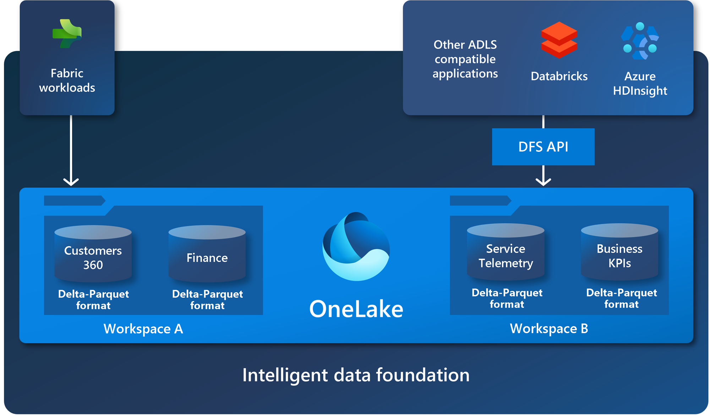
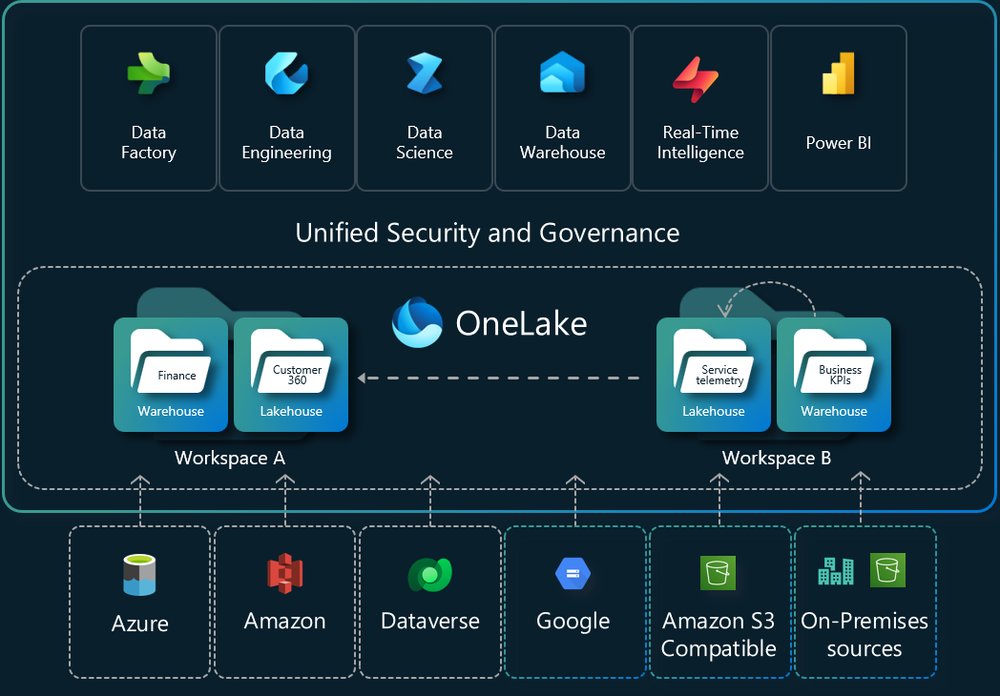

# Evaluate Spark Engine in Azure Fabric

Date: **2024-04-20**

## Description

As a data engineer, I want to run transformation jobs in the Spark Engine in Fabric to evaluate the
following:

- Integrate with Minimum Viable Experiment (MVE) Data Generator
- Flexibility of Job Scheduling
- Integration with Azure Data Lake Storage (ADLS)/OneLake
- Performance of Spark Engine
- Continuous Integration/Continuous Deployment (CI/CD) of Spark Notebooks
- Data Observability
- Integration with Great Expectations
- Azure Key Vault (KeyVault) Integration
- Cost Estimation
- Security considerations of Spark jobs

## Summary

### Feature Support Summary

| Feature                                               | Support Status |
|-------------------------------------------------------|----------------|
| Flexibility of Job Scheduling                         | Partial        |
| Integration with ADLS/OneLake                         | Yes            |
| Performance of Spark Engine                           | Yes            |
| CI/CD of Spark Notebooks                              | Limited        |
| Data Observability                                    | Limited        |
| Integration of Great Expectations for Data Validation | Yes            |
| KeyVault Integration in Spark Engine                  | Yes            |
| Cost Estimation for Workloads                         | Needs Review   |

### Findings

#### Flexibility of Job Scheduling

In short, Apache Spark job scheduling can be done at the Cluster level or at the Spark Application level:

- **Cluster Level:**
  *At the cluster level, job scheduling manages multiple Spark applications sharing the same cluster. Resources like memory and compute cores are allocated per job and locked until completion, minimizing contention. This is ideal for environments requiring strict resource isolation.*
  [Learn more about Spark cluster management](https://learn.microsoft.com/azure/hdinsight/spark/apache-spark-overview)

- **Application Level:**
  *At the application level, a Spark job is triggered by an action (e.g., `collect()`, `count()`, or `save()`) within a Spark application. When multiple job requests are submitted, the Spark scheduler manages these jobs by dividing them into stages and tasks, which are then executed in parallel. This level of scheduling is ideal for fine-grained control over individual job execution.*
  [Read about Spark job scheduling](https://spark.apache.org/docs/latest/job-scheduling.html)

#### Spark Job Definition Comparison

| Feature                             | Support Status |
|-------------------------------------|----------------|
| Concurrency Throttling and Queueing | Partial        |
| Integration with ADLS/OneLake       | Yes            |
| Performance of Spark Engine         | Yes            |
| CI/CD of Spark Notebooks            | Limited        |
| Data Observability                  | Limited        |
| Integration of Great Expectations   | Yes            |
| KeyVault Integration                | Yes            |
| Cost Estimation                     | Needs Review   |

### Key Details

#### Microsoft Fabric Spark Job Submission

- **Job Submission:**
  *Job submission in Microsoft Fabric is governed by the purchased capacity Stock Keeping Units (SKUs). Jobs are queued in a **First In, First Out (FIFO)-based queue** and are submitted when capacity becomes available. If all capacity is utilized, new submissions are throttled with the following message:*
  > "Unable to submit this request because all the available capacity is currently being used. Cancel a currently running job, increase your available capacity, or try again later."
  *Notebook jobs and Spark job definitions are automatically retried when capacity becomes available, with a queue expiration of **24 hours** from the submission time.*
  [Learn more about Spark job submission in Fabric](https://learn.microsoft.com/fabric/data-engineering/spark-compute#job-submission)

#### Bursting

- **Bursting Capabilities:**
  *Fabric supports **bursting**, allowing workloads to exceed purchased capacity by up to **3X the Spark Virtual Cores (VCores)**. This feature increases concurrency but does not raise the maximum cores per job. Bursting is ideal for handling temporary spikes in demand.*
  [Understand bursting in Microsoft Fabric](https://learn.microsoft.com/fabric/enterprise/fabric-capacity-units-cu#bursting)

#### Optimistic Job Admission

- **Concurrency Flexibility:**
  *Optimistic job admission enables running up to **24 jobs concurrently** with the same configuration when submitted simultaneously. This prevents job starvation and improves concurrency by up to **12X** in some scenarios.*
  [Read about concurrency in Spark](https://learn.microsoft.com/fabric/data-engineering/spark-compute#concurrency)

### Custom Apache Spark Pools

- **Custom Spark Pools:**
  *Users can create custom Spark pools in Fabric with the option to enable or disable **autoscaling**. Autoscaling dynamically adjusts the number of nodes based on workload requirements, retiring nodes after job execution to optimize resource usage.*
  [Learn about custom Spark pools](https://learn.microsoft.com/fabric/data-engineering/spark-pools#custom-spark-pools)

### Additional Considerations and Limitations

- **Livy API:**
  *Currently not exposed in Fabric. Users must create notebooks and Spark job definitions using the Fabric User Interface (UI).*
  [Livy API roadmap](https://learn.microsoft.com/fabric/data-engineering/spark-compute#limitations)

- **Managed Identity:**
  *Fabric does not yet support running notebooks and Spark job definitions using workspace identity or managed identity for Azure Key Vault within notebooks.*
  [Key Vault integration limitations](https://learn.microsoft.com/fabric/data-engineering/spark-compute#limitations)

## Performance of Spark Engine

- **Startup Time:**
  *The Spark engine in Fabric spins up significantly faster than Synapse Spark, with startup times of **2 to 4 seconds** compared to **~2 minutes** in Synapse.*
  [Compare Fabric Spark and Synapse Spark](https://learn.microsoft.com/fabric/data-engineering/spark-compute#compare-fabric-data-engineering-and-azure-synapse-spark)

- **Executor Usage Graph:**
  *The executor usage graph in Spark 3.4+ displays resource allocation and usage via a line chart under the Resources tab.*

## Integration with ADLS/OneLake

### OneLake: To Rule Them All

#### Overview

OneLake is a single, unified, logical data lake for the entire organization, akin to OneDrive.
OneLake comes automatically with every Microsoft Fabric tenant and is designed to be the **single
place for all analytics data**. OneLake offers:

- One data lake for the entire organization


- One copy of data for use with multiple analytical engines


#### Key Features of OneLake

- Built on **Azure Data Lake Storage (ADLS) Gen2**, supporting all file types (structured or unstructured)
- Stores all Fabric data artifacts for data warehouse and lakehouse layers in **Delta Parquet format**
- Compatible with existing ADLS Gen2 applications, including Azure Databricks using the same APIs and SDKs
- Allows addressing data as if it's one big ADLS storage account for the organization
- Each workspace corresponds to a container; different data items appear as folders within those containers
  [Read more about OneLake on the Microsoft blog](https://techcommunity.microsoft.com/t5/analytics-on-azure-blog/introducing-onelake-the-one-drive-for-data-in-microsoft-fabric/ba-p/3836464)

#### OneLake File Explorer for Windows

OneLake is the "OneDrive for data," enabling:

- **Easy exploration of OneLake data from Windows:**
  *Users can browse OneLake data directly from their Windows File Explorer, making it simple to navigate through folders and files without needing specialized tools or technical expertise.*

- **Navigation across workspaces and data items:**
  *OneLake organizes data into workspaces, with each workspace corresponding to a container. Users can seamlessly navigate between different workspaces and access data items stored within them.*

- **Uploading, downloading, and modifying files:**
  *Users can interact with OneLake data just like they would with files on their local machine. This includes uploading new files, downloading existing ones, and making modifications directly from the File Explorer.*

Even **nontechnical users** can work with data lakes through OneLake File Explorer, as it abstracts the complexity of data lake operations and provides a familiar interface.
[Learn more about OneLake File Explorer](https://techcommunity.microsoft.com/t5/analytics-on-azure-blog/introducing-onelake-the-one-drive-for-data-in-microsoft-fabric/ba-p/3836464)

## CI/CD of Spark Notebooks

### Source Control Integration

#### Git Integration Features

- Fabric supports Git integration with Azure DevOps and Azure Repos

> **Note:** Some items are in preview.
> [Learn more about supported items for Git integration](https://learn.microsoft.com/fabric/cicd/git-integration/intro-to-git-integration?tabs=azure-devops#supported-items)
>
- Each team member creates isolated workspaces during collaboration
- Version control for entire analytics projects
- Branch protection and review policies support
- Conflict resolution with automatic merging when possible

#### Git Workflow Support

  [Learn more about Git workflow support](https://learn.microsoft.com/fabric/cicd/git-integration/git-integration-process)

- **Feature branch development:** Developers work on isolated branches for new features or fixes.
- **Pull request-based reviews:** Code changes are reviewed and approved via pull requests.
- **Automatic conflict detection:** Identifies and resolves merge conflicts automatically when possible.
- **History tracking and rollback capabilities:** Maintains a detailed history of changes with the ability to revert to previous versions.
- **Parallel development support:** Enables multiple developers to work on different features simultaneously.

### Deployment Pipeline Features

#### Environment Management

- **Support for multiple environments (Dev/Test/Prod):** Enables the separation of environments to ensure proper testing and validation before production deployment.
- **Environment-specific configurations:** Allows customization of settings such as connection strings and resource allocations for each environment.
- **Selective deployment of artifacts:** Provides the ability to deploy only specific components or artifacts to targeted environments.
- **Automated validation between stages:** Ensures that deployments meet predefined quality and compliance standards before progressing to the next stage.
  [Learn more about Git workflow support](https://learn.microsoft.com/fabric/cicd/git-integration/git-integration-process)

#### Deployment Rules

- **Validation Rules:** Ensure code quality and standards
- **Dependencies:** Automatic dependency resolution
- **Rollback:** Automated rollback on failure
- **Versioning:** Automatic version management
- [Learn more about how deployment pipelines work](https://learn.microsoft.com/fabric/cicd/deployment-pipelines/understand-the-deployment-process?tabs=new-ui)

### Supported Artifacts

Learn more about supported items for deployment pipeline here:
  [Learn more about supported items for deployment pipelines](https://learn.microsoft.com/fabric/cicd/deployment-pipelines/intro-to-deployment-pipelines?tabs=new-ui#supported-items)

### Integration Features

#### Azure DevOps Integration

- **Built-in CI/CD with Azure pipelines:** Streamline deployment processes with integrated pipelines.
  [Learn more about CI/CD with Azure pipelines](https://techcommunity.microsoft.com/t5/azure-developer-community-blog/ci-cd-pipelines-with-azure-devops/ba-p/366045)
- **Work item tracking:** Track development tasks and issues efficiently.
  [Learn more about work item tracking](https://learn.microsoft.com/azure/devops/boards/work-items/about-work-items?view=azure-devops)
- **Release management:** Manage releases with automated workflows.
  [Learn more about release management](https://learn.microsoft.com/azure/devops/pipelines/release/)
- **Automated testing support:** Validate code quality with automated tests.
  [Learn more about automated testing](https://learn.microsoft.com/azure/devops/pipelines/test/continuous-test-java)

#### Automated Testing Support

- **Notebook validation:** Ensure notebooks meet quality standards.
  [Learn more about notebook validation](https://techcommunity.microsoft.com/t5/azure-ai-blog/validating-jupyter-notebooks-in-azure-machine-learning/ba-p/2285461)
- **Data quality checks:** Verify data integrity and consistency.
  [Learn more about data quality checks](https://techcommunity.microsoft.com/t5/analytics-on-azure-blog/data-quality-in-azure-synapse-analytics/ba-p/3662646)
- **Performance testing:** Assess system performance under load.
  [Learn more about performance testing](https://learn.microsoft.com/azure/architecture/example-scenario/testing/performance-testing-azure)
- **Security compliance verification:** Ensure adherence to security standards.
  [Learn more about security compliance](https://learn.microsoft.com/azure/security/fundamentals/overview)

### Security and Compliance

#### Access Control

- **Role-based access control (RBAC):** Manage access permissions effectively.
  [Learn more about RBAC](https://learn.microsoft.com/azure/role-based-access-control/overview)
- **Environment-specific permissions:** Customize permissions for each environment.
  [Learn more about environment-specific permissions](https://learn.microsoft.com/azure/devops/pipelines/security/permissions?view=azure-devops)
- **Secret management integration:** Securely manage sensitive information.
  [Learn more about secret management](https://learn.microsoft.com/azure/key-vault/general/overview)
- **Audit logging:** Track and review system activities.
  [Learn more about audit logging](https://learn.microsoft.com/azure/active-directory/reports-monitoring/concept-audit-logs)

#### Compliance Features

- **Change tracking:** Monitor and log changes to resources.
  [Learn more about change tracking](https://learn.microsoft.com/azure/automation/change-tracking/overview)
- **Deployment approvals:** Enforce approval workflows for deployments.
  [Learn more about deployment approvals](https://learn.microsoft.com/azure/devops/pipelines/policies/approvals?view=azure-devops)
- **Audit history:** Maintain a record of all changes and actions.
  [Learn more about audit history](https://learn.microsoft.com/azure/active-directory/reports-monitoring/audit-logs-overview)
- **Regulatory compliance support:** Ensure compliance with industry standards.
  [Learn more about regulatory compliance](https://learn.microsoft.com/azure/security/compliance/compliance-overview)

### Known Limitations

#### Current Limitations

| Azure DevOps On-Prem | Not supported |
| Sovereign Clouds | Not supported |
| DirectQuery Models | No support for DirectQuery and composite models on Power BI datasets |
| Analysis Services | Limited integration with Analysis Services |
| DirectLake | DirectLake semantic models not supported |

#### Workarounds

- Use Azure DevOps Services instead of on-premises
- Implement custom validation for unsupported scenarios
- Use alternative deployment methods for unsupported artifacts
- Manual intervention for complex scenarios

## Data Observability

### Features

- **Spark Advisor:** Built-in monitoring of pools and jobs via the Monitoring Hub.
  [Learn more about Spark Advisor](https://techcommunity.microsoft.com/t5/analytics-on-azure-blog/monitoring-apache-spark-jobs-in-azure-synapse-analytics/ba-p/3662647)
- **Spark history server:** Provides basic observability.
  [Learn more about Spark history server](https://learn.microsoft.com/fabric/data-engineering/browse-spark-applications-monitoring-hub)
- **Monitoring Spark Jobs within Notebooks:**
  [Spark job notebooks](https://learn.microsoft.com/fabric/data-engineering/spark-monitor-debug)

## Integration of Great Expectations

### Observability Using Great Expectations

Great Expectations (GX) provides robust data validation capabilities to ensure data quality and consistency in Spark workflows. By integrating GX with Microsoft Fabric, users can define, execute, and monitor data validation rules seamlessly.

- **Data Validation:** Define expectations for data quality, such as schema validation, null checks, and value ranges.
- **Integration with SemPy:** Use SemPy to simplify the creation and execution of GX validations within Spark workflows.
- **Automated Monitoring:** Monitor data quality issues in real-time and generate detailed reports for analysis.
- **Ease of Use:** GX integrates natively with Microsoft Fabric, enabling users to validate data without extensive setup.

For a step-by-step guide, refer to the [Tutorial: Validate data using SemPy and Great Expectations (GX) Data Validation with Great Expectations on Microsoft Fabric](https://learn.microsoft.com/fabric/data-science/tutorial-great-expectations).

## Fabric Spark Security

1. **Network Isolation with Managed Virtual Networks (VNets)**
   Managed VNets provide network isolation for Fabric Spark workloads by creating dedicated networks per workspace. Starter pools become unavailable as they run in shared networks. To enable managed VNets, refer to the public documentation.

2. **Data Exfiltration Protection (DEP)**
   When available, DEP ensures outbound connectivity only to approved destinations via managed private endpoints. It blocks public library installations, requiring custom libraries packaged as JARs or Wheel files. DEP is recommended for production but may hinder development processes.

3. **Protecting Secrets**
   - Avoid hard-coding secrets in code; use secure vaults like Azure Key Vault (AKV).
   - Protect AKVs with firewall rules and use managed private endpoints for secure access.
   - Use `notebookutils.credentials.getSecret('<AKV URL>', 'Secret Name')` for retrieving secrets in Notebooks.
   - For production, use service accounts to access AKVs instead of user accounts.
   - Example PySpark code for accessing AKV with a service principal:

     ```python
     from azure.identity import ClientSecretCredential
     from azure.keyvault.secrets import SecretClient

     # Create a credential using client ID, client secret, and tenant ID
     client_secret_credential = ClientSecretCredential(
         client_id="<client id>",
         client_secret="<client secret>",
         tenant_id="<tenant id>"
     )

     # Build the secret client
     secret_client = SecretClient(
         vault_url="<vault url>",
         credential=client_secret_credential
     )

     # Retrieve the secret
     secret_name = "<your value>"
     retrieved_secret = secret_client.get_secret(secret_name)

     # Print the retrieved secret value
     print(f"Retrieved secret: {retrieved_secret.value}")
     ```

## KeyVault Integration

Key Vault integration is supported via Microsoft Spark Utilities (MSSparkUtils):

- Credential utilities manage secrets and access tokens stored in Azure Key Vault

## Cost Estimation

### Fabric SKU Types and Pricing Models

1. **Azure Model**
   - **Billing:** Per-second granularity with no upfront commitment.
   - **Management:** Pay-as-you-go model, scalable through Azure portal.
   - **Cost Optimization:** Capacity can be paused during idle periods.
   - **Best For:** Variable workloads, development/testing environments.
   - **Key Benefit:** Maximum flexibility and cost control.

2. **Microsoft 365 Model**
   - **Billing:** Monthly or yearly commitment required.
   - **Management:** Fixed capacity with predictable costs.
   - **Cost Optimization:** Better rates for long-term commitments.
   - **Best For:** Production workloads with steady utilization.
   - **Key Benefit:** Predictable spending and potential cost savings.

### Capacity Units (CUs) and Pricing Structure

Please refer to the [Fabric Pricing Calculator](https://learn.microsoft.com/fabric/enterprise/microsoft-fabric-pricing) for the latest pricing structure.

#### [Cost Components Breakdown](https://community.fabric.microsoft.com/t5/Fabric-platform/Fabric-Capacity-Estimation/m-p/4651075)

#### Base Pricing

- **Standard Rate:** $0.18/CU/hour (USD) for EAST US 2
- **Minimum Purchase:** F4 (4 CUs)
- **Maximum Single Instance:** F2048 (2048 CUs)

#### Available SKU Sizes

| SKU Size | CUs  | Ideal For                    |
|----------|------|------------------------------|
| F4       | 4    | Development and testing      |
| F8       | 8    | Small production workloads   |
| F16      | 16   | Medium production workloads  |
| F32      | 32   | Large production workloads   |
| F64      | 64   | Enterprise workloads         |
| F128+    | 128+ | Large enterprise deployments |

#### Bursting Capabilities

- **Limit:** Up to 3X purchased Spark VCores
- **Use Case:** Handle temporary spikes in demand
- **Cost:** Included in base price
- **Restrictions:** Cannot exceed maximum cores per job limit
- **Duration:** Available for short bursts, not sustained usage

#### 1. Compute Costs

- **Formula:** CUs × Hours × Rate
- **Example:**
  - F64 SKU running 24/7:
    - 64 CUs × 730 hours × $0.18 = $8,409.60/month
  - F32 SKU running 12 hours/day:
    - 32 CUs × 365 hours × $0.18 = $2,102.40/month

#### 2. Storage Costs

- **OneLake Storage:** $0.023/GB/month
- **Includes:**
  - Raw data storage
  - Delta tables
  - Notebook outputs
  - Query results
  - Temporary processing files

#### 3. Network Costs

- **Inter-region Transfer:** Variable based on source/destination
- **Inbound Data:** Usually free
- **Outbound Data:** Charged based on volume tiers
- **VNet Integration:** May incur additional costs

#### 4. Additional Costs

- **Power BI Pro Licenses:** $10/user/month
- **Premium Features:** Varied based on requirements
- **Support Plans:** Different tiers available

### Optimization Strategies

#### 1. Compute Optimization

- **Schedule jobs during off-peak hours**
  *Leverage Fabric's capacity scheduling to run non-critical workloads during off-peak hours when resource demand is lower. This reduces contention for resources and minimizes costs.*
  [Learn more about scheduling in Microsoft Fabric](https://learn.microsoft.com/fabric/data-engineering/scheduling-jobs)

- **Implement auto-scaling for variable workloads**
  *Enable auto-scaling in custom Spark pools to dynamically adjust the number of nodes based on workload requirements. This ensures optimal resource utilization and avoids over-provisioning.*
  [Read about auto-scaling in Spark pools](https://learn.microsoft.com/fabric/data-engineering/spark-pools#auto-scaling)

- **Use bursting capabilities strategically**
  *Take advantage of Fabric's bursting feature to handle temporary spikes in demand. Bursting allows workloads to exceed purchased capacity by up to 3X Spark VCores, ensuring critical jobs are not delayed.*
  [Understand bursting in Microsoft Fabric](https://learn.microsoft.com/fabric/enterprise/fabric-capacity-units-cu#bursting)

- **Right-size CUs based on actual usage patterns**
  *Analyze historical usage data to determine the optimal number of Capacity Units (CUs) required for your workloads. Avoid over-provisioning by aligning CU purchases with actual demand.*
  [Capacity planning guide for Microsoft Fabric](https://learn.microsoft.com/fabric/enterprise/capacity-planning)

#### 2. Storage Optimization

- **Implement data lifecycle management**
  *Define policies to automatically archive or delete stale data. Use OneLake's built-in lifecycle management features to reduce storage costs while retaining critical data.*
  [Learn about data lifecycle management in OneLake](https://learn.microsoft.com/fabric/data-engineering/one-lake#data-lifecycle-management)

- **Use compression for stored data**
  *Store data in compressed formats such as Delta Parquet to reduce storage footprint. Compression not only saves costs but also improves query performance by reducing I/O overhead.*
  [Read about Delta Parquet in OneLake](https://learn.microsoft.com/fabric/data-engineering/one-lake#delta-parquet-format)

- **Regular cleanup of temporary files**
  *Monitor and delete temporary files generated during Spark job execution, such as intermediate outputs and logs. This prevents unnecessary storage consumption.*
  [Best practices for managing temporary files](https://learn.microsoft.com/fabric/data-engineering/spark-best-practices#managing-temporary-files)

- **Monitor storage metrics**
  *Use OneLake's monitoring tools to track storage usage, identify hotspots, and optimize data placement. Regularly review metrics to ensure efficient utilization of storage resources.*
  [Explore OneLake monitoring tools](https://learn.microsoft.com/fabric/data-engineering/one-lake#monitoring-tools)

### Comparison with Alternative Solutions

#### vs. Azure Synapse Analytics

- **Initial Setup:** Lower in Fabric
  *Fabric provides a streamlined setup process with pre-configured services, reducing the time and effort required compared to alternatives like Synapse or self-managed Spark.*

- **Operational Costs:** Generally lower for similar workloads
  *Fabric's pay-as-you-go model and efficient resource utilization help minimize costs for comparable workloads.*

- **Management Overhead:** Reduced in Fabric
  *Fabric's managed services eliminate the need for manual maintenance, updates, and scaling, simplifying operations.*

- **Integration Costs:** Better in Fabric for Microsoft ecosystem
  *Fabric integrates seamlessly with other Microsoft services like ADLS, OneLake, and Power BI, reducing the effort and cost of connecting tools within the ecosystem.*

#### vs. Self-Managed Spark

- **TCO:** Higher in Fabric but includes managed services
  *While the Total Cost of Ownership (TCO) for Fabric is higher compared to self-managed Spark, it includes managed services such as automatic scaling, maintenance, and updates. This eliminates the need for dedicated resources to manage infrastructure, reducing operational overhead.*

- **Operational Efficiency:** Better in Fabric
  *Fabric provides a streamlined experience with pre-configured services, faster job execution, and optimized resource utilization. This leads to higher operational efficiency compared to self-managed Spark, where users must handle setup, configuration, and tuning manually.*

- **Resource Utilization:** More efficient in Fabric
  *Fabric's dynamic resource allocation and bursting capabilities ensure that resources are used efficiently. In contrast, self-managed Spark often requires over-provisioning to handle peak loads, leading to underutilized resources during idle periods.*

- **Maintenance Costs:** Significantly lower in Fabric
  *Fabric eliminates the need for manual maintenance tasks such as patching, upgrades, and hardware management. This significantly reduces maintenance costs compared to self-managed Spark, where these tasks must be performed by in-house teams.*

### Cost Monitoring and Governance

1. **Built-in Tools**
   - **Resource utilization dashboards:** *Provide real-time insights into how resources are being used, helping identify inefficiencies and optimize workloads.*
   - **Cost allocation reports:** *Enable tracking of costs by project, team, or department, ensuring better financial accountability.*
   - **Usage metrics:** *Offer detailed information on resource consumption, allowing for data-driven decision-making.*
   - **Performance insights:** *Help identify bottlenecks and optimize job performance for cost savings.*

2. **Best Practices**
   - **Regular cost reviews:** *Conduct periodic reviews of spending patterns to identify opportunities for optimization and ensure budgets are adhered to.*
   - **Automated shutdown of idle resources:** *Implement automation to shut down unused resources, reducing unnecessary costs.*
   - **Resource tagging for cost allocation:** *Use tags to categorize resources by project or team, making it easier to track and allocate costs accurately.*
   - **Budget thresholds and alerts:** *Set up budget limits and receive alerts when spending approaches these thresholds, enabling proactive cost management.*

### Additional Resources on Pricing

- [Fabric Pricing Calculator](https://learn.microsoft.com/fabric/enterprise/microsoft-fabric-pricing)
- [Capacity Planning Guide](https://learn.microsoft.com/fabric/enterprise/capacity-planning)
- [Cost Optimization Best Practices](https://learn.microsoft.com/fabric/enterprise/fabric-skus#fabric-capacity-units-cu)
- [Enterprise Deployment Guide](https://learn.microsoft.com/fabric/cicd/deployment-pipelines/understand-deployment-process)

## Resources

1. [Basics of Spark Notebook Optimization in Fabric](https://techcommunity.microsoft.com/t5/analytics-on-azure-blog/optimizing-spark-notebooks-in-microsoft-fabric/ba-p/1234567)
    Learn the fundamentals of optimizing Spark notebooks in Microsoft Fabric for better performance.
2. [Microsoft Fabric vs Synapse: A Comparative Study](https://learn.microsoft.com/fabric/get-started/fabric-vs-synapse)
3. [Fabric and Azure Synapse Spark Comparison](https://learn.microsoft.com/fabric/data-engineering/spark-compute#compare-fabric-data-engineering-and-azure-synapse-spark)
4. [Overview of Fabric Git Integration](https://learn.microsoft.com/fabric/cicd/git-integration/git-integration-overview)
5. [Apache Spark Monitoring Overview](https://learn.microsoft.com/fabric/data-engineering/monitor-spark-applications)
6. [Deployment Pipelines Process](https://learn.microsoft.com/fabric/cicd/deployment-pipelines/understand-deployment-process)
7. [Buy a Microsoft Fabric Subscription](https://learn.microsoft.com/fabric/enterprise/buy-subscription)
8. [Capacity Planning Guide](https://learn.microsoft.com/fabric/enterprise/capacity-planning)
9. [Best Practices for Fabric Spark - Quick Tips](https://www.youtube.com/watch?v=dQw4w9WgXcQ)
    Watch the video for quick tips and best practices to optimize your Fabric Spark workflows.
