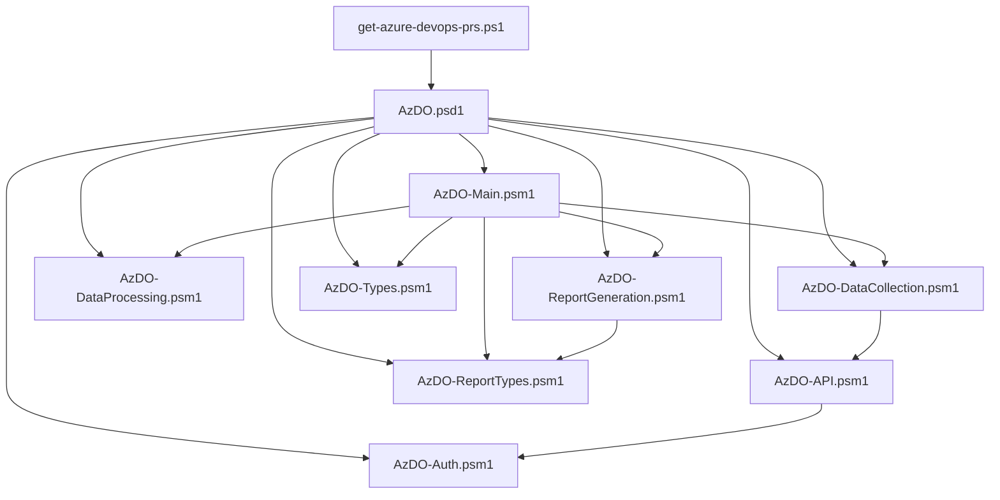

# Azure DevOps PR Analysis and Community Reports for this Project

This folder contains a PowerShell-based tool for analyzing pull request data from Azure DevOps repositories. It
generates comprehensive reports with metrics on team contributions, PR velocity, and code change patterns.

## Tool Overview

The tool consists of:

- **Main script**: `get-azure-devops-prs.ps1` - Entry point that handles authentication, data retrieval, and report generation
- **PowerShell modules**: Collection of specialized modules in the `modules/AzDO` directory

### Script Structure

The primary script (`get-azure-devops-prs.ps1`) orchestrates the entire workflow:

1. Processes command line arguments and environment variables
2. Imports and initializes all required modules
3. Authenticates to the Azure DevOps API
4. Retrieves PR data (or loads from existing JSON)
5. Processes the data into various metrics
6. Generates reports with visualizations
7. Exports data for potential later reuse

### Module Structure

The modules are organized by functionality in the `modules/AzDO` directory:

| Module                     | Purpose                                | Key Functions                                             |
|----------------------------|----------------------------------------|-----------------------------------------------------------|
| AzDO.psd1                  | Main module manifest                   | Defines module metadata and dependencies                  |
| AzDO-Auth.psm1             | Authentication and security            | `Get-AzureDevOpsPAT`, `Get-AzureDevOpsAuthHeader`         |
| AzDO-API.psm1              | Core API interactions                  | `Get-RepositoryId`, `Get-PullRequestList`                 |
| AzDO-DataCollection.psm1   | Data collection operations             | `Get-PullRequestCommitList`, `Get-AzDOPullRequestThread`  |
| AzDO-DataProcessing.psm1   | Data processing and metrics generation | `Get-PRMonthlyMetric`, `Get-PRCompletionTimeDistribution` |
| AzDO-Main.psm1             | Main orchestration and workflow        | `Get-Report`                                              |
| AzDO-ReportGeneration.psm1 | Report generation and formatting       | `Get-ReportHeader`, `Get-PRMetricsByInterval`             |
| AzDO-ReportTypes.psm1      | Report data structure definitions      | `PRMetricsIntervalData`, `ContributorReturnMetrics`       |
| AzDO-Types.psm1            | Data structure type definitions        | `AzDOApiParameters`, `AzDOPullRequestCommit`              |

### Module Dependencies

The modules have the following dependency hierarchy:



## Usage

### Prerequisites

- PowerShell 7.0 or higher
- [Azure DevOps Personal Access Token (PAT)](https://docs.microsoft.com/azure/devops/organizations/accounts/use-personal-access-tokens-to-authenticate) with the following scopes:
  - `Code (Read)`
  - `Pull Request Threads (Read)`
  - `Work Items (Read)`
- Internet connection to access the Azure DevOps API

### Command-line Parameters

```powershell
.\get-azure-devops-prs.ps1
    [-Organization <string>]
    [-Project <string>]
    [-Repository <string>]
    [-ReportOutputPath <string>]
    [-UseExistingJsonData]
    [-JsonDataPath <string>]
```

| Parameter           | Description                           | Default Value                         |
|---------------------|---------------------------------------|---------------------------------------|
| Organization        | Azure DevOps organization name        | "ai-at-the-edge-flagship-accelerator" |
| Project             | Azure DevOps project name             | "edge-ai"                             |
| Repository          | Repository name to analyze            | "edge-ai"                             |
| ReportOutputPath    | Directory to save reports             | "./docs"                              |
| UseExistingJsonData | Use existing JSON data instead of API | False                                 |
| JsonDataPath        | Path to JSON file for import/export   | "./pr-data.json"                      |

### Examples

**Set PAT token via environment variable (replace `YOUR_PAT_TOKEN_HERE` and verify the variable name used by the script):**

```powershell
$env:AZDO_PAT = "YOUR_PAT_TOKEN_HERE"
.\get-azure-devops-prs.ps1
```

**Basic usage:**

```powershell
.\get-azure-devops-prs.ps1
```

**Generate reports with custom output path:**

```powershell
.\get-azure-devops-prs.ps1 -ReportOutputPath "./custom-reports"
```

**Use previously exported JSON data:**

```powershell
.\get-azure-devops-prs.ps1 -UseExistingJsonData -JsonDataPath "./pr-data.json"
```

## Generated Reports

The script generates a comprehensive markdown report (`contributions.md`) in the specified output directory with the following sections:

1. **Summary Statistics** - Overall metrics on PRs created, completed, and abandoned
2. **PR Metrics by Interval** - Monthly and weekly metrics on PR activity
3. **SLO Compliance Trend** - Service level objective metrics for PR responses
4. **GitHub Copilot Impact** - Analysis of development productivity with GitHub Copilot
5. **Contributor Trends** - Team contribution breakdown and comparison
6. **File Types** - Analysis of file types modified in PRs
7. **Focus Areas** - Team focus areas based on code changes
8. **Industry Backlog Visualization** - Sankey diagram showing relationships between scenarios, capabilities, and features

### Metrics Included

- Total PRs created, completed, and abandoned
- Average time to complete PRs
- PR size distribution (lines added/removed)
- PR completion velocity over time
- Contributor activity patterns
- Review thoroughness (comments per PR)
- GitHub Copilot impact metrics
- Backlog item relationships and priorities

## Troubleshooting

### Common Issues

1. **Authentication Errors**
   - Ensure your PAT has the required scopes and hasn't expired
   - Verify organization/project/repository names are correct

2. **Rate Limiting**
   - The script implements pagination and throttling but may hit API rate limits
   - Use the `-UseExistingJsonData` parameter with previously exported data to avoid this

3. **Incomplete Data**
   - Historical PRs older than organization retention policy may not be accessible

### Logging

Use PowerShell's built-in verbose mode for detailed logging information:

```powershell
.\get-azure-devops-prs.ps1 -Verbose *> log.txt
```

## Extending the Tool

You can extend the functionality by modifying the existing modules or adding new ones in the `modules/AzDO` directory. Follow the existing module structure for consistency:

1. Create a new module file (e.g., `AzDO-CustomMetrics.psm1`)
2. Add the module to the imports in `AzDO.psd1`
3. Use PowerShell classes defined in `AzDO-Types.psm1` and `AzDO-ReportTypes.psm1` for data structures
4. Update the main workflow in `AzDO-Main.psm1` to use your new functionality
