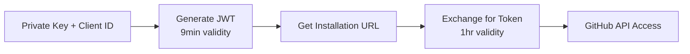

## GitHub App Authentication Scripts

PowerShell scripts for authenticating with GitHub as a GitHub App and obtaining installation access tokens.

## Overview

This directory contains scripts for implementing GitHub App authentication using JWT (JSON Web Token) flow. The primary script `Get-GitHubInstallationToken.ps1` provides a complete, self-contained solution for obtaining GitHub App installation tokens.

## Quick Start

### Using the All-in-One Script

The simplest way to authenticate is using `Get-GitHubInstallationToken.ps1`:

```powershell
# With private key file
$token = .\Get-GitHubInstallationToken.ps1 `
    -ClientId "Iv1.abc123..." `
    -PrivateKeyPath "path/to/private-key.pem" `
    -Repository "microsoft/edge-ai"

# With private key as string (from Key Vault)
$privateKey = az keyvault secret show --vault-name "your-vault" --name "github-app-key" --query value -o tsv
$privateKey = if ($privateKey -is [array]) { $privateKey -join "`n" } else { $privateKey }

$token = .\Get-GitHubInstallationToken.ps1 `
    -ClientId "Iv1.abc123..." `
    -PrivateKey $privateKey `
    -Repository "microsoft/edge-ai"

# Use the token
$headers = @{
    "Authorization" = "Bearer $token"
    "Accept" = "application/vnd.github+json"
}
Invoke-RestMethod -Uri "https://api.github.com/repos/microsoft/edge-ai" -Headers $headers
```

### Azure DevOps Pipeline Usage

```yaml
- task: PowerShell@2
  displayName: 'Get GitHub Token'
  inputs:
    targetType: 'filePath'
    filePath: '$(System.DefaultWorkingDirectory)/scripts/github/auth/Get-GitHubInstallationToken.ps1'
    arguments: >
      -ClientId "$(GITHUB_APP_CLIENT_ID)"
      -PrivateKey "$(GITHUB_APP_PRIVATE_KEY)"
      -Repository "microsoft/edge-ai"
    pwsh: true
  env:
    GITHUB_APP_CLIENT_ID: $(github-edge-ai-app-client-id)
    GITHUB_APP_PRIVATE_KEY: $(github-edge-ai-app-private-key)
```

## Script Reference

| Script                            | Purpose                                    | Key Parameters                                          | Output                            |
|-----------------------------------|--------------------------------------------|---------------------------------------------------------|-----------------------------------|
| `Get-GitHubInstallationToken.ps1` | Complete authentication flow (recommended) | `ClientId`, `PrivateKeyPath`/`PrivateKey`, `Repository` | Installation token (1hr validity) |
| `New-GitHubAppJWT.ps1`            | Generate JWT (internal use)                | `ClientId`, `PrivateKeyPath`/`PrivateKeyContent`        | JWT token (9min validity)         |
| `Get-GitHubAccessTokensUrl.ps1`   | Retrieve installation URL (internal use)   | `JWT`, `Repository`                                     | Access tokens URL                 |
| `New-GitHubInstallationToken.ps1` | Exchange JWT for token (internal use)      | `JWT`, `AccessTokensUrl`                                | Installation token (1hr validity) |

**Note**: Internal scripts are used by `Get-GitHubInstallationToken.ps1` and typically don't need to be called directly.

## Testing

### Test-GitHubInstallationToken.ps1

Comprehensive test script with three testing modes:

#### Mock Credential Testing

Validates script logic without real credentials or API calls:

```powershell
.\Test-GitHubInstallationToken.ps1 -UseMockCredentials -Verbose
```

**Validates**:

- Script syntax and parameter handling
- JWT generation logic
- Error handling paths
- Output format

#### Key Vault Integration Testing

Tests with real credentials from Azure Key Vault:

```powershell
.\Test-GitHubInstallationToken.ps1 -UseKeyVault -Verbose

# With custom Key Vault
.\Test-GitHubInstallationToken.ps1 -UseKeyVault -KeyVaultName "my-vault" -Verbose
```

**Requires**:

- Azure CLI authentication (`az login`)
- Key Vault access (RBAC permissions or access policy)
- Key Vault secrets:
  - `github-edge-ai-app-client-id`
  - `github-edge-ai-app-private-key`

**Validates**:

- Key Vault secret retrieval
- Complete authentication flow
- GitHub API integration
- Token validity

#### Local Credential Testing

Tests with local credential files:

```powershell
.\Test-GitHubInstallationToken.ps1 `
    -LocalClientId "Iv1.abc123..." `
    -LocalPrivateKeyPath ".\test-key.pem" `
    -Verbose
```

**Validates**:

- File-based authentication
- Complete authentication flow
- GitHub API integration

## Authentication Flow



## Requirements

- **PowerShell**: 7.0 or later (required for JWT generation and REST API calls)
- **GitHub App**: Must be installed on the target repository
- **Permissions**: GitHub App must have appropriate repository permissions

## Security Best Practices

### Private Key Storage

**Azure Key Vault** (Recommended):

```powershell
# Store private key in Key Vault
$privateKey = Get-Content "private-key.pem" -Raw
az keyvault secret set --vault-name "your-vault" --name "github-app-key" --value $privateKey
```

**Azure DevOps Variable Groups**:

- Store as secret variable
- Link to Key Vault secret
- Reference in pipeline: `$(github-app-private-key)`

### Key Vault Network Security

For production environments, restrict Key Vault access:

- Disable public network access
- Use private endpoints
- Enable Azure DevOps as trusted service

```bash
# Disable public access (recommended)
az keyvault update --name "your-vault" --public-network-access Disabled

# Enable temporarily for testing
az keyvault update --name "your-vault" --public-network-access Enabled
```

### Token Handling

- Installation tokens expire after 1 hour
- JWTs expire after 9 minutes (max 10 minutes)
- Generate new tokens as needed, don't cache long-term
- Never log tokens or commit to source control

## Troubleshooting

| Error                             | Cause                                            | Solution                                                                                                                                                                                 |
|:----------------------------------|:-------------------------------------------------|:-----------------------------------------------------------------------------------------------------------------------------------------------------------------------------------------|
| **"Integration not found" (404)** | GitHub App not installed or invalid Client ID    | Verify App installation on repository, check Client ID is correct, ensure repository format is `owner/repo`                                                                              |
| **"Bad credentials" (401)**       | Invalid JWT signature or expired token           | Verify private key matches GitHub App, check PEM format (headers/footers intact), verify system clock is accurate                                                                        |
| **Key Vault access errors**       | Network restrictions or insufficient permissions | Testing: `az keyvault update --name <vault> --public-network-access Enabled`. Production: Use service principal with proper permissions or run from Cloud Shell/VM with private endpoint |
| **Private key format issues**     | Key Vault returns array instead of string        | Use conversion: `$key = if ($raw -is [array]) { $raw -join [Environment]::NewLine } else { $raw }`                                                                                       |

## Migration from Old Structure

All scripts moved to `scripts/github/auth/` subdirectory:

| Old Path                                         | New Path                                              |
|--------------------------------------------------|-------------------------------------------------------|
| `scripts/github/Get-GitHubInstallationToken.ps1` | `scripts/github/auth/Get-GitHubInstallationToken.ps1` |
| `scripts/github/New-GitHubAppJWT.ps1`            | `scripts/github/auth/New-GitHubAppJWT.ps1`            |
| `scripts/github/Get-GitHubAccessTokensUrl.ps1`   | `scripts/github/auth/Get-GitHubAccessTokensUrl.ps1`   |
| `scripts/github/New-GitHubInstallationToken.ps1` | `scripts/github/auth/New-GitHubInstallationToken.ps1` |

Update references in pipeline files, scripts, and documentation.

## References

- [GitHub Apps Documentation](https://docs.github.com/en/apps)
- [Authenticating as a GitHub App](https://docs.github.com/en/apps/creating-github-apps/authenticating-with-a-github-app/authenticating-as-a-github-app)
- [JWT RFC 7519](https://datatracker.ietf.org/doc/html/rfc7519)
- [Base64url Encoding RFC 4648](https://datatracker.ietf.org/doc/html/rfc4648#section-5)

## Support

For issues or questions:

- Review [Troubleshooting](#troubleshooting) section
- Run test script with `-Verbose` for detailed output
- Check pipeline logs for authentication errors
- Verify GitHub App configuration and permissions

---

<!-- markdownlint-disable MD036 -->
*🤖 Crafted with precision by ✨Copilot following brilliant human instruction,
then carefully refined by our team of discerning human reviewers.*
<!-- markdownlint-enable MD036 -->
