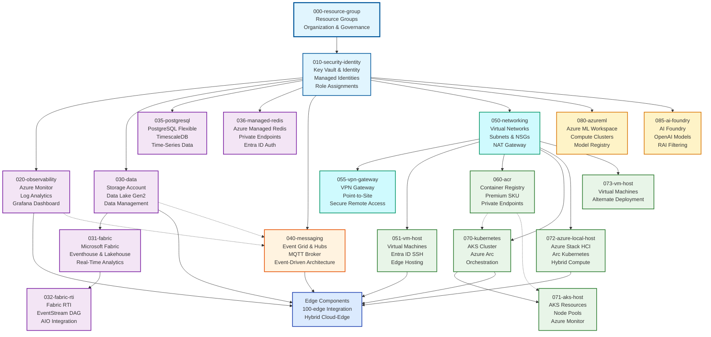

# Cloud Infrastructure (000-cloud)

Welcome to the Cloud Infrastructure components section. This grouping contains all Azure cloud-based infrastructure components that support the Edge AI platform deployment.

## Overview

The 000-cloud components provide the foundational cloud infrastructure including identity, security, data, messaging, and monitoring services that support edge deployments. These components are typically deployed first and managed by cloud infrastructure teams.

## Components

### Core Infrastructure

| Component                                                  | Description                                                                                        | Terraform | Bicep |
|------------------------------------------------------------|----------------------------------------------------------------------------------------------------|:---------:|:-----:|
| [000-resource-group](./000-resource-group/README.md)       | Environment onboarding with Resource Groups, User Assigned Managed Identity, and Service Principal |     ✅     |   ✅   |
| [010-security-identity](./010-security-identity/README.md) | Foundational security with managed identities, Key Vault, Schema Registry, and RBAC                |     ✅     |   ✅   |
| [020-observability](./020-observability/README.md)         | Centralized monitoring with Log Analytics, Monitor Workspace, and Managed Grafana                  |     ✅     |   ✅   |

### Data & Analytics

| Component                                          | Description                                                                             | Terraform | Bicep |
|----------------------------------------------------|-----------------------------------------------------------------------------------------|:---------:|:-----:|
| [030-data](./030-data/README.md)                   | Data management with Storage Accounts, Data Lake Gen2, and Fabric integration           |     ✅     |   ✅   |
| [031-fabric](./031-fabric/README.md)               | Microsoft Fabric capacity, workspace, eventhouse, and lakehouse for real-time analytics |     ✅     |   ❌   |
| [032-fabric-rti](./032-fabric-rti/README.md)       | Fabric Real-Time Intelligence EventStream with DAG architecture and AIO integration     |     ✅     |   ❌   |
| [035-postgresql](./035-postgresql/README.md)       | PostgreSQL Flexible Server with TimescaleDB extension for time-series data              |     ✅     |   ❌   |
| [036-managed-redis](./036-managed-redis/README.md) | Azure Managed Redis with private endpoints and Entra ID authentication                  |     ✅     |   ❌   |

### Messaging & Communication

| Component                                  | Description                                                                    | Terraform | Bicep |
|--------------------------------------------|--------------------------------------------------------------------------------|:---------:|:-----:|
| [040-messaging](./040-messaging/README.md) | Event Grid Namespace with MQTT broker, Event Hubs, and edge-to-cloud dataflows |     ✅     |   ✅   |

### Networking

| Component                                      | Description                                                                     | Terraform | Bicep |
|------------------------------------------------|---------------------------------------------------------------------------------|:---------:|:-----:|
| [050-networking](./050-networking/README.md)   | Virtual networks with subnets, NSGs, optional NAT gateway, and Private Resolver |     ✅     |   ✅   |
| [055-vpn-gateway](./055-vpn-gateway/README.md) | VPN Gateway with P2S configuration and certificate or Entra ID authentication   |     ✅     |   ✅   |

### Compute & Container Infrastructure

| Component                                                | Description                                                                  | Terraform | Bicep |
|----------------------------------------------------------|------------------------------------------------------------------------------|:---------:|:-----:|
| [051-vm-host](./051-vm-host/README.md)                   | Azure VMs with Entra ID RBAC-based SSH authentication                        |     ✅     |   ✅   |
| [060-acr](./060-acr/README.md)                           | Azure Container Registry with Premium SKU and private endpoint support       |     ✅     |   ✅   |
| [070-kubernetes](./070-kubernetes/README.md)             | Azure Kubernetes Service with optional Azure Arc and private cluster support |     ✅     |   ✅   |
| [071-aks-host](./071-aks-host/README.md)                 | AKS resources with configurable node pools and Azure Monitor metrics         |     ✅     |   ✅   |
| [072-azure-local-host](./072-azure-local-host/README.md) | Arc-enabled Kubernetes on Azure Stack HCI with provisioned cluster instances |     ✅     |   ❌   |
| [073-vm-host](./073-vm-host/README.md)                   | Azure VMs with Entra ID RBAC-based SSH authentication (alternate deployment) |     ✅     |   ✅   |

### AI & Machine Learning

| Component                                    | Description                                                                 | Terraform | Bicep |
|----------------------------------------------|-----------------------------------------------------------------------------|:---------:|:-----:|
| [080-azureml](./080-azureml/README.md)       | Azure Machine Learning workspace with compute clusters and AKS integration  |     ✅     |   ❌   |
| [085-ai-foundry](./085-ai-foundry/README.md) | Azure AI Foundry with projects, OpenAI model deployments, and RAI filtering |     ✅     |   ✅   |

## Architecture

The cloud infrastructure follows a layered deployment approach with clear dependencies and logical grouping:

## Deployment Order

Components are numbered to indicate their deployment order and dependencies:

### Foundation (000-029)

1. **000-resource-group** - Deploy first to establish resource organization
2. **010-security-identity** - Essential security and identity foundation
3. **020-observability** - Monitoring and logging infrastructure

### Data & Analytics (030-039)

1. **030-data** - Data storage and management services
2. **031-fabric** - Microsoft Fabric capacity and workspace (optional)
3. **032-fabric-rti** - Fabric Real-Time Intelligence EventStream (optional)
4. **035-postgresql** - PostgreSQL with TimescaleDB (optional)
5. **036-managed-redis** - Azure Managed Redis (optional)

### Messaging (040-049)

1. **040-messaging** - Event-driven messaging infrastructure

### Networking (050-059)

1. **050-networking** - Network infrastructure for compute resources
2. **051-vm-host** - Virtual machine hosting (if required)
3. **055-vpn-gateway** - VPN Gateway for secure remote access (optional)

### Compute & Containers (060-079)

1. **060-acr** - Azure Container Registry
2. **070-kubernetes** - Azure Kubernetes Service with Arc integration
3. **071-aks-host** - AKS resources (alternate deployment)
4. **072-azure-local-host** - Azure Stack HCI with Arc Kubernetes (optional)
5. **073-vm-host** - Virtual machine hosting (alternate deployment)

### AI & Machine Learning (080-099)

1. **080-azureml** - Azure Machine Learning workspace (optional)
2. **085-ai-foundry** - Azure AI Foundry with OpenAI models (optional)

## Framework Support

Each component supports multiple Infrastructure as Code frameworks:

- **Terraform** - Complete Terraform modules with comprehensive configuration
- **Bicep** - Azure-native Bicep templates for streamlined deployment

## Getting Started

1. **Review Architecture**: Start with [main source documentation](../README.md) for overall architecture
2. **Plan Deployment**: Choose components based on your deployment requirements
3. **Select Framework**: Pick Terraform or Bicep based on your team's preferences
4. **Follow Order**: Deploy components in numerical order to respect dependencies
5. **Configure Monitoring**: Ensure observability components are properly configured

## Prerequisites

- Azure subscription with appropriate permissions
- Resource providers registered (see [azure-resource-providers](../azure-resource-providers/README.md))
- Service principal or managed identity for deployment automation

For more information about the overall source code structure, see the [main source documentation](../README.md).

---

<!-- markdownlint-disable MD036 -->
*🤖 Crafted with precision by ✨Copilot following brilliant human instruction,
then carefully refined by our team of discerning human reviewers.*
<!-- markdownlint-enable MD036 -->
