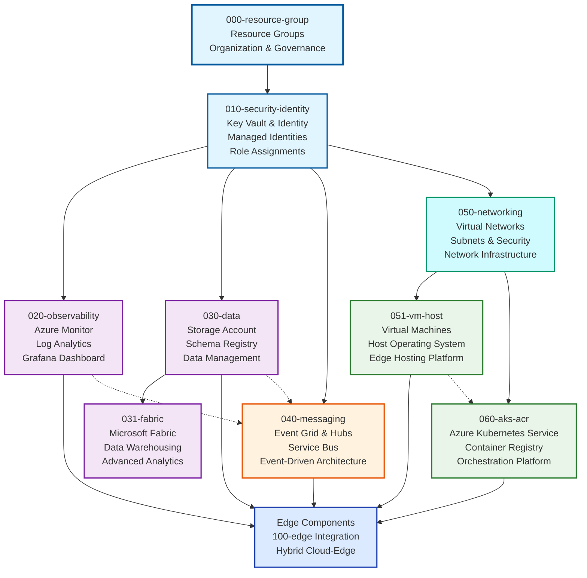

# Cloud Infrastructure (000-cloud)

Welcome to the Cloud Infrastructure components section. This grouping contains all Azure cloud-based infrastructure components that support the Edge AI platform deployment.

## Overview

The 000-cloud components provide the foundational cloud infrastructure including identity, security, data, messaging, and monitoring services that support edge deployments. These components are typically deployed first and managed by cloud infrastructure teams.

## Components

### Core Infrastructure

- **[000-resource-group](./000-resource-group/README.md)** - Resource Groups for organizing all Azure resources
- **[010-security-identity](./010-security-identity/README.md)** - Identity and security resources including Key Vault, Managed Identities, and role assignments
- **[020-observability](./020-observability/README.md)** - Cloud-side monitoring, logging, and observability resources

### Data & Analytics

- **[030-data](./030-data/README.md)** - Data storage, Schema Registry, and data management resources
- **[031-fabric](./031-fabric/README.md)** - Microsoft Fabric resources for data warehousing and analytics

### Messaging & Communication

- **[040-messaging](./040-messaging/README.md)** - Event Grid, Event Hubs, Service Bus and messaging infrastructure

### Compute & Networking

- **[050-networking](./050-networking/README.md)** - Virtual networks, subnets, and network security infrastructure
- **[051-vm-host](./051-vm-host/README.md)** - VM provisioning resources with configurable host operating system
- **[060-aks-acr](./060-aks-acr/README.md)** - Azure Kubernetes Service and Azure Container Registry

## Architecture

The cloud infrastructure follows a layered deployment approach with clear dependencies and logical grouping:

## Deployment Order

Components are numbered to indicate their deployment order and dependencies:

1. **000-resource-group** - Deploy first to establish resource organization
2. **010-security-identity** - Essential security and identity foundation
3. **020-observability** - Monitoring and logging infrastructure
4. **030-data** - Data storage and management services
5. **031-fabric** - Advanced analytics and data warehousing (optional)
6. **040-messaging** - Event-driven messaging infrastructure
7. **050-networking** - Network infrastructure for compute resources
8. **051-vm-host** - Virtual machine hosting (if required)
9. **060-aks-acr** - Container orchestration and registry (if required)

## Framework Support

Each component supports multiple Infrastructure as Code frameworks:

- **Terraform** - Complete Terraform modules with comprehensive configuration
- **Bicep** - Azure-native Bicep templates for streamlined deployment

## Getting Started

1. **Review Architecture**: Start with [main source documentation](../README.md) for overall architecture
2. **Plan Deployment**: Choose components based on your deployment requirements
3. **Select Framework**: Pick Terraform or Bicep based on your team's preferences
4. **Follow Order**: Deploy components in numerical order to respect dependencies
5. **Configure Monitoring**: Ensure observability components are properly configured

## Prerequisites

- Azure subscription with appropriate permissions
- Resource providers registered (see [azure-resource-providers](../azure-resource-providers/README.md))
- Service principal or managed identity for deployment automation

For more information about the overall source code structure, see the [main source documentation](../README.md).

---

<!-- markdownlint-disable MD036 -->
*🤖 Crafted with precision by ✨Copilot following brilliant human instruction,
then carefully refined by our team of discerning human reviewers.*
<!-- markdownlint-enable MD036 -->
