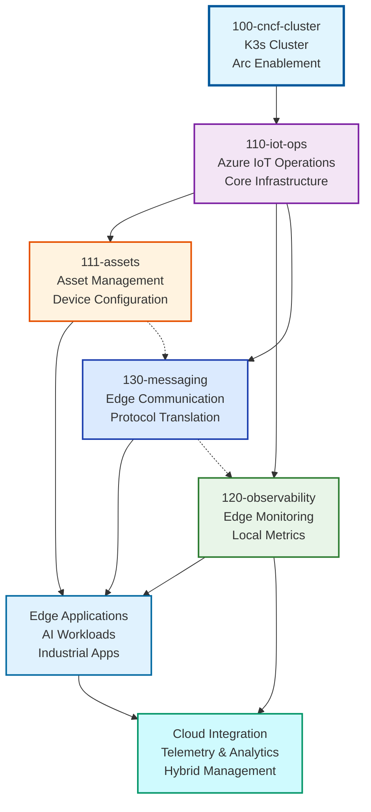

# Edge Infrastructure (100-edge)

Welcome to the Edge Infrastructure components section. This grouping contains all edge computing and IoT operations components that run on-premises or at the edge locations.

## Overview

The 100-edge components provide the edge computing infrastructure including CNCF cluster setup, Azure IoT Operations deployment, asset management, and edge-specific observability. These components are typically deployed by physical plant engineers and edge computing teams.

## Components

### Core Edge Platform

- **[100-cncf-cluster](./100-cncf-cluster/README.md)** - CNCF cluster installation (K3s) with Arc enablement and workload identity. Extensible approach supports future Kubernetes distributions
- **[110-iot-ops](./110-iot-ops/README.md)** - Azure IoT Operations deployment with core infrastructure components (MQ, Device Registry, etc.). Compatible with any Arc-enabled cluster
- **[111-assets](./111-assets/README.md)** - Asset management and device configuration

### Edge Services

- **[120-observability](./120-observability/README.md)** - Edge-specific monitoring, logging, and observability
- **[130-messaging](./130-messaging/README.md)** - Edge messaging and communication services

## Architecture

The edge infrastructure follows a layered approach with integrated services:

## Deployment Order

Components are numbered to indicate their deployment order and dependencies:

1. **100-cncf-cluster** - Deploy first to establish the Kubernetes foundation (skip if using existing Arc-enabled cluster)
2. **110-iot-ops** - Install Azure IoT Operations on any Arc-enabled cluster
3. **111-assets** - Configure asset management and device connectivity
4. **120-observability** - Set up edge-specific monitoring and logging
5. **130-messaging** - Configure edge messaging and communication

## Framework Support

Each component supports multiple Infrastructure as Code frameworks:

- **Terraform** - Complete Terraform modules with comprehensive configuration
- **Bicep** - Azure-native Bicep templates for streamlined deployment

## Key Features

### 🔄 **CNCF Compliance**

- Standards-compliant Kubernetes distribution (K3s)
- Arc-enabled cluster management
- Workload identity integration

### 🏭 **Industrial IoT**

- OPC UA server simulation and connectivity
- Asset discovery and management
- Real-time data processing

### 📊 **Edge Observability**

- Local monitoring and alerting
- Cloud synchronization
- Performance optimization

### 🔐 **Security**

- Certificate management
- Role-based access control
- Secure communication channels

## Prerequisites

- **Kubernetes Infrastructure**: Either:
  - Physical or virtual machines for new K3s deployment via 100-cncf-cluster
  - Existing Arc-enabled Kubernetes cluster (any CNCF-compliant distribution)
- Network connectivity to Azure (for Arc enablement)
- Appropriate hardware specifications for workloads
- Valid Azure subscription and permissions

## Getting Started

1. **Review Architecture**: Start with [blueprint examples](../../blueprints/README.md) to see complete deployment scenarios
2. **Choose Blueprint**: Select from [single-node](../../blueprints/full-single-node-cluster/README.md) or [multi-node](../../blueprints/full-multi-node-cluster/README.md) blueprints
3. **Prepare Infrastructure**: Either prepare hardware for new K3s deployment or ensure existing physical cluster is Arc-enabled
4. **Plan Network**: Configure network connectivity and security
5. **Deploy/Verify Foundation**: Deploy 100-cncf-cluster for new installations, or verify Arc enablement on existing clusters
6. **Add IoT Operations**: Deploy 110-iot-ops for industrial connectivity
7. **Configure Assets**: Set up 111-assets for device management
8. **Enable Monitoring**: Deploy 120-observability for edge monitoring

## Edge-Specific Considerations

- **Disconnected Scenarios**: Components designed to handle intermittent connectivity
- **Resource Constraints**: Optimized for edge hardware limitations
- **Local Processing**: Emphasis on local data processing and decision-making
- **Security**: Enhanced security for edge deployment environments

For more information about the overall source code structure, see the [main source documentation](../README.md).

---

<!-- markdownlint-disable MD036 -->
*🤖 Crafted with precision by ✨Copilot following brilliant human instruction,
then carefully refined by our team of discerning human reviewers.*
<!-- markdownlint-enable MD036 -->
