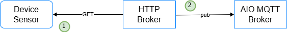

# HTTP Connector with AIO Rust SDK

[](LICENSE.md)

This project demonstrates reading data from an edge device and publishes the data to an MQTT broker topic. It utilizes a simulated edge sensor written in Python and brokers written in Rust, all containerized within Docker containers and orchestrated using Kubernetes clusters with components from
Azure IoT Operation (AIO) utilizing the **Azure IoT Operations SDK** for Rust.

## Application Overview

The HTTP Broker application consists of an edge device sensor and a broker service built with the Azure IoT Operations SDK.

### Components

1. **Sensor Service**: Generates new simulated temperature telemetry data with every HTTP GET request made to the sensor's endpoints (e.g. `/sensor/temperature`, `sensor/humidity`, `/sensor/data`).
2. **Broker Service**: Reads the temperature data, validates the data, extracts the context and publishes it to an MQTT topic.
3. **Subscriber Service**: Subscribes to the MQTT topic published by the Broker Service
4. **Connection Monitor Service**: Monitors connection uptime of the MQTT broker session

## Architecture



## Features

- **Azure IoT Operations SDK**: Uses the official Rust SDK for AIO integration
- **Rust-based Microservices**: Lightweight, high-performance services with efficient resource usage
- **MQTT Integration**: Compatible with Azure IoT Operations (AIO) MQTT broker
- **Eclipse Mosquitto Broker**: Lightweight MQTT broker included in the docker-compose
- **Configurable**: All components can be customized via environment variables
- **Containerized**: All services packaged as Docker containers for easy deployment
- **Local Development**: Full stack runs locally with Docker Compose

## Getting Started

### Running Locally

#### Prerequisites

- Docker and Docker Compose
- Rust (optional, only for local development)

#### Docker Compose

The easiest way to run the application locally is with Docker Compose:

```bash
# Start all services (device sensor, HTTP broker, subscriber)
docker compose up -d

# To recreate and restart the containers with the rebuilt images, use:
docker compose up --build --force-recreate

# View the logs
docker compose logs -f

# Stop all services
docker compose down

```

## Configuration

For a comprehensive list of Azure IoT Operations configuration options, see [Connection Settings](https://github.com/Azure/iot-operations-sdks/blob/main/doc/reference/connection-settings.md#settings).

### Docker Compose Configuration

The application can be configured using environment variables in the Docker Compose file:

### Broker Service

| Variable              | Description                       | Docker Compose Default |
|-----------------------|-----------------------------------|------------------------|
| `AIO_BROKER_HOSTNAME` | MQTT broker hostname              | mosquitto-broker       |
| `AIO_BROKER_TCP_PORT` | MQTT broker port                  | 1883                   |
| `AIO_MQTT_CLIENT_ID`  | MQTT device ID                    | device-sender          |
| `AIO_MQTT_USE_TLS`    | Whether to use TLS                | false                  |
| `DEVICE_ID`           | Unique sensor/device identifier   | DHT11-001              |
| `MQ_DATA_TOPIC`       | Topic to publish data             | device_id/temperature  |
| `POLLING_INTERVAL`    | Sensor polling interval (seconds) | 10                     |
| `JSON_SCHEMA`         | JSON schema validator             | null                   |
| `RUST_LOG`            | Log level                         | info                   |

### Subscriber Service

| Variable              | Description                      | Docker Compose Default |
|-----------------------|----------------------------------|------------------------|
| `AIO_BROKER_HOSTNAME` | MQTT broker hostname             | mosquitto-broker       |
| `AIO_BROKER_TCP_PORT` | MQTT broker port                 | 1883                   |
| `AIO_MQTT_CLIENT_ID`  | MQTT device ID                   | device-subscriber      |
| `AIO_MQTT_USE_TLS`    | Whether to use TLS               | false                  |
| `MQ_DATA_TOPIC`       | Topic to subscribe for telemetry | device_id/temperature  |
| `RUST_LOG`            | Log level                        | info                   |

## Development

### Building the Services Locally

If you want to build and run the services without Docker:

```bash
# Install dependencies
pip install -r src/requirements.txt
# Run the application
python src/device-sensor.py

# In another terminal, build and run the broker
cd services/broker
cargo build --release
cargo run --release

# In another terminal, build and run the subscriber
cd services/subscriber
cargo build --release
cargo run --release
```

### Project Structure

```text
502-rust-http-broker/
├── docker-compose.yaml      # Container orchestration for all services
├── resources/               # Configuration files
│   ├── mosquitto.conf       # MQTT broker configuration
│   └── broker-config.yaml   # HTTP broker configuration
├── services/                # Application services
|   ├── sensor-simulator/    # Device simulator service
|   │   ├── Cargo.toml       # Rust dependencies and metadata
|   │   ├── Dockerfile       # Container definition
|   │   └── src/             # Rust source code
|   ├── broker/              # HTTP broker processor service
|   |   ├── Cargo.toml       # Rust dependencies and metadata
|   |   ├── Dockerfile       # Container definition
|   |   └── src/             # Rust source code
|   ├── subscriber/          # MQTT broker subscriber service
|   |   ├── Cargo.toml       # Rust dependencies and metadata
|   |   ├── Dockerfile       # Container definition
|   |   └── src/             # Rust source code
```

## Integration with Azure IoT Operations

This example is designed to work with Azure IoT Operations (AIO). To use with AIO:

1. Configure the sensor and broker services to connect to your AIO MQTT broker
2. Update the environment variables to match your AIO deployment
3. Deploy the containers to your AIO-enabled Kubernetes cluster

## License

This project is licensed under the MIT License - see the LICENSE file for details.
