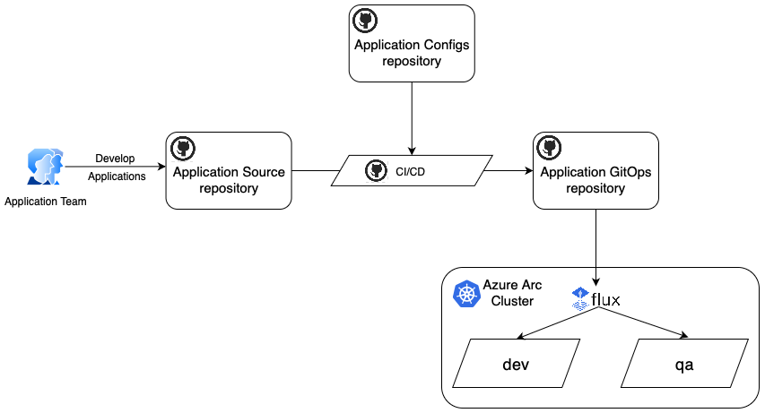
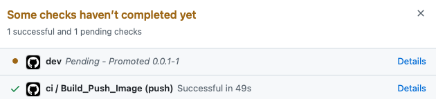
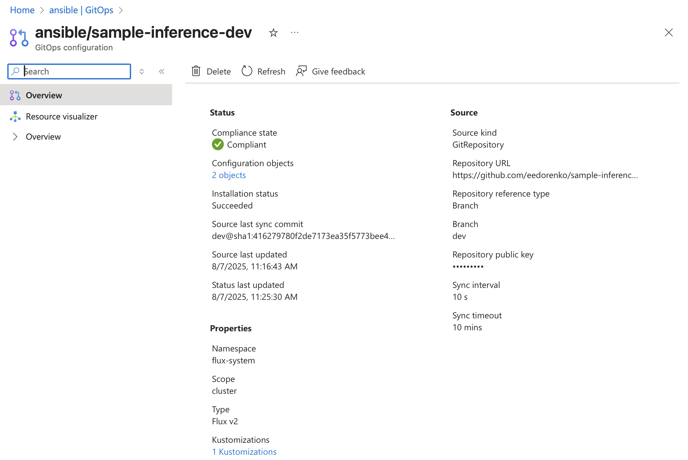
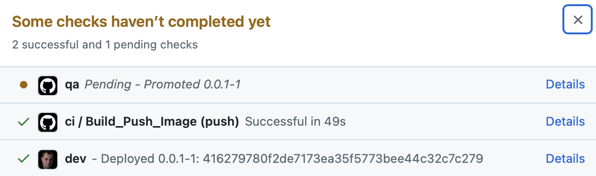
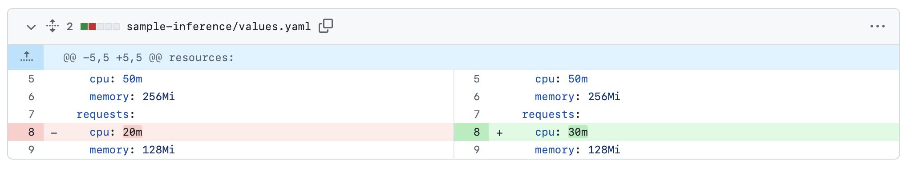
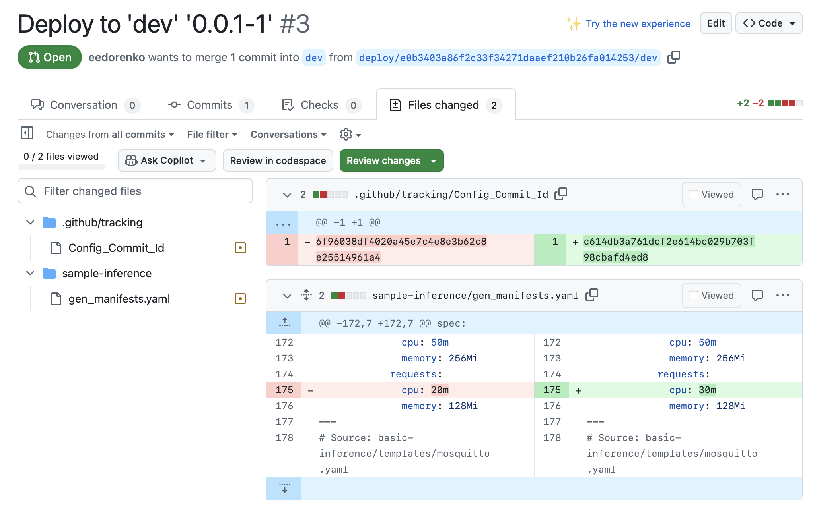

This guidance demonstrates how to set up a complete GitOps CI/CD pipeline for the Basic Inference Application using the Kalypso pattern, described in the [CI/CD. Multi-Environment Promotional Flow with GitOps](../../../docs/solution-adr-library/cicd-gitops.md) ADR.

## Prerequisites

Before going ahead, ensure you have:

1. **Azure Arc-enabled Kubernetes Cluster**: Your cluster must be connected to Azure Arc

   ```bash
   # Connect your cluster to Azure Arc (if not already connected)
   az connectedk8s connect --name your-cluster --resource-group your-rg

   # Verify connection
   az connectedk8s show --name your-cluster --resource-group your-rg
   ```

2. **Azure CLI Login**: Authenticate with Azure CLI

   ```bash
   az login
   ```

3. **GitHub CLI Configured**: Ensure you're authenticated with GitHub

   ```bash
   gh auth status
   ```

4. **Kubernetes Access**: Ensure you have access to your target Azure Arc-enabled cluster

   ```bash
   # Check current context
   kubectl config current-context

   # List available contexts
   kubectl config get-contexts

   # Set context to your Arc cluster (if needed)
   kubectl config use-context <your-arc-cluster-context>

   # Verify cluster access
   kubectl cluster-info
   kubectl get namespaces
   ```

5. **GitHub Token**
   GitHub token with the following scopes:

   Classic: `repo`, `workflow`, `write:packages`, `delete:packages`, `read:org`, `delete_repo`.

   Fine-grained: `Actions` - R/W, `Administration` - R/W, `Commit statuses` - R/W, `Contents` - R/W, `Metadata` - RO, `Pull requests` - R/W, `Secrets` - R/W, `Variables` - R/W, `Workflows` - R/W

6. **Required Environment Variables**

   ```bash
   export TOKEN="ghp_xxxxxxxxxxxxxxxxxxxx"
   export AZURE_CREDENTIALS_SP='{"clientId":"...","clientSecret":"...","subscriptionId":"...","tenantId":"..."}'
   ```

## Overview

This tutorial demonstrates CI/CD patterns specifically designed for multi-cluster Kubernetes environments.  It will:

1. **Provision GitOps Repositories**: Create source, config, and GitOps repositories for edge deployments
2. **Deploy Application Code**: Push the basic inference application to the source repository
3. **Configure CI/CD Workflows**: Set up automated build and deployment pipelines optimized for edge scenarios
4. **Enable Promotion Flow**: Configure multi-environment deployment (dev→qa) with PR-based approvals
5. **Setup Flux GitOps**: Configure Azure Arc Flux extension for continuous deployment to edge clusters

Overall the tutorial creates an infrastructure, shown on the following diagram:



For the sake of this tutorial both `dev` and `qa` environments are hosted on the same cluster and separated by namespaces.

## Setting Up

Execute the script to set up the complete CI/CD pipeline on your Azure Arc-enabled cluster:

```bash
./basic-inference-cicd.sh --org your-github-org --project my-inference-app --cluster your-arc-cluster --rg your-resource-group
```

**Required Parameters:**

- `--org` or `-o`: GitHub organization name
- `--cluster` or `-c`: Azure Arc-enabled Kubernetes cluster name
- `--rg` or `-r`: Azure resource group containing the Arc cluster

**Optional Parameters:**

- `--project` or `-p`: Project name (default: basic-inference-pipeline)

**Example with all parameters:**

```bash
./basic-inference-cicd.sh \
  --org mycompany \
  --project smart-factory-inference \
  --cluster arc-edge-cluster \
  --rg rg-iot-edge-production
```

The setup script fetches all required Kalypso assets directly from the [upstream repository](https://github.com/microsoft/kalypso).

## Build

After the script has completed, the application source repository contains a pull request with GitHub Actions workflows and tools that implement the promotional CI/CD flow.


After merging this PR into the main branch, the `ci` workflow is triggered automatically. It builds a Docker image and pushes it to GitHub Packages. At the end of the process, the `ci` workflow initiates the `deploy` workflow, which generates Kubernetes manifests for the `dev` environment and creates a pull request to the Application GitOps repository.


Both `ci` and `deploy` workflows update Git commit status in the `Application Source` repository, so it reflects the current state of the entire flow:



The application has been built and promoted to `dev` environment. The created PR with the manifests to the `dev` branch in the `Application GitOps` repository represents a fact of promotion. The application has not been deployed yet.

## Deploy

Once the pull request containing the manifests is reviewed and merged, the Flux controllers on the Kubernetes cluster automatically synchronize and apply the changes. Azure Arc GitOps controllers continuously monitor this process and report deployment status to Azure. You can track the progress and health of GitOps deployments for each cluster directly in the Azure Portal under the **GitOps** tab.



If the deployment on the cluster has finished successfully, the whole `cd` flow proceeds with the promotion to the next environment. If the deployment has failed, the whole process stops.

Follow the test [instructions](../../500-application/500-basic-inference/tests/README.md) to validate the deployment.

## Promote

After a successful deployment to the `dev` environment, the `post-deployment` workflow automatically triggers the `deploy` flow to promote the application version to the `qa` environment. During this process, the `deploy` workflow retrieves configuration values from the `qa` branch of the Application Configs repository, generates the required Kubernetes manifests, and creates a pull request to the `qa` branch of the Application GitOps repository for review and approval.

This fact is reflected in the `Application Source` repository commit status:



Once the pull request with the manifests is merged, Flux automatically applies the changes to the cluster. The `post-deployment` workflow monitors the deployment progress in the `qa` environment and waits for completion. In this tutorial, no additional environments are configured beyond `qa`, so the promotion process ends here. At this point, the entire CI/CD flow is complete.

## Configure

Let's reconfigure the application on the `dev` environment and increase the `cpu` requests:



Pushing changes to the `Application Configs` repository triggers the `deploy` workflow in the `Application Source` repository. This workflow regenerates the Kubernetes manifests for the `dev` environment and opens a new pull request to the `dev` branch of the `Application GitOps` repository:



Once the pull request is merged, Flux automatically applies the configuration change to the `dev` environment on the cluster. Because this update is specific to the `dev` environment, it is not promoted to other environments.

## Cleanup and Resource Removal

To remove all created resources (repositories, Flux configurations, and Kubernetes namespaces), use the cleanup flag:

```bash
./basic-inference-cicd.sh --cleanup --org your-github-org --project my-inference-app --cluster arc-edge-cluster --rg your-resource-group
```

**What gets deleted in cleanup mode:**

- **GitHub Repositories**:
  - `${PROJECT_NAME}`
  - `${PROJECT_NAME}-configs`
  - `${PROJECT_NAME}-gitops`

- **Azure Arc Flux Configurations**:
  - `${PROJECT_NAME}-dev`
  - `${PROJECT_NAME}-qa`

- **Kubernetes Namespaces**:
  - `dev-${PROJECT_NAME}`
  - `qa-${PROJECT_NAME}`

**Example cleanup command:**

```bash
./basic-inference-cicd.sh \
  --cleanup \
  --org mycompany \
  --project smart-factory-inference \
  --cluster arc-edge-cluster \
  --rg rg-iot-edge-production
```

## Resources

- [CI/CD Multi-Environment GitOps ADR](../../../docs/solution-adr-library/cicd-gitops.md) - Architecture decision record for the CI/CD promotional flow
