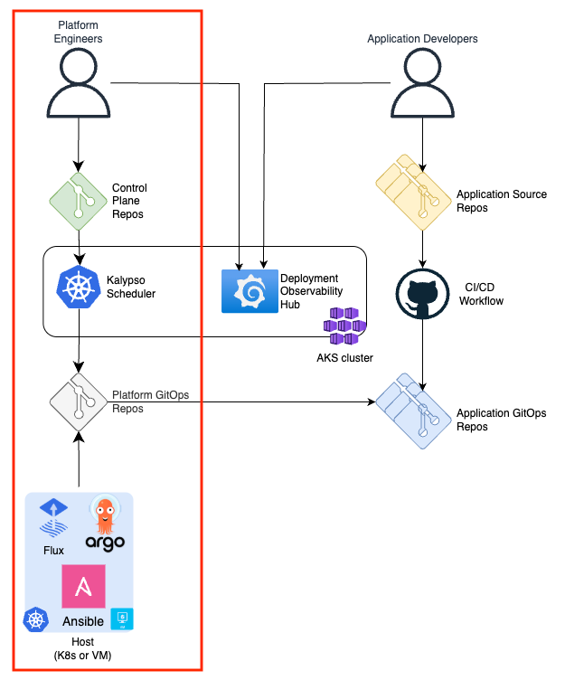
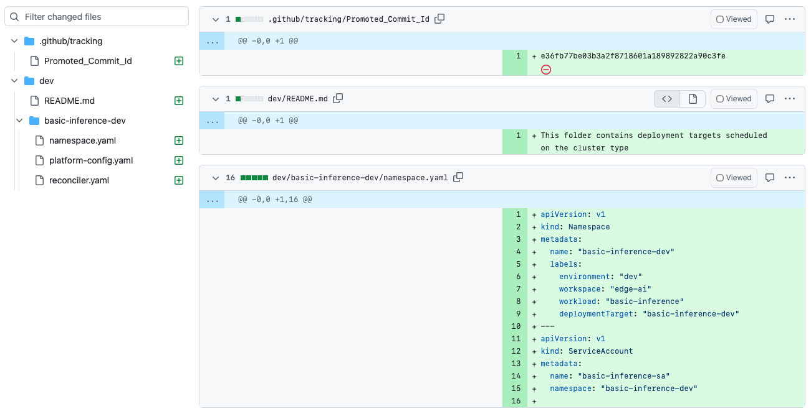
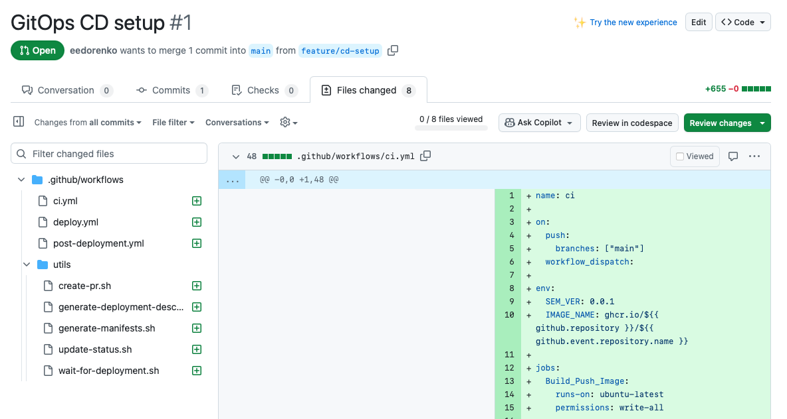
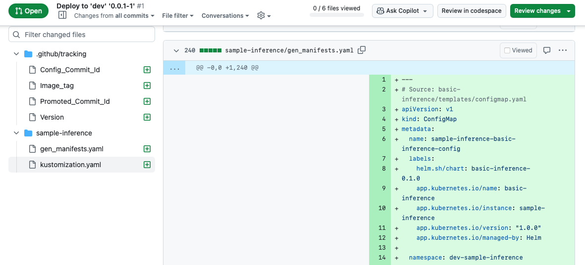
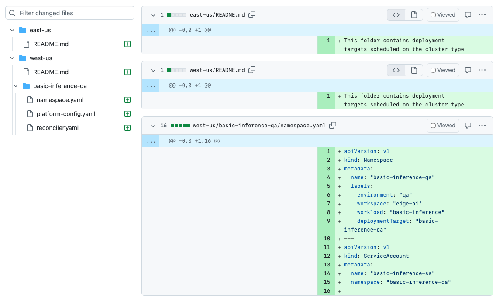
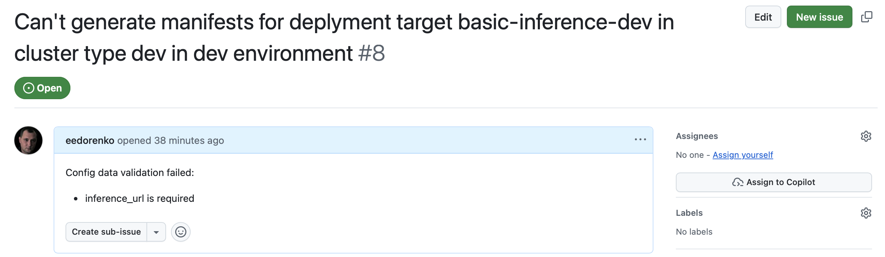
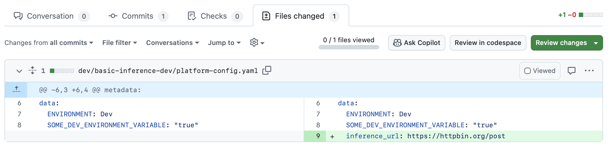

This tutorial demonstrates how to set up complete multi-cluster workload orchestration for the Basic Inference Application using Kalypso, a GitOps-based orchestration framework.

## Prerequisites

Before proceeding, ensure you have:

1. **Azure Arc-enabled Kubernetes Cluster(s)**: One or more existing clusters for application deployment

   ```bash
   # Connect your clusters to Azure Arc (if not already connected)
   az connectedk8s connect --name cluster-east --resource-group your-rg
   az connectedk8s connect --name cluster-west --resource-group your-rg

   # Verify connection
   az connectedk8s list --resource-group your-rg --output table
   ```

2. **Azure CLI Login**: Authenticate with Azure CLI

   ```bash
   az login
   ```

3. **GitHub CLI Configured**: Ensure you're authenticated with GitHub

   ```bash
   gh auth status
   ```

4. **Kubernetes Access**: Ensure you have access to your target Arc clusters

   ```bash
   # Connect to your Arc cluster via proxy
   az connectedk8s proxy --name your-arc-cluster --resource-group your-rg

   # In a new terminal, list available contexts
   kubectl config get-contexts

   # Verify cluster access (for your Arc cluster)
   kubectl cluster-info
   kubectl get namespaces
   ```

5. **GitHub Token**
   GitHub token with the following scopes:

   Classic: `repo`, `workflow`, `write:packages`, `delete:packages`, `read:org`, `delete_repo`.

   Fine-grained: `Actions` - R/W, `Administration` - R/W, `Commit statuses` - R/W, `Contents` - R/W, `Metadata` - RO, `Pull requests` - R/W, `Secrets` - R/W, `Variables` - R/W, `Workflows` - R/W

6. **Required Environment Variables**

   ```bash
   export TOKEN="ghp_xxxxxxxxxxxxxxxxxxxx"
   export AZURE_CREDENTIALS_SP='{"clientId":"...","clientSecret":"...","subscriptionId":"...","tenantId":"..."}'
   ```

## Overview

This tutorial demonstrates Kalypso workload orchestration patterns for managing applications across multiple environments.

This tutorial enhances the [Basic Inference CI/CD setup](../../../501-ci-cd/basic-inference-cicd/README.md) by introducing multi-cluster orchestration capabilities. While the CI/CD tutorial focuses on the **Application Developer persona** building and promoting applications through environments, this tutorial shifts focus to the **Platform Team persona** who manages infrastructure, cluster types, and workload scheduling across multiple deployment targets.



Through this tutorial, you will learn how to:

- Onboard a new application to the platform control plane
- Onboard a new cluster to an environment
- Assign applications to clusters using scheduling policies
- Manage platform-specific configurations across environments

## Setting Up

Execute the script to set up workload orchestration for your clusters:

```bash
./basic-inference-workload.sh \
  --org your-github-org \
  --arc-cluster my-arc-cluster \
  --arc-rg rg-arc-clusters \
  --kalypso-cluster my-kalypso-aks \
  --kalypso-rg rg-kalypso-control-plane \
  --kalypso-location eastus
```

**Required Parameters:**

- `--org` or `-o`: GitHub organization name
- `--arc-cluster` or `-c`: Existing Azure Arc-enabled cluster name (for application deployment)
- `--arc-rg` or `-r`: Azure resource group containing the Arc cluster
- `--kalypso-cluster` or `-k`: AKS cluster name for Kalypso control plane. If the cluster doesn't exist, the script will create it
- `--kalypso-rg` or `-g`: Azure resource group for Kalypso AKS cluster

**Optional Parameters:**

- `--project` or `-p`: Project name (default: basic-inference-orchestration)
- `--kalypso-location` or `-l`: Azure region for Kalypso cluster (default: eastus)

The setup script leverages Kalypso bootstrap tooling from the [upstream repository](https://github.com/microsoft/kalypso).

### What the Script Creates

The `basic-inference-workload.sh` script automates the complete setup of a Kalypso-based workload orchestration pattern. Here's what gets created:

#### Application Repositories

- **Source Repository** (`https://github.com/YOUR_ORG/basic-inference-orchestration`): Contains application code and workload definitions
- **Configuration Repository** (`https://github.com/YOUR_ORG/basic-inference-orchestration-configs`): Environment-specific configuration files
- **GitOps Repository** (`https://github.com/YOUR_ORG/basic-inference-orchestration-gitops`): Generated Kubernetes manifests for each environment (dev, qa)

#### Kalypso Control Plane

- **AKS Cluster**: Creates or uses existing AKS cluster for Kalypso scheduler
- **Flux Installation**: GitOps operator for continuous reconciliation
- **Kalypso Scheduler**: Helm chart deployment in `kalypso-system` namespace
- **Control Plane Repository** (`https://github.com/YOUR_ORG/kalypso-control-plane`): Contains environment definitions, cluster types, and scheduling policies
- **Platform GitOps Repository** (`https://github.com/YOUR_ORG/kalypso-platform-gitops`): Platform-level configurations and assignment manifests

#### GitOps Configuration on Azure Arc Cluster

- **Flux Configuration** (`platform-dev`): Configures the Arc cluster to sync from `kalypso-platform-gitops/dev` branch

## Onboard a new application

The Application Team runs their software development lifecycle. They build their application and promote it across environments. They're not aware of what cluster types are available and where their application will be deployed. But they do know that they want to deploy their application in Dev and QA environments.

The Application Team describes this intention in the `workload/workload.yaml` file in the `Application Source` repository:

```yaml
apiVersion: scheduler.kalypso.io/v1alpha1
kind: Workload
metadata:
  name: basic-inference
  labels:
    type: application
    component: inference
spec:
  deploymentTargets:
    - name: dev
      labels:
        purpose: dev-test
      environment: dev
      manifests:
        repo: https://github.com/YOUR_ORG/basic-inference-orchestration-gitops
        branch: dev
        path: ./basic-inference-orchestration
    - name: qa
      labels:
        purpose: qa-test
      environment: qa
      manifests:
        repo: https://github.com/YOUR_ORG/basic-inference-orchestration-gitops
        branch: qa
        path: ./basic-inference-orchestration

```

This file contains a list of two deployment targets. These targets are marked with custom labels and point to the folders in Application GitOps repository where the Application Team generates application manifests for each deployment target.

With this file, Application Team requests Kubernetes compute resources from the Platform Team. In response, the Platform Team must register the application in the Control Plane repo.

To register the application, create a workload registration file `workloads/basic-inference-workload-registration.yaml` in the `main` branch of the `Control Plane` repository. Don't forget to update the repo url according to your setup:

```yaml
apiVersion: scheduler.kalypso.io/v1alpha1
kind: WorkloadRegistration
metadata:
  name: basic-inference
spec:
  workload:
    repo: https://github.com/YOUR_ORG/basic-inference-orchestration
    branch: main
    path: ./workload
  workspace: edge-ai
```

**Note:** The folder structure in the Control Plane repository doesn't really matter. This example provides one way of organizing files in the repository, but feel free to do it in your own preferred way. The scheduler is interested in the content of the files, rather than where the files are located.

## Understand deployment target assignment

Once the workload is registered, Kalypso control plane starts the scheduling process and creates a PR to the `dev` branch in the `Platform GitOps` repository. It may take a couple of minutes.

**Tip:** If you don't see the PR to the `dev` branch as it is shown bellow, check that you have updated `YOUR_ORG` in the `basic-inference-workload-registration.yaml`.



Besides `Promoted_Commit_id`, which is just tracking information for the promotion CD flow, the PR contains assignment manifests. There are `namespace.yaml`, `platform-config.yaml` and `reconciler.yaml` manifest files.

`namespace.yaml` defines a namespace and a service account that will be created on any cluster where the basic-inference application runs.

```yaml
apiVersion: v1
kind: Namespace
metadata:
  name: "basic-inference-dev"
  labels:
    environment: "dev"
    workspace: "edge-ai"
    workload: "basic-inference"
    deploymentTarget: "basic-inference-dev"
---
apiVersion: v1
kind: ServiceAccount
metadata:
  name: "basic-inference-sa"
  namespace: "basic-inference-dev"
```

`platform-config.yaml` contains all platform configuration values available on any cluster that the application can use in the Dev environment.

```yaml
apiVersion: v1
kind: ConfigMap
metadata:
  name: platform-config
data:
  ENVIRONMENT: Dev
  SOME_DEV_ENVIRONMENT_VARIABLE: "true"
```

`reconciler.yaml` contains Flux resources that a `dev` cluster uses to fetch application manifests, prepared by the Application Team for the `dev` deployment target. This is essentially a pointer to the application manifests.

```yaml
apiVersion: source.toolkit.fluxcd.io/v1beta2
kind: GitRepository
metadata:
  name: dev.basic-inference.basic-inference-dev
  namespace: flux-system
spec:
  interval: 30s
  url: "https://github.com/YOUR_ORG/basic-inference-orchestration-gitops"
  ref:
    branch: "dev"
  secretRef:
    name: platform-dev-auth
---
apiVersion: kustomize.toolkit.fluxcd.io/v1beta2
kind: Kustomization
metadata:
  name: dev.basic-inference.basic-inference-dev
  namespace: flux-system
spec:
  interval: 30s
  targetNamespace: "basic-inference-dev"
  sourceRef:
    kind: GitRepository
    name: dev.basic-inference.basic-inference-dev
  path: "./basic-inference-orchestration"
  prune: true
```

**Note:** The control plane defines that the `dev` cluster type uses Flux to reconcile manifests from the application GitOps repositories. Therefore `reconciler.yaml` file contains Flux GitRepository and Kustomization resources.

Merge the PR to the `Platform GitOps` repository. Now the `basic-inference` application is assigned to the `dev` cluster type on `dev` environment.

The setup script automatically onboards your Azure Arc cluster to the `dev` environment by creating a GitOps configuration that monitors the `dev` folder within the `Platform GitOps` repository's `dev` branch. Flux automatically synchronizes any content from this folder to your cluster.

## Build and Deploy the Application

Acting as an Application Developer persona lets build and deploy our application to `dev` environment. The application source repository contains a pull request with workflows for the CI/CD pipeline.



When you merge this PR, it will trigger the CI/CD pipeline and create a PR with the manifests to the `dev` branch of the `Application GitOps` repository. See the details in [CI/CD setup for the Basic Inference application](../../../501-ci-cd/basic-inference-cicd).



Once the PR is merged, the manifests will be deployed to all cluster on `dev` environment where the application is assigned to. In our setup there is only one such cluster, which is our Azure Arc cluster.
You can verify the application deployment in the Azure portal under your Arc cluster's **GitOps** tab, or use kubectl to check pod status:

```bash
kubectl get pods -n basic-inference-dev
```

## Schedule the Application

The Platform Team configures the `qa` environment in the `qa` branch of the `Control Plane` repository. While the `dev` environment contains a single cluster type `dev`, the `qa` environment is split across two regions and defines two different cluster types in the `cluster-types` folder: `east-us` and `west-us`.

```yaml
apiVersion: scheduler.kalypso.io/v1alpha1
kind: ClusterType
metadata:
  name: east-us
  labels:
    region: eastus
spec:
  reconciler: argocd
  namespaceService: default
  configType: configmap

---

apiVersion: scheduler.kalypso.io/v1alpha1
kind: ClusterType
metadata:
  name: west-us
  labels:
    region: westus
spec:
  reconciler: arc-flux
  namespaceService: default
  configType: configmap

```

These cluster types represent logical groups of `qa` clusters in the `eastus` and `westus` regions respectively. The control plane operates at an abstraction level above individual physical clusters - it manages cluster types rather than tracking hundreds of individual cluster instances. This design enables scalable orchestration across large fleet deployments.

**Note:** Clusters in `eastus` region use `argocd` as a GitOps reconciler, while `westus` clusters are configured with `flux`.

At this point the `qa` environment doesn't contain any scheduling policies. So, Kalypso control plane  doesn't assign applications to any cluster types in the `qa` environment. It simply doesn't know how.

Let's define a scheduling policy for the `basic-inference` application to be assigned to the `westus` clusters only.

Create `basic-inference-policy.yaml` file in the `qa` branch in the the `scheduling-policies` folder (or in any other preferred folder):

```yaml
apiVersion: scheduler.kalypso.io/v1alpha1
kind: SchedulingPolicy
metadata:
  name: basic-inference-policy
spec:
  deploymentTargetSelector:
    labelSelector:
      matchLabels:
        workload: basic-inference
  clusterTypeSelector:
    labelSelector:
      matchLabels:
        region: westus
```

With this in place, Kalypso Control Plane assigns `qa` deployment target of the `basic-inference` application to all cluster types with `region: westus` label. The result of this assignment is reflected in a PR to the `qa` branch of the `Platform GitOps` repository. The PR is created automatically by Kalypso Control Plane.



Review and merge this PR.

## Add a cluster to an Environment

Our Azure Arc cluster is already included in the `dev` environment. For this tutorial, we'll also add it to the `qa` environment. Workloads from different environments on this cluster will be isolated using separate namespaces.

Let's declare that our Azure Arc cluster belongs to the `west-us` cluster type, so it should be subscribed on the `west-us` folder in the `Platform GitOps` repository. Create a GitOps configuration pointing to this folder with the following command:

```bash
CLUSTER_NAME=YOUR_CLUSTER_NAME
RESOURCE_GROUP=YOUR_RESOURCE_GROUP
GITHUB_ORG=YOUR_GITHUB_ORG
TOKEN=YOUR_GITHUB_TOKEN

az k8s-configuration flux create \
    --name "platform-qa" \
    --cluster-name $CLUSTER_NAME \
    --namespace flux-system \
    --https-user flux \
    --https-key $TOKEN \
    --resource-group $RESOURCE_GROUP \
    --url "https://github.com/$GITHUB_ORG/kalypso-platform-gitops" \
    --scope cluster \
    --interval 10s \
    --cluster-type connectedClusters \
    --branch qa \
    --kustomization name="platform-qa" prune=true sync_interval=10s path=west-us
```

## Promote Application Version to QA

Let's wear Application Developer's hat again and promote the application version from `dev` to `qa` environment. As described in [CI/CD setup for the Basic Inference application](../../../501-ci-cd/basic-inference-cicd/README.md#promote), merge a PR to the `qa` branch in `Application GitOps` repository.

Once the pull request with the manifests is merged, Flux automatically applies the changes to the cluster. You can verify the application deployment in the Azure portal under your Arc cluster's **GitOps** tab, or use kubectl to check pod status:

```bash
kubectl get pods -n basic-inference-qa
```

**Note:** It may take a few minutes for FLux on the cluster to catch-up.

## Request Platform Configuration

The Application Team is refactoring their application and needs the platform to provide a value for
the `ENDPOINT_URI` configuration. This is platform-specific configuration that may vary across environments and regions.

When an application is assigned to a cluster, the platform provides a namespace where the application is hosted. This namespace contains everything that application needs such `platform-config` ConfigMap, service account, limits, quotas, etc. Everything that the Platform team decides to provide. So the application expects `platform-config` ConfigMap to be present in the same namespace and to contain a value for `ENDPOINT_URI`, along with other platform-specific configuration values.

Let's update `helm/templates/deployment.yaml` in the Application Source repository, so that block

```yaml
- name: ENDPOINT_URI
  valueFrom:
    configMapKeyRef:
      name: {{ include "basic-inference.fullname" . }}-config
      key: inference-url

```

will be changed to

```yaml
- name: ENDPOINT_URI
  valueFrom:
    configMapKeyRef:
      name: platform-config
      key: inference-url

```

Let's also formally request the platform for the configuration value. Let's update the `workload/workload.yaml` with the following content. Don;t forget to change `YOUR_ORG` to your GitHub org.

```yaml
apiVersion: scheduler.kalypso.io/v1alpha1
kind: Workload
metadata:
  name: basic-inference
  labels:
    type: application
    component: inference
spec:
  deploymentTargets:
    - name: dev
      labels:
        purpose: dev-test
      environment: dev
      manifests:
        repo: https://github.com/YOUR_ORG/basic-inference-orchestration-gitops
        branch: dev
        path: ./basic-inference-orchestration
    - name: qa
      labels:
        purpose: qa-test
      environment: qa
      manifests:
        repo: https://github.com/YOUR_ORG/basic-inference-orchestration-gitops
        branch: qa
        path: ./basic-inference-orchestration
  configSchemas:
     - |
      {
      "properties": {
        "inference_url": {
        "type": "string",
        "description": "Inference URL"
        }
      },
        "required": [
        "inference_url"
        ]
      }
```

The `configSchemas` section in the `workload.yaml` file declares that the application requires a `platform-config` ConfigMap containing an `inference_url` key with a string value to be available in both deployment environments.

These changes pushed to the `main` branch of the `Application Source` repository start the `ci/cd` promotional flow. Application Team follows the process as described in [CI/CD setup for the Basic Inference application](../../../501-ci-cd/basic-inference-cicd/) to promote the changes across environments.

## Provide Platform Configuration

Kalypso Control Plane processes the platform configuration request and reacts by creating two issues in the `Platform GitOps` repository. One issue per environment.



Let's define a configuration entry in the `Control Plane` repository for the `dev` environment. This entry is going to be applicable and therefore automatically included into the composed `platform-config` ConfigMap for all applications with `component: inference` label on all clusters in the `dev` environment. Create `configs/inference-config.yaml` file in the `dev` branch with the following content:

```yaml
apiVersion: v1
kind: ConfigMap
metadata:
  name: inference-config
  labels:
    platform-config: "true"
    component: inference
data:
  inference_url: "https://httpbin.org/post"
```

Kalypso Control Plane processes the new configuration entry, reassembles the `platform-config` configMap for the application assignment and create a PR to the Platform GitOps repository. It also closes the issue related to the `dev` environment.



## Exercise

Practice implementing region-specific platform configurations by providing different `inference_url` values for the `eastus` and `westus` regions in the `qa` environment.

Configure separate inference endpoints for each region:

- East US clusters: `https://qa-eastus-api.contoso.com`
- West US clusters: `https://qa-westus-api.contoso.com`

## Cleanup and Resource Removal

To remove all orchestration resources created by this tutorial:

```bash
./basic-inference-workload.sh \
  --cleanup \
  --org your-github-org \
  --arc-cluster my-arc-cluster \
  --arc-rg rg-arc-clusters \
  --kalypso-cluster my-kalypso-aks \
  --kalypso-rg rg-kalypso-control-plane \
  --kalypso-location eastus
```

**What gets deleted in cleanup mode:**

**Kalypso Resources:**

- **AKS Cluster**: Kalypso control plane cluster
- **Resource Group**: Resource group containing the Kalypso AKS cluster

**GitHub Repositories:**

- `basic-inference-orchestration` - Application source code
- `basic-inference-orchestration-configs` - Configuration repository
- `basic-inference-orchestration-gitops` - GitOps manifests repository
- `kalypso-control-plane` - Control plane definitions
- `kalypso-platform-gitops` - Platform GitOps repository

**Azure Arc Flux Configurations:**

- `platform-dev` - Dev environment Flux configuration on Arc cluster
- `platform-qa` - QA environment Flux configuration on Arc cluster (if created)

**Note:** The cleanup process removes the AKS cluster and resource group in the background. This deletion may take 5-10 minutes to complete. The Arc cluster itself is not deleted, only the Flux configurations pointing to the platform repositories are removed

## Resources

- [Kalypso GitHub Repository](https://github.com/microsoft/kalypso)
- [Kalypso Bootstrap Documentation](https://github.com/microsoft/kalypso/tree/main/docs/bootstrap)
- [Workload management in a multi-cluster environment with GitOps](https://learn.microsoft.com/azure/azure-arc/kubernetes/conceptual-workload-management)

---

<!-- markdownlint-disable MD036 -->
*🤖 Crafted with precision by ✨Copilot following brilliant human instruction,
then carefully refined by our team of discerning human reviewers.*
<!-- markdownlint-enable MD036 -->
