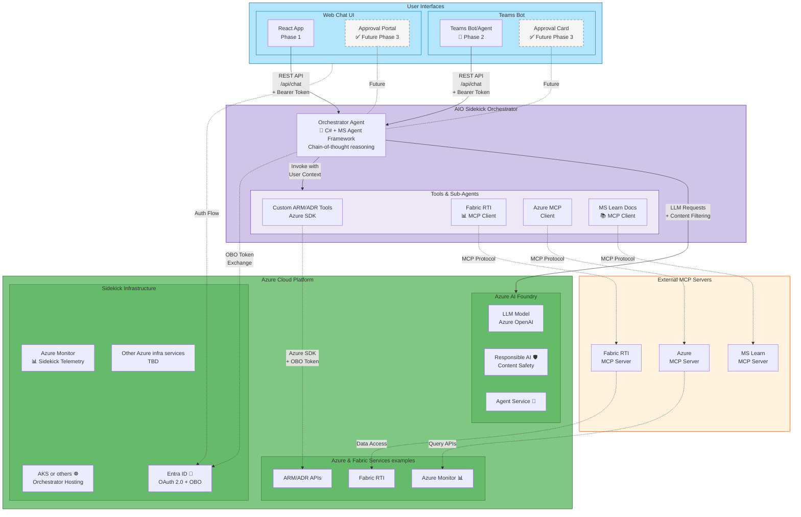

## AIO Sidekick

> Natural language assistant for industrial & edge operations – cloud-first, secure, extensible, human-in-the-loop.

## Overview

AIO Sidekick is an open-source conversational assistant that helps operations teams diagnose and understand issues across industrial IoT and edge environments using plain language.
It hides platform and tooling complexity for edge and cloud industrial systems behind a chat-style interface while preserving transparent, auditable access patterns. Phase 1 focuses on high-value read-only diagnostics delivered from the cloud; later phases extend capabilities to edge clusters and controlled remediation actions.

## Evolution & Delivery Model

**Continuous Evolution**: The landscape of agentic tools, standards, and frameworks is evolving rapidly. Agent frameworks, MCP protocol patterns, and AI orchestration practices are actively advancing. As these technologies mature and new capabilities emerge, AIO Sidekick's architecture choices will evolve accordingly. We commit to adapting our implementation to leverage proven patterns and incorporate emerging best practices from the broader agentic ecosystem.

**Operational Helper Philosophy**: AIO Sidekick is delivered as an operational helper—a starting point and reference implementation rather than a prescriptive solution. Scenarios will be refined based on real-world feedback, and the toolset will expand in the future.

## Goals & Non-Goals

### Goals

* **Simplify operational tooling with natural language**: Enable operations teams to interact with complex IoT/edge systems using plain English, abstracting away platform intricacies that currently require specialized knowledge.
* **Leverage existing platform capabilities**: Reuse proven MCP servers, Azure SDKs, and platform services instead of reimplementing or duplicating backend functionality. Integrate with first-party MCP connectors (Fabric RTI, Azure Monitor, etc.) and Azure APIs.
* **Enable human-in-the-loop workflows**: Augment operators, not replace them. Start with read-only advisory capacity; require explicit human approval for any future state-changing operations through validation UI or approval workflows.
* **Focus on real customer scenarios**: Every feature motivated by concrete operational gaps observed in the field (data flow interruptions, quality issues, connectivity problems, log correlation).
* **Deliver cloud-first with edge extensibility**: Initial deployment on Azure leveraging Azure AI Foundry; later extend to Arc-enabled Kubernetes clusters using the same containerized deployment model (Helm charts).
* **Ensure security and auditability**: End-to-end authentication via Entra ID with OAuth 2.0 flows, least-privilege access, and correlation IDs for all tool invocations.
* **Maintain transparent, responsible AI practices**: Use Azure AI Foundry's content safety, prompt filtering, and observability features; clearly disclose limitations and source references in responses.

### Non-Goals (Phase 1)

* **Autonomous write or remediation actions**: Phase 1 is strictly read-only diagnostics and insights.
* **Offline/local LLM inference**: Requires cloud connectivity to Azure AI Foundry; fully air-gapped scenarios out of scope initially.
* **Replacing existing monitoring platforms**: Sidekick augments and integrates with existing tools (Azure Monitor, Fabric RTI) rather than duplicating their functionality.

## Design Principles

* **Simplicity**: Plain English queries; minimal required context.
* **Reuse > Rebuild**: Integrate existing services and SDKs; avoid duplicating infrastructure logic.
* **Progressive Capability**: Start narrow and accurate; expand only with evidence.
* **Human Oversight**: Read-only first; future write actions gated by explicit approvals.
* **Security by Default**: Least privilege identities, audited tool calls, transparent sources.
* **Portability**: Containerized deployment with Helm for cloud and Arc-enabled edge.
* **Extensibility**: Pluggable tool/sub-agent model; configuration-driven enablement.
* **Responsible AI**: Safety filters, prompt hygiene, and clear disclosure of limitations.

## Key Features (Phase 1 Read-Only)

* **Multi-tool orchestration with chain-of-thought reasoning**: Agent Framework-powered orchestrator plans investigation workflows, determining which tools to invoke in sequence based on conversational context and intermediate results.
* **Scenario-driven approach**: Initial capabilities focused on proven, high-value diagnostic scenarios observed in real operations (data flow interruptions, quality anomalies, connectivity issues) rather than broad speculative features.
* Conversational diagnostics across data flow, quality, connectivity, and logs with follow-up question support.
* Cloud-hosted runtime leveraging Azure AI Foundry services for model access, content safety, and observability.
* Entra ID powered authentication and authorization with on-behalf-of token exchange for end-to-end user-context operations.
* Transparent response sourcing: references data sources and tool invocations rather than exposing raw internal identifiers.

## Architecture (Cloud-First, Edge-Ready)

* **Orchestrator**: Built in **C# using Agent Framework** (Microsoft's evolution of Semantic Kernel and AutoGen libraries), providing central reasoning, multi-tool orchestration, and conversational context management. Implements chain-of-thought planning to determine which tools to invoke and in what sequence.
* **REST API Layer**: Exposes `/api/chat` endpoints for client communication. Secured with Entra ID authentication; accepts user messages with correlation IDs and returns agent responses. All API calls include **on-behalf-of token exchange** to maintain user context when the orchestrator calls Azure services, ensuring proper RBAC enforcement and audit trails.
* **Tools & Sub-Agents**: Modular integrations with curated MCP servers (Fabric RTI, Azure Monitor, MS Docs) and custom tools built using Azure SDKs where MCP servers don't exist. Each tool declares required permissions and is explicitly enabled via configuration. All tool invocations are audited with user context.
* **Teams Bot/Agent (Phase 2)**: Integral architectural component deployed as Azure Bot Service or custom bot, enabling in-thread responses to operational alerts within Teams channels. Translates Teams messages to orchestrator API calls and delivers agent insights back into the collaborative workflow where operations teams already coordinate.
* **AI Layer**: Azure AI Foundry provides LLM access (Azure OpenAI), content safety filters, prompt injection protection, and observability dashboards. Foundry's Agent Service capabilities support multi-agent orchestration and evaluation harnesses for continuous quality improvement.
* **Identity & Access**: End-to-end Entra ID OAuth2 flows with on-behalf-of token delegation; orchestrator executes operations under user identity for proper authorization and compliance.
* **Runtime**: Initial deployment on Azure (AKS/App Service/Container Apps). Same container images can later deploy to Arc-enabled Kubernetes clusters for edge scenarios.
* **Portability**: Helm charts package orchestrator, API layer, and configuration; values files control tool enablement and deployment targets (cloud vs. edge).

### Architecture Diagram

Below is a high-level architecture diagram illustrating AIO Sidekick's components and interactions as of current thinking.

**Key Architecture Elements**:

* **User Interfaces**: Web chat (Phase 1) and Teams bot (Phase 2) both interact via REST API with bearer tokens
* **Orchestrator Agent**: Central reasoning engine using Microsoft Agent Framework for chain-of-thought planning and multi-tool orchestration
* **Tools Layer**: Mix of custom SDK tools (ARM/ADR) and MCP client connections to external servers
* **MCP Servers**: External standardized protocol servers providing access to Fabric RTI, Azure services, and documentation
* **Azure AI Foundry**: LLM access, content safety, and agent orchestration services
* **Identity Flow**: End-to-end Entra ID with on-behalf-of (OBO) token exchange maintaining user context
* **Future Capabilities**: Approval workflows (dashed) planned for Phase 3 write actions

## Security & Identity

* End-to-end AuthN/AuthZ via Entra ID; least-privilege scopes per tool.
* Read-only operations only in Phase 1 (no state mutation).
* Human approval workflow planned before introducing any write/remediation actions.
* Audited tool invocation: each request annotated with correlation identifiers.
* Secrets and tokens expected to be managed externally (e.g., vault integration) — not stored in this repository.
* Defense-in-depth: input validation, guarded tool selection, safe prompting patterns.

## Phased Roadmap

| Phase  | Focus                             | Capabilities                                                                              | Safety Posture                        |
|--------|-----------------------------------|-------------------------------------------------------------------------------------------|---------------------------------------|
| 1      | Cloud Read-Only                   | Core diagnostics, scenario responses                                                      | Full read-only, audited               |
| 2      | Edge Enablement + Teams Bot/Agent | Deploy to Arc-enabled clusters; Teams bot/agent integration with in-thread alert response | Controlled expansion, still read-only |
| 3      | Controlled Write Actions          | Limited remediation (restart, recheck) behind approval                                    | Human-in-loop mandatory               |
| Future | Local Inference / Proactive Ops   | Optional small models on edge, proactive summaries, broader remediation                   | Progressive guardrail reviews         |

## User Scenarios

### 1. Data Quality Issue Investigation

An operator notices incorrect temperature readings in Fabric RTI (values in Fahrenheit instead of expected Celsius). The operator asks Sidekick: *"Why are temperature readings showing in Fahrenheit?"*

**Agent workflow**: Sidekick queries the Fabric RTI MCP server for data schema and recent changes, uses a tool to retrieve AIO data flow configuration and conversion logic, and consults MS Docs MCP for proper guidance. It responds with a diagnosis: the data flow is missing the Fahrenheit-to-Celsius conversion step, provides the correct formula, and links to relevant documentation.

**Value**: Multi-tool investigation (Fabric metadata + data flow ARM config + documentation) synthesized into a single conversational answer, eliminating manual navigation across multiple systems.

### 2. Data Flow Interruption Diagnosis

An Azure Monitor alert appears in a Teams channel: *"Data ingestion from Factory B dropped to zero for 15 minutes."* A team member asks the Sidekick bot in-thread: *"Why did data stop flowing from Factory B?"*

**Agent workflow**: The bot extracts context from the alert (resource ID, time window), queries Azure Monitor Logs MCP for errors around the incident time, checks Arc connectivity status via Azure SDK to verify edge cluster health, and examines pod/module logs for failures from the Azure Monitor logs. It discovers a connectivity error at 1:58 PM with module restarts, determines the edge cluster itself remained healthy (Arc status Connected), and concludes a transient network issue caused the outage.

**Response**: *"Data stopped due to a brief connectivity loss at the ingestion module on Factory B. Logs show network errors around 1:58 PM. The Arc cluster remained online—likely a transient network issue. Data flow resumed at 2:15 PM. Recommend checking network stability during that timeframe."*

**Value**: Rapid root-cause analysis combining monitoring logs, infrastructure status, and edge diagnostics, delivered conversationally within the existing Teams alert workflow. Acts as Tier-1 support, gathering evidence operators would otherwise collect manually from multiple dashboards.

### Additional Scenarios (Planned)

1. **Edge Connectivity & Module Health** – Status snapshot of edge components with degraded module identification.
2. **Log Correlation for Root Cause** – Aggregate relevant log snippets across services to produce causal narratives.
3. **Configuration Guidance & Docs Assist** – Retrieve targeted documentation for specific configuration questions with actionable next steps.

## Tool & Extensibility Model

* Tools are implemented as **MCP (Model Context Protocol) servers** – a standardized, open protocol for connecting AI applications to external systems (data sources, tools, workflows).
* The orchestrator connects to curated MCP servers for platform integrations (Azure, Fabric RTI, MS Docs).
* When no suitable curated MCP server exists, custom functionality is developed as **sub-agents** (autonomous reasoning components) or **custom tools** (direct SDK/API adapters) within the orchestrator.
* Enable/disable MCP servers and custom tools via environment settings.
* All tool invocations are audited with correlation IDs and user context for transparency and security.

## Curated External Tool References

AIO Sidekick leverages existing, curated MCP servers and protocol standards rather than creating bespoke service layers. These external tools provide structured access to platform and knowledge resources. Some examples include:

* **Fabric RTI MCP Server** – Real-Time Intelligence data and diagnostics integration ([repository](https://github.com/microsoft/fabric-rti-mcp)).
* **Azure MCP Server** – Access to Azure service information via standardized tool interfaces ([document](https://learn.microsoft.com/azure/developer/azure-mcp-server/get-started)).
* **MS Docs MCP Server** – Documentation retrieval and guidance support ([document](https://learn.microsoft.com/training/support/mcp)).

Sidekick's extensibility model treats each integration as an auditable, permission-scoped tool. Activation of a tool requires explicit configuration; unused tools remain disabled.

## User Interfaces

AIO Sidekick provides two complementary interfaces for operations teams:

### Web Chat Interface (Phase 1)

Phase 1 delivers a lightweight web-based chat UI as the primary interface, interacting with the orchestrator API:

* **Technology**: Planned React single-page app (SPA) served alongside the backend or via a static hosting option.
* **Auth**: Uses Entra ID login; bearer tokens forwarded to the orchestrator for user-context operations (read-only).
* **Session Flow**: Each user prompt is packaged with minimal context and a correlation ID; responses streamed when supported.
* **Transparency**: UI surfaces tool usage summaries and clarifies read-only nature of actions.
* **Future Expansion**: Approval portal (for Phase 3 write actions) will extend the same UI with gated remediation cards.

Implementation specifics, component hierarchy, and configuration will be added once the initial React scaffold is committed.

### Teams Bot Interface (Experimental - Phase 2)

A highly strategic but experimental interface that meets operations teams where they already coordinate:

* **In-Thread Alert Response**: Enables Sidekick to respond directly within Teams channels where Azure Monitor or operational alerts are posted, providing immediate diagnostic context without switching tools (as demonstrated in Scenario 2).
* **Existing Workflow Integration**: Many industrial customers already use Teams for operations coordination—Sidekick becomes a natural extension of these established patterns.
* **Consistency**: Teams bot shares the same orchestrator backend and conversational patterns as the web chat, ensuring feature parity as capabilities mature.
* **Phase 2 Focus**: Teams integration follows web chat stabilization; experimental status reflects evolving Teams Agent capabilities and need for production validation.

Both interfaces have the intent of calling the same `/api/chat` REST endpoints, ensuring consistent agent behavior and tool orchestration regardless of entry point.

## Deployment (Early Guidance)

Phase 1 targets a cloud deployment. A future update will provide Helm charts and minimal values. At this stage, treat this README as directional — not an implementation guide.

## Future Edge Deployment (Preview)

* **Container Portability**: Reuse identical containers on Arc-enabled Kubernetes clusters; same Helm charts deploy to both cloud and edge.
* **GitOps Configuration**: Helm envisioned for configuration synchronization and updates across edge deployments.
* **Hybrid Deployment Option**: Cloud-hosted orchestrator with secure access to edge-based MCP tools via **private ExpressRoute routing**, avoiding public endpoints while enabling cloud reasoning with edge data access.
* **Local Inference Layer**: Optional on-edge AI inference using **Ollama or local inference engines** for air-gapped scenarios where cloud connectivity is unavailable. Note: local inference sacrifices Azure AI Foundry's RAI features (content safety, observability) and requires careful evaluation.

## Observability & Logging (Planned)

* **Structured Logging**: Each tool invocation and model response logged with full context and outcomes.
* **Correlation IDs**: End-to-end tracing spanning user prompt → agent reasoning → tool calls → responses for debugging and audit trails.
* **Azure AI Foundry Observability**: Leverage Foundry's built-in observability dashboards for LLM request monitoring, content safety filtering events, and model performance metrics.
* **Telemetry Options**: **OpenTelemetry/Azure Monitor** integration for unified telemetry collection, especially important for edge deployments requiring consistent observability across cloud and on-premises environments.
* **Quality Metrics**: Scenario coverage, response latency, tool invocation patterns; evaluation harness added post initial release for continuous agent quality assessment.

## Limitations (Current State)

* No write or remediation actions.
* No offline/local inference; requires cloud connectivity.
* Scenario implementations will evolve; responses may initially be conservative.

## Responsible AI & Human-in-Loop

* Read-only start reduces operational risk while building trust.
* Safety filters and prompt hygiene used to limit unintended content.
* Future write actions require explicit human approval before execution.
* Transparent provenance: Sidekick aims to indicate source categories behind insights.

## Next Steps

* Implement orchestrator skeleton and first diagnostic tools.
* Implement Web Chat UI scaffold.
* Add architecture diagram asset.
* Provide Helm chart and minimal deployment instructions.
* Expand scenario documentation with end-to-end request/response examples.

## References

* **Agent Framework** – Framework to build agentic applications, migrating from AutoGent and Semantic Kernel ([repository](https://github.com/microsoft/agent-framework)).
* **MCP Protocol Specification** – Underlying protocol enabling standardized tool interoperability ([spec](https://modelcontextprotocol.io/docs/getting-started/intro)).
* **A2A Protocol Specification** – Complementary agent-to-agent interaction patterns ([spec](https://a2a-protocol.org/latest/specification/)).

---
<!-- markdownlint-disable MD036 -->
*🤖 Crafted with precision by ✨Copilot following brilliant human instruction,
then carefully refined by our team of discerning human reviewers.*
<!-- markdownlint-enable MD036 -->
