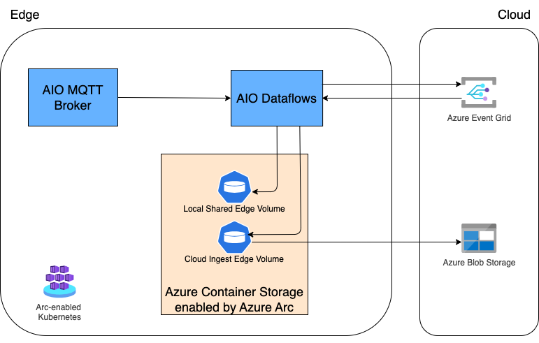

This folder contains assets with Azure IoT Operations Dataflows and supported infrastructure creation.
This sample deploys the necessary components to enable data flow from the AIO MQTT Broker to the Cloud and back, as well as to the local storage. The next data routing is enabled in this sample:

1. AIO MQTT -> Azure Event Grid
2. Azure Event Grid -> AIO MQTT
3. AIO MQTT -> Azure Storage Account
4. AIO MQTT -> Local Shared Azure Container Storage enabled by Azure Arc (ACSA) Edge Volume

The following resources will be created when using the assets available under the `dataflows-acsa-egmqtt-bidirectional` folder:

- ACSA Persistent Volume Claims
- Event Grid and supporting role access assignments
- Storage Account and supporting role access assignments
- ACSA Edge Subvolumes attached to Cloud Ingest Edge Volume to create sync to a Storage Account
- Dataflow Profile
- Dataflow Event Grid and ACSA endpoints
- Dataflows for `AIO MQTT -> ACSA` and `AIO MQTT -> Event Grid` bidirectional flow



## Prerequisites

- [Azure CLI](https://docs.microsoft.com/cli/azure/install-azure-cli?view=azure-cli-latest)
- Azure subscription

    Login to Azure CLI using the below command:

    ```bash
    # Login to Azure CLI, optionally specify the tenant-id
    az login # --tenant <tenant-id>
    ```

- A Kubernetes cluster with the Azure IoT Operations installed. We recommend using the [blueprints/minimum-single-node-cluster](../../../blueprints/minimum-single-node-cluster/README.md) blueprint for this sample:
  - The minimum recommended VM size is 8 GB of RAM, with 16 GB of RAM being preferred for optimal performance, for this sample we suggest using `Standard_D8s_v3` VM size.
  - Follow the blueprint documentation for deployment instructions

  Alternatively, you can follow these tutorials: [Creating a cluster](../../020-cncf-cluster/README.md), [installing AIO prerequisites](../../030-iot-ops-cloud-reqs/README.md), and [installing AIO](../../040-iot-ops/README.md).
- [kubectl](https://k8s-docs.netlify.app/en/docs/tasks/tools/install-kubectl/) command-line tool installed and configured to connect to your Kubernetes cluster
- Access to Arc enabled Kubernetes cluster with a [proxy configured](https://learn.microsoft.com/cli/azure/connectedk8s?view=azure-cli-latest#az-connectedk8s-proxy)
- An MQTT client such as `mosquitto_pub` for testing the connection
- Set up the following environment variables by running:

    ```bash
    export <variable name>="<variable value>"
    ```

    | Variable Name                  | Description                                                                                                                                       | Default Value               |
    |--------------------------------|---------------------------------------------------------------------------------------------------------------------------------------------------|-----------------------------|
    | RESOURCE_GROUP                 | Resource Group name where Arc enabled Kubernetes cluster is located                                                                               | n/a                         |
    | CLUSTER_NAME                   | Azure Arc enabled Kubernetes cluster name                                                                                                         | n/a                         |
    | LOCATION                       | Location name to which the Azure Arc enabled Kubernetes cluster is provisioned, e.g., `eastus2`                                                   | n/a                         |
    | ACSA_UNBACKED_AIO_PVC_NAME     | Name of Persistent Volume Claim that would be created as Local Shared Edge ACSA Volume                                                            | `pvc-acsa-unbacked-aio`     |
    | ACSA_CLOUD_BACKED_AIO_PVC_NAME | Name of Persistent Volume Claim that would be created as Cloud Ingest Edge ACSA Volume                                                            | `pvc-acsa-cloud-backed-aio` |
    | EVENT_GRID_NAMESPACE_NAME      | Event Grid Namespace name                                                                                                                         | `eg-`$RESOURCE_GROUP        |
    | METRIC1_TOPIC_PATH_NAME        | This variable would be used for defining both Event Grid Namespace Topic Spaces name and Storage Account Container name for Machine Status metric | `machine-status`            |
    | METRIC2_TOPIC_PATH_NAME        | This variable would be used for defining both Event Grid Namespace Topic Spaces name and Storage Account Container name for Total Counter metric  | `total-counter`             |
    | METRIC3_TOPIC_TEMPLATE_NAME    | Event Grid Namespace Topic Spaces name for Devices Health metric                                                                                  | `devices-health`            |
    | STORAGE_ACCOUNT_NAME           | Storage Account name                                                                                                                              | `st`$RESOURCE_GROUP         |

## Getting Started

- Navigate to the scripts directory:

    ```bash
    cd src/starter-kit/dataflows-acsa-egmqtt-bidirectional/scripts
    ```

- Ensure you have your `kubectl` context set to the Azure Arc enabled Kubernetes cluster where AIO is installed:

    ```bash
    kubectl config use-context <context-name>

    # Or if using the blueprint, use the following command in a separate terminal:
    az connectedk8s proxy --resource-group $RESOURCE_GROUP --name $CLUSTER_NAME
    ```

- Deploy Persistent Volume Claims for Azure Container Storage enabled by Azure-Arc (ACSA):

    ```bash
    ./deploy-acsa-pvc.sh
    ```

- Create Event Grid and supporting role access assignments:

    ```bash
    ./create-event-grid.sh
    ```

    >**Note**: `maximumClientSessionsPerAuthenticationName` Event Grid parameter [should be increased](https://learn.microsoft.com/azure/iot-operations/connect-to-cloud/howto-configure-mqtt-endpoint?tabs=portal#enable-mqtt) if more Event Grid sync Dataflows are created. You can use the `EVENT_GRID_MAX_CLIENT_SESSIONS` environment variable to configure this value.

- Create Storage Account, ACSA Edge Subvolumes, and supporting role access assignments:

    ```bash
    ./create-blob-storage.sh
    ```

- Deploy Dataflows Profile, Dataflows Event Grid and ACSA endpoints, and Dataflows for `AIO MQTT -> ACSA` and `AIO MQTT -> Event Grid` bidirectional flow:

    ```bash
    ./deploy-dataflows.sh
    ```

### Testing the sample

- [Connect to the default listener inside the cluster](https://learn.microsoft.com/azure/iot-operations/manage-mqtt-broker/howto-test-connection?tabs=portal#connect-to-the-default-listener-inside-the-cluster) to be able to send payload to AIO MQTT Broker

- Send a payload to AIO MQTT Broker to the following topics to see data in the created Storage Account `machine-status` and `total-counter` containers accordingly:

  - `metrics/aio/machine-status`
  - `metrics/aio/total-counter`

    To send the sample payload run the following command from within the `mqtt-client` pod:

    ```bash
    mosquitto_pub --host aio-broker --port 18883 --message "test payload" --topic "metrics/aio/total-counter" --debug --cafile /var/run/certs/ca.crt -D CONNECT authentication-method 'K8S-SAT' -D CONNECT authentication-data $(cat /var/run/secrets/tokens/broker-sat)
    ```

- Send a payload to the following topics using your preferred MQTT client to see data in ACSA Local Shared Edge Volumes:

  - `data/input/valid`
  - `metrics/aio/devices-health`

    To send the sample payload run the following command from within the `mqtt-client` pod:

    ```bash
    mosquitto_pub --host aio-broker --port 18883 --message "test payload" --topic "data/input/valid" --debug --cafile /var/run/certs/ca.crt -D CONNECT authentication-method 'K8S-SAT' -D CONNECT authentication-data $(cat /var/run/secrets/tokens/broker-sat)
    ```

- To view the data in ACSA Local Shared Edge Volumes, the `acsa-local-viewer` pod can be used that was installed with ACSA PVC:

    ```bash
    kubectl exec -it $(kubectl get pods -l name=acsa-local-viewer \
    -n azure-iot-operations --output=jsonpath='{.items[*].metadata.name}') \
    -n azure-iot-operations -- sh
    ```

    >Note: The data will be under a `/data` folder, inside `/data-input` and `devices-health` folders.

- Send a payload to AIO MQTT Broker to the following topics using your preferred MQTT client to see data flowing to the created Event Grid and back to AIO MQTT topics:

  - `metrics/aio/machine-status` (routed back to `metrics/aio/machine-status/event-grid` topic)
  - `metrics/aio/total-counter` (routed back to `metrics/aio/total-counter/event-grid` topic)
  - `metrics/aio/devices-health` (routed back to `metrics/aio/devices-health/event-grid` topic)

   To send the sample payload run the following command from within the `mqtt-client` pod:

    ```bash
    mosquitto_pub --host aio-broker --port 18883 --message "test payload" --topic "metrics/aio/machine-status" --debug --cafile /var/run/certs/ca.crt -D CONNECT authentication-method 'K8S-SAT' -D CONNECT authentication-data $(cat /var/run/secrets/tokens/broker-sat)
    ```

## Customizing Edge Subvolume Ingestion Policy

The edge subvolumes created in this sample use the default ingestion policy (`edgeingestpolicy-default`) for synchronizing data between the edge device and Azure blob storage. You can customize this behavior by creating your own ingestion policy.

### Creating a Custom Ingestion Policy

1. Create a YAML file for your custom ingestion policy (e.g., `custom-ingest-policy.yaml`):

    ```yaml
    apiVersion: arccontainerstorage.azure.net/v1
    kind: EdgeIngestPolicy
    metadata:
      name: my-custom-ingest-policy
    spec:
      schedule: "*/10 * * * *"      # Cron expression (every 10 minutes in this example)
      maxBandwidthInMbps: 10        # Maximum bandwidth limit in Mbps
      maxFilesToUpload: 100         # Maximum number of files to upload per sync
      maxFilesToDelete: 50          # Maximum number of files to delete per sync
      includedPaths:                # Paths to include (optional)
        - "*.json"
        - "data/*.csv"
      excludedPaths:                # Paths to exclude (optional)
        - "*.tmp"
        - "temp/*"
      priority: 10                  # Priority level (higher number = higher priority)
    ```

2. Apply the custom ingestion policy to your Kubernetes cluster:

    ```bash
    kubectl apply -f custom-ingest-policy.yaml -n azure-iot-operations
    ```

3. Update your EdgeSubvolume YAML to reference your custom policy. You can modify the `create-blob-storage.sh` script or apply the change directly:

    ```yaml
    apiVersion: "arccontainerstorage.azure.net/v1"
    kind: EdgeSubvolume
    metadata:
      name: ${SUBVOLUME_NAME}
    spec:
      edgevolume: ${EDGE_VOLUME_NAME}
      path: ${PATH}
      auth:
        authType: MANAGED_IDENTITY
      storageaccountendpoint: "https://${STORAGE_ACCOUNT_NAME}.blob.core.windows.net/"
      container: ${CONTAINER_NAME}
      ingestPolicy: my-custom-ingest-policy  # Reference your custom policy here
    ```

### Key Ingestion Policy Parameters

| Parameter            | Description                       | Default                |
|----------------------|-----------------------------------|------------------------|
| `schedule`           | Cron expression for sync schedule | `"0 * * * *"` (hourly) |
| `maxBandwidthInMbps` | Maximum bandwidth for uploads     | Unlimited              |
| `maxFilesToUpload`   | Maximum files to upload per sync  | 1000                   |
| `maxFilesToDelete`   | Maximum files to delete per sync  | 1000                   |
| `includedPaths`      | File patterns to include          | All files              |
| `excludedPaths`      | File patterns to exclude          | None                   |
| `priority`           | Sync task priority                | 0                      |

### Common Cron Expression Examples

- Every 5 minutes: `*/5 * * * *`
- Every hour at minute 30: `30 * * * *`
- Every day at midnight: `0 0 * * *`
- Every Monday at 9 AM: `0 9 * * 1`

For more information on EdgeIngestPolicy options, refer to the [Azure Arc-enabled Kubernetes Storage documentation](https://learn.microsoft.com/azure/azure-arc/container-storage/cloud-ingest-edge-volume-configuration?tabs=portal#optional-modify-the-ingestpolicy-from-the-default).

---

<!-- markdownlint-disable MD036 -->
*🤖 Crafted with precision by ✨Copilot following brilliant human instruction,
then carefully refined by our team of discerning human reviewers.*
<!-- markdownlint-enable MD036 -->
